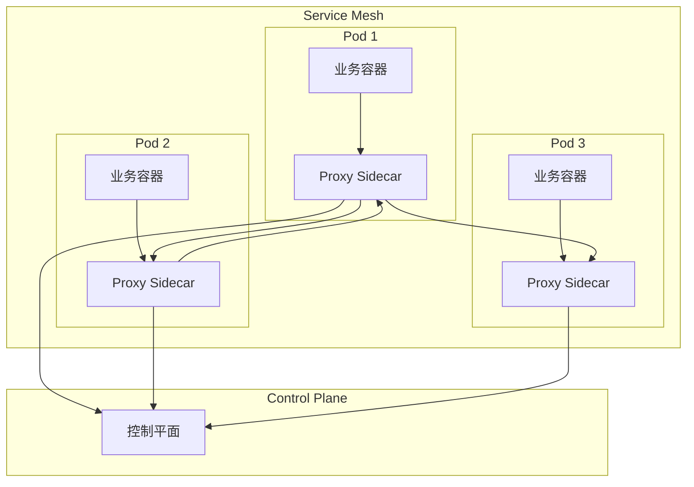
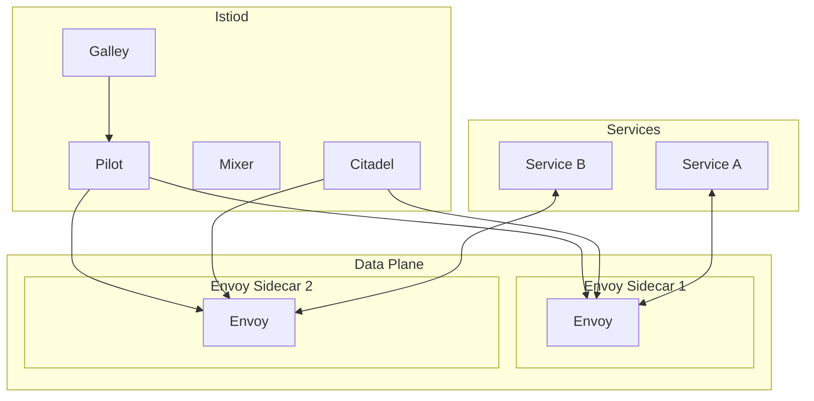

# 边车模式

你的微服务需要增加这些能力：统一日志采集、服务发现、健康检查、限流熔断、mTLS 加密、流量监控。你打算怎么做？

**方案一**：在每个微服务里集成这些功能。结果：每个服务多了一个笨重的 SDK，升级一次要改所有服务。

**方案二**：把这些功能抽成公共库，所有服务共用。结果：公共库变成巨石，任何改动都要所有服务同步升级。

**方案三**：把这些功能下沉到基础设施层，用边车模式实现。结果：业务代码保持干净，基础设施升级不影响业务。

**边车模式的本质，就是把基础设施逻辑从业务代码中剥离出来，放到独立的 Sidecar 进程中。业务服务只专注业务逻辑，Sidecar 处理所有横切关注点。**

## Service Mesh 架构

Service Mesh（服务网格）是边车模式的典型实现。它把网络代理（Sidecar）部署在每个服务实例旁边，所有网络流量都经过 Sidecar 转发：



**Data Plane（数据平面）**：Sidecar 代理负责拦截所有进出服务的流量，执行路由、限流、认证等功能。

**Control Plane（控制平面）**：管理 Sidecar 的配置、分发策略、收集遥测数据。

## Istio 架构

Istio 是目前最流行的 Service Mesh 实现，由 Google、IBM、Lyft 联合开发。

### 架构组件



**Pilot**：服务发现、流量管理、配置分发。

**Mixer**：策略检查、遥测数据收集（已废弃，v1.5 后功能合并到 Envoy）。

**Citadel**：证书管理和 mTLS 加密。

**Galley**：配置验证、配置抽象。

### Envoy Sidecar

Envoy 是 Istio 默认的 Sidecar 代理，负责：

- L4/L7 流量代理
- 动态服务发现
- 负载均衡
- 熔断
- mTLS
- 遥测数据上报

## Sidecar 注入

Sidecar 注入有两种方式：手动注入和自动注入。

### 自动注入

在 Kubernetes 环境中，启用自动注入后，所有新创建的 Pod 都会自动注入 Sidecar：

```bash
# 启用自动注入
kubectl label namespace default istio-injection=enabled

# 禁用自动注入
kubectl label namespace default istio-injection=disabled
```

```yaml title="pod.yaml"
apiVersion: v1
kind: Pod
metadata:
  name: user-service
  namespace: default
  labels:
    app: user-service
spec:
  containers:
    - name: user-service
      image: user-service:v1
      ports:
        - containerPort: 8080
```

### 手动注入

```bash
# 手动注入 Sidecar
istioctl kube-inject -f pod.yaml -o pod-injected.yaml

# 直接应用到集群
istioctl kube-inject -f pod.yaml | kubectl apply -f -
```

### 注入后的 Pod 配置

```yaml title="pod-with-sidecar.yaml"
apiVersion: v1
kind: Pod
metadata:
  name: user-service
spec:
  containers:
    - name: user-service
      image: user-service:v1
      env:
        - name: ISTIO_META_INITIAL_SERVICE_LOCALE
          value: "Kubernetes"
    - name: istio-proxy
      image: istio/proxyv2:1.20.0
      args:
        - proxy
        - sidecar
        - --domain
        - $(POD_NAMESPACE).svc.cluster.local
        - --serviceCluster
        - user-service
        - --proxyLogLevel
        - warning
        - --componentLogLevel
        - misc:error
      env:
        - name: JWT_POLICY
          value: third-party-jwt
        - name: PILOT_CERT_PROVIDER
          value: istiod
        - name: CA_ADDR
          value: istiod.istio-system.svc:15012
      ports:
        - containerPort: 15090
          name: http-envoy-prom
```

## Istio 流量管理

### VirtualService

VirtualService 定义路由规则，控制流量如何分发：

```yaml title="virtual-service.yaml"
apiVersion: networking.istio.io/v1beta1
kind: VirtualService
metadata:
  name: user-service
spec:
  hosts:
    - user-service
  http:
    - match:
        - headers:
            x-canary:
              exact: "true"
      route:
        - destination:
            host: user-service
            subset: v2
          weight: 100
    - route:
        - destination:
            host: user-service
            subset: v1
          weight: 90
        - destination:
            host: user-service
            subset: v2
          weight: 10
```

### DestinationRule

DestinationRule 定义后端服务实例的负载均衡和连接池配置：

```yaml title="destination-rule.yaml"
apiVersion: networking.istio.io/v1beta1
kind: DestinationRule
metadata:
  name: user-service
spec:
  host: user-service
  trafficPolicy:
    connectionPool:
      tcp:
        maxConnections: 100
      http:
        h2UpgradePolicy: UPGRADE
        http1MaxPendingRequests: 100
        http2MaxRequests: 1000
    loadBalancer:
      simple: ROUND_ROBIN
      consistentHash:
        httpHeaderName: X-User-Id
    outlierDetection:
      consecutive5xxErrors: 5
      interval: 30s
      baseEjectionTime: 30s
  subsets:
    - name: v1
      labels:
        version: v1
    - name: v2
      labels:
        version: v2
```

### 流量镜像

流量镜像（Traffic Mirroring）用于将生产流量同时发送到两个版本，进行灰度验证：

```yaml title="traffic-mirror.yaml"
apiVersion: networking.istio.io/v1beta1
kind: VirtualService
metadata:
  name: user-service
spec:
  hosts:
    - user-service
  http:
    - route:
        - destination:
            host: user-service
            subset: v1
          weight: 100
        - destination:
            host: user-service
            subset: v2
          weight: 0
      mirror:
        host: user-service
        subset: v2
      mirrorPercentage:
        value: 10
```

## mTLS 双向认证

Istio 提供开箱即用的 mTLS 双向认证，所有服务间的通信自动加密。

###  permissive 模式

新部署的服务可以先运行在 permissive 模式，允许明文流量，逐步迁移到 mTLS：

```yaml title="peer-authentication.yaml"
apiVersion: security.istio.io/v1beta1
kind: PeerAuthentication
metadata:
  name: default
  namespace: istio-system
spec:
  mtls:
    mode: PERMISSIVE
```

### STRICT 模式

所有流量强制使用 mTLS：

```yaml title="peer-authentication-strict.yaml"
apiVersion: security.istio.io/v1beta1
kind: PeerAuthentication
metadata:
  name: default
spec:
  mtls:
    mode: STRICT
```

### 命名空间级别配置

```yaml title="namespace-mtls.yaml"
apiVersion: security.istio.io/v1beta1
kind: PeerAuthentication
metadata:
  name: default
  namespace: production
spec:
  mtls:
    mode: STRICT
  portLevelMtls:
    8080:
      mode: DISABLE  # 特定端口禁用 mTLS
```

## Linkerd vs Istio vs Consul Connect

| 维度 | Linkerd | Istio | Consul Connect |
| --- | --- | --- | --- |
| **设计理念** | 简单、安全 | 功能丰富 | 轻量集成 |
| **控制平面复杂度** | 简单 | 复杂 | 中等 |
| **资源消耗** | 低 | 高 | 中等 |
| **学习曲线** | 低 | 高 | 中等 |
| **功能完整性** | 核心功能完善 | 功能最全 | 服务发现为主 |
| **多语言支持** | 完善 | 完善 | 完善（通过 sidecar） |
| **适用规模** | 中小型 | 中大型 | 中型 |

### Linkerd 特点

Linkerd 强调简单和稳定，控制平面组件少，资源消耗低，适合不想投入太多运维成本的团队。

### Istio 特点

Istio 功能最全，但学习曲线陡峭，运维复杂。适合有专门平台团队的大型组织。

### Consul Connect 特点

Consul Connect 与 Consul 服务发现深度集成，适合已经使用 Consul 的团队。

## 常见问题与反模式

### Sidecar 资源消耗

Sidecar 本身消耗 CPU 和内存，如果配置不当，可能影响业务服务性能。

**正确做法**：

- 为 Sidecar 配置资源限制和请求
- 根据实际流量调整 Sidecar 配置
- 监控 Sidecar 资源使用

### 流量拦截开销

所有流量都经过 Sidecar 转发，理论上会增加延迟。

**正确做法**：

- Istio 默认使用 iptables 拦截流量，开销约 1-2ms
- 使用 Istio 的 Ambient 模式（无 Sidecar）减少开销
- 或者使用 eBPF 模式

### 调试困难

流量经过 Sidecar 后，调试请求变得困难。

**正确做法**：

- 使用 `istioctl proxy-config` 查看代理配置
- 使用 `istioctl proxy-status` 查看代理状态
- 使用 `istioctl x trace` 分析请求链路

### 与应用框架集成问题

某些应用框架（如 gRPC）的流量可能绕过 Sidecar。

**正确做法**：

- 确保应用使用原始网络调用，不使用高级特性绕过代理
- 使用 Istio 的 `IncludeOutboundPorts` 配置强制代理特定端口

## 适用场景

**应该使用 Service Mesh**：

- 微服务数量多，治理需求复杂
- 有专门的平台/SRE 团队负责运维
- 需要统一的流量管理、安全、可观测性
- 多语言微服务环境

**暂不需要 Service Mesh**：

- 微服务数量少（`< 10`），治理需求简单
- 团队规模小，没有专人负责基础设施
- 已经有完善的 SDK 治理方案

Service Mesh 是微服务治理的高级形态。它把基础设施逻辑从业务代码中剥离出来，让业务开发者专注业务逻辑。但 Service Mesh 也会增加系统的复杂度和运维成本，选择时需要权衡投入产出比。
