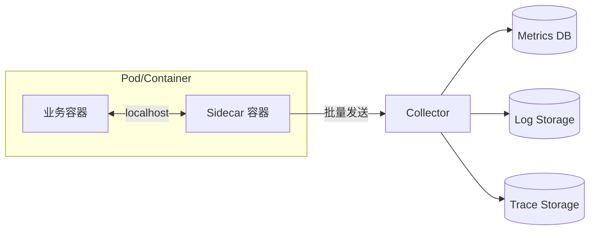

# 遥测监控模式

在单体应用中，排查问题相对简单：看日志、查数据库、直接调试。代码路径是线性的，调用栈是清晰的。但在微服务架构中，一个用户请求可能涉及十几个甚至几十个服务的协作，问题可能出现在网络延迟、服务超时、数据库慢查询等任意环节。**可观测性（Observability）** 成为了分布式系统的必备能力。

可观测性的核心是三种遥测数据（Telemetry Data）：**指标（Metrics）**、**日志（Logs）** 和**链路追踪（Traces）**。这三种数据各有侧重，组合起来才能还原系统的完整运行状态。

## 三大支柱

**指标（Metrics）** 是聚合后的数值数据，用于回答「系统健康吗」这类宏观问题。典型的指标包括：CPU 使用率、内存占用、请求 QPS、接口延迟、错误率。指标的特点是存储成本低、查询速度快，适合长期存储和告警。

Prometheus 是目前最流行的指标采集方案。它采用 Pull 模式，由 Prometheus Server 主动从应用端点拉取指标数据。每个指标由指标名称、标签（Label）和数值组成：

```
# HELP http_requests_total Total HTTP requests
# TYPE http_requests_total counter
http_requests_total{method="GET",status="200",endpoint="/api/users"} 15234
http_requests_total{method="POST",status="201",endpoint="/api/orders"} 8932
```

**日志（Logs）** 是离散的事件记录，用于回答「发生了什么」这类细节问题。每条日志包含时间戳、日志级别、来源服务、上下文信息。日志的优势是信息丰富，但缺点是量大、查询慢。在微服务架构中，日志的收集和聚合是基本功——所有服务的日志应该统一汇聚到 Elasticsearch 或 Loki 中。

**链路追踪（Traces）** 是请求在分布式系统中的完整路径记录，用于回答「请求去哪儿了」这类链路问题。每次请求分配一个全局唯一的 Trace ID，贯穿整个调用链路，每个节点在处理请求时记录自己的 Span（时段），包含开始时间、结束时间、调用的下游服务等信息。

```json
{
  "traceId": "abc123def456",
  "spanId": "span789",
  "parentSpanId": "span456",
  "operationName": "/api/orders",
  "serviceName": "order-service",
  "startTime": 1704652800000,
  "duration": 45,
  "tags": {
    "http.status_code": 200,
    "db.statement": "SELECT * FROM orders WHERE user_id = ?"
  }
}
```

## Sidecar 与统一采集架构

在微服务架构中，每个服务都要实现上述三种遥测数据的采集。如果让业务代码直接集成采集逻辑，会造成代码侵入、版本碎片化。**Sidecar 模式**是解决这个问题的主流方案。



业务容器只负责生成原始遥测数据（如通过标准输出打印日志），Sidecar 容器负责收集、聚合、转发这些数据。这种模式的优势在于：**业务代码零侵入**，不需要引入任何遥测 SDK；**运维统一**，采集策略在 Sidecar 层面统一配置；**语言无关**，任何语言实现的服务都能被正确采集。

OpenTelemetry 是 CNCF 旗下的统一可观测性框架，定义了 Metrics、Logs、Traces 的统一数据模型和 API。各语言的 SDK 只需要按照 OpenTelemetry 的规范埋点，数据就能被 Collector 接收并转发到任意后端（Prometheus、Jaeger、Zipkin、Tempo 等）。

## 关联分析实践

三种遥测数据只有被关联起来才能发挥最大价值。**Trace ID 是关联的枢纽**。当用户报告某个请求很慢时，可以通过 Trace ID 从链路追踪系统中找到完整的调用链，定位到具体是哪个服务的哪个操作耗时过长。然后，根据时间范围在日志系统中搜索相同 Trace ID 的日志，获取错误详情。最后，在指标系统中查看该服务的 CPU、内存、GC 等指标，判断是否是资源问题导致的性能下降。

```python
# 在日志中注入 Trace ID（Python logging 示例）
import logging
from opentelemetry import trace

# 获取当前 span 的 trace_id
current_span = trace.get_current_span()
trace_id = format(current_span.get_span_context().trace_id, '032x')

# 添加到日志的 extra 信息中
logger = logging.getLogger(__name__)
extra = {"trace_id": trace_id}

logger.error("Database query failed", extra=extra)

# 输出: 2024-01-08 10:30:45 ERROR [order-service] Database query failed trace_id=abc123def456
```

这种关联分析的能力是诊断复杂分布式问题的前提。没有 Trace ID，日志是散的；没有 Metrics，问题是模糊的；没有链路追踪，调用路径是黑的。三个支柱缺一不可，共同构建起系统的全链路可见性。
