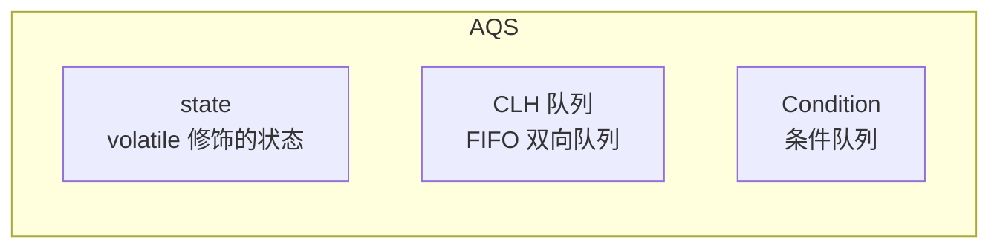
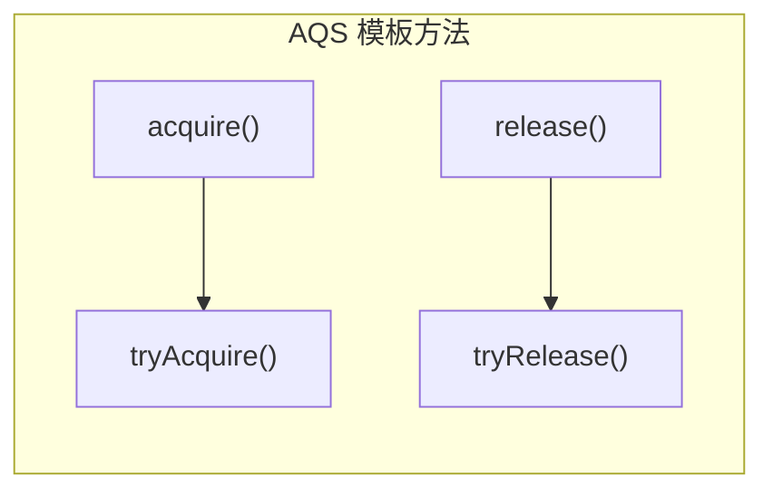
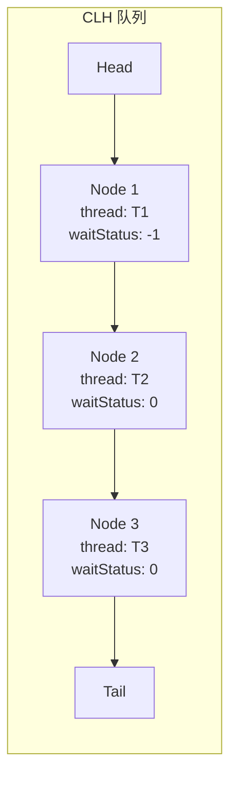

# AQS 框架

AQS（AbstractQueuedSynchronizer）是 Java 并发包的核心基础设施，几乎所有高级同步工具都构建在 AQS 之上。理解 AQS 的原理，是掌握 Java 并发库的钥匙。

## AQS 概述

### 核心组件



AQS 维护了一个 `volatile int state` 和一个 FIFO 双向队列（CLH 队列变体）。

### 设计模式

AQS 采用**模板方法模式**，子类只需实现指定的方法：



## 两种模式

### 独占模式（Exclusive）

同一时刻只有一个线程能获取锁：

```java
// 独占模式获取
public final void acquire(int arg) {
    if (!tryAcquire(arg)) {
        if (shouldParkAfterFailedAcquire())
            parkAndCheckInterrupt();
    }
}
```

### 共享模式（Shared）

多个线程可以同时获取锁：

```java
// 共享模式获取
public final void acquireShared(int arg) {
    if (tryAcquireShared(arg) < 0) {
        doAcquireShared(arg);
    }
}
```

## CLH 队列

### 队列结构



CLH（Craig, Landin, Hagersten）队列是一种高效的无锁队列。

### Node 结构

```java
static final class Node {
    // 共享模式标记
    static final Node SHARED = new Node();

    // 独占模式标记
    static final Node EXCLUSIVE = null;

    // 等待状态
    volatile int waitStatus;

    // 前驱节点
    volatile Node prev;

    // 后继节点
    volatile Node next;

    // 等待线程
    volatile Thread thread;

    // 下一个等待节点（Condition 使用）
    Node nextWaiter;
}
```

### 等待状态

| 状态值 | 含义 |
| --- | --- |
| 0 | 初始状态 |
| -1 | SIGNAL，后继节点需要被唤醒 |
| -2 | CONDITION，节点在 Condition 队列中 |
| -3 | PROPAGATE，用于共享模式传播 |
| >0 | CANCELLED，节点已取消 |

## 独占模式源码解析

### 获取锁（acquire）

```java
public final void acquire(int arg) {
    if (!tryAcquire(arg)) {
        // 尝试获取失败，进入队列
        if (!acquireQueued(addWaiter(Node.EXCLUSIVE), arg)) {
            selfInterrupt();
        }
    }
}

// 子类实现
protected boolean tryAcquire(int arg) {
    throw new UnsupportedOperationException();
}
```

### 入队（addWaiter）

```java
private Node addWaiter(Node mode) {
    Node node = new Node(mode);

    for (;;) {
        Node oldTail = tail;
        if (oldTail != null) {
            // CAS 设置尾节点
            U.putObject(node, Node.PREV, oldTail);
            if (compareAndSetTail(oldTail, node)) {
                oldTail.next = node;
                return node;
            }
        } else {
            // 队列为空，初始化
            initializeSyncQueue();
        }
    }
}
```

### 自旋获取（acquireQueued）

```java
final boolean acquireQueued(Node node, int arg) {
    try {
        boolean interrupted = false;
        for (;;) {
            Node p = node.predecessor();
            if (p == head && tryAcquire(arg)) {
                // 前驱是头节点，再次尝试获取
                setHead(node);
                p.next = null;  // 断链
                return interrupted;
            }

            // 尝试获取失败，检查是否需要阻塞
            if (shouldParkAfterFailedAcquire(p, node)) {
                // 阻塞等待
                interrupted |= parkAndCheckInterrupt();
            }
        }
    } catch (RuntimeException e) {
        cancelAcquire(node);
        throw e;
    }
}
```

### 释放锁（release）

```java
public final boolean release(int arg) {
    if (tryRelease(arg)) {
        Node h = head;
        if (h != null && h.waitStatus != 0) {
            // 唤醒后继节点
            unparkSuccessor(h);
        }
        return true;
    }
    return false;
}
```

## 共享模式源码解析

### 获取锁（acquireShared）

```java
public final void acquireShared(int arg) {
    if (tryAcquireShared(arg) < 0) {
        // 获取失败，进入队列
        doAcquireShared(arg);
    }
}

// 返回值：负数表示失败，0 表示成功但不需要传播，正数表示成功且需要传播
protected int tryAcquireShared(int arg) {
    throw new UnsupportedOperationException();
}
```

### 入队自旋

```java
private void doAcquireShared(int arg) {
    Node node = addWaiter(Node.SHARED);

    try {
        boolean interrupted = false;
        for (;;) {
            Node p = node.predecessor();
            if (p == head) {
                int r = tryAcquireShared(arg);
                if (r >= 0) {
                    // 获取成功，可能需要传播
                    setHeadAndPropagate(node, r);
                    return;
                }
            }

            if (shouldParkAfterFailedAcquire(p, node)) {
                interrupted |= parkAndCheckInterrupt();
            }
        }
    } catch (RuntimeException e) {
        cancelAcquire(node);
        throw e;
    }
}
```

### 传播（Propagate）

```java
private void setHeadAndPropagate(Node node, int propagate) {
    Node h = head;
    setHead(node);

    // 传播给后继节点
    if (propagate > 0 || h == null || h.waitStatus < 0) {
        Node s = node.next;
        if (s == null || s.isShared()) {
            doReleaseShared();
        }
    }
}
```

## Condition 条件队列

### Condition 原理

```mermaid
flowchart LR
    subgraph AQS 队列
        A["同步队列\n_EntryList"]
    end

    subgraph Condition 队列
        B["Condition\n_waitSet"]
    end

    A --> |"await()| B
    B --> |"signal()| A
```

### await()

```java
public final void await() throws InterruptedException {
    if (Thread.interrupted()) {
        throw new InterruptedException();
    }

    // 加入 Condition 队列
    Node node = addConditionWaiter();

    // 释放锁
    int savedState = fullyRelease(node);

    int interruptMode = 0;
    while (!isOnSyncQueue(node)) {
        LockSupport.park(this);
        if ((interruptMode = checkInterruptWhilePark(node)) != 0) {
            break;
        }
    }

    // 重新获取锁
    reacquireInterruptibly(savedState);
}
```

### signal()

```java
public final void signal() {
    if (!isHeldExclusively()) {
        throw new IllegalMonitorStateException();
    }

    Node first = firstWaiter;
    if (first != null) {
        // 移动到同步队列
        doSignal(first);
    }
}

private void doSignal(Node first) {
    do {
        firstWaiter = first.nextWaiter;
        if (transferForSignal(first)) {
            // 成功唤醒
            return;
        }
    } while ((first = firstWaiter) != null);
}
```

## 典型实现

### ReentrantLock（独占）

```java
protected final boolean tryAcquire(int acquires) {
    final Thread current = Thread.currentThread();
    int c = getState();

    if (c == 0) {
        // 尝试获取
        if (compareAndSetState(0, acquires)) {
            setExclusiveOwnerThread(current);
            return true;
        }
    } else if (current == getExclusiveOwnerThread()) {
        // 重入
        int nextc = c + acquires;
        setState(nextc);
        return true;
    }
    return false;
}
```

### CountDownLatch（共享）

```java
protected int tryAcquireShared(int acquires) {
    return getState() == 0 ? 1 : -1;
}

protected boolean tryReleaseShared(int releases) {
    for (;;) {
        int c = getState();
        if (c == 0) {
            return false;  // 已归零
        }
        int nextc = c - 1;
        if (compareAndSetState(c, nextc)) {
            return nextc == 0;  // 返回是否完全释放
        }
    }
}
```

### Semaphore（共享）

```java
protected int tryAcquireShared(int reduces) {
    while (true) {
        int current = getState();
        int available = current - reduces;
        if (available < 0) {
            return -1;  // 失败
        }
        if (compareAndSetState(current, available)) {
            return 1;  // 成功
        }
    }
}
```

## 本章总结

**核心要点**：

1. **AQS 核心组件**：state（状态）+ CLH 队列（同步队列）+ Condition（条件队列）
2. **两种模式**：独占模式（单一线程持有）+ 共享模式（多线程同时持有）
3. **CLH 队列**：FIFO 双向队列，用于管理等待线程
4. **模板方法**：子类实现 tryAcquire/tryRelease/tryAcquireShared/tryReleaseShared
5. **Condition**：await/signal 机制实现条件等待

AQS 是理解 Java 并发包的钥匙。下一节我们将讲解 ReentrantLock 与 Condition。