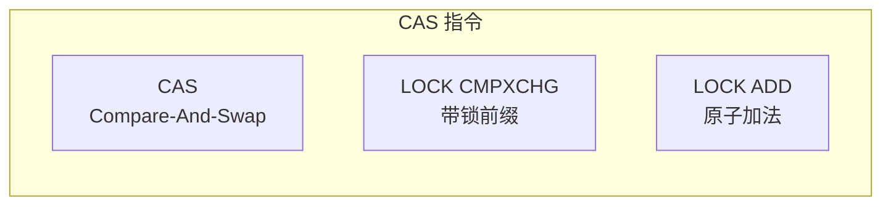
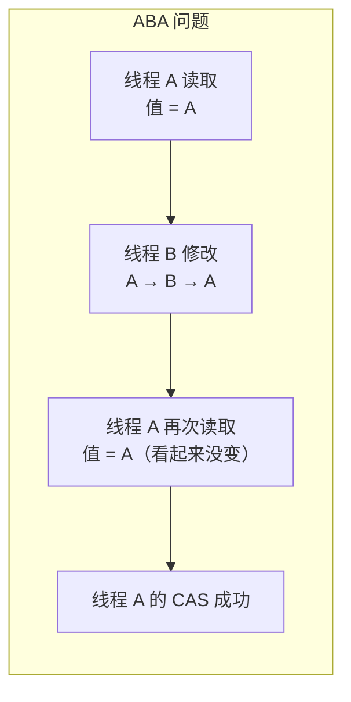
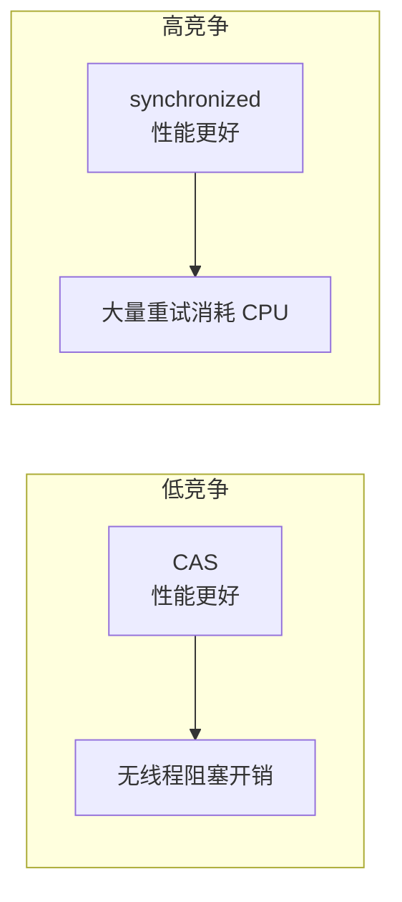

# CAS 与原子类

CAS（Compare-And-Swap）是现代 CPU 提供的原子指令，是 Java 无锁编程的基础。java.util.concurrent.atomic 包中的原子类都基于 CAS 实现，提供了高性能的并发操作。

## CAS 原理

### 概念

CAS 操作包含三个操作数：

- **V**：内存位置
- **E**：期望值
- **U**：新值

只有当 V 的当前值等于 E 时，才将 V 更新为 U。

```mermaid
flowchart LR
    A["内存 V"] --> |"读取| B["当前值"]
    B --> |"等于 E?"| C{"比较"}
    C -->|"是| D["更新 V = U"]
    C -->|"否| E["返回 false\n不更新"]
```

### 伪代码

```java
public class CASExample {
    // 伪代码
    public boolean compareAndSwap(Object obj, long offset, int expected, int newValue) {
        // 读取当前值
        int current = UNSAFE.getIntVolatile(obj, offset);

        // 比较
        if (current == expected) {
            // 相等，更新
            UNSAFE.putInt(obj, offset, newValue);
            return true;
        }
        return false;
    }
}
```

## CAS 的硬件支持

### x86 指令



x86 架构提供 `lock cmpxchg` 指令：

```asm
; EAX = expected, EBX = new_value
; [EDX:ECX] = memory address
lock cmpxchg8b [EDX:ECX]  ; 64位 CAS
```

### CAS 的 ABA 问题



ABA 问题是 CAS 的经典问题：值从 A 变成 B 再变回 A，对于 CAS 操作来说看起来「没变」，但实际上已经被人修改过。

### ABA 问题的解决

```java
// AtomicStampedReference：使用版本号
AtomicStampedReference<Integer> ref = new AtomicStampedReference<>(100, 0);

int[] stamp = new int[1];
Integer value = ref.get(stamp);

// CAS + 版本号检查
ref.compareAndSet(100, 200, stamp[0], stamp[0] + 1);

// AtomicMarkableReference：使用标记位
AtomicMarkableReference<Integer> ref2 = new AtomicMarkableReference<>(100, false);
ref2.compareAndSet(100, 200, false, true);
```

## 原子类家族

### 基本类型

```java
AtomicInteger atomicInt = new AtomicInteger(0);
AtomicLong atomicLong = new AtomicLong(0L);
AtomicBoolean atomicBool = new AtomicBoolean(false);

// 常用方法
atomicInt.incrementAndGet();  // i++
atomicInt.decrementAndGet();  // i--
atomicInt.getAndAdd(delta);   // 返回旧值后增加
atomicInt.updateAndGet(x -> x * 2);  // 函数式更新
atomicInt.compareAndSet(expected, newValue);  // CAS
```

### 引用类型

```java
AtomicReference<User> userRef = new AtomicReference<>(new User());

// CAS 更新
userRef.compareAndSet(oldUser, newUser);

// 批量更新
userRef.updateAndGet(user -> {
    User newUser = new User();
    newUser.setName(user.getName() + "_updated");
    return newUser;
});
```

### 数组类型

```java
AtomicIntegerArray array = new AtomicIntegerArray(new int[]{1, 2, 3});

// 数组元素 CAS
array.compareAndSet(0, 1, 10);  // arr[0] = 10
```

### 字段更新器

```java
public class User {
    volatile int age;
}

// 避免创建大量对象
AtomicIntegerFieldUpdater<User> updater =
    AtomicIntegerFieldUpdater.newUpdater(User.class, "age");

User user = new User();
updater.compareAndSet(user, 0, 18);
```

## CAS vs 锁

### 对比

| 特性 | CAS | synchronized |
| --- | --- | --- |
| 实现层次 | 硬件指令 | JVM/操作系统 |
| 开销 | 轻量（需重试） | 较重（线程阻塞） |
| 并发性 | 高（无阻塞） | 低（有阻塞） |
| 复杂度 | 较高（需自旋） | 较低（自动重试） |
| 适用场景 | 冲突少 | 冲突多 |

### 性能对比



## CAS 的问题

### 自旋开销

```java
// 高竞争下的自旋
while (!compareAndSet(expected, newValue)) {
    expected = get();  // 每次重试都需要重新读取
    // CPU 空转
}
```

### 线程饥饿

高竞争下，某些线程可能长时间无法成功。

### 只能保证单一变量

CAS 只能保证单个变量的原子性，多个变量的复合操作需要额外的同步。

## LongAdder 详解

LongAdder 是解决高竞争下 CAS 性能问题的经典方案。

### 设计思想

```mermaid
flowchart LR
    subgraph AtomicLong（高竞争）
        A["线程 1"] --> B["CAS"]
        A --> C["线程 2"]
        C --> B
        A --> D["线程 3"]
        D --> B
    end

    subgraph LongAdder（分段计数）
        E["线程 1"] --> F["Cell 1"]
        G["线程 2"] --> H["Cell 2"]
        I["线程 3"] --> J["Cell 3"]
    end
```

### 核心思想

- **分段**：将单个计数分散到多个 Cell
- **减少冲突**：不同线程写入不同 Cell
- **求和**：读取时将所有 Cell 的值求和

### LongAdder vs AtomicLong

```java
// AtomicLong：高竞争下大量 CAS 重试
AtomicLong counter = new AtomicLong(0);
counter.incrementAndGet();  // 1000 线程时，大量自旋

// LongAdder：分段计数，减少竞争
LongAdder adder = new LongAdder();
adder.increment();  // 分散到多个 Cell
long sum = adder.sum();
```

### 使用场景

```java
// LongAdder 适用场景
LongAdder counter = new LongAdder();

// 计数器：强烈推荐
counter.increment();

// 统计：QPS、请求数、错误数
for (int i = 0; i < 1000; i++) {
    counter.increment();
}

// LongAdder 不适用场景
// - 需要读取精确值（需要求和，有一定延迟）
// - 竞争不激烈的场景（AtomicLong 足够）
```

## 实战应用

### 无锁计数器

```java
public class LockFreeCounter {

    private final AtomicLong count = new AtomicLong(0);

    public void increment() {
        long old, newValue;
        do {
            old = count.get();
            newValue = old + 1;
        } while (!count.compareAndSet(old, newValue));
    }

    public long get() {
        return count.get();
    }
}
```

### 单例模式

```java
public class LockFreeSingleton {

    private static final AtomicReference<LockFreeSingleton> INSTANCE =
        new AtomicReference<>();

    public static LockFreeSingleton getInstance() {
        while (true) {
            LockFreeSingleton current = INSTANCE.get();
            if (current != null) {
                return current;
            }

            LockFreeSingleton newInstance = new LockFreeSingleton();
            if (INSTANCE.compareAndSet(null, newInstance)) {
                return newInstance;
            }
        }
    }
}
```

### 环形缓冲区

```java
public class RingBuffer<T> {

    private final Object[] buffer;
    private final int mask;
    private final AtomicLong index = new AtomicLong(0);

    public RingBuffer(int size) {
        int actualSize = Integer.highestOneBit(size - 1) << 1;
        this.buffer = new Object[actualSize];
        this.mask = actualSize - 1;
    }

    public void offer(T item) {
        long current = index.get();
        int pos = (int) (current & mask);
        buffer[pos] = item;
        index.incrementAndGet();  // CAS 自增
    }

    @SuppressWarnings("unchecked")
    public T poll() {
        long current = index.get();
        int pos = (int) ((current - 1) & mask);
        return (T) buffer[pos];
    }
}
```

## 本章总结

**核心要点**：

1. **CAS 原理**：比较当前值与期望值，相等才更新
2. **硬件支持**：x86 的 `lock cmpxchg` 指令
3. **ABA 问题**：使用版本号（AtomicStampedReference）解决
4. **原子类**：AtomicInteger/Long/Reference 等基于 CAS
5. **LongAdder**：分段计数，解决高竞争下 CAS 性能问题
6. **CAS vs 锁**：低竞争选 CAS，高竞争选锁

CAS 是无锁编程的基础。下一节我们将详细对比 LongAdder 与 AtomicLong。