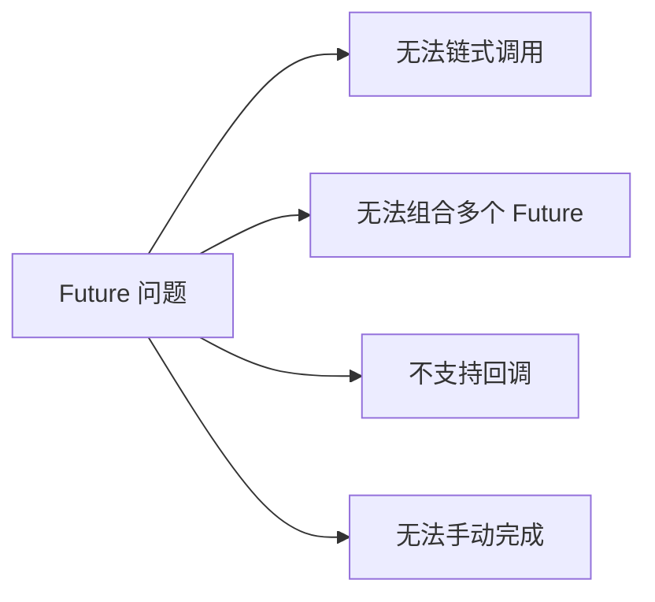

# CompletableFuture 异步编程

Future 是 Java 5 引入的异步编程模型，但它的功能有限：只能通过 `get()` 阻塞获取结果，无法组合多个 Future。CompletableFuture 在 JDK 8 引入，提供了强大的链式异步编程能力。

## Future 的局限性

### 基本 Future

```java
// Future 的问题：无法链式调用
Future<String> future = executor.submit(() -> {
    // 异步执行
    return fetchData();
});

String result = future.get();  // 阻塞等待

// 如果需要组合操作...
String result2 = future.get() + process(result);  // 仍然阻塞
```

### Future 的问题



## CompletableFuture 入门

### 创建 CompletableFuture

```java
// 1. 直接创建
CompletableFuture<String> future = new CompletableFuture<>();

// 2. 静态方法创建
CompletableFuture<String> completed = CompletableFuture.completedFuture("result");
CompletableFuture<Void> future2 = CompletableFuture.runAsync(() -> {
    // 异步执行，无返回值
});

// 3. supplyAsync
CompletableFuture<String> future3 = CompletableFuture.supplyAsync(() -> {
    return "Hello";
});
```

### 获取结果

```java
CompletableFuture<String> future = CompletableFuture.supplyAsync(() -> "result");

// 1. 阻塞获取
String result = future.get();  // 抛出受检异常
String result2 = future.get(5, TimeUnit.SECONDS);  // 带超时

// 2. 非阻塞获取
future.thenAccept(result -> {
    System.out.println("Result: " + result);
});
```

## 链式调用

### thenApply：转换

```java
CompletableFuture<Integer> future = CompletableFuture
    .supplyAsync(() -> "123")        // String
    .thenApply(Integer::parseInt);     // Integer
```

### thenCompose：扁平化

```java
// thenCompose 用于返回另一个 CompletableFuture 的场景
CompletableFuture<User> userFuture = CompletableFuture
    .supplyAsync(() -> userId)
    .thenCompose(this::fetchUser);  // 返回 CompletableFuture<User>

// thenApply 用于返回普通值的场景
CompletableFuture<String> nameFuture = userFuture
    .thenApply(User::getName);  // 返回 String
```

### thenCombine：组合

```java
CompletableFuture<String> future1 = CompletableFuture.supplyAsync(() -> "Hello");
CompletableFuture<String> future2 = CompletableFuture.supplyAsync(() -> "World");

CompletableFuture<String> combined = future1
    .thenCombine(future2, (s1, s2) -> s1 + " " + s2);  // "Hello World"
```

## 异常处理

### 异常捕获

```java
CompletableFuture<Integer> future = CompletableFuture
    .supplyAsync(() -> riskyOperation())
    .exceptionally(ex -> {
        System.out.println("Error: " + ex.getMessage());
        return 0;  // 默认值
    });
```

### handle：无论成功失败都处理

```java
CompletableFuture<Integer> future = CompletableFuture
    .supplyAsync(() -> riskyOperation())
    .handle((result, ex) -> {
        if (ex != null) {
            System.out.println("Error: " + ex.getMessage());
            return 0;
        }
        return result;
    });
```

### 测试异常

```java
CompletableFuture<Integer> future = CompletableFuture
    .failedFuture(new RuntimeException("Error"));

CompletableFuture<Integer> defaultFuture = future.exceptionally(ex -> {
    return 0;
});
```

## 实战示例

### 异步调用链

```java
// 场景：用户下单 -> 查询用户 -> 查询商品 -> 计算价格
public CompletableFuture<OrderResult> createOrder(Long userId, Long productId) {
    return CompletableFuture
        .supplyAsync(() -> fetchUser(userId))           // 查询用户
        .thenCompose(user ->                            // 组合商品查询
            CompletableFuture.supplyAsync(() -> fetchProduct(productId))
                .thenApply(product -> new OrderContext(user, product)))
        .thenApply(context -> calculatePrice(context))  // 计算价格
        .thenApply(context -> saveOrder(context));       // 保存订单
}
```

### 并行执行

```java
// 场景：同时查询多个接口
public UserProfile getUserProfile(Long userId) {
    // 1. 查询用户基本信息
    CompletableFuture<User> userFuture =
        CompletableFuture.supplyAsync(() -> fetchUser(userId));

    // 2. 查询用户订单
    CompletableFuture<List<Order>> ordersFuture =
        CompletableFuture.supplyAsync(() -> fetchOrders(userId));

    // 3. 查询用户偏好
    CompletableFuture<Preferences> prefsFuture =
        CompletableFuture.supplyAsync(() -> fetchPreferences(userId));

    // 等待所有完成
    User user = userFuture.join();
    List<Order> orders = ordersFuture.join();
    Preferences prefs = prefsFuture.join();

    return new UserProfile(user, orders, prefs);
}
```

### allOf 和 anyOf

```java
List<CompletableFuture<String>> futures = Arrays.asList(
    CompletableFuture.supplyAsync(() -> fetchFrom("API1")),
    CompletableFuture.supplyAsync(() -> fetchFrom("API2")),
    CompletableFuture.supplyAsync(() -> fetchFrom("API3"))
);

// 等待所有完成
CompletableFuture<Void> allDone = CompletableFuture.allOf(
    futures.toArray(new CompletableFuture[0])
);
allDone.join();  // 阻塞直到所有完成

// 获取所有结果
List<String> results = futures.stream()
    .map(CompletableFuture::join)
    .collect(Collectors.toList());

// 任意一个完成（第一个返回）
CompletableFuture<Object> anyDone = CompletableFuture.anyOf(
    futures.toArray(new CompletableFuture[0])
);
Object first = anyDone.join();
```

## 线程池配置

### 默认线程池

```java
// 默认使用 ForkJoinPool.commonPool()
// 线程数 = Runtime.getRuntime().availableProcessors() - 1

CompletableFuture.supplyAsync(() -> doSomething());
// 使用公共线程池
```

### 自定义线程池

```java
ExecutorService executor = Executors.newFixedThreadPool(10);

CompletableFuture<String> future = CompletableFuture
    .supplyAsync(() -> doSomething(), executor);

// 链式调用默认使用同一个线程池
future.thenApply(this::process);  // 仍在 executor 中执行
```

### 推荐实践

```java
// IO 密集型任务：使用更大的线程池
ExecutorService ioExecutor = new ThreadPoolExecutor(
    50, 100, 60L, TimeUnit.SECONDS,
    new LinkedBlockingQueue<>(1000)
);

// 异步方法封装
public <T> CompletableFuture<T> supplyAsync(Supplier<T> supplier) {
    return CompletableFuture.supplyAsync(supplier, ioExecutor);
}
```

## 取消操作

### 取消 CompletableFuture

```java
CompletableFuture<String> future = CompletableFuture.supplyAsync(() -> {
    try {
        Thread.sleep(5000);
        return "result";
    } catch (InterruptedException e) {
        Thread.currentThread().interrupt();
        throw new RuntimeException("Cancelled");
    }
});

// 取消
future.cancel(true);

// 检查状态
if (future.isCompletedExceptionally()) {
    // 处理取消
}
```

## 性能考虑

### 避免阻塞

```java
// 错误：在异步链中使用 get
CompletableFuture<String> future = CompletableFuture
    .supplyAsync(() -> fetchData())
    .thenApply(data -> {
        String result = anotherFuture.get();  // 阻塞！
        return process(data, result);
    });

// 正确：继续使用异步链
CompletableFuture<String> future = CompletableFuture
    .supplyAsync(() -> fetchData())
    .thenCompose(data ->
        anotherFuture.thenApply(result -> process(data, result))
    );
```

### 避免过度嵌套

```java
// 错误：回调地狱
future1.thenAccept(result1 -> {
    future2.thenAccept(result2 -> {
        future3.thenAccept(result3 -> {
            // 嵌套太深
        });
    });
});

// 正确：扁平化链式调用
CompletableFuture
    .supplyAsync(() -> result1)
    .thenCompose(r1 -> future2.thenApply(r2 -> combine(r1, r2)))
    .thenCompose(result -> future3.thenApply(r3 -> combineAll(result, r3)))
    .thenAccept(finalResult -> {});
```

## 本章总结

**核心要点**：

1. **Future 的局限**：无法链式调用、组合、回调
2. **CompletableFuture**：支持链式调用的异步编程模型
3. **thenApply**：同步转换
4. **thenCompose**：异步扁平化
5. **thenCombine**：组合两个 Future
6. **exceptionally/handle**：异常处理
7. **allOf/anyOf**：并行执行和竞态处理

CompletableFuture 是现代 Java 异步编程的核心工具。下一节我们将讲解 Fork/Join 框架。