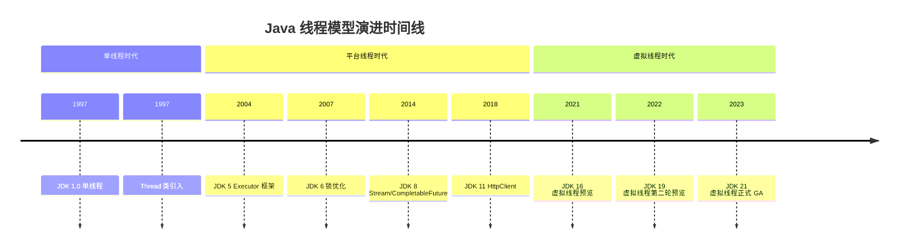
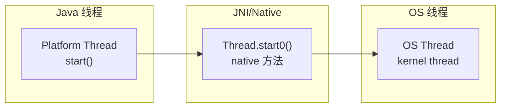
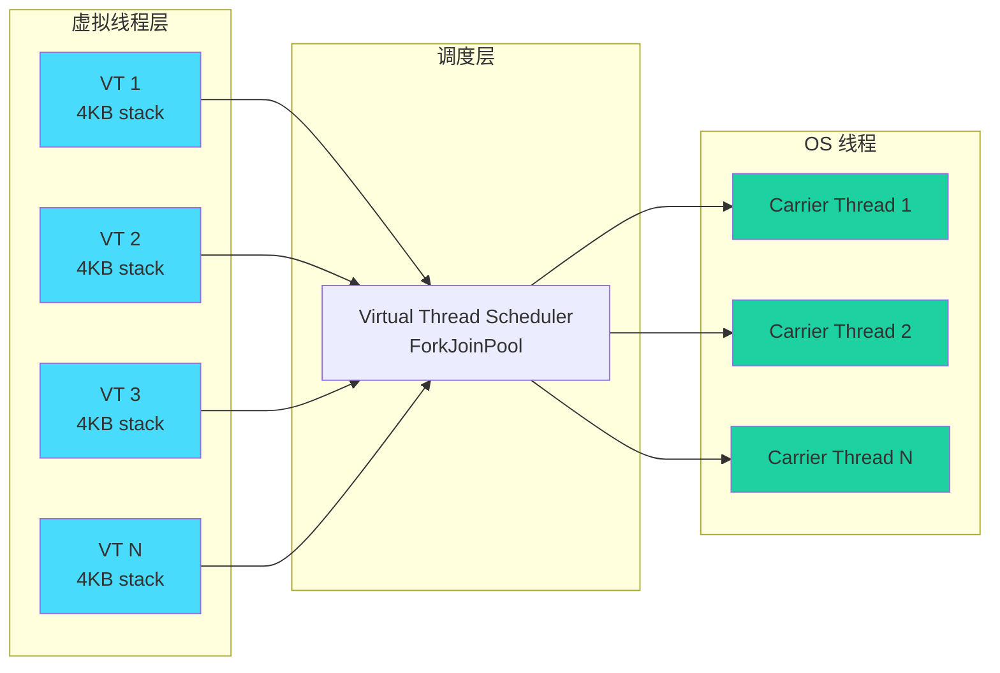
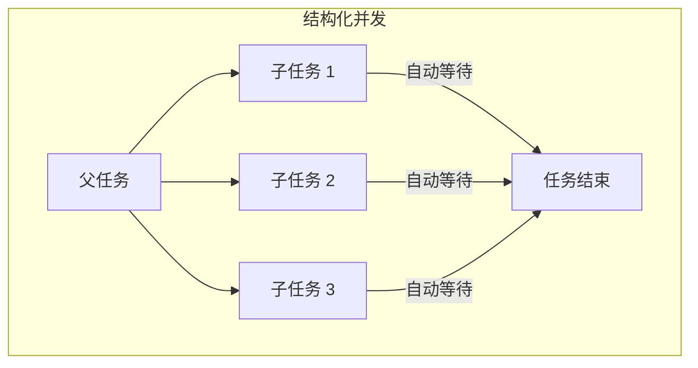

# Java 线程模型演进史

从 1997 年 JDK 1.0 的单线程模型，到 2023 年 JDK 21 的虚拟线程正式 GA，Java 的线程模型经历了漫长的演进过程。理解这段历史，才能理解 Java 并发编程的过去、现在和未来。

## 线程模型的演进时间线



## 平台线程：Thread.start() → OS 线程

### 1:1 映射模型

在虚拟线程出现之前，Java 线程与 OS 线程是 1:1 映射关系：



### 平台线程的特点

**优势**：

- 实现简单，语义清晰
- 与 OS 线程一一对应，可直接利用 OS 的线程调度
- 支持完整的 POSIX 线程语义

**劣势**：

- 每个线程占用约 1MB 栈空间
- 线程创建和销毁开销大
- 线程上下文切换成本高

### C10K 问题

当并发连接数超过 10000 时，传统线程模型的资源消耗开始失控：


这就是经典的 **C10K 问题**（10,000 Connections Problem）。虽然名字是 10K，但实际上问题从 1000 并发开始就可能出现。

## 虚拟线程：Project Loom

### M:N 映射模型

Project Loom 引入了虚拟线程，其核心思想是 M:N 映射：M 个虚拟线程映射到 N 个 OS 线程。



### 虚拟线程的关键技术

1. **Continuation（延续）**：当虚拟线程执行阻塞操作时，它会被挂起，释放底层的 Carrier Thread
2. **调度器**：虚拟线程由 ForkJoinPool 调度
3. **栈折叠**：虚拟线程的栈空间按需分配，初始只有 4KB

### 虚拟线程的优势

- **轻量级**：每个虚拟线程只占用约 4KB 栈空间
- **高效阻塞**：阻塞操作不会阻塞 OS 线程
- **简化并发**：可以用同步的方式编写异步代码

## 结构化并发：Java 21+

### 什么是结构化并发

结构化并发（Structured Concurrency）是一种编程范式，旨在简化多线程代码的生命周期管理。



### 结构化并发的优势

1. **自动资源管理**：子任务的生命周期自动绑定到父任务
2. **简化异常处理**：子任务的异常自动传播到父任务
3. **清晰的代码结构**：并发代码看起来像顺序执行

### 示例

```java
// Java 21 结构化并发
try (var scope = new StructuredTaskScope.ShutdownOnFailure()) {
    Future<String> user = scope.fork(() -> findUser());
    Future<Integer> order = scope.fork(() -> fetchOrderCount());

    scope.join();          // 等待所有子任务完成
    scope.throwIfFailed(); // 抛出第一个子任务的异常

    System.out.println(user.resultNow() + " " + order.resultNow());
}
```

## 三种模型的对比

| 特性 | 平台线程 | 虚拟线程 | 结构化并发 |
| --- | --- | --- | --- |
| **映射关系** | 1:1 | M:N | M:N + 结构化 |
| **栈大小** | ~1MB | ~4KB（按需增长） | 与虚拟线程相同 |
| **阻塞成本** | 高（阻塞 OS 线程） | 低（挂起虚拟线程） | 与虚拟线程相同 |
| **生命周期管理** | 手动管理 | 手动管理 | 自动管理 |
| **代码风格** | 传统多线程 | 同步风格 | 结构化风格 |
| **JDK 版本** | 1.0+ | 21+ | 21+ |

## 演进的意义

Java 线程模型的演进，反映了 Java 对并发编程理解的不断深入：

1. **从手动到自动**：从手动管理线程生命周期，到自动管理
2. **从复杂到简单**：从复杂的异步回调，到简单的同步风格
3. **从资源浪费到高效利用**：从 1:1 映射的资源浪费，到 M:N 映射的高效利用

理解这段演进历史，有助于更好地理解 Java 并发编程的设计哲学，以及为什么虚拟线程和结构化并发是 Java 的重要里程碑。

## 本章总结

**核心要点**：

1. **平台线程**：1:1 映射到 OS 线程，简单但资源消耗大
2. **虚拟线程**：M:N 映射，轻量级，适合 IO 密集型任务
3. **结构化并发**：自动管理生命周期，简化并发代码
4. **演进方向**：从手动到自动，从复杂到简单

下一节我们将深入讲解平台线程的细节。