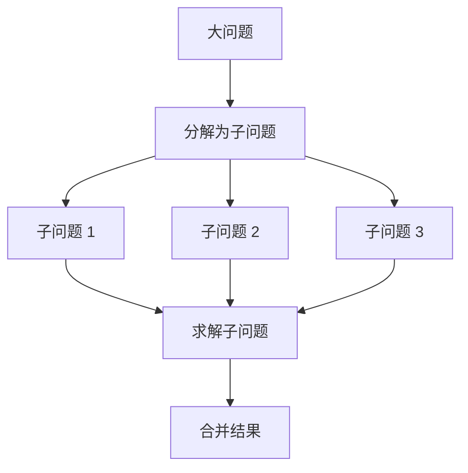
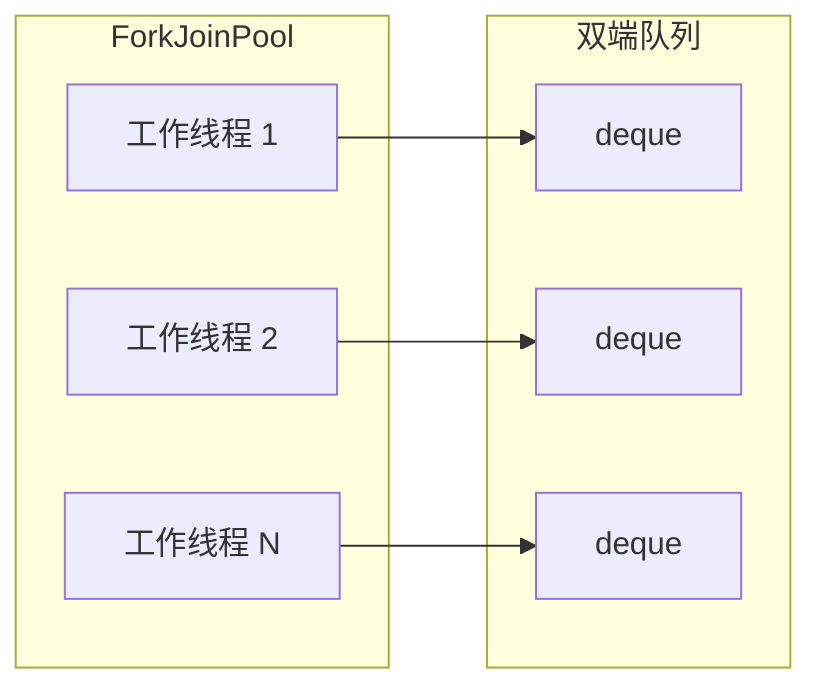
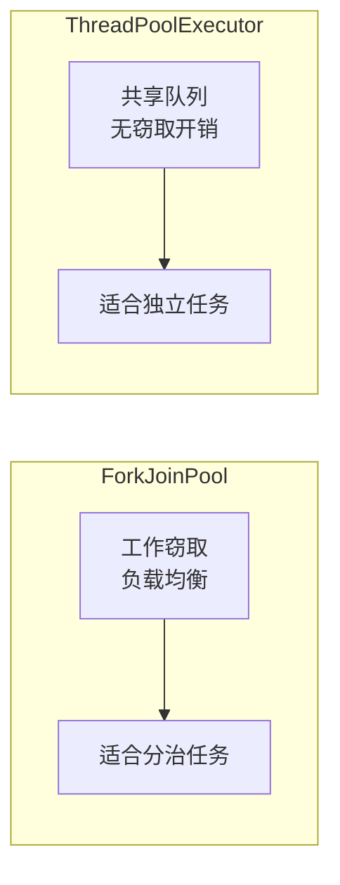

# Fork/Join 框架

Fork/Join 是 JDK 7 引入的并行计算框架，专门用于分治策略的并行化。它是 Java 并行流和 CompletableFuture 的底层实现，理解它有助于更好地使用这些高级 API。

## 核心思想

### 分治策略



### 工作窃取算法

```mermaid
flowchart LR
    subgraph 线程 1
        A["任务队列"] --> B["任务 1"]
        A --> C["任务 2"]
        A --> D["任务 3"]
    end

    subgraph 线程 2
        E["任务队列"] --> |"窃取| F["任务 3"]
        E --> G["任务 4"]
    end
```

**工作窃取**：当某个线程的任务队列为空时，从其他线程的队列尾部「窃取」任务执行。

## ForkJoinPool

### 创建

```java
// 1. 默认公共池
ForkJoinPool pool = ForkJoinPool.commonPool();

// 2. 自定义池
ForkJoinPool customPool = new ForkJoinPool(10);  // 10 个线程
```

### 工作原理



每个工作线程维护一个双端队列（deque）：

- **push**：新任务加入队列头部
- **pop**：从队列头部取任务（自己执行）
- **steal**：从队列尾部取任务（窃取）

## RecursiveTask 与 RecursiveAction

### RecursiveTask（有返回值）

```java
public class SumTask extends RecursiveTask<Long> {

    private static final int THRESHOLD = 1000;
    private final long[] array;
    private final int start;
    private final int end;

    public SumTask(long[] array, int start, int end) {
        this.array = array;
        this.start = start;
        this.end = end;
    }

    @Override
    protected Long compute() {
        int length = end - start;

        // 足够小，直接计算
        if (length <= THRESHOLD) {
            long sum = 0;
            for (int i = start; i < end; i++) {
                sum += array[i];
            }
            return sum;
        }

        // 分解为两个子任务
        int mid = start + length / 2;
        SumTask left = new SumTask(array, start, mid);
        SumTask right = new SumTask(array, mid, end);

        // fork 异步执行
        left.fork();
        right.fork();

        // join 获取结果
        return left.join() + right.join();
    }
}
```

### RecursiveAction（无返回值）

```java
public class PrintTask extends RecursiveAction {

    private static final int THRESHOLD = 10;
    private final String[] array;
    private final int start;
    private final int end;

    public PrintTask(String[] array, int start, int end) {
        this.array = array;
        this.start = start;
        this.end = end;
    }

    @Override
    protected void compute() {
        int length = end - start;

        if (length <= THRESHOLD) {
            for (int i = start; i < end; i++) {
                System.out.println(array[i]);
            }
            return;
        }

        int mid = start + length / 2;
        PrintTask left = new PrintTask(array, start, mid);
        PrintTask right = new PrintTask(array, mid, end);

        invokeAll(left, right);  // 并行执行两个子任务
    }
}
```

## 使用示例

### 计算数组求和

```java
public class ForkJoinSum {

    public static long sum(long[] array) {
        ForkJoinPool pool = ForkJoinPool.commonPool();
        SumTask task = new SumTask(array, 0, array.length);
        return pool.invoke(task);
    }
}
```

### 并行排序

```java
public class ForkJoinSort extends RecursiveAction {

    private static final int THRESHOLD = 1000;
    private final int[] array;
    private final int start;
    private final int end;

    public ForkJoinSort(int[] array, int start, int end) {
        this.array = array;
        this.start = start;
        this.end = end;
    }

    @Override
    protected void compute() {
        int length = end - start;

        if (length <= THRESHOLD) {
            Arrays.sort(array, start, end);
            return;
        }

        int mid = start + length / 2;
        ForkJoinSort left = new ForkJoinSort(array, start, mid);
        ForkJoinSort right = new ForkJoinSort(array, mid, end);

        invokeAll(left, right);
        merge(mid);
    }

    private void merge(int mid) {
        // 合并两个有序子数组
    }
}
```

## ForkJoinPool vs ThreadPoolExecutor

### 对比

| 特性 | ForkJoinPool | ThreadPoolExecutor |
| --- | --- | --- |
| 设计目标 | 分治任务 | 通用任务 |
| 任务队列 | 每线程独立 deque | 共享队列 |
| 负载均衡 | 工作窃取 | 抢任务 |
| 适用场景 | 递归分治 | 独立任务 |

### 性能对比



## 并行流与 ForkJoinPool

### 默认并行流

```java
// 默认使用 ForkJoinPool.commonPool()
List<Long> list = Arrays.asList(1L, 2L, 3L, 4L, 5L);
long sum = list.parallelStream()
    .mapToLong(Long::longValue)
    .sum();
```

### 自定义并行流

```java
ForkJoinPool customPool = new ForkJoinPool(10);

long sum = customPool.submit(() ->
    list.parallelStream()
        .mapToLong(Long::longValue)
        .sum()
).join();
```

### 注意事项

```java
// 公共池线程数 = CPU 核心数 - 1
// IO 密集型任务可能需要更大的自定义池

ForkJoinPool pool = new ForkJoinPool(
    Runtime.getRuntime().availableProcessors() * 2
);
```

## 最佳实践

### 任务粒度

```java
// THRESHOLD 选择原则：
// - 太小：任务太细，线程调度开销大
// - 太大：并行度不够

// 建议：选择使得每个子任务的计算量在 100~1000 单位
private static final int THRESHOLD = 1000;
```

### 避免阻塞

```java
// 错误：在 compute 中调用阻塞操作
@Override
protected Long compute() {
    if (需要等待) {
        future.get();  // 会阻塞工作线程！
    }
}

// 正确：使用 asyncFork
@Override
protected Long compute() {
    if (需要等待) {
        CompletableFuture<Long> future = CompletableFuture.supplyAsync(() -> compute());
        return future.join();
    }
}
```

### 监控

```java
ForkJoinPool pool = ForkJoinPool.commonPool();

// 查看状态
System.out.println("Pool size: " + pool.getPoolSize());
System.out.println("Active threads: " + pool.getActiveThreadCount());
System.out.println("Running threads: " + pool.getRunningThreadCount());
System.out.println("Queued tasks: " + pool.getQueuedSubmissionCount());
System.out.println("Steal count: " + pool.getStealCount());
```

## 本章总结

**核心要点**：

1. **分治策略**：大问题分解为小问题，并行求解，合并结果
2. **工作窃取**：空闲线程从其他线程队列窃取任务，负载均衡
3. **RecursiveTask**：有返回值，用于计算任务
4. **RecursiveAction**：无返回值，用于操作任务
5. **ForkJoinPool**：专门为分治任务设计的线程池
6. **并行流**：底层使用 ForkJoinPool.commonPool()

Fork/Join 是 Java 并行计算的基础。下一节我们将讲解虚拟线程深度解析。