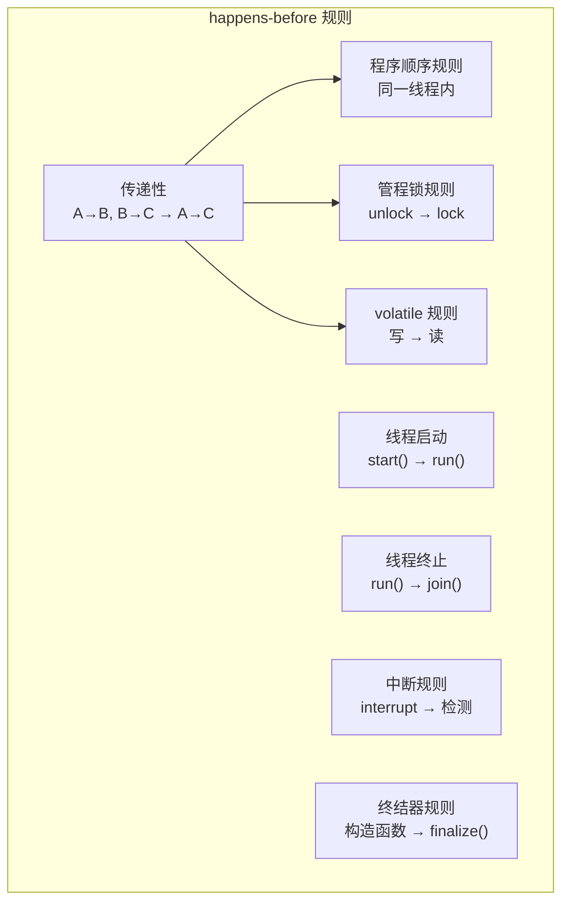

# happens-before 原则

如果说 JMM 是 Java 并发编程的「宪法」，那么 happens-before 就是宪法的「实施细则」。它定义了线程间操作的可见性和有序性规则，是理解 Java 并发正确性的关键。

## happens-before 的定义

### 形式化定义

如果操作 A happens-before 操作 B，那么：

1. **可见性**：A 的结果对 B 可见
2. **有序性**：A 的执行顺序在 B 之前

这是 Java 内存模型中最核心的概念，也是 JMM 正确性的保证。

### 形式化定义

```
HB(A, B) 表示 A happens-before B

如果 HB(A, B) 且 HB(B, C)，则 HB(A, C)（传递性）
```

## 八大规则详解

### 规则一：程序顺序规则（Program Order Rule）

**在同一个线程中**，前面的操作 happens-before 后面的操作。

```java
int a = 1;      // 1 happens-before 2
int b = 2;      // 2 happens-before 3
int c = a + b;  // 3
```

**关键点**：这只保证**同一个线程内**的有序性，不保证不同线程间。

### 规则二：管程锁规则（Monitor Lock Rule）

**对同一个锁的 unlock 操作**，happens-before **后续对这个锁的 lock 操作**。

```java
synchronized (lock) {
    // 线程 A 的操作
    sharedVar = 1;
}  // unlock

synchronized (lock) {
    // 线程 B 看到 sharedVar = 1
    int x = sharedVar;
}  // lock
```

**含义**：线程 A 在释放锁之前的所有操作，对线程 B 获取锁后可见。

### 规则三：volatile 变量规则（Volatile Variable Rule）

**对 volatile 变量的写操作**，happens-before **后续对这个变量的读操作**。

```java
public class VolatileRule {

    private volatile boolean ready = false;
    private int value = 0;

    public void writer() {
        value = 42;      // 1
        ready = true;    // 2
        // 2 happens-before 3
    }

    public void reader() {
        if (ready) {     // 3
            // 一定能读到 value = 42
            int x = value;  // 4
        }
    }
}
```

**含义**：线程 A 对 volatile 变量的修改，线程 B 一定能看到。

### 规则四：线程启动规则（Thread Start Rule）

**Thread.start()**，happens-before **被启动线程内的任何操作**。

```java
Thread t = new Thread(() -> {
    // 线程启动后，能看到主线程在 start() 之前的所有操作
    int x = sharedVar;  // 能读到正确值
});

int sharedVar = 42;
t.start();
```

### 规则五：线程终止规则（Thread Termination Rule）

**线程内的任何操作**，happens-before **其他线程检测到线程终止**。

```java
Thread t = new Thread(() -> {
    sharedVar = 42;
});

t.start();
t.join();  // join 返回后

// 这里一定能读到 sharedVar = 42
System.out.println(sharedVar);
```

### 规则六：中断规则（Interruption Rule）

**对线程 interrupt() 的调用**，happens-before **被中断线程检测到中断**。

```java
Thread t = new Thread(() -> {
    while (!Thread.currentThread().isInterrupted()) {
        // 正常执行
    }
    // 能被中断
});

t.start();
t.interrupt();  // happens-before 线程检测到中断

t.join();
```

### 规则七：终结器规则（Finalizer Rule）

**对象的构造函数**，happens-before **finalize() 方法的开始**。

```java
public class FinalizerRule {

    private final int value;

    public FinalizerRule() {
        this.value = 42;  // happens-before finalize()
    }

    @Override
    protected void finalize() {
        // 一定能读到 value = 42
        System.out.println(value);
    }
}
```

### 规则八：传递性规则（Transitivity）

**如果 A happens-before B，且 B happens-before C，则 A happens-before C**。

## 规则关系图



## 实际应用

### 场景一：单例模式

```java
public class Singleton {

    private static volatile Singleton instance;

    public static Singleton getInstance() {
        if (instance == null) {
            synchronized (Singleton.class) {
                if (instance == null) {
                    instance = new Singleton();
                    // 等价于：
                    // 1. 分配内存
                    // 2. 调用构造函数
                    // 3. 将引用赋值给 instance
                    // volatile 防止 2 和 3 重排
                }
            }
        }
        return instance;
    }
}
```

### 场景二：线程安全的计数器

```java
public class SafeCounter {

    private int value = 0;

    public synchronized void increment() {  // synchronized 保证可见性
        value++;
    }

    public synchronized int get() {  // synchronized 保证可见性
        return value;
    }
}
```

### 场景三：双重检查锁定

```java
public class DoubleCheckedLocking {

    private static volatile Resource resource;

    public static Resource getResource() {
        if (resource == null) {  // 第一次检查
            synchronized (DoubleCheckedLocking.class) {
                if (resource == null) {  // 第二次检查
                    resource = new Resource();
                    // 构造函数 happens-before 其他线程读取 resource
                }
            }
        }
        return resource;
    }
}
```

## happens-before vs 同步机制

### 对应关系

| happens-before 规则 | 对应机制 |
| --- | --- |
| 程序顺序规则 | 同一线程内天然保证 |
| 管程锁规则 | synchronized |
| volatile 变量规则 | volatile |
| 线程启动规则 | Thread.start() |
| 线程终止规则 | Thread.join() |
| 中断规则 | Thread.interrupt() |

### happens-before 不是「先后执行」

```java
// 错误理解
int a = 0;
Thread t = new Thread(() -> {
    // 如果 B happens-before C，这里一定能读到 a = 1？
});
t.start();
a = 1;
t.join();

// 正确理解
// a = 1 happens-before t.join()
// t.join() returns happens-before 后续代码
// 但 a = 1 可能在 t 启动之前或之后执行
```

**关键**：happens-before 只保证**因果关系**，不保证**执行顺序**。

## 与 as-if-serial 的关系

### as-if-serial 语义

**在单线程内**，程序的执行结果必须与按照程序顺序执行的结果相同。

### happens-before vs as-if-serial

```mermaid
flowchart LR
    subgraph 约束
        A["as-if-serial\n单线程内"]
        B["happens-before\n多线程间"]
    end

    A --> |"保证| C["正确性"]
    B --> C
```

- **as-if-serial**：保证单线程内的正确性
- **happens-before**：保证多线程间的正确性

## 常见误解

### 误解一：happens-before 是时间上的先后

```java
// 错误理解：b = 2 一定先于 c = 3 执行
a = 1;
b = 2;
c = 3;

// 正确理解：编译器/CPU 可能重排
// 但最终结果必须与顺序执行一致
```

### 误解二：volatile 变量之间的顺序

```java
volatile boolean a = false;
volatile boolean b = false;

Thread A:
    a = true;  // 写 A
    b = true;  // 写 B

Thread B:
    if (b) {   // 读到 B
        // 一定能读到 a = true 吗？
        // 是的，因为 volatile 写 happens-before 后续的 volatile 读
        // 但 b = true happens-before if (b) 成立
        // a = true happens-before b = true（程序顺序）
        // 所以 a = true happens-before if (b)
    }
```

### 误解三：不同锁的 happens-before

```java
Object lock1 = new Object();
Object lock2 = new Object();

Thread A:
    synchronized (lock1) {
        x = 1;
    }

Thread B:
    synchronized (lock2) {
        // 能看到 x = 1 吗？
        // 不能！不同锁没有 happens-before 关系
    }
```

## 本章总结

**核心要点**：

1. **定义**：如果 A happens-before B，则 A 的结果对 B 可见，A 的顺序在 B 之前
2. **八大规则**：程序顺序、管程锁、volatile、线程启动/终止、中断、终结器、传递性
3. **传递性**：A→B，B→C 则 A→C
4. **应用**：单例模式、双重检查锁定、线程安全计数器
5. **区别**：happens-before 不是「先后执行」，而是「可见性和有序性的保证」

理解 happens-before 是正确使用 Java 并发机制的关键。下一节我们将讲解 volatile 原理与内存屏障。