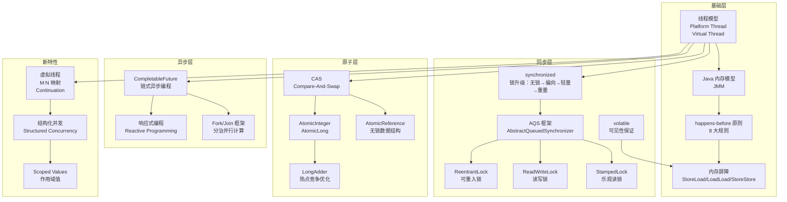
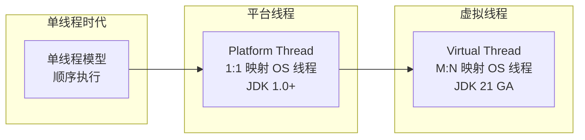
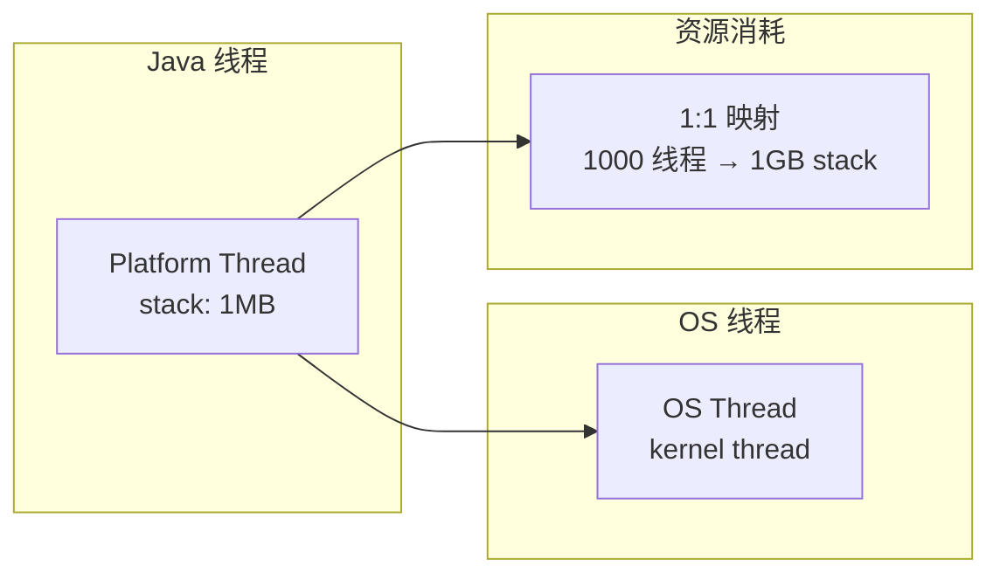
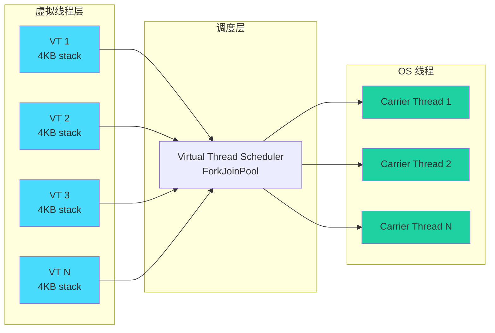
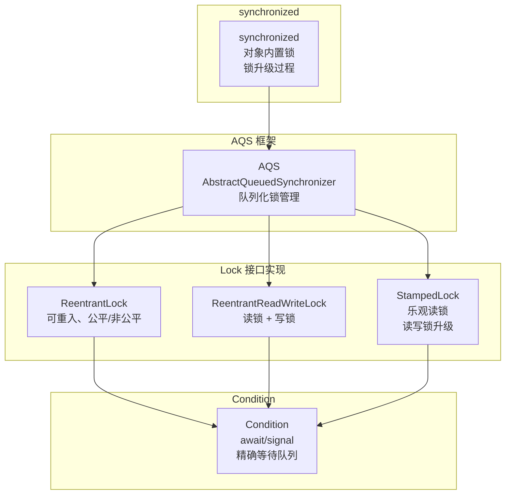
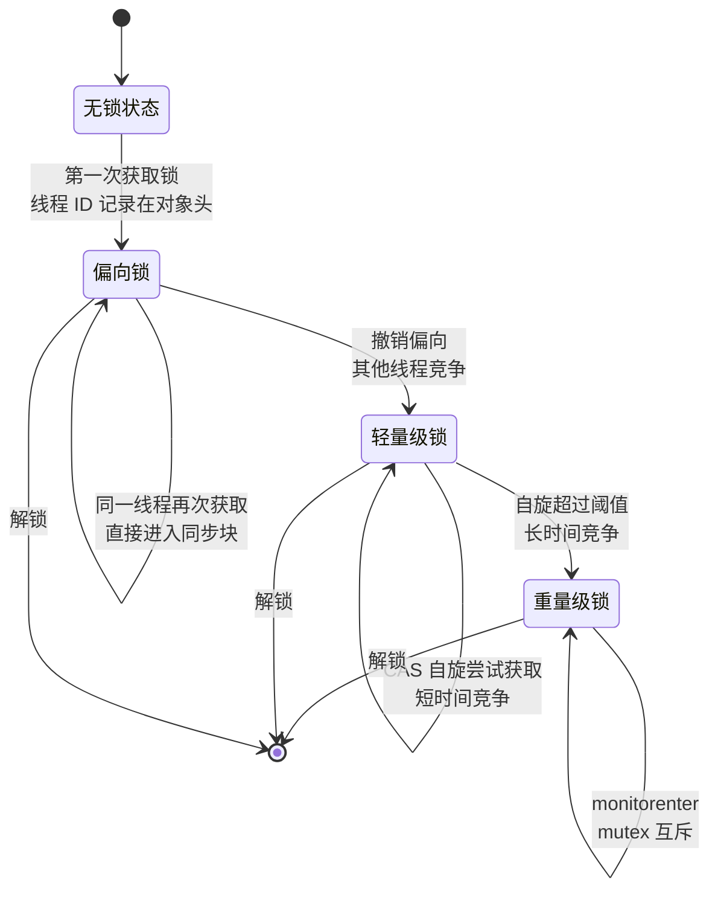
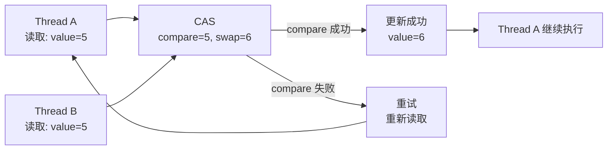
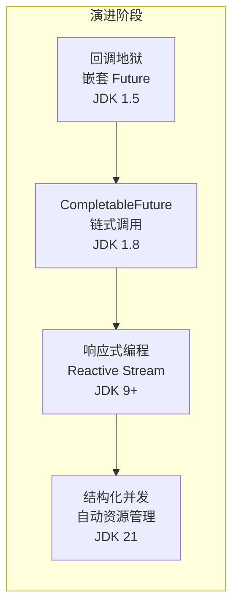

# Java 并发模型

凌晨 2 点，线上告警突然响起：CPU 使用率飙升至 95%，但吞吐量却没有相应提升。你打开线程 dump 发现——几百个线程全部处于 `BLOCKED` 状态，全部在等待同一把锁。而这把锁的持有者，正在执行一个看似无害的网络请求。

这不是极端案例。在 Java 并发编程的世界里，类似的场景每天都在上演：**一个隐藏的死锁、一个不恰当的线程池配置、一个被忽略的可见性问题**，轻则导致接口超时，重则让整个系统完全挂起。

某公司曾因为 `synchronized` 锁粒度过粗，导致 2000 QPS 的接口退化到 200 QPS；另一个团队因为 `volatile` 与 `synchronized` 混用不当，引发了长达三天的「幽灵 Bug」——只在生产环境偶发，测试环境怎么都复现不了。

**Java 并发编程，是后端工程师必须跨越的门槛，也是最容易踩坑的领域。**

本模块从线程模型演进出发，深入讲解 Java 内存模型（JMM）、happens-before 原则、同步机制（AQS、ReentrantLock、ReadWriteLock、StampedLock）、原子操作（CAS、Atomic*）、异步编程（CompletableFuture、Fork/Join）、虚拟线程（Virtual Thread）等核心知识点，帮助你建立完整的 Java 并发知识体系。

## 模块结构

本模块按主题分为 8 个子模块：

| 子模块 | 核心问题 | 典型场景 |
| --- | --- | --- |
| 线程模型演进 | 平台线程 vs 虚拟线程的底层差异 | C10K 问题、线程资源消耗 |
| Java 内存模型 | 可见性、原子性、有序性如何保证 | 多线程数据不一致 |
| 同步机制 | synchronized、AQS、Lock 的实现原理 | 死锁、锁竞争、并发控制 |
| 原子操作与 CAS | 无锁编程的核心原理 | 高性能计数器、乐观并发 |
| 异步编程 | CompletableFuture、Fork/Join、响应式 | 非阻塞调用、并行计算 |
| 虚拟线程深度解析 | Loom 架构、Continuation、迁移指南 | 高并发 IO 密集型服务 |
| Java 21+ 新特性 | Scoped Values、结构化并发增强 | 简化并发代码、避免泄漏 |
| 常见陷阱与排查 | 死锁、活锁、竞态条件、可见性问题 | 线上疑难 Bug 定位 |

## 核心概念图谱

Java 并发编程涉及的核心概念相互关联，下图展示它们之间的关系：

## 线程模型演进

Java 的线程模型经历了从单线程到多线程、从平台线程到虚拟线程的演进过程：

### 平台线程（Platform Thread）

平台线程是最传统的方式：**一个 Java 线程直接映射到一个 OS 线程**，两者的生命周期完全绑定。

**关键问题**：当需要处理大量并发任务时（比如 HTTP 服务器的每个请求一个线程），线程本身的开销会变成瓶颈：

- 每个线程默认占用 1MB 栈空间
- 线程上下文切换（Context Switch）带来 CPU 开销
- 创建和销毁线程的成本不可忽视

这就是经典的 **C10K 问题**——当并发连接数超过 10000 时，传统线程模型的资源消耗开始失控。

### 虚拟线程（Virtual Thread）

Project Loom 引入了虚拟线程，其核心思想是 **M:N 映射**：M 个虚拟线程映射到 N 个 OS 线程（通常等于 CPU 核心数）。

虚拟线程的关键技术是 **Continuation（延续）**：当虚拟线程执行阻塞操作（如网络请求）时，它会被挂起，释放底层的 Carrier Thread，让其他虚拟线程继续执行。这使得我们可以轻松创建数百万个虚拟线程，而不用担心资源耗尽。

## 同步机制全图

Java 提供了多种同步机制，从最基础的 `synchronized` 到更高级的 AQS 框架：

### 锁升级过程（偏向锁 → 轻量级锁 → 重量级锁）

`synchronized` 并不是一开始就直接加重量级锁，而是会根据竞争情况动态升级：

## 原子操作与 CAS

无锁编程的核心是 **CAS（Compare-And-Swap）**：通过硬件支持的原子指令，在用户态完成数据更新，避免了锁的开销。

当多个线程竞争同一个变量时，`AtomicLong` 会产生大量自旋重试，在高竞争场景下性能退化明显。`LongAdder` 通过分段计数（Cell 数组）解决了这个问题：在写入时分散到不同 Cell，读取时求和，大幅降低竞争。

## 异步编程演进

Java 的异步编程能力也在不断演进：

## 常见认知误区

| 误区 | 真相 |
| --- | --- |
| `volatile` 能保证原子性 | `volatile` 只保证可见性和有序性，不保证复合操作的原子性（如 `i++`） |
| `synchronized` 性能很差 | JDK 6 引入锁升级后，轻量级竞争场景下性能已大幅提升 |
| 多线程一定比单线程快 | 线程创建、上下文切换有开销，过多线程反而降低性能 |
| `ReentrantLock` 一定比 `synchronized` 好 | 在不需要高级特性时，`synchronized` 更简洁，自动释放也更安全 |
| 虚拟线程可以完全替代线程池 | 虚拟线程适合 IO 密集型，长时间占用 CPU 的任务仍需平台线程 |
| `volatile` + `synchronized` 一定能保证线程安全 | 需要根据具体场景分析，先理解 JMM 的三大特性 |

## 本章文章导读

### 入门路径

如果你是 Java 并发编程的初学者，建议按以下顺序学习：

1. **线程生命周期与状态转换** → 理解线程的 NEW、RUNNABLE、BLOCKED、WAITING、TIMED_WAITING、TERMINATED 六种状态
2. **synchronized 实现原理与优化** → 掌握最基础的同步机制
3. **Java 内存模型（JMM）** → 理解可见性、有序性问题的根源
4. **happens-before 原则** → 理解 JMM 保证的底层规则
5. **CAS（Compare-And-Swap）与原子类** → 无锁编程的基础

### 进阶路径

已有一定基础后，深入以下内容：

6. **AQS（AbstractQueuedSynchronizer）框架** → Lock 家族背后的实现原理
7. **ReentrantLock 与 Condition** → 更灵活的同步控制
8. **ReadWriteLock 与 StampedLock** → 读多写少场景的优化
9. **CompletableFuture 异步编程** → 链式异步调用
10. **Fork/Join 框架详解** → 分治并行计算

### 精通路径

想成为并发编程专家，继续深入：

11. **虚拟线程（Virtual Thread）深度解析** → 理解 Loom 的设计哲学
12. **Loom 项目架构与实现原理** → Continuation 机制
13. **虚拟线程 vs 平台线程性能对比** → 真实性能测试与选型
14. **结构化并发（Structured Concurrency）** → 简化并发代码
15. **Scoped Values 作用域值** → 虚拟线程时代的线程局部变量替代
16. **Java 21+ 并发新特性** → 最新语言特性一览
17. **响应式编程（Reactive Programming）** → 非阻塞异步的新范式
18. **Project Reactor 与 WebFlux** → Spring 响应式栈
19. **并发编程常见陷阱与排查** → 死锁、活锁、竞态条件实战

## 学习建议

1. **从问题出发**：不要一开始就背概念，问自己「这个技术解决什么问题」
2. **动手画图**：线程模型、同步机制用 Mermaid 画出来，有助于理解
3. **对比学习**：`synchronized` vs `ReentrantLock`、`AtomicLong` vs `LongAdder`、平台线程 vs 虚拟线程，每组对比都能加深理解
4. **关注边界条件**：并发 Bug 往往只在特定场景下触发，理解原理才能举一反三
5. **阅读源码**：JDK 并发包的源码（如 `AQS`、`ReentrantLock`）是绝佳的学习素材

准备好开始了吗？让我们从 Java 线程模型演进史开始，深入理解线程的过去与未来。
