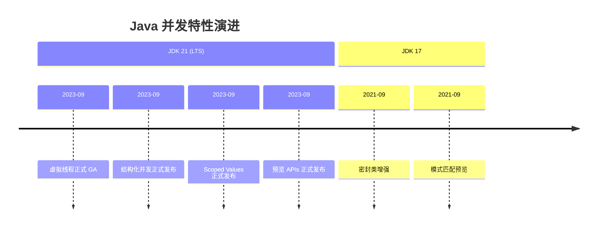

# Java 21+ 并发新特性

JDK 21 是 Java 的里程碑版本，带来了虚拟线程、结构化并发、Scoped Values 等重量级并发特性。本节总结 Java 21+ 的所有并发新特性及其使用方法。

## 新特性总览



### 特性对比

| 特性 | JDK 版本 | 状态 |
| --- | --- | --- |
| 虚拟线程 | 21 | 正式 GA |
| 结构化并发 | 21 | 正式发布 |
| Scoped Values | 21 | 正式发布 |
| Sequenced Collections | 21 | 正式发布 |

## 虚拟线程（正式 GA）

### 核心 API

```java
// 创建虚拟线程
Thread vt = Thread.ofVirtual().start(() -> {
    System.out.println("Running in virtual thread");
});

// 虚拟线程执行器
try (ExecutorService executor =
        Executors.newVirtualThreadPerTaskExecutor()) {
    Future<String> future = executor.submit(() -> "result");
    System.out.println(future.get());
}
```

### 注意事项

```java
// 1. ThreadLocal 可能被虚拟线程复用
// 2. synchronized 可能阻塞 Carrier 线程
// 3. CPU 密集型任务仍用平台线程
```

## 结构化并发（正式发布）

### StructuredTaskScope

```java
// ShutdownOnFailure：所有任务必须成功
try (var scope = new StructuredTaskScope.ShutdownOnFailure()) {
    Future<String> f1 = scope.fork(() -> task1());
    Future<String> f2 = scope.fork(() -> task2());

    scope.join();
    scope.throwIfFailed();

    String result = f1.resultNow() + f2.resultNow();
}

// ShutdownOnSuccess：第一个成功即可
try (var scope = new StructuredTaskScope.ShutdownOnSuccess<String>() {
    scope.fork(() -> tryPrimary());
    scope.fork(() -> trySecondary());

    scope.join();
    String result = scope.result();
}
```

### 与虚拟线程结合

```java
try (var executor = Executors.newVirtualThreadPerTaskExecutor();
     var scope = new StructuredTaskScope.ShutdownOnFailure(executor)) {

    scope.fork(() -> fetchUser(id));
    scope.fork(() -> fetchOrders(id));
    scope.fork(() -> fetchRecommendations(id));

    scope.join();
    scope.throwIfFailed();

    return new UserProfile(
        userFuture.resultNow(),
        ordersFuture.resultNow(),
        recsFuture.resultNow()
    );
}
```

## Scoped Values（正式发布）

### 基本用法

```java
public static final ScopedValue<String> REQUEST_ID = ScopedValue.newInstance();

// 设置和获取
ScopedValue.where(REQUEST_ID, "abc", () -> {
    String id = REQUEST_ID.get();  // "abc"
});

// 嵌套作用域
ScopedValue.where(REQUEST_ID, "outer", () -> {
    System.out.println(REQUEST_ID.get());  // "outer"

    ScopedValue.where(REQUEST_ID, "inner", () -> {
        System.out.println(REQUEST_ID.get());  // "inner"
    });

    System.out.println(REQUEST_ID.get());  // "outer" - 自动恢复
});
```

## 其他并发相关增强

### Sequenced Collections

```java
// JDK 21 新增接口
public interface SequencedCollection<E> extends Collection<E> {
    SequencedCollection<E> reversed();
    void addFirst(E);
    void addLast(E);
    E getFirst();
    E getLast();
    E removeFirst();
    E removeLast();
}

// LinkedList 已实现
LinkedList<String> list = new LinkedList<>();
list.addFirst("first");
list.addLast("last");
String first = list.getFirst();
```

### 预览特性（可能成为正式特性）

```java
// String Templates（预览）
String name = "World";
String greeting = STR."Hello, \{name}!";

// Record Patterns（正式）
record Point(int x, int y) {}
if (obj instanceof Point(int x, int y)) {
    // 直接解构
}

// switch 模式匹配（正式）
return switch (obj) {
    case String s -> "String: " + s;
    case Integer i -> "Integer: " + i;
    default -> "Unknown";
};
```

## 迁移指南

### 从旧版本迁移

```java
// JDK 8-20 → JDK 21

// 1. 线程池迁移
// 旧
ExecutorService executor = Executors.newFixedThreadPool(100);

// 新
try (ExecutorService executor =
        Executors.newVirtualThreadPerTaskExecutor()) {
    // 使用虚拟线程
}

// 2. ThreadLocal → ScopedValue
// 旧
ThreadLocal<String> requestId = new ThreadLocal<>();
requestId.set("abc");
String id = requestId.get();

// 新
ScopedValue<String> requestId = ScopedValue.newInstance();
ScopedValue.where(requestId, "abc", () -> {
    String id = requestId.get();
});

// 3. Future 链 → CompletableFuture + 结构化并发
// 使用新的结构化并发 API
```

### 兼容性考虑

```java
// JDK 21 兼容旧代码
// 虚拟线程可以调用旧代码
// 旧代码也可以在虚拟线程中运行

// 但要注意
// - 不要混合使用虚拟线程和平台线程池
// - ThreadLocal 需要重新评估
// - synchronized 高竞争可能有问题
```

## 最佳实践

### 推荐配置

```java
// 1. IO 密集型：虚拟线程 + 结构化并发
try (var executor = Executors.newVirtualThreadPerTaskExecutor();
     var scope = new StructuredTaskScope.ShutdownOnFailure(executor)) {
    // 最佳实践
}

// 2. CPU 密集型：平台线程
ExecutorService cpuExecutor =
    Executors.newFixedThreadPool(Runtime.getRuntime().availableProcessors());

// 3. 混合型：分开处理
Map<ExecutorService, List<Runnable>> tasks = new HashMap<>();
// 分流到不同的执行器
```

### 代码示例

```java
public class ModernHttpService {

    private static final ScopedValue<String> REQUEST_ID = ScopedValue.newInstance();

    private final HttpClient httpClient;
    private final ExecutorService virtualExecutor;
    private final ExecutorService cpuExecutor;

    public ModernHttpService() {
        this.virtualExecutor = Executors.newVirtualThreadPerTaskExecutor();
        this.cpuExecutor = Executors.newFixedThreadPool(
            Runtime.getRuntime().availableProcessors()
        );
        this.httpClient = HttpClient.newBuilder()
            .executor(virtualExecutor)
            .build();
    }

    public UserProfile getUserProfile(Long userId) {
        String requestId = generateRequestId();

        return ScopedValue.where(REQUEST_ID, requestId, () -> {
            try (var scope =
                    new StructuredTaskScope.ShutdownOnFailure(virtualExecutor)) {

                Future<User> userFuture = scope.fork(() -> fetchUser(userId));
                Future<List<Order>> ordersFuture =
                    scope.fork(() -> fetchOrders(userId));

                scope.join();
                scope.throwIfFailed();

                return new UserProfile(
                    userFuture.resultNow(),
                    ordersFuture.resultNow()
                );
            }
        });
    }

    private User fetchUser(Long userId) {
        String id = REQUEST_ID.get();  // Scoped Value 可访问
        // ...
    }

    public void shutdown() {
        virtualExecutor.close();
        cpuExecutor.close();
    }
}
```

## 未来展望

### 可能的增强

- **轻量级同步器**：针对虚拟线程优化的锁
- **结构化并发增强**：更多 scope 类型
- **FFM API 增强**：更好的外部函数调用

## 本章总结

**核心要点**：

1. **虚拟线程正式 GA**：M:N 映射，适合 IO 密集型
2. **结构化并发正式发布**：自动生命周期管理
3. **Scoped Values 正式发布**：虚拟线程时代的数据共享
4. **Sequenced Collections**：增强的集合接口
5. **迁移策略**：IO 密集用虚拟线程，CPU 密集用平台线程
6. **最佳实践**：虚拟线程 + 结构化并发 + Scoped Values

Java 21 是 Java 并发编程的重大里程碑。下一节我们将讲解响应式编程。