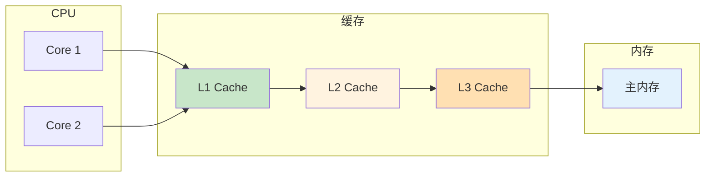
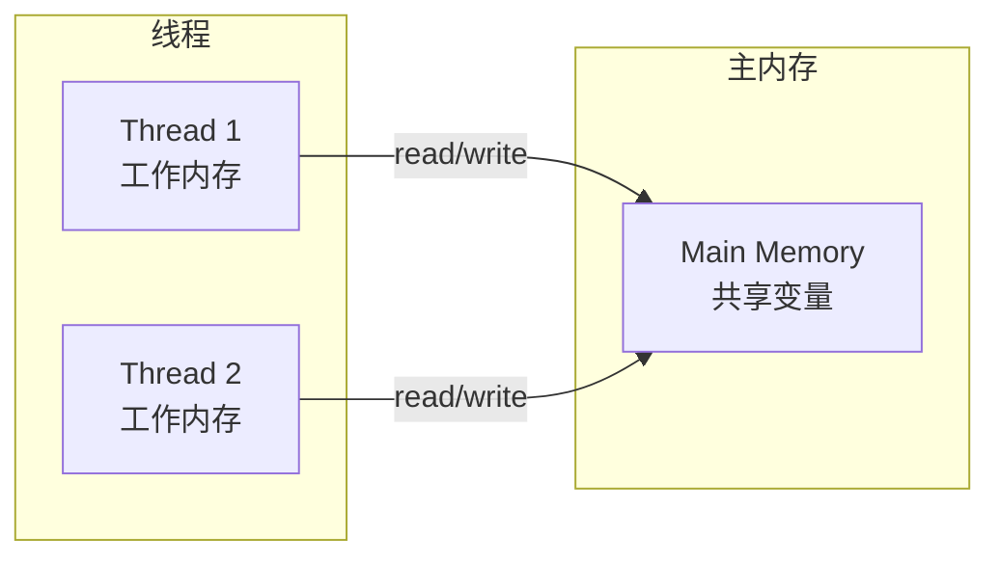
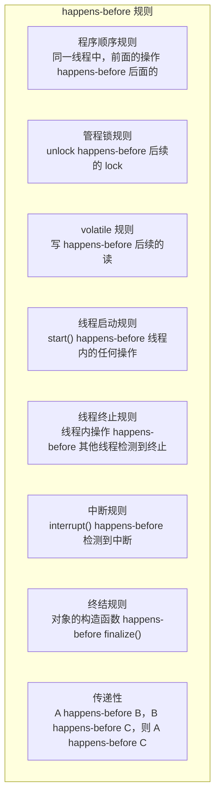

# Java 内存模型（JMM）

凌晨两点，线上告警响了：「多线程计数器数据不一致」。工程师排查后发现：两个线程同时对同一个变量进行 `i++` 操作，最终结果比预期少了一半。这个看似简单的 Bug，暴露的是 Java 内存模型的深层问题。

## 为什么需要 JMM

### 硬件层面的内存架构

现代 CPU 和内存之间存在多层缓存：



每个 CPU 核心有自己的 L1/L2 缓存，所有核心共享 L3 缓存和主内存。

### JMM 的抽象

JMM 定义了线程和主内存之间的抽象关系：



每个线程有自己的「工作内存」，线程对变量的操作在工作内存中进行，而不是直接操作主内存。

## JMM 三大特性

### 1. 可见性（Visibility）

一个线程对共享变量的修改，对其他线程不可见：

```java
public class VisibilityProblem {

    private static boolean flag = false;

    public static void main(String[] args) throws InterruptedException {
        // 线程 1：修改 flag
        Thread writer = new Thread(() -> {
            flag = true;
            System.out.println("Flag set to true");
        });

        // 线程 2：等待 flag
        Thread reader = new Thread(() -> {
            while (!flag) {
                // 忙等待
            }
            System.out.println("Flag is true!");
        });

        reader.start();
        Thread.sleep(100);  // 确保 writer 后启动
        writer.start();

        writer.join();
        reader.join();
    }
}
```

**问题**：在某些情况下，线程 2 可能永远看不到线程 1 对 flag 的修改。

**原因**：

1. 线程 1 修改 flag 后，可能还停留在工作内存中
2. 线程 2 读取 flag 时，读取的是工作内存中的旧值
3. 即使写入主内存，线程 2 的缓存可能还是旧值

### 2. 原子性（Atomicity）

`i++` 不是原子操作：

```java
public class AtomicityProblem {

    private static int counter = 0;

    public static void main(String[] args) throws InterruptedException {
        // 10 个线程，每个执行 10000 次 i++
        for (int i = 0; i < 10; i++) {
            new Thread(() -> {
                for (int j = 0; j < 10000; j++) {
                    counter++;  // 非原子！
                }
            }).start();
        }

        Thread.sleep(2000);
        System.out.println("Counter: " + counter);
        // 期望：100000
        // 实际：可能小于 100000
    }
}
```

**`counter++` 的分解**：


这三步之间可能被其他线程打断。

### 3. 有序性（Ordering）

编译器/CPU 可能对指令进行重排：

```java
public class OrderingProblem {

    private int a = 0;
    private boolean flag = false;

    public void writer() {
        a = 1;        // 语句 1
        flag = true;  // 语句 2
    }

    public void reader() {
        if (flag) {           // 语句 3
            System.out.println(a);  // 语句 4
        }
    }
}
```

**问题**：编译器可能重排为：

```java
flag = true;  // 可能先执行
a = 1;
```

这会导致如果 reader 线程看到 `flag == true` 时，`a` 可能还是 0。

## happens-before 原则

### 定义

JMM 使用 happens-before 原则来保证可见性和有序性。如果操作 A happens-before 操作 B，那么：

1. A 的结果对 B 可见
2. A 的执行顺序在 B 之前

### 八大规则



### 规则详解

#### 程序顺序规则

```java
// 在同一线程中
int a = 1;      // 1 happens-before 2
int b = 2;      // 2 happens-before 3
int c = a + b;  // 3
```

#### volatile 规则

```java
public class VolatileExample {
    private volatile boolean flag = false;

    public void writer() {
        flag = true;  // 写
    }

    public void reader() {
        if (flag) {   // 读
            // 一定能看到 writer 对 flag 的修改
        }
    }
}
```

#### 线程启动规则

```java
Thread t = new Thread(() -> {
    // 能看到主线程在 start() 之前的所有操作
});

int x = 42;
t.start();  // start() happens-before 线程内代码
```

#### 线程 join 规则

```java
Thread t = new Thread(() -> {
    // 修改共享变量
});

t.start();
t.join();  // join() returns 后，能看到线程内的所有修改

// 这里可以安全地读取共享变量
System.out.println(x);
```

## 解决方案

### synchronized

```java
public class SynchronizedSolution {

    private int counter = 0;
    private final Object lock = new Object();

    public void increment() {
        synchronized (lock) {
            counter++;  // 原子操作
        }
    }
}
```

`synchronized` 保证：

- 原子性：同一时刻只有一个线程能进入同步块
- 可见性：解锁前会把修改刷新到主内存
- 有序性：防止指令重排

### volatile

```java
public class VolatileSolution {

    private volatile boolean flag = false;

    public void writer() {
        flag = true;  // 保证可见性和有序性
    }

    public void reader() {
        if (flag) {   // 保证能读到最新值
            // ...
        }
    }
}
```

`volatile` 保证：

- 可见性：写操作立即刷新到主内存，读操作立即从主内存读取
- 有序性：禁止指令重排

**注意**：volatile 不保证原子性！

```java
// 这个操作不是原子的！
private volatile int counter = 0;
counter++;  // 非原子，volatile 不能保证
```

### java.util.concurrent

```java
// 使用 AtomicInteger 保证原子性和可见性
public class AtomicSolution {

    private AtomicInteger counter = new AtomicInteger(0);

    public void increment() {
        counter.incrementAndGet();  // 原子操作
    }

    public int get() {
        return counter.get();
    }
}
```

## 常见问题

### double-check locking

```java
public class Singleton {
    private static volatile Singleton instance;

    public static Singleton getInstance() {
        if (instance == null) {  // 第一次检查
            synchronized (Singleton.class) {
                if (instance == null) {  // 第二次检查
                    instance = new Singleton();
                }
            }
        }
        return instance;
    }
}
```

**为什么需要 volatile**？

`instance = new Singleton()` 分解为：

1. 分配内存
2. 调用构造函数
3. 将引用赋值给 instance

没有 volatile，步骤 2 和 3 可能被重排，导致其他线程看到非 null 但未构造完成的对象。

### 竞态条件

```java
// 竞态条件：检查然后执行
public class RaceCondition {

    private boolean initialized = false;
    private Map<String, String> config;

    public void init() {
        config = new HashMap<>();
        // 初始化配置...
        initialized = true;
    }

    public String get(String key) {
        if (!initialized) {  // 检查
            throw new IllegalStateException();
        }
        return config.get(key);  // 执行
    }
}
```

## 本章总结

**核心要点**：

1. **为什么需要 JMM**：硬件缓存导致可见性问题，编译器和 CPU 重排导致有序性问题
2. **三大特性**：可见性、有序性、原子性
3. **happens-before**：8 大规则保证线程间操作的可见性和有序性
4. **解决方案**：synchronized、volatile、java.util.concurrent 包
5. **volatile 不保证原子性**：`i++` 这种复合操作需要用锁或原子类

理解 JMM 是学习 Java 并发的基础。下一节我们将深入讲解 happens-before 原则。