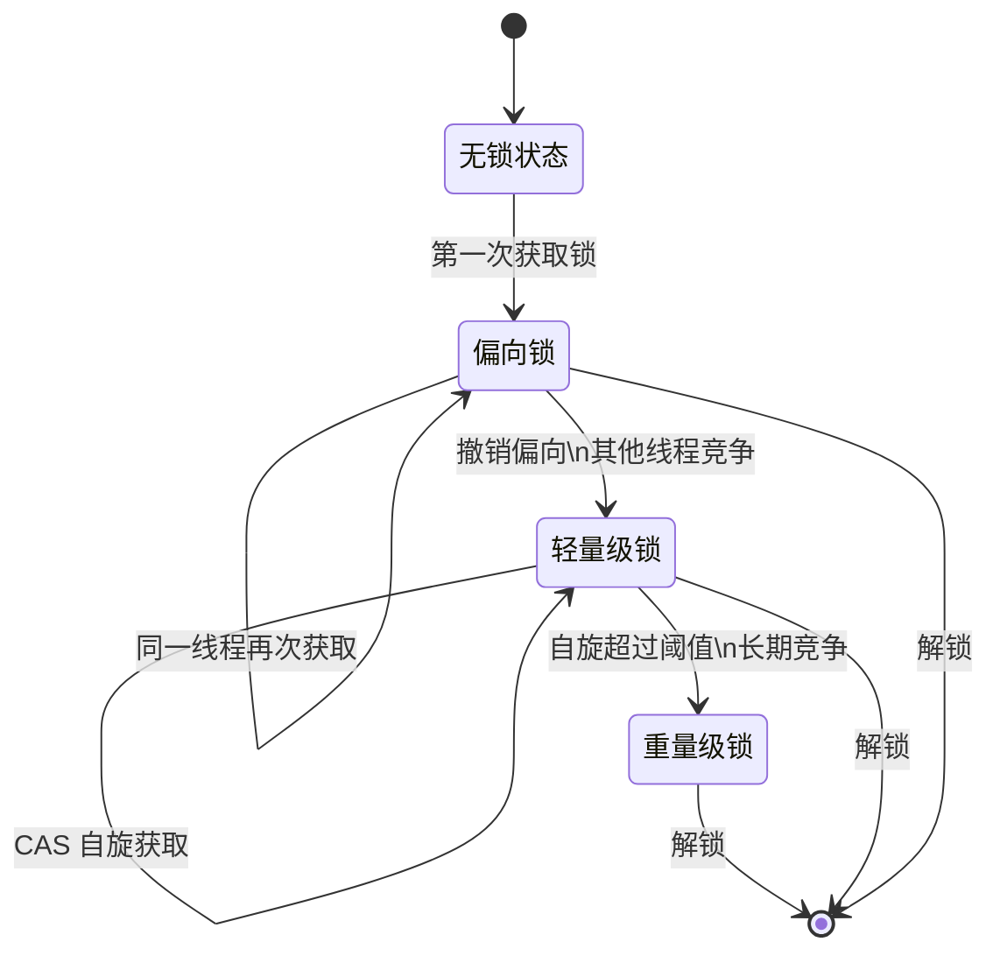
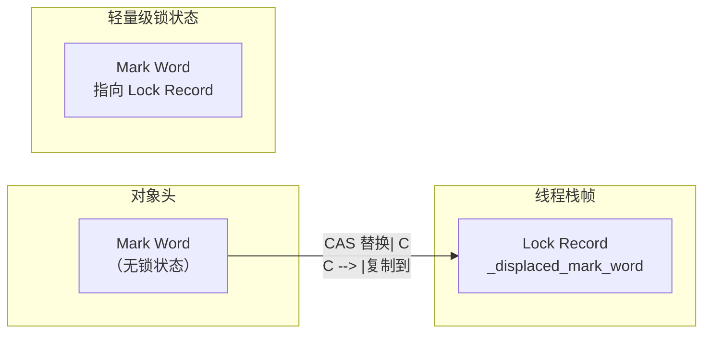
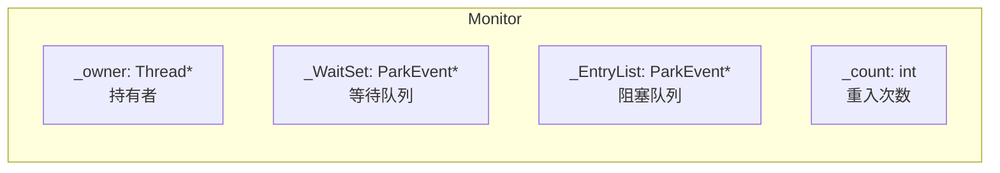
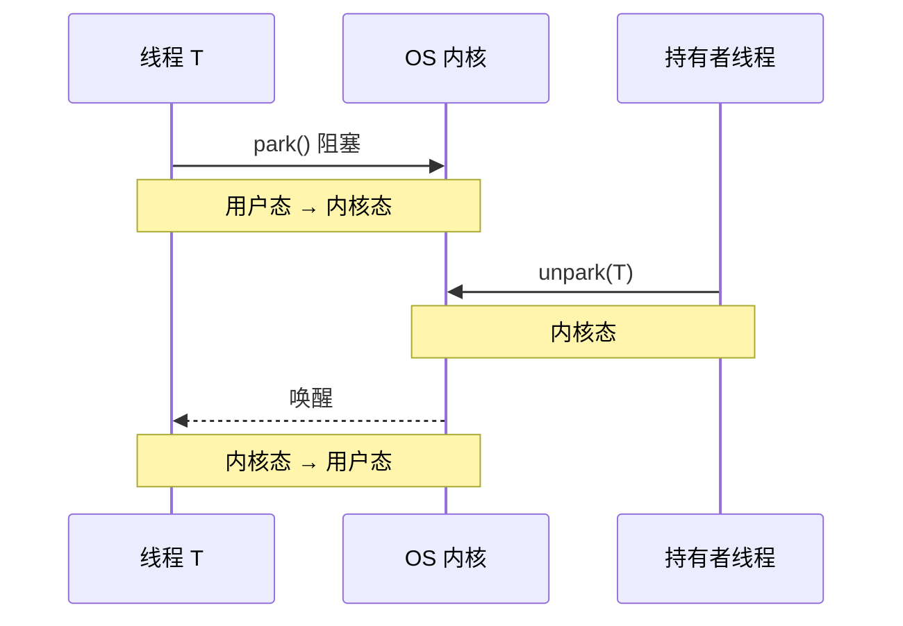

# 锁升级过程：无锁→偏向→轻量→重量

synchronized 不是一开始就使用重量级锁，而是会根据竞争情况动态升级。这个过程叫做「锁升级」或「锁膨胀」，是 JDK 6 引入的重要优化。

## 锁升级总览



## 无锁状态

对象刚创建时，处于无锁状态：

```mermaid
flowchart LR
    subgraph Mark Word（无锁状态，64 位）
        A["hashcode:25|age:4|0|01"]
    end

    subgraph 字段说明
        B["hashcode: 对象 hashCode（如果计算过）"]
        C["age: 分代年龄"]
        D["0: 无偏向锁标志"]
        E["01: 无锁状态"]
    end
```

### 无锁状态特点

- Mark Word 包含对象的 hashCode（如果已计算）
- 分代年龄
- 无锁标志

## 偏向锁

### 原理

当一个线程首次获取锁时，如果启用偏向锁（默认启用），会将线程 ID 记录在对象头的 Mark Word 中：

```java
// Mark Word（偏向锁状态）
// [thread:54|epoch:2|age:4|1|01]

// thread: 偏向线程的线程 ID
// epoch: 偏向时间戳，用于批量撤销
// 1: 偏向锁标志
// 01: 偏向锁状态
```

### 偏向锁的优势

```mermaid
flowchart LR
    subgraph 偏向锁获取
        A["线程 T 进入同步块"] --> B{"Mark Word\n指向 T?"}
        B -->|"是| C["直接进入\n无需 CAS"]
        B -->|"否| D["CAS 设置\n线程 ID"]
        D -->|{"成功"| C
        D -->|{"失败"| E["撤销偏向"]
    end

    style C fill:#c8e6c9
    style E fill:#ffebee
```

### 偏向锁的撤销

在以下情况会撤销偏向锁：

1. **其他线程尝试获取锁**：当有其他线程尝试获取已被偏向的锁时，JVM 会撤销偏向锁
2. **调用 hashCode()**：调用 `Object.hashCode()` 或 `System.identityHashCode()` 会撤销偏向
3. **调用 wait()/notify()**：调用 `wait()` 或 `notify()` 会撤销偏向

```java
// hashCode 导致撤销
Object obj = new Object();
obj.hashCode();  // 计算 hashCode，撤销偏向

// wait/notify 导致撤销
synchronized (obj) {
    obj.wait();  // 撤销偏向
}
```

### 批量偏向与撤销

JVM 维护了一个「偏向批量阈值」：

| 参数 | 默认值 | 说明 |
| --- | --- | --- |
| BiasedLockingStartupDelay | 4 秒 | JVM 启动后 4 秒才启用偏向锁 |
| BiasedLockingBulkRebiasThreshold | 20 | 批量重偏向阈值 |
| BiasedLockingBulkRevokeThreshold | 40 | 批量撤销阈值 |

## 轻量级锁

### 原理

当偏向锁撤销或多个线程交替获取锁时，升级为轻量级锁：



### 轻量级锁的获取

```java
// 线程 T 获取轻量级锁的流程

// 1. 在线程 T 的栈帧中创建 Lock Record
LockRecord* lr = new LockRecord();

// 2. 将 Mark Word 复制到 Lock Record
lr.setDisplacedMarkWord(object.mark());

// 3. CAS 尝试将 Mark Word 替换为指向 Lock Record 的指针
if (object.mark().compareAndSet(
    expected = original_mark,
    new = lr,
    width = 64
)) {
    // 成功：获取轻量级锁
    return;
}

// 4. 失败：自旋重试
```

### 自旋优化

轻量级锁获取失败后，不会立即升级为重量级锁，而是先自旋重试：

```java
// 自旋重试逻辑
int retries = 10;  // 自旋次数
while (retries-- > 0) {
    if (object.mark().compareAndSet(expected, lr)) {
        return;  // 获取成功
    }
    // 自旋等待
    Thread.sleep(1);  // 或 Thread.yield()
}

// 自旋失败，升级为重量级锁
```

### 自旋次数自适应

JDK 6 之后，自旋次数不再固定，而是根据之前的自旋成功率动态调整：

```java
// 如果在同一个锁上，刚成功过自旋，则增加自旋次数
// 如果在同一个锁上，刚失败过自旋，则减少自旋次数
```

## 重量级锁

### 原理

当自旋超过阈值或竞争激烈时，升级为重量级锁：



### Monitor 的工作原理

```java
// 线程 T 获取重量级锁

// 1. 进入 _EntryList（阻塞队列）
ParkEvent* event = alloc_parkevent();
event.setThread(current_thread);
_EntryList.add(event);

// 2. 阻塞等待
park(event);

// 3. 被唤醒（其他线程释放锁）
if (event == _owner) {
    // 成为新的持有者
}
```

### 重量级锁的开销

重量级锁的主要开销来自用户态到内核态的切换：



## 锁升级的触发条件

### 总结

| 锁状态 | 触发条件 |
| --- | --- |
| 偏向锁 | 第一次获取锁，偏向锁启用 |
| 轻量级锁 | 偏向锁撤销；多个线程交替获取 |
| 重量级锁 | 轻量级锁自旋失败；竞争激烈 |

### 竞争场景分析

```mermaid
flowchart TD
    subgraph 竞争场景
        A["线程 T 获取锁"] --> B{"锁是否偏向 T?"}
        B -->|"是| C["偏向锁\n直接进入"]
        B -->|"否| D{"其他线程是否竞争?"}
        D -->|"否| E["轻量级锁\nCAS 获取"]
        D -->|"是| F{"自旋成功?"}
        F -->|"是| E
        F -->|"否| G["重量级锁\nMutex"]
    end

    style C fill:#c8e6c9
    style E fill:#fff3e0
    style G fill:#ffebee
```

## 实战：观察锁升级

### j OL 工具

```java
// 使用 jol-core 观察对象头
import org.openjdk.jol.info.ClassLayout;

public class LockEscalation {
    public static void main(String[] args) {
        Object obj = new Object();

        System.out.println("无锁状态:");
        System.out.println(ClassLayout.parseInstance(obj).toPrintable());

        synchronized (obj) {
            System.out.println("偏向锁/轻量级锁:");
            System.out.println(ClassLayout.parseInstance(obj).toPrintable());
        }

        System.out.println("释放锁后:");
        System.out.println(ClassLayout.parseInstance(obj).toPrintable());
    }
}
```

### 输出示例

```
无锁状态:
[B @ 0x00000000]
 0:        0x0000000000000001 (bias: 0x0000000000000001, age: 4)

轻量级锁:
[B @ 0x00000000]
 0:        0x0000024d0000001a (stack: 0x0000024d, age: 4)

重量级锁:
[B @ 0x00000000]
 0:        0x00000000000005c8 (thinlock: 0x00005c8)
```

## 性能调优建议

### 禁用偏向锁

如果没有竞争，或竞争很少，可以禁用偏向锁：

```bash
# 禁用偏向锁
-XX:-UseBiasedLocking=false
```

### 控制自旋次数

```bash
# 预定义自旋次数（已废弃）
-XX:PreBlockSpin=10

# JDK 6+ 不再使用，由自适应算法替代
```

### 逃逸分析

如果锁对象不逃逸出方法，可以消除锁：

```java
// 锁对象不逃逸，JIT 可以消除锁
public String concat(String a, String b) {
    StringBuffer sb = new StringBuffer();  // 不逃逸
    sb.append(a);
    sb.append(b);
    return sb.toString();
}
```

## 本章总结

**核心要点**：

1. **锁升级是单向的**：偏向锁 → 轻量级锁 → 重量级锁
2. **偏向锁**：消除同一线程的 CAS 开销
3. **轻量级锁**：使用 CAS + 自旋避免线程阻塞
4. **重量级锁**：OS Mutex，开销大
5. **触发条件**：根据竞争情况自动升级
6. **调优策略**：禁用偏向锁、逃逸分析

理解锁升级过程是深入 Java 并发性能优化的基础。下一节我们将讲解 AQS 框架。