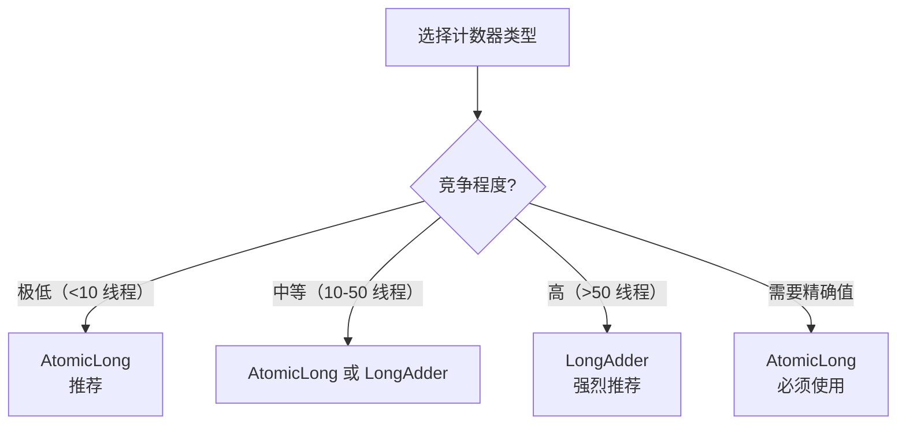

# LongAdder 与 AtomicLong 对比

在 JDK 8 之前，AtomicLong 是 Java 中进行原子计数的标准选择。但当计数器成为性能瓶颈时，LongAdder 提供了更好的解决方案。理解两者的差异和适用场景，是编写高性能并发代码的关键。

## 为什么需要 LongAdder

### AtomicLong 的问题

```java
// AtomicLong 在高竞争下的问题
AtomicLong counter = new AtomicLong(0);

// 1000 个线程同时 increment
for (int i = 0; i < 1000; i++) {
    new Thread(() -> counter.incrementAndGet()).start();
}
```

高竞争下，AtomicLong 的 CAS 操作会大量失败，导致：

- 大量自旋重试
- CPU 空转
- 性能急剧下降

## LongAdder 的设计思想

### 分段计数

```mermaid
flowchart LR
    subgraph AtomicLong
        A["单一 Cell\ncount"] --> |"所有线程 CAS| B["单点竞争"]
    end

    subgraph LongAdder
        C["Cell[0]\ncount0"] --> |"线程 1| E["分段竞争"]
        D["Cell[1]\ncount1"] --> E
        C["Cell[2]\ncount2"] --> E
    end
```

### 核心思想

1. **分段**：将单个计数器拆分为多个 Cell
2. **分散**：不同线程写入不同 Cell（通过 ThreadLocal 索引）
3. **求和**：读取时将所有 Cell 的值求和

## 源码解析

### LongAdder 结构

```java
public class LongAdder extends Striped64 {

    // Cell 数组：核心数据结构
    transient volatile Cell[] cells;

    // base：初始计数，在竞争不激烈时使用
    transient volatile long base;

    // cellsBusy：CAS 锁标志
    transient volatile int cellsBusy;
}
```

### Cell 结构

```java
// Striped64 内部类
@sun.misc.Contended
static final class Cell {
    volatile long value;

    Cell(long initialValue) {
        value = initialValue;
    }

    // CAS 更新
    final boolean cas(long cmp, long val) {
        return UNSAFE.compareAndSwapLong(this, valueOffset, cmp, val);
    }
}
```

### increment() 流程

```java
public void increment() {
    add(1L);
}

public void add(long x) {
    Cell[] as;
    long b, v;
    int m;
    Cell a;

    // 1. 先尝试 CAS 更新 base（无竞争时）
    if ((as = cells) != null || !casBase(b = base, b + x)) {
        boolean uncontended = true;

        if (as == null || (m = as.length - 1) < 0 ||
            (a = as[getProbe() & m]) == null ||
            !(uncontended = a.cas(v = a.value, v + x))) {
            // 2. 进入 longAccumulate
            longAccumulate(x, null, uncontended);
        }
    }
}
```

### longAccumulate

```java
// 核心方法：Cell 数组初始化和扩容
final void longAccumulate(long x, LongBinaryOperator fn,
                          boolean wasUncontended) {
    int h;
    if ((h = getProbe()) == 0) {
        // 初始化 ThreadLocal 随机值
        ThreadLocalRandom.current();
        h = getProbe();
        wasUncontended = true;
    }

    boolean collide = false;
    for (;;) {
        Cell[] as; Cell a; int n; long v;

        if ((as = cells) != null && (n = as.length) > 0) {
            // 数组已初始化
            if ((a = as[(n - 1) & h]) == null) {
                // 添加新 Cell
            } else if (!wasUncontended) {
                // 重试
                wasUncontended = true;
            } else if (a.cas(v = a.value, ((fn == null) ? v + x : fn.applyAsLong(v, x)))) {
                break;
            } else if (n >= NCPU) {
                // 达到 CPU 核心数，不再扩容
            } else if (!collide) {
                // 尝试扩容
                collide = true;
            }
        } else if (cellsBusy == 0 && cellsBusy == casCellsBusy()) {
            // 初始化数组
            Cell[] rs = new Cell[2];
            rs[h & 1] = new Cell(x);
            cells = rs;
            break;
        }
    }
}
```

## 性能对比

### 低竞争场景

```java
// 单线程或低竞争场景
AtomicLong counter1 = new AtomicLong(0);
LongAdder counter2 = new LongAdder();

// 性能相当，AtomicLong 略快（无额外开销）
counter1.increment();
counter2.increment();
```

### 高竞争场景

```java
// JMH 压测对比（伪代码）
// @Benchmark
// public void atomicLongIncrement() {
//     atomicLong.incrementAndGet();
// }
//
// @Benchmark
// public void longAdderIncrement() {
//     longAdder.increment();
// }

// 结果（16 线程并发）：
// AtomicLong: ~500,000 ops/ms
// LongAdder:  ~2,000,000 ops/ms  (4倍提升)
```

### 性能曲线

```mermaid
graph LR
    subgraph 性能对比
        A["线程数增加"] --> B["AtomicLong 性能下降"]
        A --> C["LongAdder 性能稳定"]
    end

    B --> |"大量 CAS 重试| D["瓶颈"]
    C --> |"分段计数| E["高吞吐"]
```

## 使用场景对比

### LongAdder 适用场景

```java
// 1. 高并发计数器
LongAdder requests = new LongAdder();
requests.increment();  // 请求计数

LongAdder errors = new LongAdder();
errors.increment();  // 错误计数

// 2. 统计数据
LongAdder totalLatency = new LongAdder();
totalLatency.add(durationMs);  // 延迟累加

// 3. QPS 统计
LongAdder qps = new LongAdder();
qps.increment();  // 每请求 +1
```

### LongAdder 不适用场景

```java
// 1. 需要立即读取精确值
LongAdder counter = new LongAdder();
counter.increment();

// 问题：sum() 不是原子操作
// 两次 sum() 可能返回不同值（如果有并发写入）
long value1 = counter.sum();
long value2 = counter.sum();  // 可能不等于 value1！

// 解决方案：使用 AtomicLong
AtomicLong atomicCounter = new AtomicLong(0);
atomicCounter.increment();
long exactValue = atomicCounter.get();  // 始终精确

// 2. 竞争不激烈的场景
// AtomicLong 足够，且开销更小

// 3. 需要算术运算以外的原子操作
// AtomicLong 有 getAndIncrement, incrementAndGet 等
// LongAdder 只有 add 和 increment
```

## 注意事项

### sum() 非原子

```java
LongAdder adder = new LongAdder();
adder.add(1);
adder.add(2);
adder.add(3);

long sum = adder.sum();  // 6

// 警告：sum() 返回的是「快照」，不是原子操作
// 在极短时间内多次 sum() 可能得到不同结果
```

### Cell 填充（@Contended）

```java
// JDK 8+ 使用 @Contended 避免伪共享
@sun.misc.Contended
static final class Cell {
    volatile long value;
    // ...
}

// 伪共享问题：
// CPU 缓存行 64 字节
// 相邻的 Cell 可能在同一缓存行
// 一个 Cell 修改导致另一个 Cell 的缓存失效
```

### 内存开销

```java
// LongAdder 相比 AtomicLong 有额外内存开销
// Cell 数组默认大小 = CPU 核心数
// 每个 Cell 16 字节（value 8 + 对象头 8）

// 16 核机器：16 × 16 = 256 字节（即使只有一个 Cell 在使用）
```

## 实战建议

### 选择指南



### 性能测试

```java
// JMH 测试示例
@State(Scope.Group)
@BenchmarkMode(Mode.Throughput)
public class CounterBenchmark {

    AtomicLong atomicLong = new AtomicLong();
    LongAdder longAdder = new LongAdder();

    @Benchmark
    public void atomicLong() {
        atomicLong.incrementAndGet();
    }

    @Benchmark
    public void longAdder() {
        longAdder.increment();
    }
}
```

## 本章总结

**核心要点**：

1. **AtomicLong 的问题**：高竞争下大量 CAS 重试，性能急剧下降
2. **LongAdder 的设计**：分段计数 + 求和，减少 CAS 竞争
3. **Cell 数组**：每个 Cell 独立计数，通过 ThreadLocal 分散写入
4. **sum() 非原子**：返回快照，不是精确值
5. **适用场景**：高并发计数器、统计数据、QPS 统计
6. **不适用场景**：需要精确值、竞争不激烈、算术运算以外的操作

LongAdder 是高并发计数器场景的首选。下一节我们将讲解 CompletableFuture 异步编程。