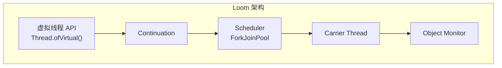
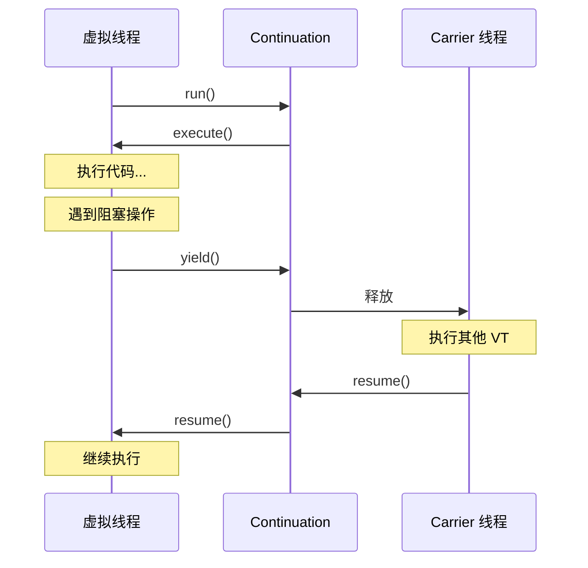
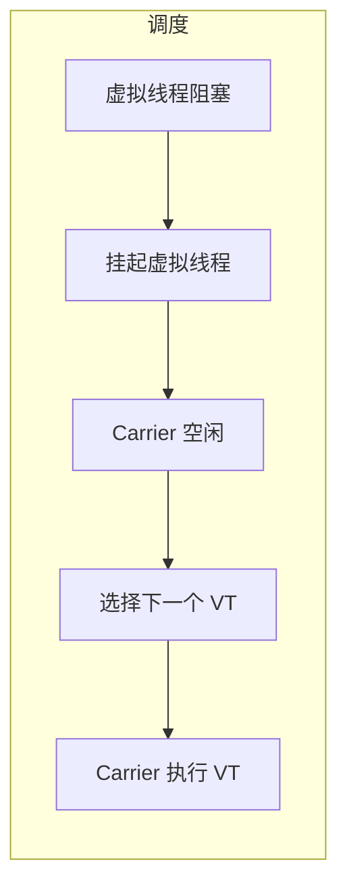
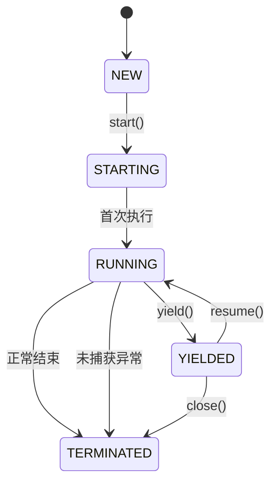

# Loom 项目架构

Project Loom 是 Oracle 主导的 Java 里程碑项目，旨在通过引入虚拟线程彻底解决 Java 的并发模型问题。理解 Loom 的架构设计，是深入理解虚拟线程的基础。

## Loom 项目目标

### 核心目标


1. **简化并发模型**：用同步方式编写异步代码
2. **消除 C10K/C10M 问题**：支持百万级并发
3. **降低编程门槛**：无需复杂的异步框架

## 核心组件

### 组件架构



| 组件 | 作用 |
| --- | --- |
| 虚拟线程 API | 提供创建和管理虚拟线程的接口 |
| Continuation | 实现虚拟线程的挂起与恢复 |
| Scheduler | 调度虚拟线程到 Carrier 线程 |
| Carrier Thread | 实际执行代码的 OS 线程 |
| Object Monitor | synchronized 锁的实现 |

## Continuation 机制

### 延续的概念

```java
// Continuation 的伪代码概念
public class Continuation {
    private final Runnable target;

    public Continuation(Runnable target) {
        this.target = target;
    }

    public void run() {
        if (!hasStarted()) {
            // 第一次执行
            runImpl(target);
        } else {
            // 恢复执行
            resumeImpl();
        }
    }

    public static void yield() {
        // 挂起当前 Continuation
        yieldImpl();
    }
}
```

### Continuation 执行流程



## 调度器

### Scheduler 实现

```java
// ForkJoinPool 作为默认调度器
public class VirtualThreadScheduler extends ForkJoinPool {
    // M 个虚拟线程映射到 N 个 Carrier 线程
    // N = Runtime.getRuntime().availableProcessors()
}
```

### 调度策略



调度器维护一个等待队列，当 Carrier 线程空闲时，从队列中选择虚拟线程执行。

## 对象头与Continuation 结构

### 虚拟线程的内存布局

```java
// 虚拟线程对象结构
class VirtualThread {
    // 继承 Thread 对象头
    // ...

    // Loom 特定字段
    private Continuation cont;           // 关联的 Continuation
    private Stack<StackChunk> stack;    // 虚拟栈
    private int status;                  // 状态
    private int priority;
}
```

### 虚拟栈

```java
// 虚拟栈由多个 StackChunk 组成
class StackChunk {
    private long address;     // 内存地址
    private int size;        // 大小
    private StackChunk next; // 链接

    // 按需增长和收缩
    private void expand() { /* 分配新 chunk */ }
    private void shrink() { /* 释放 chunk */ }
}
```

## 阻塞操作的处理

### 阻塞操作列表

```java
// 以下操作会触发虚拟线程挂起

// 1. Thread.sleep()
Thread.sleep(1000);

// 2. Object.wait()
synchronized (obj) {
    obj.wait();
}

// 3. LockSupport.park()
// ReentrantLock、Condition、Semaphore 等

// 4. I/O 操作
Socket.read();
Files.readAllBytes();

// 5. 各种 blocking queue 操作
BlockingQueue.put();
BlockingQueue.take();
```

### park/unpark 机制

```java
// LockSupport.park 挂起
public static void park() {
    if (Thread.currentThread() instanceof VirtualThread vt) {
        // 虚拟线程：挂起 Continuation
        vt.park();
    } else {
        // 平台线程：OS park
        os.park();
    }
}

// LockSupport.unpark 恢复
public static void unpark(Thread thread) {
    if (thread instanceof VirtualThread vt) {
        // 虚拟线程：恢复 Continuation
        vt.unpark();
    } else {
        // 平台线程：OS unpark
        os.unpark(thread);
    }
}
```

## 与现有 API 的兼容性

### Thread API 扩展

```java
// 新增方法
Thread virtualThread = Thread.ofVirtual().start(() -> {});

// 检查是否为虚拟线程
boolean isVirtual = virtualThread.isVirtual();

// 获取调度器
Executor scheduler = virtualThread.getScheduler();
```

### ThreadGroup 变化

```java
// 虚拟线程有自己的 ThreadGroup
ThreadGroup vtg = Thread.ofVirtual().unstarted(null).getThreadGroup();
```

## 结构化并发

### 与虚拟线程的结合

```java
// Java 21 结构化并发
try (var scope = new StructuredTaskScope.ShutdownOnFailure()) {
    Future<String> f1 = scope.fork(() -> task1());
    Future<String> f2 = scope.fork(() -> task2());

    scope.join();
    scope.throwIfFailed();

    String result = f1.resultNow() + f2.resultNow();
}
```

### StructuredTaskScope 原理

```java
public class StructuredTaskScope<T> implements AutoCloseable {

    // 子任务的线程被限定在 scope 内
    // scope 关闭时，所有子任务被中断

    public <U> Future<U> fork(Callable<U> task) {
        // 创建虚拟线程执行任务
        return executor.submit(task);
    }

    public void join() throws InterruptedException {
        // 等待所有 fork 的任务完成
    }

    @Override
    public void close() {
        // 中断未完成的任务
    }
}
```

## 实现细节

### ContinuationScope

```java
// Continuation 作用域
public class ContinuationScope {
    private final String name;
    // 用于区分不同的 Continuation 类型
}
```

### 状态转换



## 性能特性

### 内存开销

```java
// 平台线程栈：固定 1MB
Thread platform = new Thread(runnable);
Thread t = new Thread(() -> {}, 1024 * 1024);  // 1MB

// 虚拟线程栈：按需增长，初始 4KB
Thread virtual = Thread.ofVirtual().start(runnable);
```

### 创建性能

```java
// 创建 10000 个线程的时间对比

// 平台线程：约 2-5 秒
// 虚拟线程：约 0.1-0.2 秒
```

### 调度性能

```java
// 虚拟线程切换开销
// 约 100-500 纳秒
// 平台线程上下文切换：约 1-10 微秒
```

## 本章总结

**核心要点**：

1. **Loom 项目目标**：简化并发、消除 C10K/M 问题
2. **Continuation**：实现挂起与恢复的核心机制
3. **Scheduler**：ForkJoinPool 作为默认调度器
4. **阻塞处理**：park/unpark 机制的虚拟线程适配
5. **结构化并发**：与虚拟线程结合的任务作用域
6. **性能优势**：内存低、创建快、切换快

Loom 是 Java 并发模型的重大变革。下一节我们将对比虚拟线程与平台线程的性能。