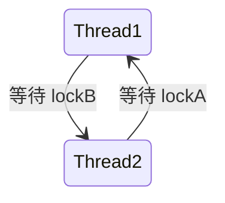

# 并发编程常见陷阱与排查

并发编程是 Java 后端开发的难点，也是最容易出 Bug 的领域。本节总结常见的并发陷阱及其排查方法。

## 常见陷阱

### 1. 死锁

#### 什么是死锁

两个或多个线程相互等待对方持有的锁，导致都无法继续执行：



#### 经典死锁示例

```java
public class DeadLockExample {

    private final Object lockA = new Object();
    private final Object lockB = new Object();

    // 线程 1 的操作
    public void operation1() {
        synchronized (lockA) {
            System.out.println("Thread1: holding lockA");
            try {
                Thread.sleep(100);
            } catch (InterruptedException e) {
                Thread.currentThread().interrupt();
            }
            synchronized (lockB) {
                System.out.println("Thread1: holding lockA and lockB");
            }
        }
    }

    // 线程 2 的操作
    public void operation2() {
        synchronized (lockB) {  // 与线程 1 相反的加锁顺序
            System.out.println("Thread2: holding lockB");
            try {
                Thread.sleep(100);
            } catch (InterruptedException e) {
                Thread.currentThread().interrupt();
            }
            synchronized (lockA) {
                System.out.println("Thread2: holding lockA and lockB");
            }
        }
    }
}
```

#### 解决方案

```java
// 1. 固定加锁顺序
public void operation() {
    // 始终先 lockA 再 lockB
    synchronized (lockA) {
        synchronized (lockB) {
            // 操作
        }
    }
}

// 2. 使用 ReentrantLock 的 tryLock
private final ReentrantLock lock1 = new ReentrantLock();
private final ReentrantLock lock2 = new ReentrantLock();

public boolean operation() {
    if (lock1.tryLock()) {
        try {
            if (lock2.tryLock()) {
                try {
                    // 操作
                    return true;
                } finally {
                    lock2.unlock();
                }
            }
        } finally {
            lock1.unlock();
        }
    }
    return false;
}
```

### 2. 活锁

#### 什么是活锁

线程不断重试但没有进展，不会阻塞但也无法完成：

```java
// 活锁示例：两个线程互相让步
public class LivelockExample {

    private final AtomicBoolean flag = new AtomicBoolean(true);

    public void operation1() {
        while (true) {
            // 尝试获取资源
            if (flag.compareAndSet(true, false)) {
                System.out.println("Operation1: got resource");
                break;
            }
            // 放弃，让对方先执行
            Thread.yield();
        }
    }

    public void operation2() {
        while (true) {
            if (flag.compareAndSet(false, true)) {
                System.out.println("Operation2: got resource");
                break;
            }
            Thread.yield();
        }
    }
}
```

### 3. 线程饥饿

线程长时间无法获得需要的资源：

```java
// 饥饿示例
public class StarvationExample {

    private final Object resource = new Object();

    // 高优先级线程不断获取资源
    public void highPriorityOperation() {
        Thread.currentThread().setPriority(Thread.MAX_PRIORITY);
        while (true) {
            synchronized (resource) {
                System.out.println("High priority running");
            }
        }
    }

    // 低优先级线程可能永远得不到资源
    public void lowPriorityOperation() {
        Thread.currentThread().setPriority(Thread.MIN_PRIORITY);
        while (true) {
            synchronized (resource) {  // 可能永远得不到
                System.out.println("Low priority running");
            }
        }
    }
}
```

### 4. 竞态条件

多个线程对共享数据的访问顺序导致结果不确定：

```java
// 竞态条件示例：计数器
public class RaceCondition {

    private int counter = 0;

    // 不安全的操作
    public void increment() {
        counter++;  // 不是原子操作
    }
}

// 验证竞态条件
public class RaceConditionTest {

    public static void main(String[] args) throws InterruptedException {
        RaceCondition rc = new RaceCondition();

        for (int i = 0; i < 1000; i++) {
            new Thread(rc::increment).start();
        }

        Thread.sleep(2000);
        System.out.println("Counter: " + rc.counter);
        // 结果可能小于 1000
    }
}
```

### 5. 内存可见性问题

一个线程对共享变量的修改对其他线程不可见：

```java
// 内存可见性问题
public class VisibilityProblem {

    private boolean flag = false;  // 不是 volatile

    // 线程 1
    public void writer() {
        flag = true;  // 可能对线程 2 不可见
    }

    // 线程 2
    public void reader() {
        while (!flag) {
            // 可能永远看不到 flag=true
        }
    }
}
```

## 排查工具

### jstack

```bash
# 查看线程状态
jstack <pid>

# 查找死锁
jstack -l <pid> | grep -A 10 "Found one Java-level deadlock"
```

### 输出示例

```
"pool-1-thread-2" #15
    java.lang.Thread.State: BLOCKED
    at com.example.DeadLockExample.operation2(DeadLockExample.java:45)
    - waiting to lock <0x000000076b012890> (a java.lang.Object)
    - locked <0x000000076b012898> (a java.lang.Object)

"pool-1-thread-1" #14
    java.lang.Thread.State: BLOCKED
    at com.example.DeadLockExample.operation1(DeadLockExample.java:25)
    - waiting to lock <0x000000076b012898> (a java.lang.Object)
    - locked <0x000000076b012890> (a java.lang.Object)
```

### jconsole

```bash
# 启动 jconsole
jconsole <pid>
```

可以查看：

- 线程数量和状态
- 内存使用
- CPU 使用率

### VisualVM

```bash
# 启动 VisualVM
jvisualvm
```

### Arthas

```bash
# 安装 arthas
curl -O https://arthas.aliyun.com/arthas-boot.jar

# 启动
java -jar arthas-boot.jar

# 查看线程
thread

# 查找死锁
thread -b

# 查看线程 CPU 使用
thread --top
```

### 输出示例

```
[arthas@12345]$ thread -b
Found 1 deadlock.
Thread thread-1 @ java.lang.Thread.State:BLOCKED
    at com.example.DeadLockExample.operation2(DeadLockExample.java:45)
    - waiting to lock <0x000000076b012890>
    - locked <0x000000076b012898>
```

## 最佳实践

### 1. 避免死锁

```java
// 1. 固定加锁顺序
// 2. 使用 tryLock 并设置超时
// 3. 减少锁的使用范围
// 4. 使用更高层次的并发工具
```

### 2. 使用并发工具

```java
// 使用 ConcurrentHashMap 替代 synchronizedMap
Map<String, Object> map = new ConcurrentHashMap<>();

// 使用 AtomicInteger 替代普通整数
AtomicInteger counter = new AtomicInteger(0);

// 使用并发集合
List<String> list = new CopyOnWriteArrayList<>();
Queue<String> queue = new ConcurrentLinkedQueue<>();
```

### 3. 正确使用 volatile

```java
// 用于状态标志
private volatile boolean running = true;

// 用于单例模式
private volatile Singleton instance;
```

### 4. 使用线程安全的日期格式

```java
// 错误：SimpleDateFormat 不是线程安全的
private static final SimpleDateFormat sdf =
    new SimpleDateFormat("yyyy-MM-dd");

// 正确：使用 ThreadLocal 或 DateTimeFormatter
private static final ThreadLocal<DateFormat> tl =
    ThreadLocal.withInitial(() -> new SimpleDateFormat("yyyy-MM-dd"));

// JDK 8+
private static final DateTimeFormatter formatter =
    DateTimeFormatter.ofPattern("yyyy-MM-dd");
```

## 本章总结

**核心要点**：

1. **死锁**：相互等待对方持有的锁
2. **活锁**：不断重试但没有进展
3. **线程饥饿**：长时间无法获得资源
4. **竞态条件**：访问顺序导致结果不确定
5. **内存可见性**：修改对其他线程不可见
6. **排查工具**：jstack、jconsole、Arthas

理解这些陷阱和排查方法，是成为并发编程高手的必经之路。