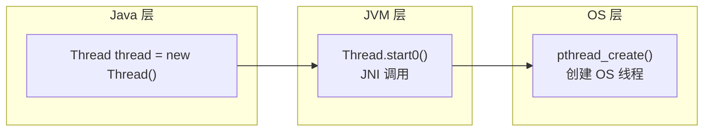
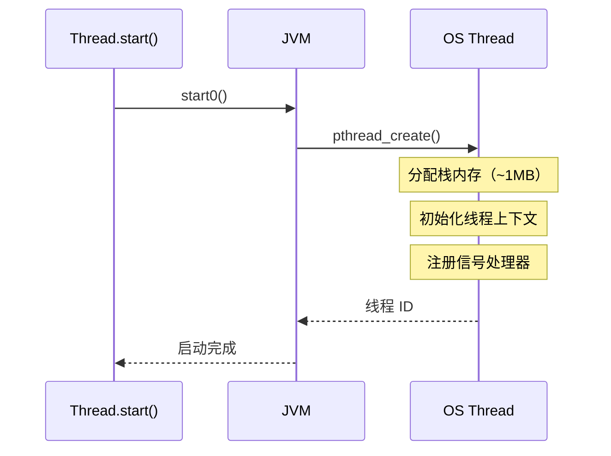
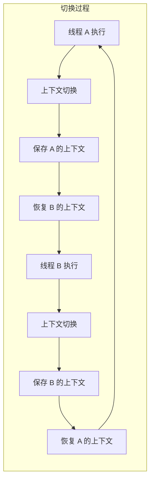

# 平台线程详解

平台线程（Platform Thread）是 Java 最传统的线程实现方式，也是理解虚拟线程的基础。虽然 JDK 21 之后虚拟线程成为主流，但平台线程的原理仍然是 Java 并发编程的核心知识。

## 平台线程的本质

### 1:1 映射到 OS 线程

平台线程的本质是 **一个 Java Thread 对象映射到一个 OS 线程**：



### 创建过程

当调用 `Thread.start()` 时，JVM 会通过 JNI 调用 OS 的线程创建接口：

```java
// 简化流程
public synchronized void start() {
    // 检查线程状态
    if (threadStatus != 0) {
        throw new IllegalThreadStateException();
    }

    // JNI 调用，创建 OS 线程
    start0();

    // 线程状态变为 RUNNABLE
    threadStatus = 0;
    // ...
}

// native 方法声明
private native void start0();
```

在 JVM 内部，`start0()` 对应一个 C++ 实现，最终调用 POSIX 线程库（如 `pthread_create`）或 Windows 线程 API。

## 线程栈大小配置

### 默认栈大小

不同平台的默认栈大小：

| 平台 | 默认栈大小 |
| --- | --- |
| Linux x86 | 1MB |
| Windows | 1MB（可动态调整） |
| macOS | 1MB |
| JVM 64位（-Xss 默认） | 1MB |

### 配置方式

```bash
# JVM 启动参数
-Xss512k   # 设置为 512KB
-Xss1m     # 设置为 1MB
-Xss2m     # 设置为 2MB
```

### 栈大小的选择

**栈太大**：

- 浪费内存：1000 线程 × 1MB = 1GB 内存
- 增加 GC 压力

**栈太小**：

- 容易栈溢出：`StackOverflowError`
- 无法支持深度递归

```java
// 栈溢出的典型场景
public class RecursiveExample {

    // -Xss512k 时，约 5000 层递归后会栈溢出
    public static long recursive(int n) {
        if (n <= 1) {
            return 1;
        }
        return n * recursive(n - 1);  // 递归调用
    }

    public static void main(String[] args) {
        try {
            recursive(100000);
        } catch (StackOverflowError e) {
            System.out.println("Stack overflow!");
        }
    }
}
```

### 业务线程池栈大小配置

对于 IO 密集型的业务线程池，可以适当减小栈大小：

```java
// IO 密集型：栈大小可以小一些
ThreadFactory ioFactory = new ThreadFactory() {
    @Override
    public Thread newThread(Runnable r) {
        Thread t = new Thread(r);
        t.setName("io-pool-" + counter.incrementAndGet());
        // IO 密集型任务通常不需要深度递归
        // 减小栈大小可以支持更多并发
        // 注意：不同 JVM 实现可能忽略这个参数
        // t.setStackSize(256 * 1024); // 256KB
        return t;
    }
};

ExecutorService executor = new ThreadPoolExecutor(
    50, 200,
    60L, TimeUnit.SECONDS,
    new LinkedBlockingQueue<>(1000),
    ioFactory
);
```

## 线程创建与销毁开销

### 创建开销

线程创建涉及多个步骤：



### 销毁开销

线程销毁同样有开销：

- 栈内存释放
- 线程上下文清理
- OS 资源的释放

### 线程池的必要性

由于线程创建和销毁开销大，线程池成为标准实践：

```java
// 复用线程，避免频繁创建销毁
ExecutorService executor = new ThreadPoolExecutor(
    10, 50,           // 核心/最大线程数
    60L, TimeUnit.SECONDS,
    new LinkedBlockingQueue<>(1000),
    new ThreadPoolExecutor.CallerRunsPolicy()
);

// 复用线程
executor.submit(() -> {
    // 复用已有线程执行
    doSomething();
});
```

## 线程上下文切换

### 什么是上下文切换

当 CPU 在不同线程之间切换时，需要保存和恢复线程的执行上下文：



### 上下文切换的成本

上下文切换涉及：

| 成本项 | 说明 |
| --- | --- |
| 寄存器保存 | 保存 CPU 寄存器状态 |
| 程序计数器 | 保存指令地址 |
| 栈指针 | 保存栈帧信息 |
| TLB 刷新 | 缓存局部性丢失 |

### 上下文切换的类型

1. **自发性切换**：线程主动调用 `yield()`、`sleep()` 或阻塞
2. **非自发性切换**：时间片用完，被 OS 强制切换

### 减少上下文切换

```java
// 减少上下文切换的策略

// 1. 使用无锁算法
AtomicInteger counter = new AtomicInteger(0);
counter.incrementAndGet();  // CAS 操作，不需要锁

// 2. 使用线程本地存储
ThreadLocal<UserContext> context = new ThreadLocal<>();
context.set(user);  // 每个线程独立副本，无需同步

// 3. 合理配置线程数
// CPU 密集型：CPU 核心数 + 1
// IO 密集型：CPU 核心数 × (1 + IO 等待时间 ÷ 计算时间)
```

## 线程优先级

### 优先级设置

```java
Thread t = new Thread(() -> {
    // 任务代码
});
t.setPriority(Thread.MAX_PRIORITY);  // 10
// t.setPriority(Thread.NORM_PRIORITY); // 5
// t.setPriority(Thread.MIN_PRIORITY); // 1
```

### 优先级的陷阱

**重要警告**：线程优先级在大多数 OS 上只是「建议」，不是强制：

```mermaid
flowchart TD
    A["高优先级线程"] --> |"请求| B["OS 调度器"]
    B --> |"考虑| C["实际优先级"]
    C --> D{"结果"}
    D --> |"其他线程更重要| E["仍然可能抢占失败"]
    D --> |"时间片用完| F["低优先级线程执行"]
```

在 Windows 上，线程优先级的影响相对更明显。但在 Linux 上，调度器主要基于 CFS（Completely Fair Scheduler），优先级影响较小。

### 最佳实践

1. **不要依赖优先级做关键逻辑**：优先级只能作为「提示」
2. **使用队列顺序**：如果需要保证顺序，使用队列而不是优先级
3. **避免优先级倒置**：低优先级线程持有高优先级线程需要的资源

## Daemon 线程

### Daemon vs User 线程

```java
// 创建 Daemon 线程
Thread daemon = new Thread(() -> {
    while (true) {
        // 后台任务
    }
});
daemon.setDaemon(true);  // 设置为 Daemon 线程
daemon.start();
```

### 区别

| 特性 | User 线程 | Daemon 线程 |
| --- | --- | --- |
| JVM 退出 | JVM 会等待所有 User 线程结束 | JVM 不会等待 Daemon 线程 |
| 典型用途 | 业务逻辑、计算任务 | 后台监控、定时任务 |
| finally 块 | 一定执行 | 可能不执行 |

### 注意事项

```java
Thread daemon = new Thread(() -> {
    try {
        // 任务代码
    } finally {
        // 警告：Daemon 线程的 finally 可能不执行
        // 不要在 finally 中做资源释放等关键操作
        closeConnection();
    }
});
daemon.setDaemon(true);
```

## 本章总结

**核心要点**：

1. **平台线程是 1:1 映射**：一个 Java Thread 对应一个 OS 线程
2. **栈大小约 1MB**：可以通过 `-Xss` 配置，但需权衡内存和容量
3. **创建销毁开销大**：需要线程池复用
4. **上下文切换有成本**：减少不必要的线程切换
5. **优先级只是建议**：不要依赖优先级做关键逻辑
6. **Daemon 线程不保证执行**：JVM 退出时不等待 Daemon 线程

理解平台线程是学习虚拟线程的基础。下一节我们将讲解线程的生命周期与状态转换。