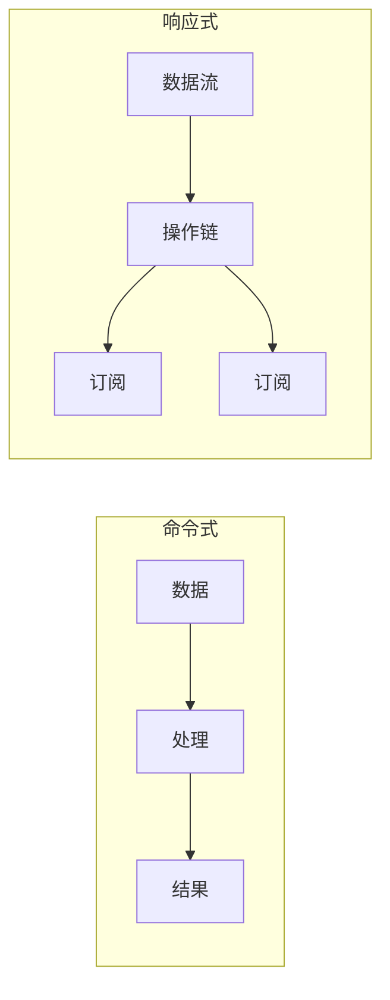
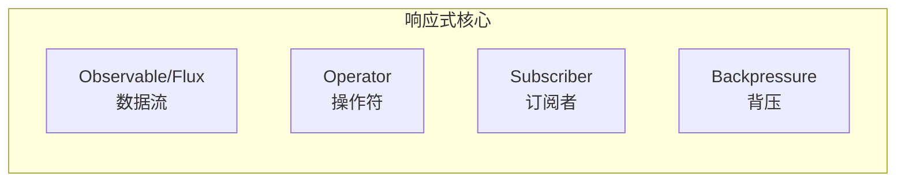
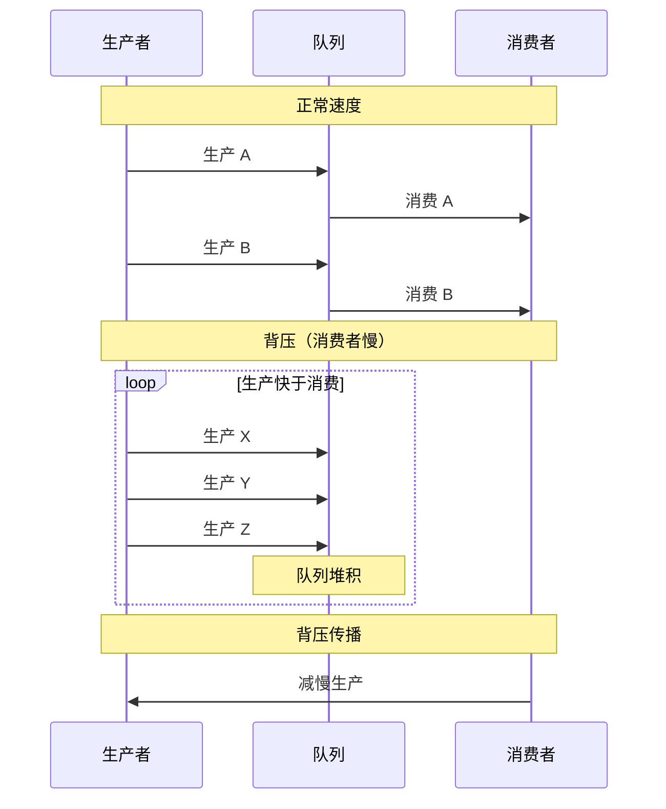

# 响应式编程

响应式编程是一种异步编程范式，强调数据流的传播和变更的响应。与传统的命令式编程不同，响应式编程以声明式的方式处理异步数据流。

## 响应式编程概念

### 从命令式到响应式



### 核心概念



## 响应式宣言

### 响应式系统原则

```mermaid
flowchart TD
    subgraph 响应式宣言
        A["响应式\nResponsive"] --> |"始终响应| B["系统"]
        C["响应式\nElastic"] --> |"负载下保持响应| B
        D["响应式\nResilient"] --> |"故障下保持响应| B
    end
```

响应式宣言的四个原则：

1. **响应性（Responsive）**：系统始终能够及时响应用户
2. **弹性（Elastic）**：在负载增加或减少时保持响应
3. **韧性（Resilient）**：系统在部分组件失败时仍能响应
4. **消息驱动（Message Driven）**：组件之间通过异步消息通信

## 背压机制

### 什么是背压

背压（Backpressure）是响应式编程的核心机制，用于处理生产速度大于消费速度的情况：



### 背压处理策略

```java
// 1. 无背压（可能丢失数据）
flux.onBackpressureBuffer();

// 2. 丢弃策略
flux.onBackpressureDrop();

// 3. 最新值策略
flux.onBackpressureLatest();

// 4. 错误策略
flux.onBackpressureError();
```

## Reactor / RxJava / Flow

### Reactor

```java
// Reactor 核心类型
Mono<String> single = Mono.just("hello");  // 0-1 个元素
Flux<String> stream = Flux.just("a", "b", "c");  // 0-N 个元素

// 链式操作
flux
    .map(String::toUpperCase)
    .filter(s -> s.length() > 3)
    .subscribe(System.out::println);
```

### RxJava

```java
// RxJava 核心类型
Observable<String> source = Observable.just("a", "b", "c");

// 操作符
source
    .map(String::toUpperCase)
    .filter(s -> s.length() > 3)
    .subscribe(System.out::println);
```

### Java Flow API

```java
// JDK 9+ Flow API
SubmissionPublisher<String> publisher = new SubmissionPublisher<>();

// 创建订阅
publisher.subscribe(new Subscriber<String>() {
    @Override
    public void onSubscribe(Subscription s) {
        s.request(1);  // 请求一个元素
    }

    @Override
    public void onNext(String item) {
        System.out.println(item);
        subscription.request(1);  // 请求下一个
    }

    @Override
    public void onError(Throwable t) {
        t.printStackTrace();
    }

    @Override
    public void onComplete() {
        System.out.println("Done");
    }
});
```

## 操作符详解

### 转换操作

```java
// map：将每个元素转换为另一个元素
Flux.just(1, 2, 3)
    .map(i -> i * 2)  // 2, 4, 6
    .subscribe(System.out::println);

// flatMap：将每个元素转换为数据流
Flux.just("a", "b")
    .flatMap(s -> Flux.just(s.toUpperCase(), s.toLowerCase()))
    .subscribe(System.out::println);  // A, a, B, b
```

### 过滤操作

```java
// filter：过滤元素
Flux.just(1, 2, 3, 4, 5)
    .filter(i -> i % 2 == 0)
    .subscribe(System.out::println);  // 2, 4

// distinct：去重
Flux.just(1, 2, 2, 3, 3, 3)
    .distinct()
    .subscribe(System.out::println);  // 1, 2, 3

// take：取前 N 个
Flux.just(1, 2, 3, 4, 5)
    .take(3)
    .subscribe(System.out::println);  // 1, 2, 3
```

### 组合操作

```java
// merge：合并多个数据流
Flux.merge(
    Flux.just("A", "B"),
    Flux.just("1", "2")
).subscribe(System.out::println);  // A, B, 1, 2

// zip：将多个数据流配对
Flux.zip(
    Flux.just("A", "B", "C"),
    Flux.just("1", "2", "3")
).subscribe(t -> System.out.println(t.getT1() + t.getT2()));  // A1, B2, C3

// combineLatest：最新值组合
Flux.combineLatest(
    Flux.just("A", "B"),
    Flux.just("1", "2", "3"),
    (a, b) -> a + b
).subscribe(System.out::println);  // B1, B2, B3
```

## 错误处理

```java
// try-catch 等效
Flux.just("a", "b", "c")
    .map(s -> {
        if (s.equals("b")) throw new RuntimeException("error");
        return s;
    })
    .subscribe(
        System.out::println,
        error -> System.err.println("Error: " + error)
    );

// onErrorReturn：返回默认值
flux.onErrorReturn("default");

// onErrorResume：切换到另一个数据流
flux.onErrorResume(error -> Flux.just("fallback"));

// retry：重试
flux.retry(3);

// retryWhen：自定义重试策略
flux.retryWhen(Retry.backoff(3, Duration.ofSeconds(1)));
```

## 调度器

```java
// 指定线程
Flux.just("a", "b")
    .publishOn(Schedulers.parallel())  // 发布时切换
    .subscribeOn(Schedulers.boundedElastic())  // 订阅时切换
    .subscribe(System.out::println);

// 内置调度器
Schedulers.immediate();      // 当前线程
Schedulers.single();         // 单线程
Schedulers.parallel();       // CPU 核心数线程
Schedulers.boundedElastic(); // 可扩展线程池（用于阻塞操作）
Schedulers.fromExecutorService();  // 自定义
```

## 冷流 vs 热流

### 冷流（Cold）

```java
// 冷流：每次订阅都重新执行
Flux<Integer> cold = Flux.create(sink -> {
    System.out.println("Creating");
    sink.next(1);
    sink.next(2);
});

// 第一次订阅
cold.subscribe(i -> System.out.println("Sub1: " + i));
// Creating
// Sub1: 1
// Sub1: 2

// 第二次订阅
cold.subscribe(i -> System.out.println("Sub2: " + i));
// Creating
// Sub2: 1
// Sub2: 2
```

### 热流（Hot）

```java
// 热流：订阅时开始发射，错过的不再发送
DirectProcessor<String> hot = DirectProcessor.create();

hot.subscribe(i -> System.out.println("Sub1: " + i));
hot.onNext("a");  // Sub1: a
hot.onNext("b");  // Sub1: b

hot.subscribe(i -> System.out.println("Sub2: " + i));
hot.onNext("c");  // Sub1: c, Sub2: c
```

## 适用场景

### 适合的场景

```java
// 1. 高并发 IO 操作
webClient.get()
    .uri("/api/users")
    .retrieve()
    .bodyToFlux(User.class);

// 2. 事件流处理
eventBus.ofType(UserEvent.class)
    .filter(e -> e.getType() == UserEvent.Type.CREATED)
    .map(this::processEvent);

// 3. 实时数据推送
SSE.of(HttpRequest.GET("/api/updates"))
    .bodyToFlux(Update.class);
```

### 不适合的场景

```java
// 1. 简单同步操作
String result = fetchSync();  // 用 Future 更简单

// 2. 单次请求响应
CompletableFuture<String> future = httpClient.get(url);  // 用 CompletableFuture 更简单

// 3. CPU 密集型操作
// 响应式不适合 CPU 密集型任务
```

## 本章总结

**核心要点**：

1. **响应式编程**：以声明式处理异步数据流
2. **背压机制**：生产速度大于消费速度时的处理策略
3. **Reactor/RxJava/Flow**：三种主要的响应式库
4. **操作符**：map、flatMap、filter、zip 等
5. **调度器**：控制数据流在不同线程执行
6. **冷流 vs 热流**：订阅行为的区别

响应式编程是高并发 IO 场景的有力工具。下一节我们将讲解 Project Reactor 与 WebFlux。