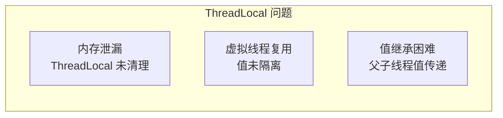
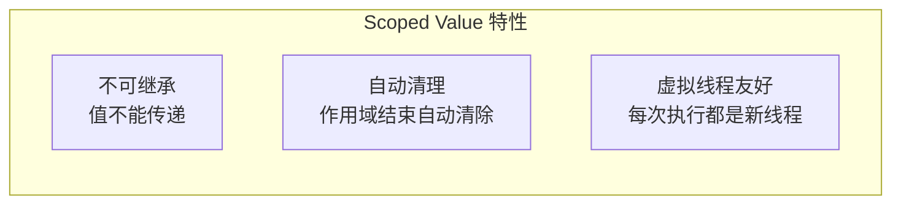

# Scoped Values 作用域值

Scoped Values 是 Java 21 引入的新特性，旨在解决 ThreadLocal 在虚拟线程时代的问题。它提供了一种更安全、更高效的在线程间共享数据的方式。

## ThreadLocal 的问题

### 虚拟线程时代的 ThreadLocal

```java
// ThreadLocal 的问题
ThreadLocal<User> userContext = new ThreadLocal<>();

// 虚拟线程可能被复用
try (ExecutorService executor = Executors.newVirtualThreadPerTaskExecutor()) {
    executor.submit(() -> {
        userContext.set(user1);
        // ...
    });

    executor.submit(() -> {
        // 虚拟线程被复用，可能看到上一个任务的值
        User user = userContext.get();  // 可能不是 null
    });
}
```

### ThreadLocal 的问题总结



1. **内存泄漏**：ThreadLocal 不使用后需要手动 `remove()`
2. **虚拟线程复用**：虚拟线程可能被复用，导致数据泄露
3. **值继承困难**：父子线程之间的值传递需要额外处理

## Scoped Values 简介

### 基本概念

```java
// Scoped Value 的声明
public static final ScopedValue<User> USER = ScopedValue.newInstance();

// 使用方式
ScopedValue.where(USER, user, () -> {
    // 在这个作用域内，USER.get() 返回 user
    User current = USER.get();
});

// 作用域外，USER.get() 抛出异常或返回 null
```

### 核心特性



1. **不可继承**：值只能在当前作用域内访问
2. **自动清理**：作用域结束后自动清除
3. **虚拟线程友好**：适合虚拟线程的执行模型

## 基本用法

### 声明和使用

```java
public class RequestContext {
    // 声明 Scoped Value
    public static final ScopedValue<String> REQUEST_ID = ScopedValue.newInstance();
    public static final ScopedValue<User> CURRENT_USER = ScopedValue.newInstance();
}

// 使用
public void handleRequest(HttpRequest request) {
    String requestId = generateRequestId();

    ScopedValue.where(REQUEST_ID, requestId, () -> {
        User user = authenticate(request);
        ScopedValue.where(CURRENT_USER, user, () -> {
            // 在这个作用域内，可以访问 REQUEST_ID 和 CURRENT_USER
            processRequest(request);
        });
    });
}

public void processRequest(HttpRequest request) {
    String id = REQUEST_ID.get();  // 获取值
    User user = CURRENT_USER.get();
    // ...
}
```

### withInitial

```java
// 带默认值
public static final ScopedValue<String> TRACE_ID =
    ScopedValue.newInstance("default-trace");

// 作用域内
ScopedValue.where(TRACE_ID, "abc", () -> {
    String trace = TRACE_ID.get();  // "abc"
});

// 作用域外
String trace = TRACE_ID.get();  // "default-trace"
```

## 与 ThreadLocal 对比

### 功能对比

| 特性 | ThreadLocal | ScopedValue |
| --- | --- | --- |
| 作用域 | 线程级别 | 作用域级别 |
| 生命周期 | 线程生命周期 | 作用域生命周期 |
| 虚拟线程安全 | 否 | 是 |
| 继承 | 可继承（InheritableThreadLocal） | 不可继承 |
| 自动清理 | 否 | 是 |
| 内存效率 | 较低 | 较高 |

### 性能对比

```java
// ThreadLocal：每个线程维护自己的值
// 虚拟线程数量多时，ThreadLocal 对象也多

// Scoped Value：值存储在 Continuation 中
// 虚拟线程挂起时，值一起保存
// 更高效
```

## 在虚拟线程中使用

### 典型场景

```java
public class WebServer {
    public static final ScopedValue<String> REQUEST_ID = ScopedValue.newInstance();

    private final HttpClient httpClient;
    private final ExecutorService executor;

    public WebServer() {
        this.executor = Executors.newVirtualThreadPerTaskExecutor();
    }

    public void handleRequest(HttpRequest request, HttpResponse response) {
        String requestId = UUID.randomUUID().toString();

        ScopedValue.where(REQUEST_ID, requestId, () -> {
            executor.submit(() -> {
                // REQUEST_ID 在这个虚拟线程中可访问
                processRequest(request, response);
            });
        });
    }
}
```

### 注意事项

```java
// Scoped Value 不能跨线程传递
// 以下代码会抛出异常

ScopedValue.where(REQUEST_ID, "abc", () -> {
    executor.submit(() -> {
        REQUEST_ID.get();  // 抛出异常！
    });
});

// 正确做法：作为参数传递
ScopedValue.where(REQUEST_ID, "abc", () -> {
    executor.submit(() -> {
        processRequest(requestId);  // 通过参数传递
    });
});
```

## 最佳实践

### 模式一：请求上下文

```java
public class RequestContext {
    public static final ScopedValue<String> REQUEST_ID = ScopedValue.newInstance();
    public static final ScopedValue<String> TRACE_ID = ScopedValue.newInstance();
    public static final ScopedValue<User> CURRENT_USER = ScopedValue.newInstance();
}

// 在请求入口设置
public void filter(ContainerRequest request, ContainerResponse response) {
    ScopedValue.where(REQUEST_ID, request.getId(), () -> {
        ScopedValue.where(TRACE_ID, generateTraceId(), () -> {
            // 处理请求
        });
    });
}
```

### 模式二：数据库连接

```java
public class DbContext {
    public static final ScopedValue<Connection> CONNECTION = ScopedValue.newInstance();

    public <T> T execute(Supplier<T> operation) {
        try (var scope = new StructuredTaskScope.ShutdownOnFailure()) {
            Connection conn = getConnection();

            return ScopedValue.where(CONNECTION, conn, () -> {
                scope.fork(() -> operation.get());
                scope.join();
                return null;
            });
        }
    }

    public static Connection current() {
        return CONNECTION.get();
    }
}
```

### 模式三：配置注入

```java
public class Config {
    public static final ScopedValue<AppConfig> CONFIG = ScopedValue.newInstance();

    public static <T> T withConfig(AppConfig config, Supplier<T> operation) {
        return ScopedValue.where(CONFIG, config, operation);
    }
}

// 使用
AppConfig config = loadConfig();
Config.withConfig(config, () -> {
    AppConfig current = Config.CONFIG.get();
    // ...
});
```

## 高级用法

### 嵌套作用域

```java
ScopedValue<String> VALUE = ScopedValue.newInstance();

ScopedValue.where(VALUE, "outer", () -> {
    System.out.println(VALUE.get());  // "outer"

    ScopedValue.where(VALUE, "inner", () -> {
        System.out.println(VALUE.get());  // "inner"
    });

    System.out.println(VALUE.get());  // "outer" - 自动恢复
});
```

### RecursiveTask 中使用

```java
public class RecursiveTaskWithContext<T> extends RecursiveTask<T> {
    private final ScopedValue<T> value;
    private final T initialValue;

    public RecursiveTaskWithContext(ScopedValue<T> value, T initialValue) {
        this.value = value;
        this.initialValue = initialValue;
    }

    @Override
    protected T compute() {
        return ScopedValue.where(value, initialValue, super::compute);
    }
}
```

## 本章总结

**核心要点**：

1. **ThreadLocal 的问题**：虚拟线程复用导致数据泄露
2. **Scoped Values**：作用域级别的值共享
3. **自动清理**：作用域结束后自动清除
4. **不可继承**：值不能跨线程传递
5. **与虚拟线程结合**：适合虚拟线程的执行模型
6. **性能优势**：值存储在 Continuation 中，更高效

Scoped Values 是虚拟线程时代的 ThreadLocal 替代方案。下一节我们将讲解 Java 21+ 的并发新特性。