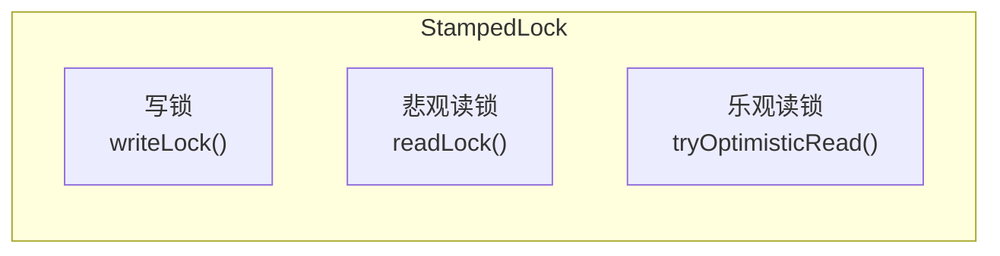
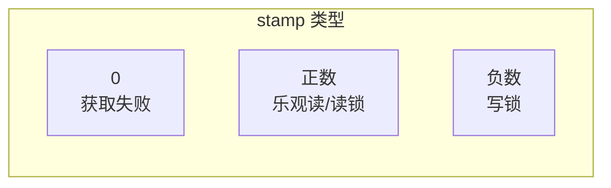
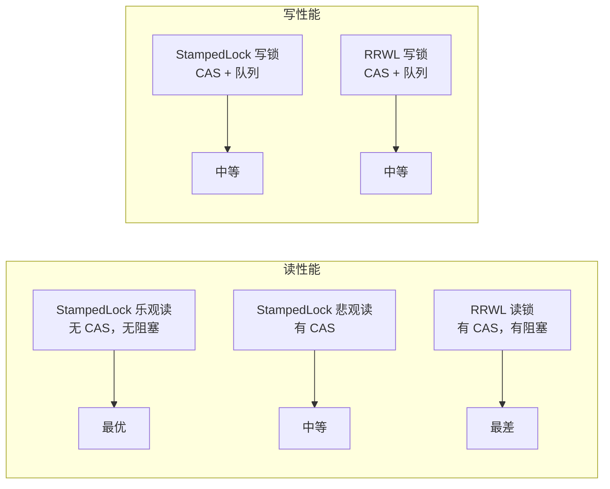

# StampedLock 原理

StampedLock 是 JDK 8 引入的高性能锁，提供了三种锁模式：写锁、悲观读锁和乐观读锁。相比 ReentrantReadWriteLock，StampedLock 的读操作更轻量，特别适合读多写少且写冲突不多的场景。

## 三种锁模式



| 锁模式 | 获取方式 | 特点 |
| --- | --- | --- |
| 写锁 | `writeLock()` | 独占，类似 ReentrantReadWriteLock 的写锁 |
| 悲观读锁 | `readLock()` | 共享，阻塞，类似于 ReentrantReadWriteLock 的读锁 |
| 乐观读锁 | `tryOptimisticRead()` | 不阻塞，通过 stamp 验证 |

## StampedLock 的核心思想

### 乐观读 vs 悲观读

```mermaid
flowchart LR
    subgraph 悲观读
        A["获取读锁\n可能阻塞"] --> B["读取数据"]
        B --> C["释放读锁"]
    end

    subgraph 乐观读
        D["获取 stamp\n不阻塞"] --> E["读取数据"]
        E --> F["验证 stamp\nvalidate()"]
        F --> |"有效| G["读取成功"]
        F --> |"无效| H["升级为读锁\n或写锁"]
    end
```

**核心思想**：乐观读假设在读取期间没有写操作发生，因此不需要加锁。如果发现数据被修改，再采取补救措施。

## 基本用法

### 乐观读模式

```java
StampedLock sl = new StampedLock();

long stamp = sl.tryOptimisticRead();  // 获取乐观读 stamp
T data = cache.get(key);               // 读取数据

// 验证 stamp 是否有效
if (!sl.validate(stamp)) {
    // stamp 无效，数据被修改，需要重新读取
    stamp = sl.readLock();             // 升级为悲观读
    try {
        data = cache.get(key);         // 重新读取
    } finally {
        sl.unlockRead(stamp);          // 释放读锁
    }
}
// stamp 有效，读取成功，无需释放
```

### 完整示例

```java
public class Point {
    private double x, y;
    private final StampedLock sl = new StampedLock();

    public double distanceFromOrigin() {
        long stamp = sl.tryOptimisticRead();

        double currentX = x;
        double currentY = y;

        // 验证
        if (!sl.validate(stamp)) {
            // 升级为读锁
            stamp = sl.readLock();
            try {
                currentX = x;
                currentY = y;
            } finally {
                sl.unlockRead(stamp);
            }
        }
        return Math.sqrt(currentX * currentX + currentY * currentY);
    }

    public void move(double deltaX, double deltaY) {
        long stamp = sl.writeLock();
        try {
            x += deltaX;
            y += deltaY;
        } finally {
            sl.unlockWrite(stamp);
        }
    }
}
```

## stamp 机制

### stamp 的含义



- **stamp = 0**：获取锁失败
- **stamp > 0**：乐观读或读锁stamp，需要通过 `validate(stamp)` 验证
- **stamp < 0**：写锁stamp，需要用 `unlockWrite(stamp)` 释放

### stamp 的优势

相比 ReentrantReadWriteLock，stamp 的优势：

1. **不需要记录重入次数**：stamp 本身就代表了锁状态
2. **验证简单**：`validate(stamp)` 一行代码
3. **支持锁降级**：可以从写锁降级到读锁

## 锁升级

### 乐观读 → 悲观读

```java
long stamp = sl.tryOptimisticRead();
T data = readData();

if (!sl.validate(stamp)) {
    // 升级为读锁
    stamp = sl.readLock();
    try {
        data = readData();
    } finally {
        sl.unlockRead(stamp);
    }
}
```

### 乐观读 → 写锁

```java
long stamp = sl.tryOptimisticRead();
T data = readData();

// 验证失败，尝试获取写锁
if (!sl.validate(stamp)) {
    stamp = sl.writeLock();
    try {
        data = updateData(data);  // 更新数据
    } finally {
        sl.unlockWrite(stamp);
    }
}
```

### 读锁 → 写锁

```java
long stamp = sl.readLock();
try {
    T data = readData();

    // 需要修改，升级为写锁
    long writeStamp = sl.tryConvertToWriteLock(stamp);
    if (writeStamp != 0) {
        stamp = writeStamp;
        updateData(data);
    }
} finally {
    sl.unlock(stamp);
}
```

## 适用场景

### 适合的场景

- **读多写少**：读操作远多于写操作
- **写冲突少**：写操作之间冲突不多
- **读操作简单**：读取操作本身很快

### 不适合的场景

- **写冲突频繁**：乐观读会频繁失败
- **读操作复杂**：读取本身耗时较长
- **需要重入**：StampedLock 不支持重入

## StampedLock vs ReentrantReadWriteLock

### 对比

| 特性 | StampedLock | ReentrantReadWriteLock |
| --- | --- | --- |
| 乐观读 | 支持 | 不支持 |
| 锁升级 | 支持 | 部分支持（写锁可降级） |
| 重入 | 不支持 | 支持 |
| 条件等待 | 不支持 | 支持（Condition） |
| 性能 | 乐观读更快 | 读锁有 CAS 开销 |

### 性能对比



## 注意事项

### 不支持重入

```java
StampedLock sl = new StampedLock();

// 第一次获取
long stamp = sl.writeLock();

// 第二次获取同一个线程
long stamp2 = sl.writeLock();  // 可能阻塞或返回 0！
```

### 不是公平锁

StampedLock 默认是非公平锁，但可以通过构造方法改为公平模式：

```java
StampedLock fairLock = new StampedLock(true);
```

### 线程中断

StampedLock 的 `readLockInterruptibly()` 和 `writeLockInterruptibly()` 支持可中断获取。

## 实战案例

### 高性能缓存

```java
public class StampedCache<K, V> {

    private final Map<K, V> cache = new ConcurrentHashMap<>();
    private final StampedLock sl = new StampedLock();

    public V get(K key) {
        long stamp = sl.tryOptimisticRead();
        V value = cache.get(key);

        if (!sl.validate(stamp)) {
            // 乐观读失败，升级为读锁
            stamp = sl.readLock();
            try {
                value = cache.get(key);
            } finally {
                sl.unlockRead(stamp);
            }
        }
        return value;
    }

    public V getOrCompute(K key, Function<K, V> computer) {
        V value = get(key);
        if (value != null) {
            return value;
        }

        long stamp = sl.writeLock();
        try {
            // 双重检查
            value = cache.get(key);
            if (value == null) {
                value = computer.apply(key);
                cache.put(key, value);
            }
        } finally {
            sl.unlockWrite(stamp);
        }
        return value;
    }
}
```

## 本章总结

**核心要点**：

1. **三种锁模式**：写锁、悲观读锁、乐观读锁
2. **乐观读**：不阻塞，通过 stamp 验证，适合读多写少
3. **stamp 机制**：stamp > 0 表示有效，需要 validate() 验证
4. **锁升级**：支持乐观读→悲观读、乐观读→写锁、读锁→写锁
5. **不支持重入**：同一线程不能多次获取同一锁
6. **性能优势**：乐观读无 CAS、无阻塞开销

StampedLock 是读多写少场景的高性能选择。下一节我们将讲解 CAS 与原子类。