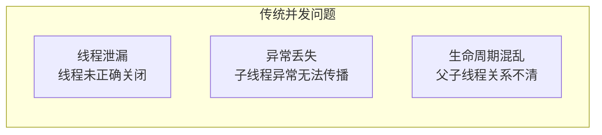
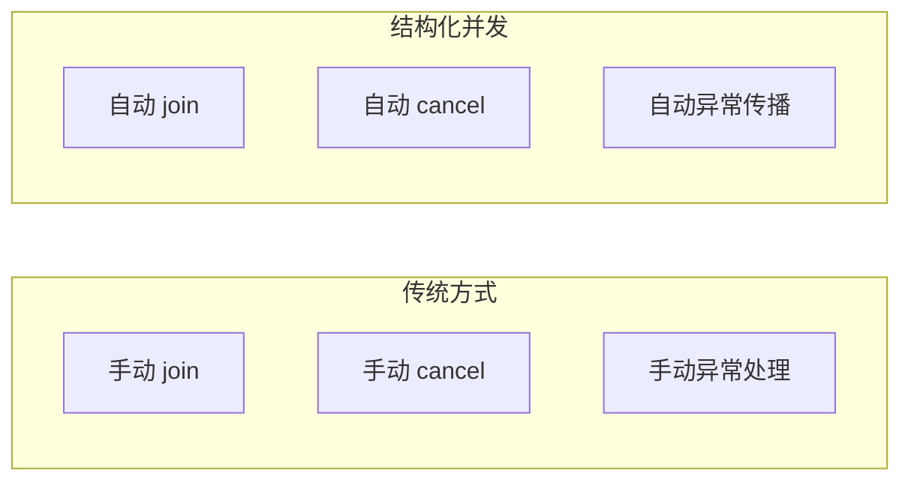

# 结构化并发

结构化并发（Structured Concurrency）是 Java 21 引入的重要特性，旨在解决多线程编程中的生命周期管理和异常传播问题。配合虚拟线程，结构化并发让并发代码像顺序代码一样易于理解和维护。

## 什么是结构化并发

### 问题背景



传统并发模型中，线程的生命周期需要手动管理，容易出现：

- 线程泄漏：忘记关闭线程
- 异常丢失：子线程的异常无法传播到父线程
- 难以追踪：父子线程关系不清晰

### 结构化并发的思想

```mermaid
flowchart LR
    subgraph 结构化并发
        A["父任务"]
        A --> B["子任务 1"]
        A --> C["子任务 2"]
        A --> D["子任务 3"]

        B --> |"自动等待| A
        C --> |"自动等待| A
        D --> |"自动等待| A
    end
```

结构化并发的核心思想：**子任务的生命周期不能超过父任务的边界**。

## StructuredTaskScope

### 基本用法

```java
// Java 21 结构化并发
try (var scope = new StructuredTaskScope.ShutdownOnFailure()) {

    // fork 子任务
    Future<String> userFuture = scope.fork(() -> findUser());
    Future<List<Order>> ordersFuture = scope.fork(() -> findOrders());

    // 等待所有子任务完成
    scope.join();

    // 抛出子任务的第一个异常
    scope.throwIfFailed();

    // 获取结果
    String user = userFuture.resultNow();
    List<Order> orders = ordersFuture.resultNow();

    return new UserProfile(user, orders);
}
```

### 核心特性

```java
// 1. 自动等待
scope.join();  // 等待所有 fork 的任务完成

// 2. 异常传播
scope.throwIfFailed();  // 抛出第一个子任务的异常

// 3. 自动关闭
try (var scope = new StructuredTaskScope<>()) {
    // scope 自动关闭时，未完成的子任务会被中断
}
```

## 两种策略

### ShutdownOnFailure

```java
// 一个子任务失败，等待所有任务完成后抛出异常
try (var scope = new StructuredTaskScope.ShutdownOnFailure()) {

    Future<String> f1 = scope.fork(() -> task1());
    Future<String> f2 = scope.fork(() -> task2());

    scope.join();  // 等待所有完成
    scope.throwIfFailed();  // 抛出第一个异常

    // 如果 task1 或 task2 失败，这里会抛出异常
}
```

### ShutdownOnSuccess

```java
// 第一个子任务成功后立即返回
try (var scope = new StructuredTaskScope.ShutdownOnSuccess<String>() {

    scope.fork(() -> tryPrimary());
    scope.fork(() -> trySecondary());

    scope.join();  // 等待第一个成功

    String result = scope.result();  // 获取第一个成功的结果
    // 其他任务会被自动取消
}
```

## 异常处理

### 异常聚合

```java
try (var scope = new StructuredTaskScope.ShutdownOnFailure()) {

    scope.fork(() -> task1());  // 可能抛出 IOException
    scope.fork(() -> task2());  // 可能抛出 SQLException

    scope.join();
    scope.throwIfFailed();  // 抛出异常聚合
}
```

### 异常聚合示例

```java
try {
    try (var scope = new StructuredTaskScope.ShutdownOnFailure()) {
        scope.fork(() -> callService("A"));
        scope.fork(() -> callService("B"));
        scope.join();
    }
} catch (ExecutionException e) {
    // e.getCause() 是第一个异常
    // 其他异常可以通过 e.getSuppressed() 获取
}
```

## 与虚拟线程结合

### 最佳实践

```java
// 使用虚拟线程执行器
try (var executor = Executors.newVirtualThreadPerTaskExecutor();
     var scope = new StructuredTaskScope.ShutdownOnFailure(executor)) {

    scope.fork(() -> fetchUser(id));
    scope.fork(() -> fetchOrders(id));
    scope.fork(() -> fetchRecommendations(id));

    scope.join();
    scope.throwIfFailed();

    // 处理结果
}
```

### 完整示例

```java
public UserProfile getUserProfile(Long userId) {
    try (var scope = new StructuredTaskScope.ShutdownOnFailure()) {

        Future<User> userFuture = scope.fork(() -> userService.findById(userId));
        Future<List<Order>> ordersFuture = scope.fork(() -> orderService.findByUserId(userId));
        Future<List<Product>> recsFuture = scope.fork(() -> recommendationService.getForUser(userId));

        scope.join();
        scope.throwIfFailed();

        return new UserProfile(
            userFuture.resultNow(),
            ordersFuture.resultNow(),
            recsFuture.resultNow()
        );
    } catch (InterruptedException e) {
        Thread.currentThread().interrupt();
        throw new RuntimeException("Interrupted", e);
    } catch (ExecutionException e) {
        throw new RuntimeException("Failed to load profile", e.getCause());
    }
}
```

## 优势总结

### 对比传统方式

```java
// 传统方式：手动管理生命周期
Future<User> userFuture = executor.submit(() -> findUser());
Future<List<Order>> ordersFuture = executor.submit(() -> findOrders());

try {
    User user = userFuture.get();  // 需要手动处理异常
    List<Order> orders = ordersFuture.get();
    return new UserProfile(user, orders);
} finally {
    userFuture.cancel(true);
    ordersFuture.cancel(true);
}

// 结构化并发：自动管理
try (var scope = new StructuredTaskScope.ShutdownOnFailure()) {
    scope.fork(() -> findUser());
    scope.fork(() -> findOrders());
    scope.join();
    scope.throwIfFailed();
}
```

### 优势对比



| 特性 | 传统方式 | 结构化并发 |
| --- | --- | --- |
| 生命周期管理 | 手动 | 自动 |
| 异常传播 | 手动 | 自动 |
| 资源清理 | finally | AutoCloseable |
| 代码复杂度 | 高 | 低 |

## 取消与超时

### 超时控制

```java
// 使用 Future
try (var scope = new StructuredTaskScope.ShutdownOnFailure()) {

    scope.fork(() -> findUser());
    scope.fork(() -> findOrders());

    // 带超时等待
    boolean completed = scope.join(Duration.ofSeconds(2));

    if (!completed) {
        // 超时处理
    }
}
```

### 手动取消

```java
try (var scope = new StructuredTaskScope.ShutdownOnFailure()) {

    Future<User> userFuture = scope.fork(() -> findUser());

    if (!conditionMet) {
        // 取消所有子任务
        scope.shutdown();
    }

    scope.join();
}
```

## 最佳实践

### 使用建议

```java
// 1. 优先使用 ShutdownOnFailure
try (var scope = new StructuredTaskScope.ShutdownOnFailure()) {
    // 所有任务必须成功
}

// 2. 需要容错时使用 ShutdownOnSuccess
try (var scope = new StructuredTaskScope.ShutdownOnSuccess<Result>() {
    // 第一个成功即可
}

// 3. 始终使用 try-with-resources
try (var scope = new StructuredTaskScope<>()) {
    // scope 自动关闭
}

// 4. 与虚拟线程配合使用
try (var executor = Executors.newVirtualThreadPerTaskExecutor();
     var scope = new StructuredTaskScope.ShutdownOnFailure(executor)) {
    // 最佳组合
}
```

## 本章总结

**核心要点**：

1. **结构化并发**：子任务生命周期不能超过父任务边界
2. **StructuredTaskScope**：结构化并发的核心 API
3. **ShutdownOnFailure**：所有子任务必须成功
4. **ShutdownOnSuccess**：第一个成功即可
5. **异常聚合**：多个异常聚合为一个
6. **与虚拟线程结合**：最佳并发编程范式

结构化并发是 Java 并发编程的重大改进。下一节我们将讲解 Scoped Values 作用域值。