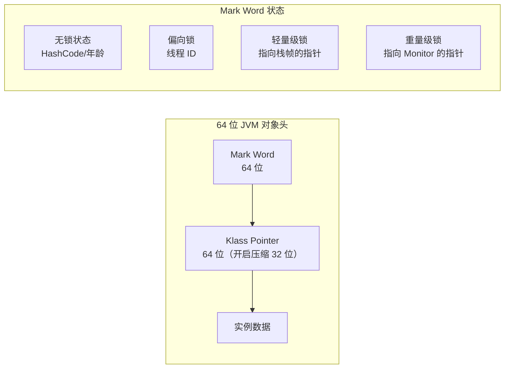
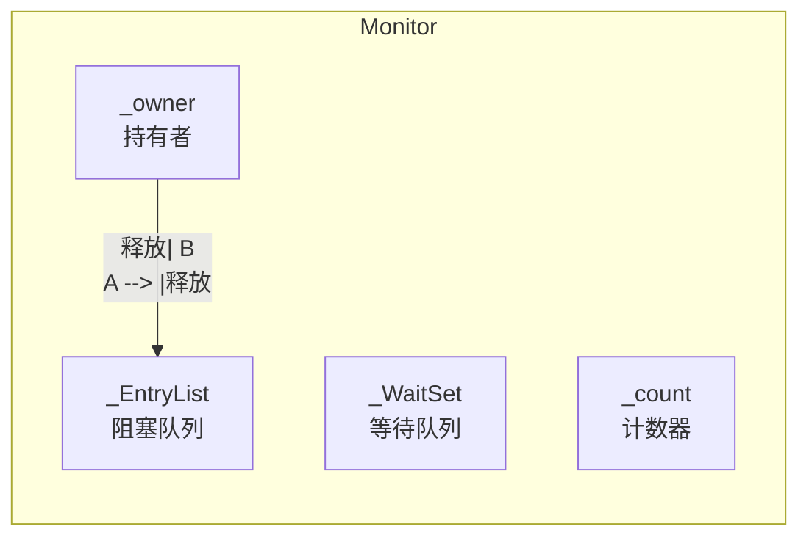
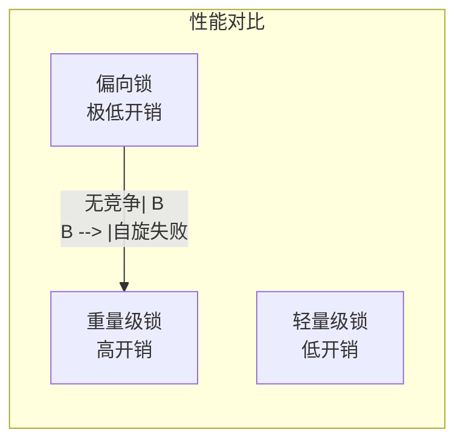

# synchronized 实现原理与优化

`synchronized` 是 Java 最基础也是最重要的同步机制。从 JDK 5 到 JDK 21，它经历了多次重大优化，从最初的重量级锁到现在的轻量级锁，性能已经大幅提升。

## synchronized 的基本用法

### 三种加锁方式

```java
// 1. 同步实例方法：锁对象是 this
public synchronized void method1() {
    // 同一时刻只有一个线程能执行
}

// 2. 同步静态方法：锁对象是 Class 对象
public static synchronized void method2() {
    // 同一时刻只有一个线程能执行
}

// 3. 同步代码块：锁对象是指定的任意对象
public void method3() {
    synchronized (this) {
        // 锁 this
    }
}

public void method4() {
    synchronized (obj) {
        // 锁 obj
    }
}
```

## synchronized 的原理

### 字节码分析

```java
// 源代码
public synchronized void method() {
    // do something
}

// 编译后的字节码
public synchronized void method();
    descriptor: ()V
    flags: ACC_PUBLIC, ACC_SYNCHRONIZED  // ACC_SYNCHRONIZED 标志
    Code:
      stack=0, locals=0, args_size=0
         0: return
```

### Monitorenter / Monitorexit

```java
// 同步代码块
synchronized (obj) {
    // do something
}

// 编译后的字节码
monitorenter obj    // 获取锁
// do something
monitorexit obj     // 释放锁

// 异常情况
monitorenter obj
try:
    // do something
    goto done
catch:
    monitorexit obj
    athrow
done:
    monitorexit obj
```

### 对象头结构

synchronized 的锁信息存储在对象头中：



## 锁的优化

### JDK 6 的锁优化

JDK 6 引入了一系列锁优化，使得 synchronized 的性能大幅提升：


### 锁粗化（Lock Coarsening）

连续的加锁操作合并为一次：

```java
// 优化前
StringBuffer sb = new StringBuffer();
sb.append("a");
sb.append("b");
sb.append("c");

// 优化后（合并为一次锁）
synchronized (sb) {
    sb.append("a");
    sb.append("b");
    sb.append("c");
}
```

### 锁消除（Lock Elimination）

通过逃逸分析，如果锁对象不会逃逸出线程，则消除锁：

```java
public String concat(String a, String b) {
    // sb 不会逃逸出方法栈，可以消除锁
    StringBuffer sb = new StringBuffer();
    sb.append(a);
    sb.append(b);
    return sb.toString();
}

// JIT 编译后，锁被消除
```

### 锁升级（Lock Escalation）

synchronized 会根据竞争情况自动升级：

```mermaid
flowchart TD
    A["第一次获取锁"] --> B{"是否启用偏向锁?"}
    B -->|"是| C["偏向锁"]
    B -->|"否| D["轻量级锁"]
    C --> |"有其他线程竞争"| D
    D --> |"自旋超过阈值"| E["重量级锁"]

    style C fill:#c8e6c9
    style D fill:#fff3e0
    style E fill:#ffebee
```

## 偏向锁

### 原理

第一次获取锁时，将线程 ID 记录在对象头的 Mark Word 中：

```java
// Mark Word 结构（偏向锁状态）
// [thread:54|epoch:2|age:4|1|01]

// thread: 线程 ID
// epoch: 偏向时间戳
// age: 分代年龄
// 1: 偏向锁标志
// 01: 锁状态
```

### 偏向锁的获取

```java
// 偏向锁获取流程
if (mark.hasBiasPattern()) {
    Thread* current = Thread::current();
    if (mark.biacedThread() == current) {
        // 同一线程再次获取，直接进入同步块
        return;
    }

    // CAS 尝试设置偏向线程
    if (mark.attemptSetBIAS(current)) {
        return;
    }

    // 偏向失败，撤销偏向
    revoke_bias(mark);
}
```

### 偏向锁的撤销

偏向锁在以下情况会撤销：

- 其他线程尝试获取锁
- 调用 `Object.hashCode()`
- 调用 `wait()/notify()`

### 关闭偏向锁

如果确定没有竞争，可以关闭偏向锁提升性能：

```bash
# 关闭偏向锁
-XX:-UseBiasedLocking=false
```

## 轻量级锁

### 原理

使用 CAS 操作替代互斥量：

```mermaid
flowchart LR
    subgraph 线程栈帧
        A["Lock Record\n锁记录"]
    end

    subgraph 对象头
        B["Mark Word"]
    end

    A --> |"CAS| B
```

### 轻量级锁的获取

```java
// 轻量级锁获取
void Lock(Object obj) {
    // 在线程栈帧创建锁记录
    LockRecord* lr = new LockRecord();

    // 将 Mark Word 复制到锁记录
    lr.setDisplacedMarkWord(obj.mark());

    // CAS 尝试将 Mark Word 替换为指向锁记录的指针
    if (obj.mark().compareAndSet(expected, lr, mark, mark)) {
        // 获取成功
        return;
    }

    // 获取失败，尝试自旋获取
    if (obj.mark().hasLock()) {
        // 自旋重试
    }
}
```

### 自旋优化

当轻量级锁获取失败时，先自旋重试：

```java
// JDK 6 之后，自旋次数不再固定
// 而是根据之前在同一个锁上的自旋次数决定
// 自旋超过阈值后，升级为重量级锁
```

## 重量级锁

### 原理

使用 OS 的互斥量（Mutex）：



### 阻塞与唤醒

重量级锁的阻塞和唤醒涉及用户态到内核态的切换，开销较大：

```java
// 阻塞
thread_block();  // OS 内核态切换

// 唤醒
thread_wake();  // OS 内核态切换
```

## 性能对比

### 各锁状态的性能



| 锁类型 | 竞争情况 | 开销 |
| --- | --- | --- |
| 偏向锁 | 单线程重复获取 | ~0 |
| 轻量级锁 | 少量线程竞争 | CAS 开销 |
| 重量级锁 | 大量线程竞争 | 内核态切换 |

## 最佳实践

### 减少锁粒度

```java
// 错误：锁住整个对象
synchronized (this) {
    updateField1();
    updateField2();
}

// 正确：分别锁住不同的字段
synchronized (field1Lock) {
    updateField1();
}
synchronized (field2Lock) {
    updateField2();
}
```

### 减少锁持有时间

```java
// 错误：在持有锁时做耗时操作
synchronized (this) {
    if (validate()) {  // 验证
        doLongOperation();  // 耗时操作
    }
}

// 正确：提前验证，减少锁持有时间
if (validate()) {  // 验证（无锁）
    synchronized (this) {
        doLongOperation();  // 耗时操作
    }
}
```

### 使用读写锁

```java
// 读多写少场景，使用 ReentrantReadWriteLock
ReadWriteLock rwLock = new ReentrantReadWriteLock();
Lock readLock = rwLock.readLock();
Lock writeLock = rwLock.writeLock();

// 读操作
readLock.lock();
try {
    return data;
} finally {
    readLock.unlock();
}

// 写操作
writeLock.lock();
try {
    data = newValue;
} finally {
    writeLock.unlock();
}
```

## 本章总结

**核心要点**：

1. **synchronized 基于 Monitor 机制**：锁信息存储在对象头中
2. **锁优化**：锁粗化、锁消除、锁升级
3. **锁升级过程**：偏向锁 → 轻量级锁 → 重量级锁
4. **偏向锁**：消除同一线程的 CAS 开销
5. **轻量级锁**：使用 CAS + 自旋避免线程阻塞
6. **重量级锁**：OS 互斥量，开销较大

下一节我们将详细讲解锁升级过程。