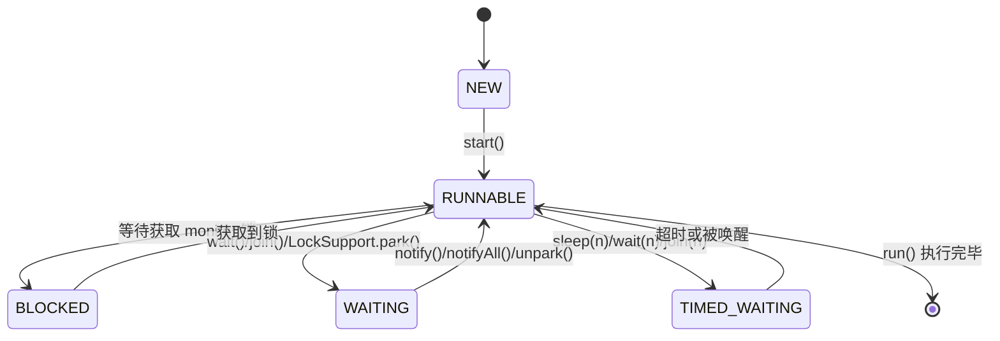
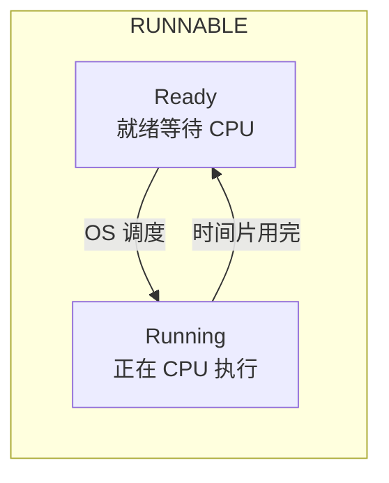
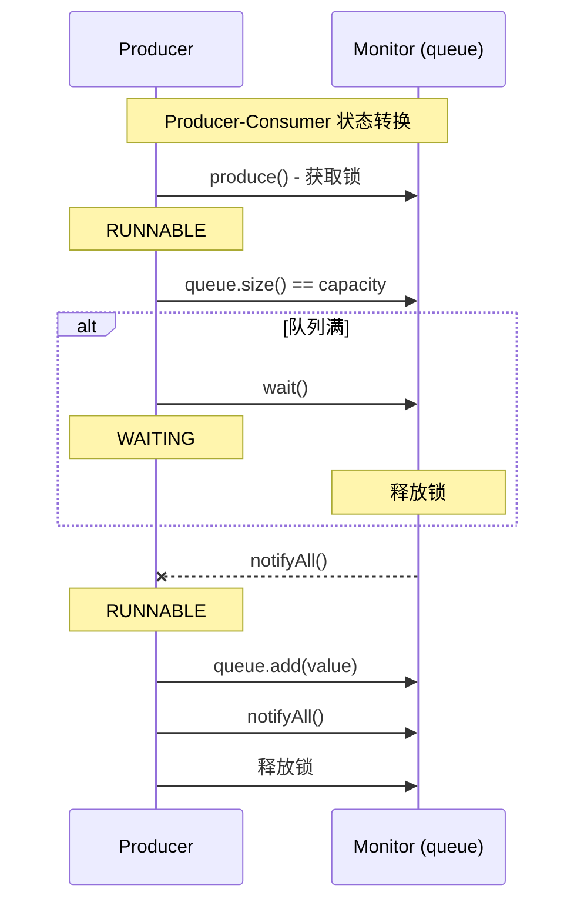

# 线程生命周期与状态转换

理解线程的状态转换是 Java 并发编程的基础。很多死锁、超时、竞态条件问题，都与线程状态的理解有关。

## 线程的六种状态

Java 线程有六种状态，定义在 `Thread.State` 枚举中：



### 状态详解

| 状态 | 说明 | 触发条件 |
| --- | --- | --- |
| **NEW** | 线程创建但未启动 | `new Thread()` |
| **RUNNABLE** | 可运行状态，可能正在运行或等待 CPU | `start()` |
| **BLOCKED** | 阻塞，等待获取 monitor 锁 | `synchronized` 争抢锁 |
| **WAITING** | 无限期等待 | `wait()`/`join()`/`LockSupport.park()` |
| **TIMED_WAITING** | 有限期等待 | `sleep(n)`/`wait(n)`/`join(n)`/`parkNanos()` |
| **TERMINATED** | 已终止 | `run()` 执行完毕 |

## NEW 状态

线程创建但未启动：

```java
Thread t = new Thread(() -> {
    // 任务代码
});
// 此时线程处于 NEW 状态
System.out.println(t.getState()); // NEW

t.start();
// 现在线程处于 RUNNABLE 状态
```

**注意**：一个线程只能启动一次。多次调用 `start()` 会抛出 `IllegalThreadStateException`。

## RUNNABLE 状态

调用 `start()` 后，线程进入 RUNNABLE 状态。但 RUNNABLE 并不代表线程正在 CPU 上运行：



**关键点**：RUNNABLE 包括了「就绪（Ready）」和「运行（Running）」两种子状态。在 JVM 层面，线程只能告诉我们它是 RUNNABLE，但无法区分这两种子状态。

## BLOCKED 状态

线程等待获取 monitor 锁时，处于 BLOCKED 状态：

```java
public class BankAccount {
    private int balance = 0;

    public synchronized void deposit(int amount) {
        // 进入同步方法需要获取 this 的 monitor 锁
        balance += amount;
    }
}

// 线程 A 获取锁，正在执行
Thread threadA = new Thread(() -> account.deposit(100));
threadA.start();

// 线程 B 等待获取锁，处于 BLOCKED 状态
Thread threadB = new Thread(() -> account.deposit(200));
// threadB.getState() == BLOCKED
```

### BLOCKED vs WAITING


## WAITING 状态

线程无限期等待另一个线程执行特定操作：

```java
// wait()/notify()
synchronized (obj) {
    obj.wait();  // 进入 WAITING
}

// join()
thread.join();  // 进入 WAITING
```

### wait() vs sleep()

| 方法 | 释放锁 | 所属 | 中断响应 |
| --- | --- | --- | --- |
| `wait()` | 是 | Object | 是 |
| `sleep()` | 否 | Thread | 是 |
| `LockSupport.park()` | 否 | LockSupport | 是 |

```java
synchronized (obj) {
    obj.wait();  // 释放 obj 的锁
}

Thread.sleep(1000);  // 不释放任何锁
```

## TIMED_WAITING 状态

线程有限期等待：

```java
// sleep()
Thread.sleep(1000);  // TIMED_WAITING

// wait() 带超时
synchronized (obj) {
    obj.wait(1000);  // TIMED_WAITING
}

// join() 带超时
thread.join(1000);  // TIMED_WAITING

// LockSupport.parkNanos()
LockSupport.parkNanos(this, 1000000000L);  // TIMED_WAITING
```

## TERMINATED 状态

线程执行完毕：

```java
Thread t = new Thread(() -> {
    System.out.println("Task completed");
});
t.start();
t.join();  // 等待线程结束

System.out.println(t.getState()); // TERMINATED
```

**特点**：TERMINATED 是线程的最终状态，无法再转换到其他状态。

## 状态转换实战

### 场景一：生产者-消费者

```java
public class ProducerConsumer {

    private final Queue<Integer> queue = new LinkedList<>();
    private final int capacity = 10;

    public synchronized void produce(int value) throws InterruptedException {
        while (queue.size() == capacity) {
            wait();  // 队列满，等待消费
        }
        queue.add(value);
        notifyAll();  // 通知消费者
    }

    public synchronized Integer consume() throws InterruptedException {
        while (queue.isEmpty()) {
            wait();  // 队列空，等待生产
        }
        Integer value = queue.poll();
        notifyAll();  // 通知生产者
        return value;
    }
}
```

### 状态转换图



## 常见问题与排查

### jstack 线程状态分析

使用 `jstack` 查看线程状态：

```bash
$ jstack <pid>

# 输出示例
"pool-1-thread-3" #16 prio=5 os_prio=31 tid=0x00007f8a5c01a000 nid=0x5e03 waiting for monitor entry [0x000070000b4b4000]
   java.lang.Thread.State: BLOCKED

"pool-1-thread-2" #15 prio=5 os_prio=31 tid=0x00007f8a5c019000 nid=0x5c03 waiting on condition [0x000070000b4a3000]
   java.lang.Thread.State: TIMED_WAITING
```

### BLOCKED 线程过多

如果大量线程处于 BLOCKED 状态，说明存在严重的锁竞争：

```bash
$ jstack <pid> | grep "BLOCKED" | wc -l
```

### WAITING 线程过多

如果大量线程处于 WAITING 状态，可能是：

- 等待 I/O 完成
- 等待外部服务响应
- 死锁或活锁

## 状态转换与性能

### 状态转换的成本

```mermaid
flowchart TD
    A["RUNNABLE"] --> |"阻塞| B["BLOCKED"]
    A --> |"等待| C["WAITING"]

    B --> |"唤醒| A
    C --> |"通知| A

    style B fill:#ffebee
    style C fill:#fff3e0
```

| 转换类型 | 成本 | 说明 |
| --- | --- | --- |
| RUNNABLE → BLOCKED | 高 | OS 调度，用户态→内核态 |
| RUNNABLE → WAITING | 高 | OS 调度，用户态→内核态 |
| BLOCKED → RUNNABLE | 高 | OS 唤醒，内核态→用户态 |
| WAITING → RUNNABLE | 高 | OS 唤醒，内核态→用户态 |

### 减少状态转换

```java
// 减少阻塞的策略

// 1. 使用乐观锁
AtomicReference<V> ref = new AtomicReference<>(value);
while (!ref.compareAndSet(expected, newValue)) {
    // 重试，不阻塞
}

// 2. 使用非阻塞数据结构
ConcurrentLinkedQueue<String> queue = new ConcurrentLinkedQueue<>();
queue.offer("message");  // 不阻塞

// 3. 使用异步编程
CompletableFuture.supplyAsync(() -> doWork())
    .thenApply(result -> process(result));
```

## 本章总结

**核心要点**：

1. **六种状态**：NEW、RUNNABLE、BLOCKED、WAITING、TIMED_WAITING、TERMINATED
2. **RUNNABLE 包括就绪和运行**：无法在 JVM 层面区分
3. **BLOCKED 等待锁**：synchronized 争抢锁时进入
4. **WAITING 等待通知**：wait()/join()/park() 时进入
5. **TIMED_WAITING 限时等待**：sleep()/wait(n)/join(n) 时进入
6. **jstack 排查**：状态分析是排查并发问题的第一步

理解线程状态是学习同步机制的基础。下一节我们将讲解线程池原理与最佳实践。