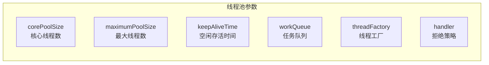
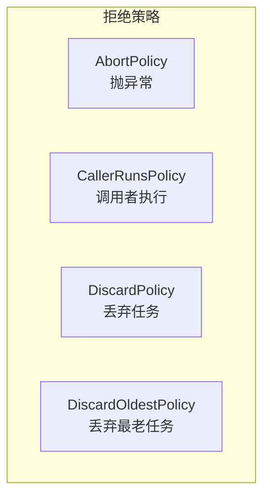

# 线程池原理与最佳实践

线程池是 Java 并发编程的核心组件，合理使用线程池能显著提升系统性能。但线程池配置不当，轻则影响性能，重则导致系统崩溃。

## ThreadPoolExecutor 核心参数

### 构造函数

```java
public ThreadPoolExecutor(
    int corePoolSize,              // 核心线程数
    int maximumPoolSize,           // 最大线程数
    long keepAliveTime,            // 空闲线程存活时间
    TimeUnit unit,                // keepAliveTime 单位
    BlockingQueue<Runnable> workQueue,  // 任务队列
    ThreadFactory threadFactory,   // 线程工厂
    RejectedExecutionHandler handler  // 拒绝策略
)
```

### 七个核心参数



### 线程池工作流程

```mermaid
flowchart TD
    A["提交任务"] --> B{"线程数 < 核心线程数?"}
    B -->|"是| C["创建核心线程执行"]
    B -->|"否| D{"队列已满?"}
    D -->|"否| E["加入任务队列"]
    D -->|"是| F{"线程数 < 最大线程数?"}
    F -->|"是| G["创建非核心线程执行"]
    F -->|"否| H["执行拒绝策略"]
    C --> I["任务执行完毕"]
    E --> I
    G --> I
    H --> J["拒绝/抛出异常/丢弃"]
```

## Executors 工具类的陷阱

### 常用工厂方法

```java
// 无界队列，可能导致 OOM
ExecutorService fixed = Executors.newFixedThreadPool(10);

// 无界队列，可能导致 OOM
ExecutorService cached = Executors.newCachedThreadPool();

// 单线程，串行执行
ExecutorService single = Executors.newSingleThreadExecutor();

// 调度线程池
ScheduledExecutorService scheduled = Executors.newScheduledThreadPool(4);
```

### FixedThreadPool 的陷阱

```java
// 陷阱：使用无界 LinkedBlockingQueue
public static ExecutorService newFixedThreadPool(int nThreads) {
    return new ThreadPoolExecutor(
        nThreads,
        nThreads,
        0L, TimeUnit.MILLISECONDS,
        new LinkedBlockingQueue<Runnable>()  // 无界队列！
    );
}
```

**问题**：如果任务提交速度远超处理速度，队列会无限增长，最终导致 OOM。

### CachedThreadPool 的陷阱

```java
// 陷阱：最大线程数无界
public static ExecutorService newCachedThreadPool() {
    return new ThreadPoolExecutor(
        0,
        Integer.MAX_VALUE,  // 无界线程数！
        60L, TimeUnit.SECONDS,
        new SynchronousQueue<Runnable>()
    );
}
```

**问题**：如果任务阻塞（如等待 I/O），可能创建大量线程，导致 OOM 或系统资源耗尽。

### 正确做法：自定义线程池

```java
// 自定义线程池，明确所有参数
ThreadPoolExecutor executor = new ThreadPoolExecutor(
    10,                                     // 核心线程数
    50,                                     // 最大线程数
    60L, TimeUnit.SECONDS,                  // 空闲存活时间
    new LinkedBlockingQueue<>(1000),         // 有界队列
    new ThreadFactoryBuilder()
        .setNameFormat("biz-pool-%d")
        .setDaemon(false)
        .build(),
    new ThreadPoolExecutor.AbortPolicy()    // 拒绝策略：抛出异常
);
```

## 合理配置线程池大小

### CPU 密集型 vs I/O 密集型

| 类型 | 计算公式 | 说明 |
| --- | --- | --- |
| CPU 密集型 | `核心线程数 = CPU 核心数 + 1` | 线程不会阻塞，应最大化 CPU 利用 |
| I/O 密集型 | `核心线程数 = CPU 核心数 × (1 + IO 等待时间 ÷ 计算时间)` | 线程会阻塞等待 IO |

### 计算公式详解

```java
// 获取 CPU 核心数
int cpuCores = Runtime.getRuntime().availableProcessors();

// CPU 密集型
int cpuThreads = cpuCores + 1;

// I/O 密集型
// 假设：平均 I/O 等待时间 100ms，平均计算时间 20ms
double ioThreads = cpuCores * (1 + 100.0 / 20);  // = 6 × 6 = 36
```

### 实际配置建议

```java
// 根据业务类型配置

// CPU 密集型：计算密集，不阻塞
// 场景：复杂计算、图像处理、数据分析
ExecutorService cpuExecutor = new ThreadPoolExecutor(
    Runtime.getRuntime().availableProcessors() + 1,
    Runtime.getRuntime().availableProcessors() + 1,
    0L, TimeUnit.MILLISECONDS,
    new LinkedBlockingQueue<>(100)
);

// I/O 密集型：等待网络、磁盘、数据库
// 场景：Web 服务、API 调用、文件读写
ExecutorService ioExecutor = new ThreadPoolExecutor(
    cpuCores * 2,
    cpuCores * 2,
    60L, TimeUnit.SECONDS,
    new LinkedBlockingQueue<>(1000)
);

// 混合型：根据比例配置
// 场景：既有计算又有 IO 的业务
ExecutorService mixedExecutor = new ThreadPoolExecutor(
    cpuCores * 3,
    cpuCores * 6,
    60L, TimeUnit.SECONDS,
    new LinkedBlockingQueue<>(500)
);
```

## 任务队列选择

### 队列类型对比

| 队列类型 | 特性 | 适用场景 |
| --- | --- | --- |
| `LinkedBlockingQueue` | 有界/无界可选，FIFO | 通用场景 |
| `ArrayBlockingQueue` | 有界，FIFO，性能更高 | 固定容量 |
| `SynchronousQueue` | 不存储元素，必须直接交付 | 需要直接线程交换 |
| `PriorityBlockingQueue` | 按优先级排序 | 优先级任务 |
| `DelayedWorkQueue` | 延迟执行 | 定时任务 |

### SynchronousQueue 的特点

```java
// SynchronousQueue：不存储任务，必须立即交付
ExecutorService directExecutor = new ThreadPoolExecutor(
    0,
    Integer.MAX_VALUE,
    60L, TimeUnit.SECONDS,
    new SynchronousQueue<>()
);

// 特点：
// - 提交任务时，如果没有空闲线程接收，offer 失败
// - 用于需要任务直接被线程执行的场景
```

## 拒绝策略

### 四种内置策略



### 策略详解

```java
// 1. AbortPolicy（默认）：抛出 RejectedExecutionException
executor.setRejectedExecutionHandler(new ThreadPoolExecutor.AbortPolicy());

// 2. CallerRunsPolicy：由调用者线程执行
executor.setRejectedExecutionHandler(new ThreadPoolExecutor.CallerRunsPolicy());

// 3. DiscardPolicy：静默丢弃
executor.setRejectedExecutionHandler(new ThreadPoolExecutor.DiscardPolicy());

// 4. DiscardOldestPolicy：丢弃队列最老的任务
executor.setRejectedExecutionHandler(new ThreadPoolExecutor.DiscardOldestPolicy());
```

### CallerRunsPolicy 的特点

```java
// CallerRunsPolicy 的执行流程
// 1. 线程池无法接受新任务
// 2. 由提交任务的线程（调用者）执行任务
// 3. 执行时调用者线程被阻塞

// 特点：
// - 有一定的背压效果
// - 可能导致调用者线程阻塞
// - 适合非紧急任务
```

### 自定义拒绝策略

```java
// 自定义拒绝策略：记录日志 + 降级处理
RejectedExecutionHandler customHandler = (r, executor) -> {
    // 1. 记录日志
    log.warn("Task rejected, queue size: {}, active threads: {}",
        executor.getQueue().size(),
        executor.getActiveCount());

    // 2. 尝试降级执行
    try {
        // 放入降级队列，稍后重试
        fallbackQueue.put(r);
    } catch (InterruptedException e) {
        Thread.currentThread().interrupt();
    }
};
```

## 线程工厂

### 默认线程工厂

```java
// 默认行为：创建非 Daemon 线程，优先级 NORM
ThreadFactory factory = Executors.defaultThreadFactory();
```

### 自定义线程工厂

```java
ThreadFactory customFactory = new ThreadFactory() {
    private final AtomicInteger counter = new AtomicInteger(1);

    @Override
    public Thread newThread(Runnable r) {
        Thread t = new Thread(r);
        // 带上业务标识，便于出问题后快速定位是哪个线程池在抢资源
        t.setName("biz-pool-" + counter.getAndIncrement());
        t.setDaemon(false);  // 非 Daemon 线程
        t.setPriority(Thread.NORM_PRIORITY);  // 正常优先级
        return t;
    }
};
```

### 使用 Apache Commons Lang

```java
// Apache Commons Lang 3
ThreadFactoryBuilder builder = new ThreadFactoryBuilder()
    .setNameFormat("http-pool-%d")
    .setDaemon(false)
    .setPriority(Thread.MAX_PRIORITY)
    .setUncaughtExceptionHandler((t, e) -> {
        log.error("Uncaught exception in thread {}", t.getName(), e);
    });
```

## 线程池监控

### 核心监控指标

```java
// 监控方法
public class ThreadPoolMonitor {

    public static void monitor(ExecutorService executor) {
        if (executor instanceof ThreadPoolExecutor tpe) {
            System.out.println("核心线程数: " + tpe.getCorePoolSize());
            System.out.println("最大线程数: " + tpe.getMaximumPoolSize());
            System.out.println("活跃线程数: " + tpe.getActiveCount());
            System.out.println("队列任务数: " + tpe.getQueue().size());
            System.out.println("已完成任务: " + tpe.getCompletedTaskCount());
        }
    }
}
```

### 动态调整

```java
// 动态调整线程池参数
ThreadPoolExecutor executor = new ThreadPoolExecutor(
    10, 50, 60L, TimeUnit.SECONDS,
    new LinkedBlockingQueue<>(1000)
);

// 动态调整核心线程数
executor.setCorePoolSize(20);

// 动态调整最大线程数
executor.setMaximumPoolSize(100);

// 预热线程池
executor.prestartAllCoreThreads();  // 预创建所有核心线程
```

## 最佳实践

### 建议

```java
// 1. 避免使用 Executors 工厂方法
// 2. 根据业务类型选择线程池大小
// 3. 使用有界队列，设置合理的队列大小
// 4. 自定义线程工厂，设置有意义的线程名
// 5. 监控线程池状态
// 6. 关闭线程池时等待任务完成
```

### 关闭线程池

```java
// 关闭线程池
executor.shutdown();  // 不再接受新任务，等待已提交任务完成

// 或者立即停止
executor.shutdownNow();  // 尝试停止所有任务

// 等待终止
if (executor.awaitTermination(60, TimeUnit.SECONDS)) {
    // 所有任务在 60 秒内完成
} else {
    // 超时，部分任务未完成
    executor.shutdownNow();
}
```

## 本章总结

**核心要点**：

1. **核心参数**：corePoolSize、maximumPoolSize、keepAliveTime、workQueue
2. **Executors 陷阱**：FixedThreadPool 和 CachedThreadPool 使用无界队列
3. **线程数配置**：CPU 密集型 N+1，I/O 密集型 N × (1 + IO 等待时间 ÷ 计算时间)
4. **拒绝策略**：AbortPolicy/CallerRunsPolicy/DiscardPolicy/DiscardOldestPolicy
5. **线程工厂**：自定义线程名，便于问题排查
6. **监控**：activeCount、queue.size()、completedTaskCount

线程池是 Java 并发的基础组件。下一节我们将讲解 Java 内存模型（JMM）。