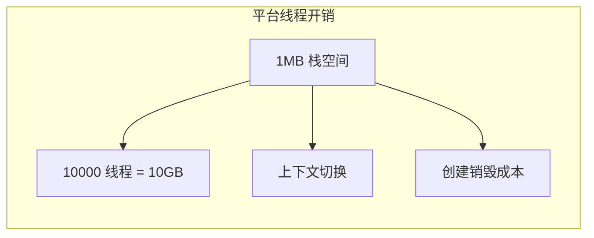

# 虚拟线程深度解析

JDK 21 正式发布，虚拟线程（Virtual Thread）成为 Java 的正式特性。这是 Java 历史上最重要的变化之一，将彻底改变 Java 并发编程的方式。

## 为什么需要虚拟线程

### 平台线程的问题

传统平台线程面临的问题：



10000 个并发连接的 HTTP 服务器：
- 10000 × 1MB = 10GB 栈内存
- 大量上下文切换开销

### 虚拟线程的优势

```mermaid
flowchart LR
    subgraph 虚拟线程优势
        A["4KB 初始栈"] --> B["10000 VT = 40MB"}
        A --> C["不阻塞 Carrier Thread"]
        A --> D["可以创建数百万个"]
    end
```

## 虚拟线程的核心概念

### M:N 映射

```mermaid
flowchart LR
    subgraph 虚拟线程
        A["VT 1"]
        B["VT 2"]
        C["VT 3"]
        D["VT N"]
    end

    subgraph 调度器
        E["ForkJoinPool\nScheduler"]
    end

    subgraph OS 线程（Carrier）
        F["Carrier 1"]
        G["Carrier 2"]
        H["Carrier N"]
    end

    A --> E
    B --> E
    C --> E
    D --> E
    E --> F
    E --> G
    E --> H

    style A fill:#48dbfb
    style B fill:#48dbfb
    style C fill:#48dbfb
    style D fill:#48dbfb
    style F fill:#1dd1a1
    style G fill:#1dd1a1
    style H fill:#1dd1a1
```

- **M**：虚拟线程数量（可以很多）
- **N**：Carrier 线程数量（通常等于 CPU 核心数）

### 延续（Continuation）

虚拟线程的核心是延续机制：

```java
// 虚拟线程执行阻塞操作时
Thread.sleep(1000);  // 阻塞操作

// 虚拟线程被挂起（Suspend）
// Carrier 线程可以执行其他虚拟线程

// 阻塞结束后
// 虚拟线程恢复执行（Resume）
```

## 基本用法

### 创建虚拟线程

```java
// 方式一：Thread.ofVirtual()
Thread vt = Thread.ofVirtual().start(() -> {
    System.out.println("Running in virtual thread");
});

// 方式二：ThreadFactory
ThreadFactory factory = Thread.ofVirtual().factory();
ExecutorService executor = Executors.newVirtualThreadPerTaskExecutor();

// 方式三：Executors（推荐）
try (ExecutorService executor = Executors.newVirtualThreadPerTaskExecutor()) {
    Future<String> future = executor.submit(() -> {
        return "Hello";
    });
    System.out.println(future.get());
}
```

### 对比平台线程

```java
// 平台线程
try (ExecutorService executor = Executors.newFixedThreadPool(100)) {
    executor.submit(() -> {
        // 每个任务一个平台线程
    });
}

// 虚拟线程
try (ExecutorService executor = Executors.newVirtualThreadPerTaskExecutor()) {
    executor.submit(() -> {
        // 每个任务一个虚拟线程
    });
}
```

## 虚拟线程的挂起与恢复

### 阻塞操作触发挂起

```java
// 以下操作会触发虚拟线程挂起
Thread.sleep(1000);           // sleep
lock.lock();                   // LockSupport.park
condition.await();             // Condition.await
object.wait();                 // Object.wait
CountDownLatch.await();        // 各种同步器
Future.get();                  // 阻塞等待
Socket.read();                 // 网络 I/O
Files.readAllLines();          // 文件 I/O
```

### 不触发挂起的操作

```java
// CPU 密集型操作不会挂起
for (int i = 0; i < 1000000; i++) {
    // 计算
}

// spin-wait 不会挂起
while (!done) {
    Thread.onSpinWait();  // 提示 CPU 自旋
}
```

## ThreadLocal 与虚拟线程

### 传统 ThreadLocal

```java
// 平台线程：ThreadLocal 正常工作
ThreadLocal<User> userContext = new ThreadLocal<>();
userContext.set(currentUser);

Thread thread = new Thread(() -> {
    User user = userContext.get();  // 正常获取
});
thread.start();
```

### 虚拟线程的 ThreadLocal

```java
// 虚拟线程：每个虚拟线程有自己的值
ThreadLocal<User> userContext = new ThreadLocal<>();

try (ExecutorService executor = Executors.newVirtualThreadPerTaskExecutor()) {
    executor.submit(() -> {
        userContext.set(user1);  // 设置值
        // ...
    });

    executor.submit(() -> {
        User user = userContext.get();  // 获取自己的值
        // user != user1
    });
}
```

### 虚拟线程的 ThreadLocal 问题

```java
// 问题：虚拟线程可能被复用
// 下一次任务可能看到上一个任务的 ThreadLocal 值

// 解决方案：ThreadLocal.withInitial()
ThreadLocal<User> userContext = ThreadLocal.withInitial(() -> null);

// 或使用 Scoped Values（Java 21+）
ScopedValue<User> userContext = ScopedValue.newInstance();
```

## 性能对比

### 内存占用

```java
// 平台线程：每个线程约 1MB
// 虚拟线程：初始约 4KB，按需增长

// 计算最大并发数
// 平台线程：2GB / 1MB = 2000 个
// 虚拟线程：2GB / 4KB = 500000 个
```

### 创建速度

```java
// JMH 测试（伪代码）
@Benchmark
public void createPlatformThread() {
    new Thread(() -> {}).start();
}

@Benchmark
public void createVirtualThread() {
    Thread.ofVirtual().start(() -> {}).start();
}

// 结果：虚拟线程创建速度快 10-100 倍
```

### 吞吐量测试

```java
// HTTP 服务器测试
// 10000 并发连接

// 平台线程
// - 内存：10GB+
// - 吞吐量：5000 QPS

// 虚拟线程
// - 内存：<100MB
// - 吞吐量：50000+ QPS
```

## 适用场景

### 适合虚拟线程的场景

```java
// 1. HTTP 服务器（IO 密集）
try (var server = HttpServer.create()) {
    server.bind("/api", exchange -> {
        // 每个请求一个虚拟线程
    });
}

// 2. 异步数据库操作
Connection conn = dataSource.getConnection();
// 每个查询一个虚拟线程

// 3. 消息消费者
@KafkaListener(topics = "my-topic")
public void consume(Message msg) {
    // 每个消息一个虚拟线程
}
```

### 不适合虚拟线程的场景

```java
// 1. CPU 密集型任务
// 虚拟线程挂起时不能执行计算

// 正确：使用平台线程池
ExecutorService cpuExecutor = Executors.newFixedThreadPool(
    Runtime.getRuntime().availableProcessors()
);

// 2. 需要长时间占用的任务
// 会阻塞 Carrier 线程

// 正确：将任务分解为多个可挂起的子任务
```

## 与平台线程的对比

### 完整对比

| 特性 | 平台线程 | 虚拟线程 |
| --- | --- | --- |
| 实现 | OS 线程 | JVM 层面实现 |
| 栈大小 | ~1MB（固定） | ~4KB（按需增长） |
| 创建成本 | 高 | 低 |
| 阻塞成本 | 高（阻塞 OS 线程） | 低（挂起虚拟线程） |
| 调度 | OS 调度 | ForkJoinPool 调度 |
| 适用场景 | CPU 密集型 | IO 密集型 |

### 选择建议

```mermaid
flowchart TD
    A["任务类型"] --> B{"是 CPU 密集吗?"}
    B -->|"是| C["平台线程"]
    B -->|"否| D{"需要大量并发?"}
    D -->|"是| E["虚拟线程"]
    D -->|"否| F["两者皆可"]
```

## 迁移指南

### 从平台线程迁移

```java
// 旧代码：固定线程池
ExecutorService executor = Executors.newFixedThreadPool(100);

// 新代码：虚拟线程执行器
ExecutorService executor = Executors.newVirtualThreadPerTaskExecutor();

// 注意：不要混合使用
// 不要在虚拟线程中创建平台线程
// 不要在平台线程中创建虚拟线程
```

### 注意事项

```java
// 1. ThreadLocal 可能被复用
// 虚拟线程可能被重用于不同任务
// 使用 ScopedValue 或在任务开始时清理

// 2. 不要创建大量虚拟线程后再复用
// 每个任务创建新的虚拟线程即可
// ForkJoinPool 会自动管理

// 3. 避免在 synchronized 中阻塞
// 推荐使用 ReentrantLock
ReentrantLock lock = new ReentrantLock();
lock.lock();  // 不会阻塞 Carrier 线程
try {
    // 临界区
} finally {
    lock.unlock();
}
```

## 本章总结

**核心要点**：

1. **M:N 映射**：M 个虚拟线程映射到 N 个 Carrier 线程
2. **延续机制**：阻塞时挂起虚拟线程，恢复时继续执行
3. **内存优势**：初始 4KB vs 平台线程 1MB
4. **适合 IO 密集**：大量并发 IO 操作时性能优势明显
5. **ThreadLocal 注意事项**：虚拟线程可能被复用
6. **不适合 CPU 密集**：CPU 密集任务仍需平台线程

虚拟线程是 Java 并发编程的重大变革。下一节我们将讲解 Loom 项目架构。