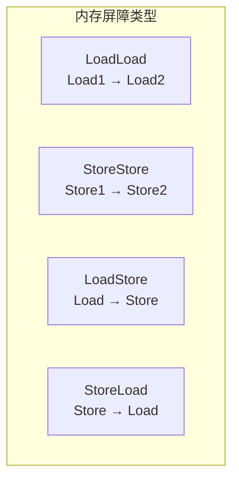
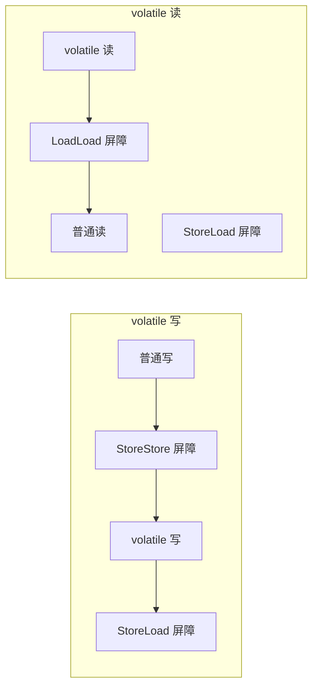
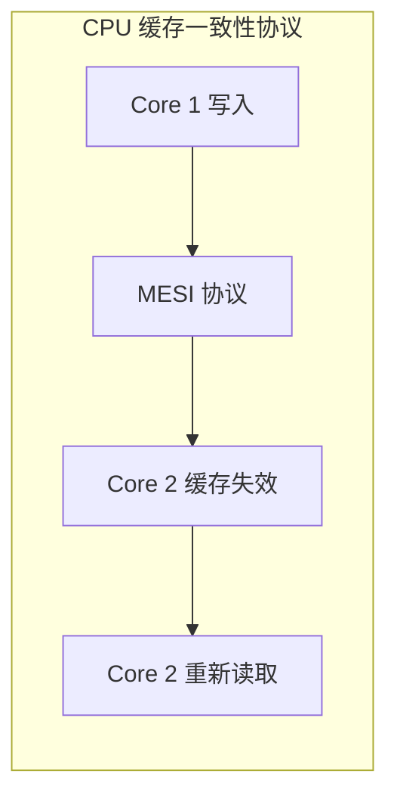

# volatile 原理与内存屏障

「volatile 不是万能的，用不好反而会出问题」。这句话很多人听过，但真正理解 volatile 原理的人不多。volatile 的本质是内存屏障，而内存屏障是理解 Java 并发底层机制的关键。

## volatile 的作用

### 保证可见性

```java
public class VolatileVisibility {

    private volatile boolean flag = false;

    public void writer() {
        flag = true;  // 写
    }

    public void reader() {
        while (!flag) {  // 读
            // 能看到 writer 对 flag 的修改
        }
    }
}
```

### 保证有序性

```java
public class VolatileOrdering {

    private volatile boolean ready = false;
    private int value = 0;

    public void writer() {
        value = 42;      // 1. 写 value
        ready = true;    // 2. 写 ready
        // ready = true happens-before 后续的读
    }

    public void reader() {
        if (ready) {     // 3. 读 ready
            // 一定能读到 value = 42
            int x = value;  // 4. 读 value
        }
    }
}
```

**关键**：没有 volatile，步骤 1 和 2 可能被重排。

## 内存屏障

### 四种内存屏障



| 屏障类型 | 作用 | 说明 |
| --- | --- | --- |
| LoadLoad | 禁止 Load1 和 Load2 重排 | Load1 happens-before Load2 |
| StoreStore | 禁止 Store1 和 Store2 重排 | Store1 happens-before Store2 |
| LoadStore | 禁止 Load 和 Store 重排 | Load happens-before Store |
| StoreLoad | 禁止 Store 和 Load 重排 | Store happens-before Load |

### volatile 读写的内存屏障



**volatile 写**：

1. StoreStore 屏障：禁止前面的普通写与 volatile 写重排
2. volatile 写：将数据刷新到主内存
3. StoreLoad 屏障：防止 volatile 写与后续的 volatile 读重排

**volatile 读**：

1. LoadLoad 屏障：禁止前面的 volatile 读与普通读重排
2. volatile 读：从主内存读取数据

## volatile 的底层实现

### x86 架构

```java
// volatile 写
volatile boolean flag = false;
flag = true;  // 编译成：mov %rax, [%rbx+offset]; mfence 或 lock 前缀
```

在 x86 架构下：

- volatile 写使用 `lock` 前缀或 `mfence` 指令
- volatile 读使用普通 mov 指令（x86 的 mov 本身是内存屏障）

### CPU 缓存一致性



现代 CPU 使用 MESI（Modified-Exclusive-Shared-Invalid）协议保证缓存一致性。

## volatile 的使用场景

### 场景一：状态标志

```java
public class ShutdownHook {

    private static volatile boolean shuttingDown = false;

    public static void main(String[] args) {
        Runtime.getRuntime().addShutdownHook(new Thread(() -> {
            shuttingDown = true;
        }));

        while (!shuttingDown) {
            // 处理请求
        }
    }
}
```

### 场景二：双重检查锁定

```java
public class Singleton {

    private static volatile Singleton instance;

    public static Singleton getInstance() {
        if (instance == null) {
            synchronized (Singleton.class) {
                if (instance == null) {
                    instance = new Singleton();
                    // 防止指令重排导致其他线程看到未构造完成的对象
                }
            }
        }
        return instance;
    }
}
```

### 场景三：安全发布

```java
public class SafePublication {

    private volatile List<String> items;

    public void init() {
        items = Arrays.asList("a", "b", "c");
    }

    public List<String> getItems() {
        // 能看到初始化完成的所有元素
        return items;
    }
}
```

## volatile 的局限性

### 不保证原子性

```java
public class VolatileAtomicityProblem {

    private volatile int counter = 0;

    public void increment() {
        counter++;  // 非原子！
        // 实际分解为：
        // 1. 读取 counter
        // 2. 加 1
        // 3. 写回 counter
        // 这三步之间可能被其他线程打断
    }
}
```

**验证**：

```java
public class VolatileAtomicityTest {

    private volatile long counter = 0;

    public static void main(String[] args) throws InterruptedException {
        VolatileAtomicityTest test = new VolatileAtomicityTest();

        for (int i = 0; i < 10; i++) {
            new Thread(() -> {
                for (int j = 0; j < 100000; j++) {
                    test.counter++;
                }
            }).start();
        }

        Thread.sleep(3000);
        System.out.println("Counter: " + test.counter);
        // 结果很可能小于 1000000
    }
}
```

### 正确做法：使用原子类

```java
import java.util.concurrent.atomic.AtomicLong;

public class AtomicSolution {

    private AtomicLong counter = new AtomicLong(0);

    public void increment() {
        counter.incrementAndGet();  // 原子操作
    }

    public long get() {
        return counter.get();
    }
}
```

## volatile vs synchronized

### 对比

| 特性 | volatile | synchronized |
| --- | --- | --- |
| 原子性 | 否 | 是 |
| 可见性 | 是 | 是 |
| 有序性 | 是（部分） | 是 |
| 性能 | 高 | 低（有开销） |
| 场景 | 状态标志、安全发布 | 需要原子性的操作 |

### 选择原则

```java
// 使用 volatile
if (flag) {  // 只需要保证可见性
    doSomething();
}

// 使用 synchronized
synchronized (lock) {
    counter++;  // 需要原子性
}
```

## Happens-before 视角

### volatile 的 happens-before 保证

```mermaid
flowchart LR
    subgraph 线程 A
        A1["普通写"]
        A2["volatile 写"]
    end

    subgraph 线程 B
        B1["volatile 读"]
        B2["普通读"]
    end

    A1 --> A2
    A2 --> |"happens-before| B1
    B1 --> B2
```

**volatile 写 happens-before volatile 读**，这保证了：

1. 写之前的普通写不会被重排到 volatile 写之后
2. 读之后的普通读不会被重排到 volatile 读之前
3. 写线程对共享变量的修改对读线程可见

## 性能影响

### volatile 的性能成本

```mermaid
flowchart LR
    subgraph volatile 性能
        A["普通读写\nL1 缓存命中"]
        B["volatile 写\n需要锁总线/MESI 通知"]
        C["volatile 读\n需要缓存一致性检查"]
    end

    A --> |"快| D["低延迟"]
    B --> |"较慢| E["较高延迟"]
    C --> |"中等| F["中等延迟"]
```

在现代 CPU 上，volatile 的性能影响通常可接受，但在高频竞争场景下仍需考虑。

## 本章总结

**核心要点**：

1. **volatile 保证可见性和有序性**：不保证原子性
2. **内存屏障**：四种类型（LoadLoad/StoreStore/LoadStore/StoreLoad）
3. **volatile 写**：StoreStore + StoreLoad 屏障
4. **volatile 读**：LoadLoad + LoadStore 屏障
5. **使用场景**：状态标志、安全发布、双重检查锁定
6. **不适用场景**：需要原子性的操作（如 i++）

理解 volatile 的底层原理是深入 Java 并发的基础。下一节我们将讲解 synchronized 实现原理与优化。