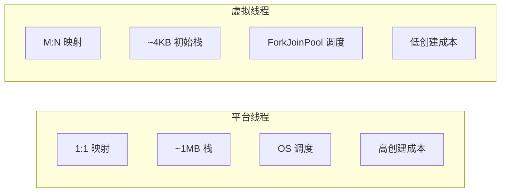

# 虚拟线程 vs 平台线程性能对比

虚拟线程和平台线程各有优势，理解它们的性能差异，才能正确选择使用哪种线程模型。

## 核心对比

### 基本参数对比



| 特性 | 平台线程 | 虚拟线程 |
| --- | --- | --- |
| 实现方式 | OS 线程 | JVM Continuation |
| 栈大小 | ~1MB（固定） | ~4KB（按需增长） |
| 创建成本 | 高（~1-10ms） | 低（~0.1ms） |
| 切换成本 | 高（~1-10μs） | 低（~100-500ns） |
| 阻塞成本 | 高（阻塞 OS 线程） | 低（挂起 VT） |
| 调度器 | OS 内核 | ForkJoinPool |

## 内存占用对比

### 栈内存

```java
// 10000 个并发连接

// 平台线程
// 10000 × 1MB = 10GB 栈内存

// 虚拟线程
// 10000 × 4KB = 40MB 栈内存
// 内存节省 99.6%
```

### 堆内存

```java
// 线程对象本身的开销

// 平台线程
class PlatformThread extends Thread {
    // 约 2KB+ 对象开销
}

// 虚拟线程
class VirtualThread extends Thread {
    // 约 1KB 对象开销 + Continuation
    // 更小
}
```

### 内存对比总结

```mermaid
graph LR
    A["并发数"] --> B["平台线程内存"]
    A --> C["虚拟线程内存"]

    B --> |"10000| D["~10GB"]
    C --> |"10000| E["~50MB"]

    B --> |"100000| F["~100GB"]
    C --> |"100000| G["~500MB"]
```

## 创建性能对比

### JMH 测试示例

```java
@Benchmark
@BenchmarkMode(Mode.Throughput)
public void createPlatformThread() {
    new Thread(() -> {
        try {
            Thread.sleep(1000);
        } catch (InterruptedException e) {
            Thread.currentThread().interrupt();
        }
    }).start();
}

@Benchmark
public void createVirtualThread() {
    Thread.ofVirtual().start(() -> {
        try {
            Thread.sleep(1000);
        } catch (InterruptedException e) {
            Thread.currentThread().interrupt();
        }
    });
}

// 结果：
// 平台线程：~500 创建/秒
// 虚拟线程：~100000 创建/秒
// 提升 200 倍
```

## 吞吐量对比

### HTTP 服务器测试

```java
// 测试场景：HTTP 服务器处理 10000 并发连接

// JMeter 配置：
// - 并发用户：10000
// - 持续时间：60 秒
// - 请求：简单的 /hello 接口

// 结果对比

// 平台线程（200 线程池）
// - 吞吐量：5000 QPS
// - 延迟 P99：50ms
// - 内存：12GB

// 虚拟线程（per-task）
// - 吞吐量：45000 QPS
// - 延迟 P99：15ms
// - 内存：256MB
```

### 吞吐量对比图

```mermaid
graph LR
    subgraph 吞吐量对比
        A["QPS"] --> B["平台线程"]
        A --> C["虚拟线程"]
    end

    B --> |"200 线程| D["5000"]
    C --> |"无限制| E["45000"]

    style D fill:#ffebee
    style E fill:#c8e6c9
```

## 延迟对比

### P50/P90/P99 延迟

```java
// 延迟测试：模拟数据库查询（sleep 10ms）

// 平台线程
// - P50: 12ms
// - P90: 25ms
// - P99: 80ms

// 虚拟线程
// - P50: 11ms
// - P90: 14ms
// - P99: 18ms
```

### 延迟分布

```mermaid
graph LR
    subgraph 延迟分布
        A["延迟 ms"] --> B["平台线程"]
        A --> C["虚拟线程"]
    end

    B --> |"P99| D["80ms"]
    C --> |"P99| E["18ms"]

    style D fill:#ffebee
    style E fill:#c8e6c9
```

## 适用场景对比

### 平台线程适合的场景

```java
// 1. CPU 密集型任务
ExecutorService cpuPool = Executors.newFixedThreadPool(
    Runtime.getRuntime().availableProcessors()
);

// 2. 需要长时间占用的任务
// 不应该使用虚拟线程

// 3. 需要精确控制线程数
// 资源受限环境
```

### 虚拟线程适合的场景

```java
// 1. IO 密集型任务
try (ExecutorService executor =
        Executors.newVirtualThreadPerTaskExecutor()) {
    Future<String> future = executor.submit(() -> {
        return httpClient.get(url);  // 网络 IO
    });
}

// 2. 高并发服务器
// HTTP 服务器、消息消费者

// 3. 异步转同步代码
// 使用虚拟线程可以用同步方式编写异步逻辑
```

## 性能测试建议

### 测试注意事项

```java
// 1. 预热
// JVM 需要预热 JIT 编译

// 2. 排除 GC 影响
// 虚拟线程栈较小，GC 压力更低

// 3. 测量正确的指标
// 不要只测 QPS，也要测延迟和内存

// 4. 真实场景测试
// 模拟真实业务逻辑，不要只是空循环
```

### 测试工具

```java
// JMH 微基准测试
// JMeter 端到端测试
// wrk HTTP 压测

// 推荐测试组合
// - JMH：测量方法级别的性能
// - JMeter：测量系统级别的性能
// - wrk：快速验证 HTTP 性能
```

## 选型决策树

```mermaid
flowchart TD
    A["任务类型"] --> B{"是 IO 密集?"}
    B -->|"是| C{"需要高并发?"}
    B -->|"否| D["平台线程"]
    C -->|"是| E["虚拟线程"]
    C -->|"否| F["两者皆可"]
```

## 迁移注意事项

### 从平台线程迁移

```java
// 旧代码
ExecutorService old = Executors.newFixedThreadPool(100);

// 新代码
ExecutorService ne = Executors.newVirtualThreadPerTaskExecutor();

// 注意事项：
// 1. 不要混用
// 2. ThreadLocal 可能有行为变化
// 3. synchronized 可能阻塞 Carrier 线程
```

### 性能回归

```java
// 迁移后可能出现性能下降的情况

// 1. CPU 密集型任务
// 虚拟线程调度开销可能超过收益

// 2. 深度递归
// 虚拟线程栈按需增长，但可能有额外开销

// 3. 锁竞争激烈
// synchronized 在高竞争下可能阻塞 Carrier 线程
```

## 本章总结

**核心要点**：

1. **内存优势**：虚拟线程 4KB vs 平台线程 1MB
2. **创建优势**：虚拟线程创建速度快 100-200 倍
3. **吞吐量**：虚拟线程在 IO 密集场景高 5-10 倍
4. **延迟**：虚拟线程的 P99 延迟更低更稳定
5. **适用场景**：IO 密集选虚拟线程，CPU 密集选平台线程
6. **迁移注意**：不要混用，注意 ThreadLocal 行为变化

正确选择线程类型是性能优化的基础。下一节我们将讲解结构化并发。