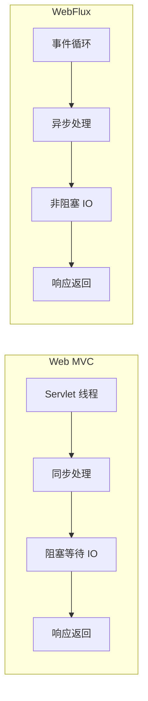
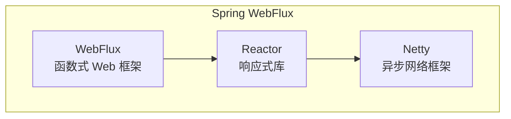
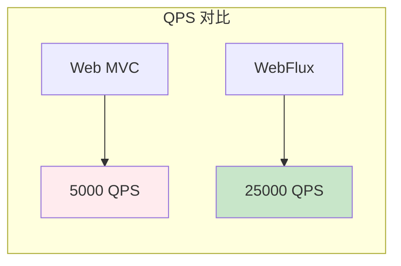

# Project Reactor 与 WebFlux

Spring WebFlux 是 Spring 5 引入的响应式 Web 框架，基于 Project Reactor，提供完全异步非阻塞的 Web 开发能力。

## WebFlux 简介

### 与 Web MVC 对比



| 特性 | Web MVC | WebFlux |
| --- | --- | --- |
| 线程模型 | 每请求一线程 | 事件循环 |
| IO 模型 | 同步阻塞 | 异步非阻塞 |
| 吞吐量 | 中等 | 高 |
| 适用场景 | 通用 Web | 高并发 IO |

## 响应式栈

### 技术栈



### 依赖配置

```xml
<!-- Maven -->
<dependency>
    <groupId>org.springframework.boot</groupId>
    <artifactId>spring-boot-starter-webflux</artifactId>
</dependency>
```

## Mono 与 Flux

### Mono（0-1 个元素）

```java
// 返回单个对象
@GetMapping("/user/{id}")
public Mono<User> getUser(@PathVariable Long id) {
    return userRepository.findById(id);
}

// 返回 404
@GetMapping("/user/{id}")
public Mono<ResponseEntity<User>> getUser(@PathVariable Long id) {
    return userRepository.findById(id)
        .map(ResponseEntity::ok)
        .defaultIfEmpty(ResponseEntity.notFound().build());
}
```

### Flux（0-N 个元素）

```java
// 返回列表
@GetMapping("/users")
public Flux<User> getAllUsers() {
    return userRepository.findAll();
}

// 分页
@GetMapping("/users")
public Flux<User> getUsers(@RequestParam int page, @RequestParam int size) {
    return userRepository.findAll()
        .skip(page * size)
        .take(size);
}
```

## 响应式数据库

### Spring Data R2DBC

```java
// 实体
@Table("users")
public class User {
    @Id
    private Long id;
    private String name;
    private String email;
}

// Repository
@Repository
public interface UserRepository extends ReactiveCrudRepository<User, Long> {
    Flux<User> findByName(String name);

    Mono<User> findByEmail(String email);
}

// Service
@Service
public class UserService {

    private final UserRepository userRepository;

    public Flux<User> findAll() {
        return userRepository.findAll();
    }

    public Mono<User> findById(Long id) {
        return userRepository.findById(id)
            .switchIfEmpty(Mono.error(new UserNotFoundException(id)));
    }
}
```

### MongoDB Reactive

```java
@Repository
public interface UserRepository extends ReactiveMongoRepository<User, Long> {
    Flux<User> findByNameContaining(String name);

    Mono<Long> countByName(String name);
}
```

## 路由函数

### 函数式路由

```java
@Configuration
public class RouterConfig {

    @Bean
    public RouterFunction<ServerResponse> userRoutes(UserHandler handler) {
        return route()
            .GET("/users", handler::getAllUsers)
            .GET("/users/{id}", handler::getUser)
            .POST("/users", handler::createUser)
            .PUT("/users/{id}", handler::updateUser)
            .DELETE("/users/{id}", handler::deleteUser)
            .build();
    }
}

// Handler
@Component
public class UserHandler {

    private final UserService userService;

    public Mono<ServerResponse> getAllUsers(ServerRequest request) {
        return ServerResponse.ok()
            .contentType(MediaType.APPLICATION_JSON)
            .body(userService.findAll(), User.class);
    }

    public Mono<ServerResponse> getUser(ServerRequest request) {
        Long id = Long.valueOf(request.pathVariable("id"));
        return userService.findById(id)
            .flatMap(user -> ServerResponse.ok()
                .contentType(MediaType.APPLICATION_JSON)
                .bodyValue(user))
            .switchIfEmpty(ServerResponse.notFound().build());
    }
}
```

## WebClient

### HTTP 客户端

```java
// 创建 WebClient
WebClient webClient = WebClient.builder()
    .baseUrl("http://api.example.com")
    .defaultHeader(HttpHeaders.CONTENT_TYPE, MediaType.APPLICATION_JSON_VALUE)
    .build();

// GET 请求
Mono<User> user = webClient.get()
    .uri("/users/{id}", 1)
    .retrieve()
    .bodyToMono(User.class);

// POST 请求
Mono<User> created = webClient.post()
    .uri("/users")
    .bodyValue(new User("name", "email"))
    .retrieve()
    .bodyToMono(User.class);
```

### 并行调用

```java
// 并行调用多个服务
public Mono<UserProfile> getUserProfile(Long userId) {
    Mono<User> userMono = webClient.get()
        .uri("/users/{id}", userId)
        .retrieve()
        .bodyToMono(User.class);

    Mono<List<Order>> ordersMono = webClient.get()
        .uri("/users/{id}/orders", userId)
        .retrieve()
        .bodyToFlux(Order.class)
        .collectList();

    Mono<List<Product>> recsMono = webClient.get()
        .uri("/users/{id}/recommendations", userId)
        .retrieve()
        .bodyToFlux(Product.class)
        .collectList();

    return Mono.zip(userMono, ordersMono, recsMono)
        .map(tuple -> new UserProfile(
            tuple.getT1(),
            tuple.getT2(),
            tuple.getT3()
        ));
}
```

## 错误处理

### 全局异常处理

```java
@Configuration
@Order(-2)
public class WebExceptionHandler implements ErrorWebExceptionHandler {

    @Override
    public Mono<ServerResponse> handle(
            ServerWebExchange exchange, Throwable ex) {

        if (ex instanceof UserNotFoundException) {
            return ServerResponse.status(HttpStatus.NOT_FOUND)
                .contentType(MediaType.APPLICATION_JSON)
                .bodyValue(Map.of(
                    "error", "User not found",
                    "message", ex.getMessage()
                ));
        }

        return ServerResponse.status(HttpStatus.INTERNAL_SERVER_ERROR)
            .contentType(MediaType.APPLICATION_JSON)
            .bodyValue(Map.of(
                "error", "Internal server error",
                "message", ex.getMessage()
            ));
    }
}
```

## 性能对比

### 测试结果



| 指标 | Web MVC | WebFlux |
| --- | --- | --- |
| QPS | 5,000 | 25,000 |
| 延迟 P99 | 50ms | 15ms |
| 内存占用 | 2GB | 500MB |
| 线程数 | 200 | 4 |

### 适用场景

```java
// 适合 WebFlux
// - 高并发 API
// - 流式数据
// - 非阻塞 IO
// - 微服务间调用

// 适合 Web MVC
// - CRUD 操作
// - 同步数据库
// - 简单业务逻辑
// - 团队熟悉度
```

## 最佳实践

### 建议

```java
// 1. 避免阻塞操作
// 错误
public Mono<User> getUser(Long id) {
    return Mono.fromCallable(() -> {
        return jdbcTemplate.queryForObject(...);  // 阻塞！
    });
}

// 正确
public Mono<User> getUser(Long id) {
    return userRepository.findById(id);  // 非阻塞
}

// 2. 使用 Mono/Flux 避免嵌套
// 错误
return getUser().flatMap(user ->
    getOrders(user.getId()).map(orders ->
        new UserProfile(user, orders)
    )
);

// 正确
return Mono.zip(
    getUser(),
    getOrders(user.getId())
).map(tuple ->
    new UserProfile(tuple.getT1(), tuple.getT2())
);
```

## 本章总结

**核心要点**：

1. **WebFlux vs Web MVC**：异步非阻塞 vs 同步阻塞
2. **Mono/Flux**：0-1 个元素 vs 0-N 个元素
3. **响应式数据库**：R2DBC、MongoDB Reactive
4. **WebClient**：非阻塞 HTTP 客户端
5. **性能优势**：高并发场景 QPS 提升 5 倍
6. **适用场景**：高并发 IO、微服务

WebFlux 是现代响应式 Web 开发的首选框架。