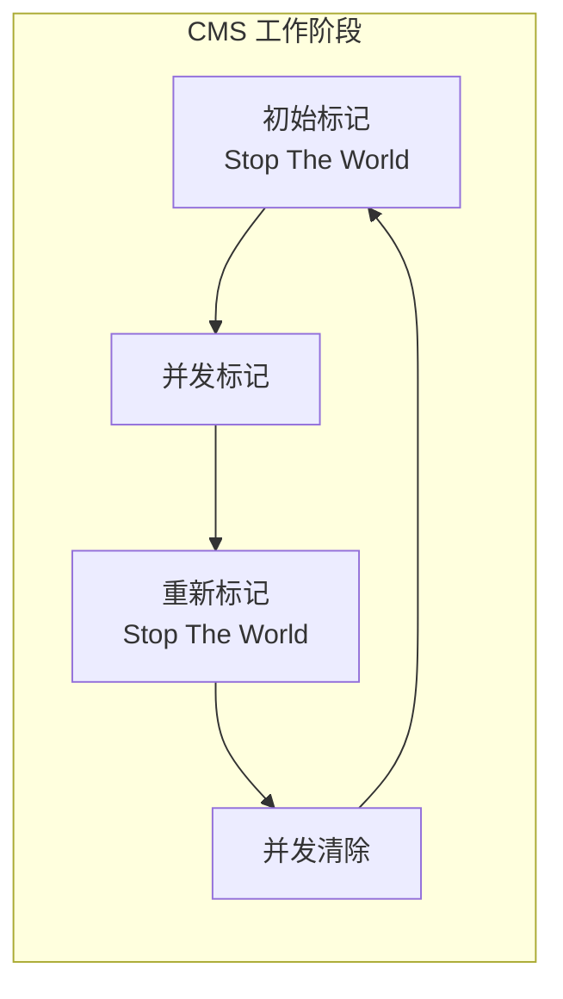
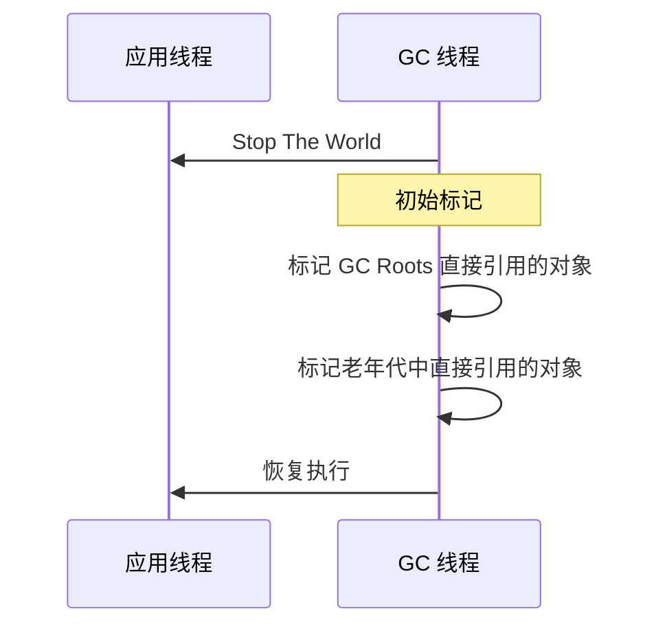
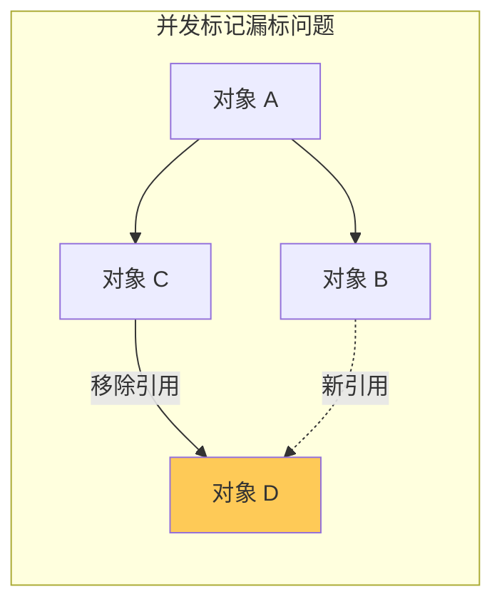
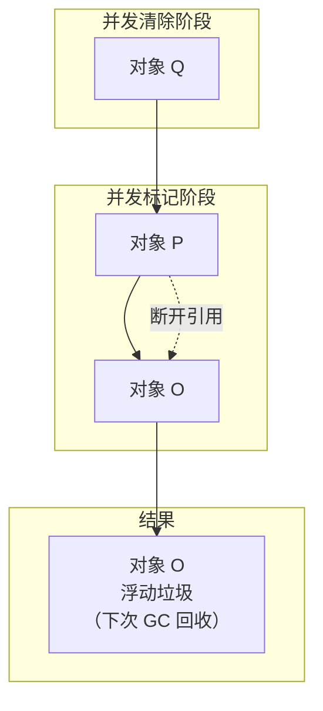
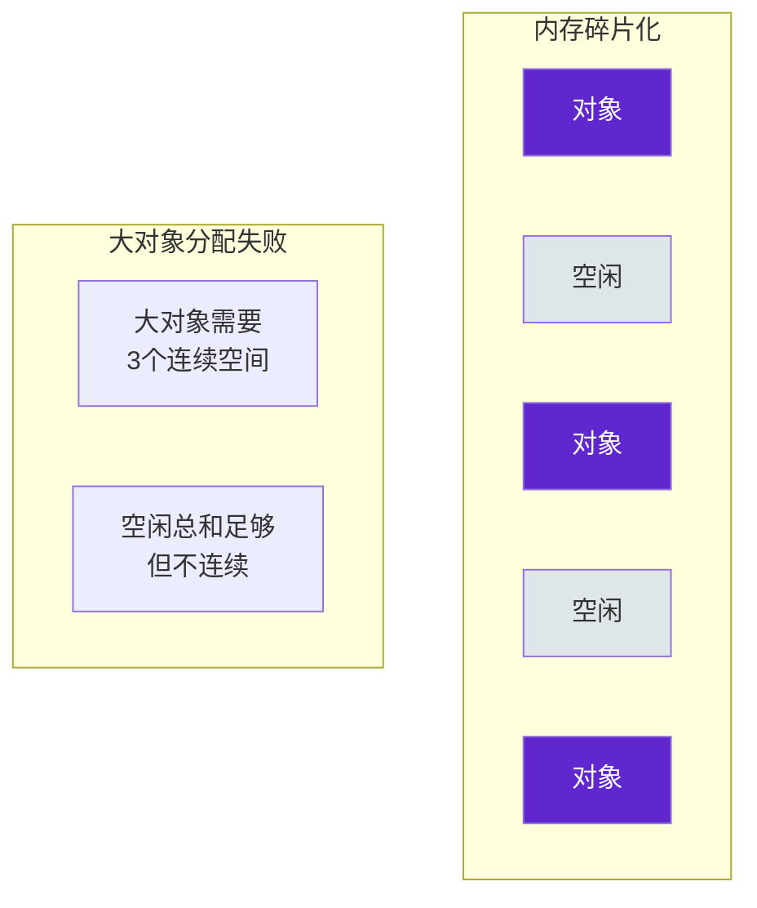

# CMS 收集器详解

CMS（Concurrent Mark Sweep）是第一个真正实现**并发标记**的收集器，它的出现标志着 GC 从「完全暂停」时代进入了「并发」时代。CMS 的目标是将停顿时间降到最短，特别适合对响应时间敏感的应用。

虽然 CMS 在 Java 14 中已被移除，但它的工作原理和设计思想对于理解现代收集器（如 G1、ZGC）仍然有重要价值。

## 收集器特点

CMS 的核心目标是**低停顿时间**，通过并发标记让大部分工作与应用线程同时执行：

- **并发标记**：标记阶段与应用线程并发执行
- **老年代收集器**：新生代使用 ParNew
- **标记-清除算法**：不进行整理，避免长停顿
- **浮动垃圾**：并发阶段产生的垃圾只能下次回收



## 工作阶段详解

### 阶段一：初始标记（Initial Mark）

初始标记需要 Stop The World，标记 GC Roots 直接引用的对象。这个阶段很快，但需要暂停应用线程。



### 阶段二：并发标记（Concurrent Mark）

并发标记与应用线程同时执行。从初始标记阶段标记的对象出发，遍历整个对象图，标记所有存活对象。

这是 CMS 最耗时的阶段，但它与应用并发执行，对应用的影响较小。

```java
// 并发标记的简化实现
public class ConcurrentMark {
    public void mark() {
        // 从初始标记的对象开始
        for (Object obj : initiallyMarked) {
            // 使用三色标记法遍历
            markGraph(obj);
        }
    }
    
    // 三色标记：
    // 白色：未访问
    // 灰色：已访问，但子节点未访问
    // 黑色：已访问，子节点也访问完成
    private void markGraph(Object obj) {
        if (obj.isWhite()) {
            obj.setGray();
            for (Object ref : obj.getReferences()) {
                markGraph(ref);
            }
            obj.setBlack();
        }
    }
}
```

### 阶段三：重新标记（Remark）

重新标记需要 Stop The World，修正并发标记阶段因应用运行导致的标记变化。

并发标记阶段的问题：**浮动垃圾**和**漏标**。



CMS 使用两种解决方案：

1. **增量更新（Incremental Update）**：记录新增的引用，下次重新标记时处理
2. **原始快照（SATB，Snapshot-At-The-Beginning）**：记录并发标记开始时的对象图快照

### 阶段四：并发清除（Concurrent Sweep）

并发清除与应用线程同时执行，清理未被标记的死亡对象。

## 浮动垃圾

并发标记阶段会产生新的垃圾，这些垃圾称为**浮动垃圾**。浮动垃圾在本次 GC 中不会被回收，只能留到下次 GC。



## 内存碎片化问题

CMS 使用标记-清除算法，不进行整理。长期运行后会产生大量内存碎片。当需要分配大对象而找不到足够连续空间时，会触发一次 **Full GC**——这次 Full GC 使用 Serial Old，是单线程的，停顿时间可能很长。



## 配置参数

| 参数 | 说明 | 示例 |
| --- | --- | --- |
| `-XX:+UseConcMarkSweepGC` | 启用 CMS 收集器 | - |
| `-XX:ParallelGCThreads` | 并行 GC 线程数 | `-XX:ParallelGCThreads=4` |
| `-XX:CMSInitiatingOccupancyFraction` | 触发 CMS 的老年代占用率 | `-XX:CMSInitiatingOccupancyFraction=70` |
| `-XX:+UseCMSCompactAtFullCollection` | Full GC 时进行整理 | 默认开启 |
| `-XX:CMSFullGCsBeforeCompaction` | 多少次 Full GC 后整理 | `-XX:CMSFullGCsBeforeCompaction=5` |

## 适用场景

CMS 适合以下场景：

1. **对延迟敏感的应用**：电商、交易、游戏服务器
2. **内存不太大**：通常 `2GB~8GB`，碎片化问题在更大堆内存下更严重
3. **需要低停顿**：响应时间 P99 `<500ms`

```bash
# CMS 配置示例
java -Xms4g -Xmx4g \
    -XX:+UseParNewGC \
    -XX:+UseConcMarkSweepGC \
    -XX:CMSInitiatingOccupancyFraction=70 \
    -XX:+UseCMSCompactAtFullCollection \
    -XX:CMSFullGCsBeforeCompaction=5 \
    -jar application.jar
```

## 已知问题

CMS 在 Java 14 中被移除，主要原因：

1. **碎片化问题**：标记-清除导致内存碎片，Full GC 时间不可控
2. **并发模式失败**：如果老年代空间不足以容纳浮动垃圾，会退化为 Serial Old
3. **CPU 敏感**：并发阶段占用 CPU 资源，可能影响应用吞吐量
4. **难以调优**：参数复杂，调优不当容易出问题

G1 收集器是 CMS 的替代方案，它在保持低停顿的同时解决了碎片化问题。
