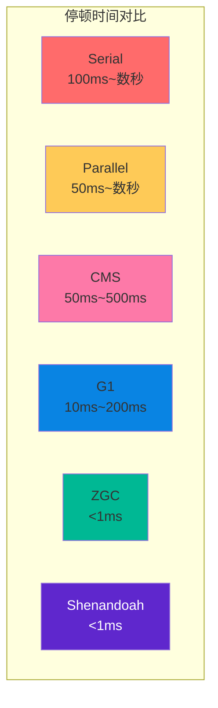
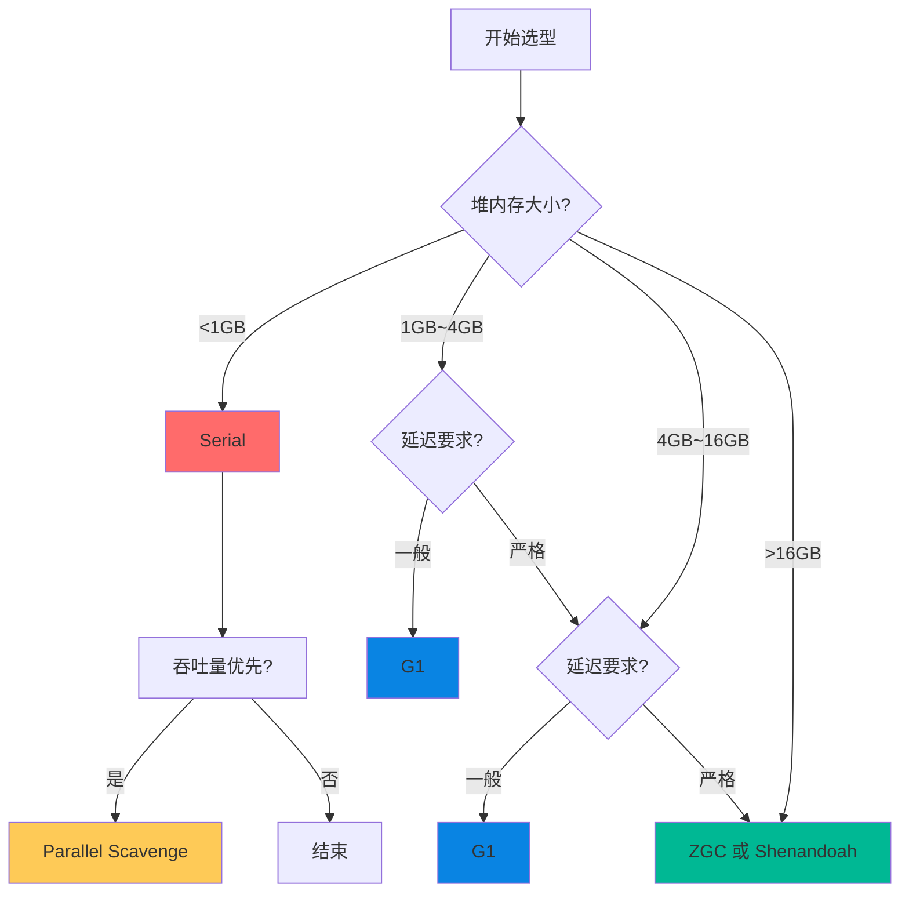

# GC 对比矩阵（G1/ZGC/Shenandoah）

JVM 提供了多种 GC 选择，每种都有其特点和适用场景。理解它们的差异，是做出正确选型决策的基础。

本文将对主流 GC 进行全面对比，帮助你在不同场景下做出最佳选择。

## 收集器全景对比

| 特性 | Serial | Parallel Scavenge | CMS | G1 | ZGC | Shenandoah |
| --- | --- | --- | --- | --- | --- | --- |
| 线程模型 | 单线程 | 多线程并行 | 并发标记 | 并发+增量整理 | 并发 | 并发 |
| 停顿时间 | 长 | 较长 | 短 | 可控 | 亚毫秒 | 亚毫秒 |
| 停顿与堆关系 | 线性增长 | 线性增长 | 线性增长 | 有关 | 无关 | 无关 |
| 吞吐量 | 低 | 高 | 中 | 中高 | 高 | 高 |
| 内存占用 | 低 | 低 | 中 | 中高 | 中 | 中 |
| 最大堆支持 | - | - | `~4GB` | `~100GB` | `>16TB` | `>100GB` |
| 内存碎片 | 无 | 无 | 有 | 可控 | 无 | 无 |
| 指针压缩 | 支持 | 支持 | 支持 | 支持 | 不支持 | 不支持 |
| 堆内存回收 | 全堆 | 全堆 | 全堆 | 分区 | 分区 | 分区 |
| Java 版本 | 1.0 | 1.4 | 1.4（已移除） | 9（默认） | 15（生产） | 15（正式） |

## 停顿时间对比



## 吞吐量对比

| 收集器 | 吞吐量 | 说明 |
| --- | --- | --- |
| Serial | 最低 | 单线程，无并行开销 |
| Parallel Scavenge | 最高 | 吞吐量优先设计 |
| CMS | 中等 | 并发标记，但有额外开销 |
| G1 | 中高 | 平衡停顿时间和吞吐量 |
| ZGC | 高 | 并发开销约 5%~15% |
| Shenandoah | 高 | 读/写屏障开销约 5%~15% |

## 选型建议

### 场景一：小内存、低要求

适用配置：

```bash
# Serial 配置
java -Xms256m -Xmx256m \
    -XX:+UseSerialGC \
    -jar application.jar
```

适用场景：

- 堆内存 `<1GB`
- 单核 CPU
- 客户端应用
- 低延迟要求不高

### 场景二：批处理、吞吐量优先

适用配置：

```bash
# Parallel 配置
java -Xms4g -Xmx4g \
    -XX:+UseParallelGC \
    -XX:+UseAdaptiveSizePolicy \
    -XX:GCTimeRatio=19 \
    -jar batch-processor.jar
```

适用场景：

- 后台批处理任务
- ETL 作业
- 科学计算
- 日志处理

### 场景三：中等内存、平衡需求

适用配置：

```bash
# G1 配置
java -Xms8g -Xmx8g \
    -XX:+UseG1GC \
    -XX:MaxGCPauseMillis=200 \
    -XX:InitiatingHeapOccupancyPercent=45 \
    -jar application.jar
```

适用场景：

- 堆内存 `4GB~16GB`
- 需要平衡停顿时间和吞吐量
- Web 服务、API 服务
- Java 9+ 默认选择

### 场景四：超大内存、极低延迟

适用配置：

```bash
# ZGC 配置
java -XX:+UseZGC \
    -Xms64g -Xmx64g \
    -XX:ConcGCThreads=8 \
    -jar application.jar

# 或 Shenandoah 配置
java -XX:+UseShenandoahGC \
    -Xms64g -Xmx64g \
    -XX:ShenandoahGCHeuristics=adaptive \
    -jar application.jar
```

适用场景：

- 堆内存 `>16GB`
- 极致低延迟要求（金融、游戏）
- 高可用服务
- 不能接受长停顿的关键系统

## 决策树



## 迁移指南

### 从 CMS 迁移

CMS 在 Java 14 中已被移除，迁移选项：

1. **迁移到 G1**（推荐）

```bash
java -Xms4g -Xmx4g \
    -XX:+UseG1GC \
    -XX:MaxGCPauseMillis=200 \
    -jar application.jar
```

2. **迁移到 ZGC**

```bash
java -XX:+UseZGC \
    -Xms8g -Xmx8g \
    -jar application.jar
```

### 从 Serial/Parallel 迁移

如果应用需要更低的延迟：

```bash
# 从 Parallel 迁移到 G1
java -Xms4g -Xmx4g \
    -XX:+UseG1GC \
    -XX:MaxGCPauseMillis=200 \
    -jar application.jar
```

### 从 G1 迁移到 ZGC

如果堆内存超过 16GB 且需要更低的延迟：

```bash
java -XX:+UseZGC \
    -Xms64g -Xmx64g \
    -XX:ConcGCThreads=8 \
    -jar application.jar
```

## 未来展望

GC 技术仍在持续演进：

1. **Generational ZGC**：ZGC 的分代版本，进一步提升性能
2. **Leyden**：OpenJDK 的静态编译项目，旨在缩短启动时间
3. **虚拟线程**：Loom 项目的一部分，可能改变内存分配模式

持续关注这些发展，可以帮助你在未来做出更好的技术决策。
