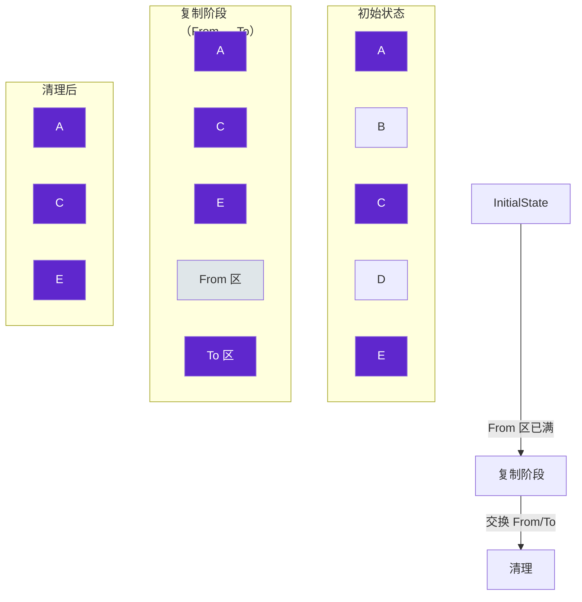
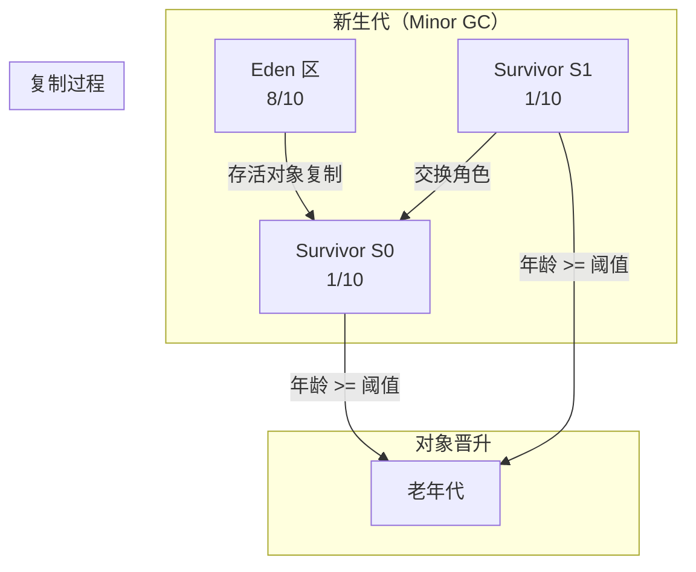

# GC 算法：复制算法（Copying）

复制算法是针对标记-清除算法空间碎片化问题的第一个解决方案。它的核心思想很简单：将可用内存划分为大小相等的两块，每次只使用其中一块。当这块内存用完时，就将存活的对象复制到另一块上，然后再把已使用过的内存空间一次清理掉。

复制算法解决了碎片化问题，实现简单、运行高效，但代价是可用内存缩小为原来的一半。

## 算法原理



复制算法的工作流程：

1. 将内存划分为 **From** 和 **To** 两块等大小的空间
2. 只使用 **From** 区进行对象分配
3. 当 **From** 区满时，触发 GC
4. 将 **From** 区中存活的对象**复制**到 **To** 区
5. 清理 **From** 区（整个区域一次性清理）
6. 交换 **From** 和 **To** 的角色

## 复制操作的实现

```java
public class CopyingGC {
    private static final int HEAP_SIZE = 1024 * 1024;
    private Object[] fromSpace;
    private Object[] toSpace;
    private int fromTop;
    private int toTop;
    
    public void copy() {
        // 遍历 From 区的所有对象
        for (int i = 0; i < fromTop; i++) {
            Object obj = fromSpace[i];
            if (obj != null && isReachable(obj)) {
                // 复制到 To 区
                toSpace[toTop++] = obj;
            }
            // 死亡对象不复制，自然被清理
        }
        // 交换 From 和 To
        Object[] temp = fromSpace;
        fromSpace = toSpace;
        toSpace = temp;
        fromTop = toTop;
        toTop = 0;
    }
    
    public Object allocate(int size) {
        if (fromTop + size > HEAP_SIZE) {
            copy();  // 触发 GC
        }
        Object obj = fromSpace[fromTop];
        fromTop += size;
        return obj;
    }
}
```

## 新生代的应用

Java 堆的新生代采用复制算法，但做了优化：不是 1:1 划分，而是 `Eden : Survivor = 8 : 1`。



HotSpot VM 的复制算法实现：

```java
// 新生代复制算法的简化实现
public class MinorGC {
    public void collect() {
        // 1. 标记 Eden 区和 From Survivor 区中存活的对象
        markLivingObjects();
        
        // 2. 如果 Survivor 区空间足够
        if (fromSurvivor.canHold(survivingObjects)) {
            // 复制到 To Survivor 区
            copyTo(fromSurvivor, survivingObjects);
            // 交换 From 和 To Survivor
            swapSurvivorSpaces();
        } else {
            // 3. Survivor 区空间不足，对象晋升到老年代
            promoteToOld(survivingObjects);
        }
        
        // 4. 清理 Eden 和 From Survivor
        clearSpace(fromSurvivor);
    }
}
```

## 复制算法的优点

1. **无空间碎片**：存活对象被紧密复制到 To 区，对象分配只需要移动指针
2. **分配效率高**：使用「指针碰撞」（bump-the-pointer）方式分配，速度快
3. **实现简单**：不需要维护复杂的空闲链表

## 复制算法的缺点

1. **空间浪费**：可用内存缩小为原来的一半
2. **移动成本**：所有存活对象都需要复制，如果存活率较高，复制成本较大
3. **不适合老年代**：老年代对象存活率高，复制代价太大

## 空间利用率优化

为解决空间浪费问题，JVM 采用「 Eden + 两个 Survivor」的设计：

- `Eden : Survivor = 8 : 1`，意味着每次 Minor GC 后，新生代可用空间约为 90%
- 只有 10% 的空间被「浪费」在 Survivor 区

```java
// Survivor 区空间计算
// 新生代大小 = X
// Eden = 8/10 * X
// S0 = 1/10 * X
// S1 = 1/10 * X
// 每次 Minor GC 后，To Survivor 空间 = 1/10 * X
// 浪费空间 = 1/10 * X（From Survivor 区）
// 空间利用率 = 9/10 = 90%
```

## 适用场景

复制算法最适合**对象存活率低**的场景，这与分代收集理论中的「弱分代假说」吻合：大多数对象朝生夕灭，只有少数对象能熬过多次 GC。

新生代的 Minor GC 采用复制算法是完美的选择：新生代对象存活率低，复制成本小，空间利用率可以通过 Survivor 区优化到 90%。

对于老年代，对象存活率高，复制代价太大，需要使用标记-整理算法。
