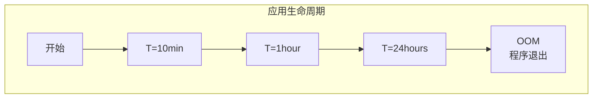

# Epsilon GC（无操作 GC）

Epsilon 是 Java 11 引入的「无操作」GC。它的设计哲学是：**对于某些场景，根本不需要 GC**。

Epsilon 只分配内存，不回收内存。当内存耗尽时，程序直接退出（而不是尝试回收）。这种看似「极端」的设计，其实有独特的价值。

## 设计理念

Epsilon 的核心理念是：

> 如果应用的内存足够大，或者生命周期足够短，GC 的开销可能是不必要的。


## 工作原理

Epsilon 的实现非常简单：

1. **分配内存**：从堆中分配对象
2. **不回收内存**：没有任何垃圾回收逻辑
3. **内存耗尽时**：触发 OutOfMemoryError，程序退出

```java
// Epsilon 的核心逻辑
public class EpsilonGC {
    public Object allocate(long size) {
        if (heapFree < size) {
            // 内存不足，程序退出
            throw new OutOfMemoryError("Epsilon: heap exhausted");
        }
        return heap.allocate(size);
    }
}
```

## 适用场景

### 短生命周期应用

对于执行时间很短的应用，Minor GC 可能还没来得及发生，应用就结束了：

```java
// 命令行工具
public class DataProcessor {
    public static void main(String[] args) {
        // 处理数据，可能只需要几十毫秒
        // 在这么短的时间内，可能不会触发 GC
        process(args);
    }
}
```

### 内存足够的容器

如果容器内存足够大，应用的内存分配永远不会被耗尽：

```yaml
# Kubernetes 配置
resources:
  limits:
    memory: 32Gi  # 非常大的内存限制
```

### 性能基准测试

Epsilon 最适合用于**排除 GC 干扰的性能测试**：

```bash
# 对比测试：有无 GC 的性能差异
# 1. 使用 Epsilon（无 GC）
java -XX:+UseEpsilonGC -Xms8g -Xmx8g -jar benchmark.jar

# 2. 使用 G1（有 GC）
java -XX:+UseG1GC -Xms8g -Xmx8g -jar benchmark.jar

# 对比结果：
# - 如果两者性能接近，说明 GC 不是瓶颈
# - 如果 Epsilon 性能明显更好，说明 GC 是瓶颈
```

### 内存敏感测试

测试应用的内存分配模式：

```java
public class MemoryTest {
    public static void main(String[] args) {
        // 使用 Epsilon 观察内存分配
        // 如果 OutOfMemoryError 很快发生，说明存在内存泄漏
        List<byte[]> leak = new ArrayList<>();
        while (true) {
            leak.add(new byte[1024 * 1024]);  // 1MB
        }
    }
}
```

## 注意事项

### 内存泄漏会立即暴露

由于 Epsilon 不回收内存，任何内存泄漏都会立即导致 OOM：

```java
// 这个代码在普通 JVM 上可能运行很久
// 在 Epsilon 上会立即 OOM
public class MemoryLeak {
    private static final List<byte[]> LEAK = new ArrayList<>();
    
    public static void main(String[] args) {
        while (true) {
            LEAK.add(new byte[1024 * 1024]);
        }
    }
}
```

### 不适合长生命周期应用

如果应用的运行时间足够长，最终一定会耗尽内存：



## 配置参数

### 启用 Epsilon

```bash
# Java 11+ 启用 Epsilon
java -XX:+UseEpsilonGC -Xms2g -Xmx2g -jar application.jar
```

### 常用参数

| 参数 | 说明 |
| --- | --- |
| `-Xms` | 堆初始大小 |
| `-Xmx` | 堆最大大小（Epsilon 会使用到最大值） |
| `-XX:+UseEpsilonGC` | 启用 Epsilon |

## 与其他 GC 的对比

| 特性 | Epsilon | Serial | G1 | ZGC |
| --- | --- | --- | --- | --- |
| GC 行为 | 无 | 串行 | 并发 | 并发 |
| 停顿时间 | 无 | 长 | 可控 | 亚毫秒 |
| 吞吐量 | 最高 | 低 | 中高 | 高 |
| 内存泄漏 | 立即 OOM | 延迟暴露 | 延迟暴露 | 延迟暴露 |
| 适用场景 | 短生命周期 | 低要求 | 平衡 | 低延迟 |

## 测试工具价值

Epsilon 是测试和诊断的有力工具：

1. **测量 GC 开销**：对比 Epsilon 和其他 GC 的性能差异
2. **发现内存泄漏**：快速暴露内存泄漏
3. **验证内存分配**：观察应用的真实内存需求
4. **微基准测试**：排除 GC 干扰的精确测量

```bash
# 微基准测试示例
public class NanoBenchmark {
    public static void main(String[] args) {
        // Warmup（使用 G1）
        runBenchmark();  
        
        // 正式测试（使用 Epsilon）
        // java -XX:+UseEpsilonGC -Xms8g -Xmx8g -jar nano.jar
    }
}
```

## 真实案例

### Netflix 的使用

Netflix 在某些性能测试中使用 Epsilon 来测量 GC 对其应用的影响。通过对比，他们发现某些高吞吐量场景下，GC 占用的时间可以忽略不计。

### 低延迟交易系统

某些高频交易系统在预热阶段使用 Epsilon 来测量真实的内存分配速率，为后续的 GC 调优提供数据支持。
