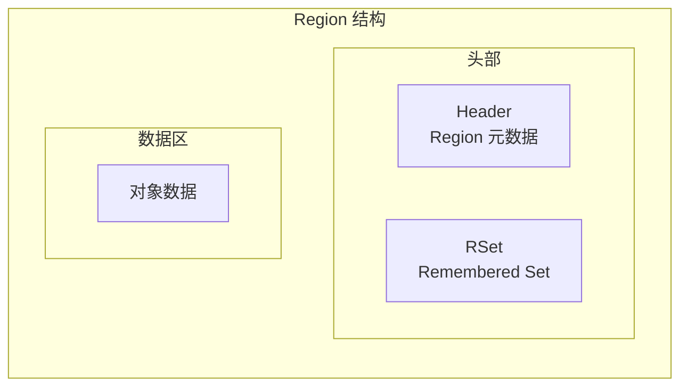
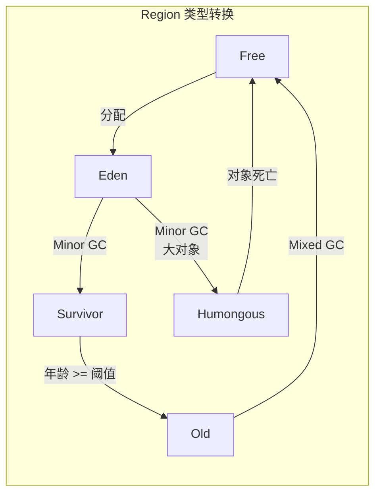
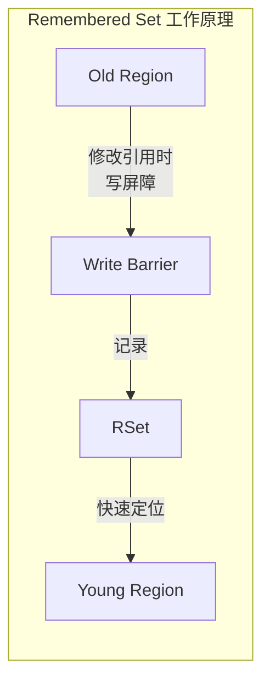
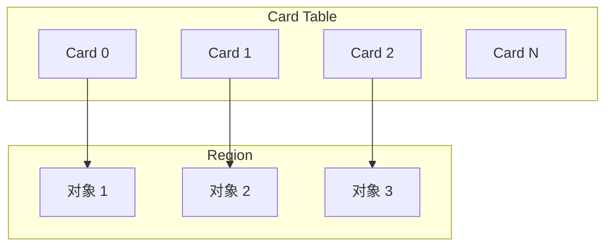

# G1 核心：Region 与 Remembered Set

G1 的核心创新是将堆划分为大小相等的 Region，每个 Region 可以独立作为 Eden、Survivor 或老年代。而 Remembered Set 是 G1 能够高效追踪跨 Region 引用的关键数据结构。

理解 Region 和 Remembered Set，是深入理解 G1 工作原理的基础。

## Region 详解

### Region 大小

G1 的 Region 大小必须是 2 的幂次，默认值根据堆大小自动计算（目标 2048 个 Region）：

| 堆大小 | 默认 Region 大小 |
| --- | --- |
| `<4GB` | 1MB |
| `4GB~8GB` | 2MB |
| `8GB~16GB` | 4MB |
| `16GB~32GB` | 8MB |
| `>32GB` | 16MB 或 32MB |

### Region 结构

每个 Region 包含以下部分：



### Region 类型转换

Region 不是固定类型的，它会根据 GC 过程动态变化：



## Remembered Set 详解

### 为什么需要 RSet

在传统的分代收集中，GC 只需要扫描当前代的对象来追踪引用。但在 G1 中，由于 Region 可以跨代引用，必须有一种机制来高效追踪这些引用。

```java
// G1 中跨 Region 引用示例
public class CrossRegionReference {
    public void example() {
        // oldRegion 的对象持有新生代对象的引用
        OldRegionObject oldObj = new OldRegionObject();
        // oldObj.youngRef 指向 Young Region 中的对象
        oldObj.youngRef = new YoungRegionObject();
    }
}
```

如果没有 RSet，每次 Minor GC 都需要扫描整个堆来找到跨 Region 引用，这是不可接受的。RSet 提供了高效的解决方案。

### RSet 的工作原理

每个 Region 都有一个 RSet，记录了「其他 Region 引用了本 Region 中哪些对象」：



### 写屏障（Write Barrier）

G1 通过写屏障（Write Barrier）在引用赋值时记录跨 Region 引用：

```java
// 写屏障的简化实现
public class G1WriteBarrier {
    public void preWriteBarrier(Object field, Object newValue) {
        // 如果新值引用的对象在不同 Region
        if (newValue != null && !sameRegion(field, newValue)) {
            // 记录这个跨 Region 引用
            Region current = getRegion(field);
            Region target = getRegion(newValue);
            
            // 将目标 Region 的卡片标记为脏
            target.getCardTable()[cardIndex] = DIRTY;
        }
    }
}
```

### Card Table

G1 使用 Card Table 来追踪 Region 内的修改：



### RSet 的存储结构

RSet 的存储采用多种策略来平衡空间和时间：

| 存储方式 | 说明 | 适用场景 |
| --- | --- | --- |
| 稀疏 RSet | 使用哈希表存储具体引用 | 引用较少时 |
| 粗粒度 RSet | 使用位图记录 Region | 引用较多时 |
| 细粒度 RSet | 使用卡片索引 | 中等引用量 |

```java
// RSet 存储结构（简化）
public class RSet {
    // 稀疏 RSet：使用哈希表
    private HashMap<Region, List<Integer>> sparseRSet;
    
    // 粗粒度 RSet：使用位图
    private BitSet coarseRSet;
    
    // 细粒度 RSet：使用卡片数组
    private byte[] fineRSet;
    
    // 添加引用
    public void addReference(Region from, int cardIndex) {
        // 根据引用数量选择存储方式
        if (referenceCount < THRESHOLD_SPARSE) {
            sparseRSet.put(from, cardIndex);
        } else if (referenceCount < THRESHOLD_FINE) {
            // 转换为细粒度
            convertToFineRSet();
        }
    }
}
```

## Young GC 与 Remembered Set

### Minor GC 时的 RSet 扫描

Minor GC 时，G1 只需要扫描 GC Roots 和 RSet 中记录的引用：

```java
// Minor GC 的引用扫描逻辑
public class G1YoungGC {
    public void scanReferences() {
        // 1. 扫描 GC Roots
        scanGCRoots();
        
        // 2. 扫描 Young Region 的 RSet
        // Young Region 被 Old Region 引用的情况
        for (Region youngRegion : youngRegions) {
            RSet rset = youngRegion.getRSet();
            
            // RSet 中记录了所有指向本 Region 的 Old Region
            for (Region oldRegion : rset.getReferencingRegions()) {
                // 扫描这个 Old Region 中被修改的卡片
                for (int cardIndex : rset.getDirtyCards(oldRegion)) {
                    scanCard(oldRegion, cardIndex);
                }
            }
        }
    }
}
```

### 扫描优化

RSet 大幅减少了扫描范围。假设没有 RSet，Minor GC 需要扫描整个老年代；有 RSet 后，只需要扫描被记录的跨 Region 引用：

| 优化前 | 优化后 |
| --- | --- |
| 扫描整个老年代 | 只扫描 RSet 记录的 Region |
| O(N) 复杂度 | O(R) 复杂度（R = 实际引用数） |

## 内存开销

RSet 的内存开销是 G1 的主要代价之一。RSet 的大小与堆大小、Region 大小、跨 Region 引用数量相关：

| 堆大小 | Region 大小 | RSet 开销（估算） |
| --- | --- | --- |
| 4GB | 1MB | ~3% |
| 8GB | 2MB | ~2.5% |
| 16GB | 4MB | ~2% |

RSet 开销可以通过以下参数调整：

```bash
# 调整 G1 Region 参数
java -XX:G1HeapRegionSize=8m \    # 更大的 Region，减少 RSet 数量
    -XX:G1RSetUpdatingPauseTimePercent=5 \  # RSet 更新开销占比
    -XX:+UseG1GC
```

## RSet 与并发

RSet 的更新是 G1 写屏障的主要开销。为减少写屏障对性能的影响，G1 采用了多种优化：

1. **异步更新**：RSet 更新不立即同步到主数据结构
2. **批量处理**：收集多个更新后批量处理
3. **并发处理**：使用专门的线程处理 RSet 更新
