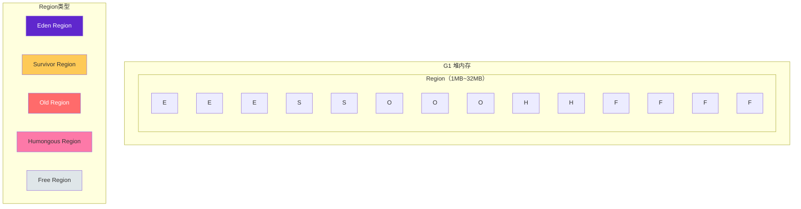
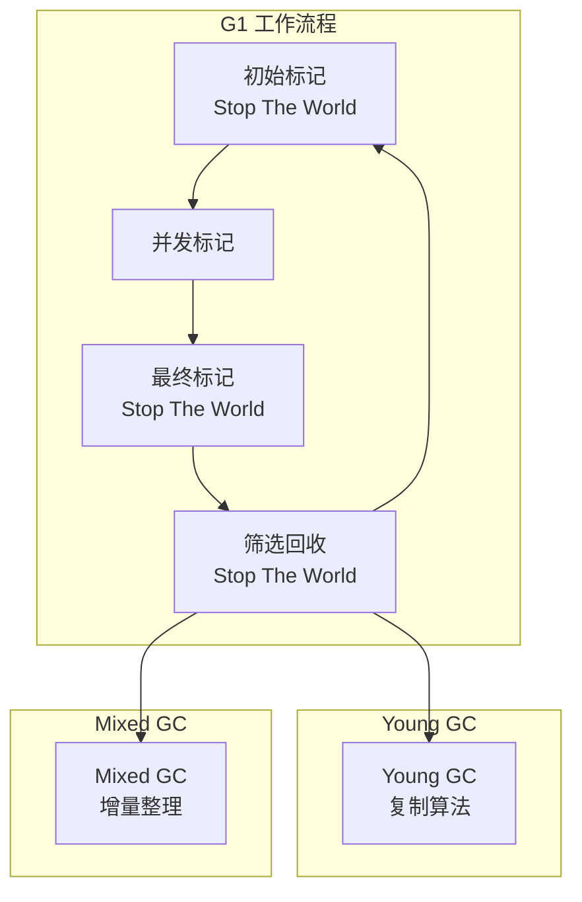
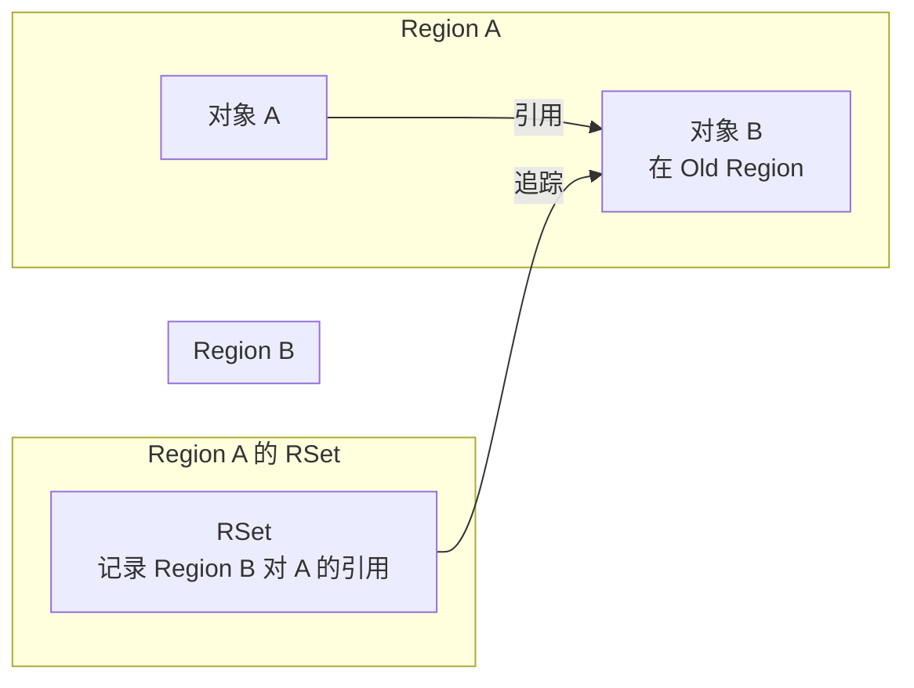

# G1 收集器深度解析

G1（Garbage First）收集器是 Java 7 引入、Java 9 成为默认收集器的现代 GC。它解决了 CMS 的碎片化问题，同时支持用户设定停顿时间目标。

G1 的设计理念是：**在用户设定的停顿时间目标内，尽可能多地回收垃圾**。这与传统收集器「尽可能快地完成 GC」的目标有本质区别。

## G1 的核心创新

G1 的核心创新是将堆划分为大小相等的 **Region**，每个 Region 可以独立作为 Eden、Survivor 或老年代：



## Region 设计

### Region 大小

G1 的 Region 大小可以是 1MB、2MB、4MB、8MB、16MB 或 32MB，由 `-XX:G1HeapRegionSize` 参数指定（必须是 2 的幂次）。

```bash
# 设置 Region 大小为 4MB
java -XX:G1HeapRegionSize=4m -XX:+UseG1GC -jar application.jar
```

### Region 类型

| 类型 | 说明 | 特点 |
| --- | --- | --- |
| Free | 空闲 Region | 可用于分配 |
| Eden | Eden Region | 新对象分配 |
| Survivor | Survivor Region | 容纳 Minor GC 后存活的对象 |
| Old | Old Region | 长生命周期对象 |
| Humongous | Humongous Region | 大对象（超过 Region 50%） |

### Humongous 对象

Humongous 对象是超过 Region 50% 大小的对象。G1 为这类对象分配专门的 Humongous Region。

```java
// G1 的 Humongous 对象判定
public class HumongousObject {
    public boolean isHumongous(long objectSize, int regionSize) {
        // 对象大小超过 Region 大小的 50%
        return objectSize > regionSize / 2;
    }
}
```

Humongous 对象的管理有特殊规则：

- 不会在年轻代和老年代之间移动
- 只在 Full GC 时回收（这可能导致问题）
- 可能导致 Humongous 区域碎片化

## G1 工作流程

G1 的工作流程分为以下阶段：



### 初始标记（Initial Mark）

初始标记需要 Stop The World，标记 GC Roots 直接引用的对象。在 G1 中，初始标记与 Minor GC 一起执行。

### 并发标记（Concurrent Mark）

并发标记与应用程序并发执行，遍历对象图，标记存活对象。

### 最终标记（Final Mark）

最终标记需要 Stop The World，处理并发标记阶段产生的变化（如新创建的对象、新增的引用）。

### 筛选回收（Evacuation）

筛选回收需要 Stop The World。G1 根据用户设定的停顿时间目标，选择垃圾最多的 Region 进行回收。

## Remembered Set

G1 通过 Remembered Set（RSet）来追踪跨 Region 的引用：



### RSet 的作用

每个 Region 都有一个 RSet，记录了其他 Region 对本 Region 对象的引用。在 GC 时，只需要扫描 RSet 就能找到跨 Region 引用，不需要扫描整个堆。

### RSet 实现

RSet 有两种实现方式：

| 类型 | 说明 | 适用场景 |
| --- | --- | --- |
| Points-into | 记录指向本 Region 的引用来自哪个其他 Region | 引用较多时 |
| Points-out | 记录本 Region 引用了哪些其他 Region | 引用较少时 |

G1 的 RSet 实现是 Points-into，每个 Region 维护一个哈希表，键是其他 Region，值是这些 Region 中引用了本 Region 对象的卡片集合。

## 停顿时间可控

G1 最大的特点是**停顿时间可控**。通过 `-XX:MaxGCPauseMillis` 参数设定停顿时间目标，G1 会尽量在目标时间内完成 GC。

```bash
# 设置最大停顿时间为 200ms
java -XX:MaxGCPauseMillis=200 -XX:+UseG1GC -jar application.jar
```

G1 如何实现停顿时间可控？

1. **选择回收 Region**：优先选择垃圾最多的 Region
2. **增量回收**：每次只回收部分 Region
3. **动态调整**：根据历史数据调整回收策略

```java
// G1 的停顿时间控制逻辑（简化）
public class G1PauseTimeControl {
    public boolean shouldContinueEvacuation(long targetPauseTime) {
        // 检查已花费的时间
        long elapsed = System.currentTimeMillis() - startTime;
        
        // 如果接近目标时间，停止回收
        if (elapsed >= targetPauseTime * 0.9) {
            return false;
        }
        
        // 检查剩余可用时间
        long remaining = targetPauseTime - elapsed;
        if (remaining < estimatedTimePerRegion) {
            return false;
        }
        
        return true;
    }
}
```

## 适用场景

G1 适合以下场景：

1. **6GB 以上堆内存**：Region 设计在大内存下表现更好
2. **停顿时间目标 `<=500ms`**：G1 可以较好地满足这个目标
3. **平衡场景**：需要在吞吐量和停顿时间之间平衡
4. **需要替换 CMS**：CMS 的碎片化问题难以解决

```bash
# G1 推荐配置
java -Xms8g -Xmx8g \
    -XX:+UseG1GC \
    -XX:MaxGCPauseMillis=200 \
    -XX:G1HeapRegionSize=4m \
    -XX:InitiatingHeapOccupancyPercent=45 \
    -XX:G1NewSizePercent=5 \
    -XX:G1MaxNewSizePercent=60 \
    -jar application.jar
```
