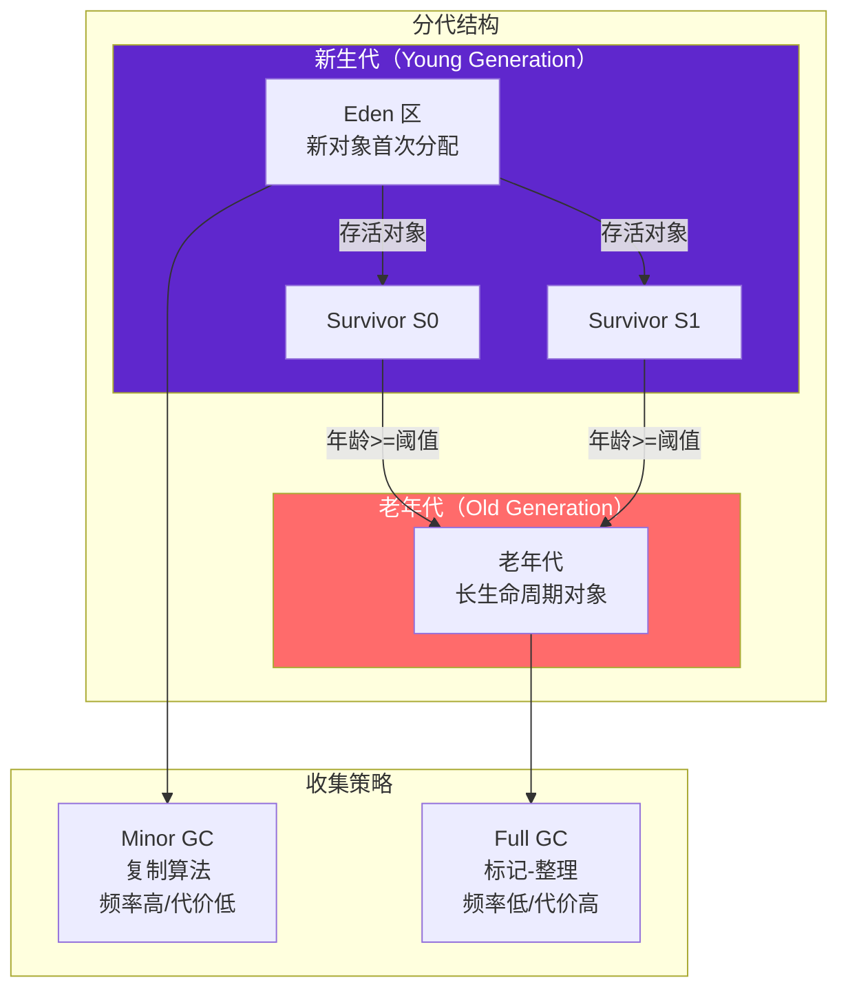
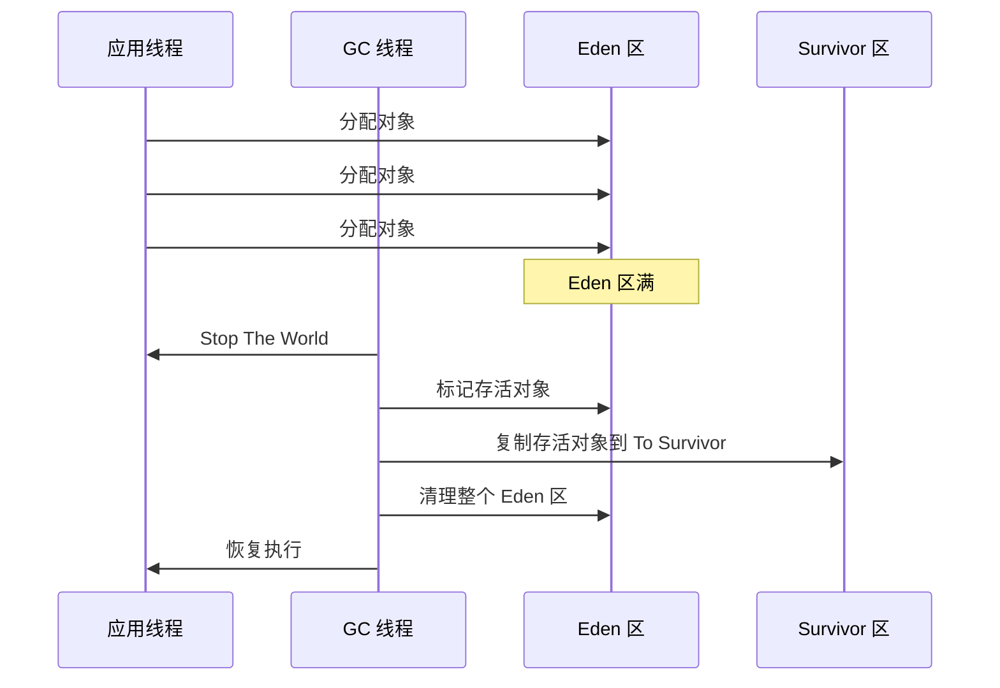

# 分代收集理论

分代收集并非某种具体的 GC 算法，而是一套经验法则和设计哲学。它的核心思想是：根据对象生命周期的不同特点，将内存划分为不同的区域，采用不同的收集策略。

分代收集理论是现代 JVM GC 的基石，几乎所有现代 GC 收集器都建立在分代理论基础之上。

## 两个核心假说

### 弱分代假说

> 大多数对象是朝生夕灭的。

大量研究表明，在典型的 Java 程序中，大多数对象在创建后很快就变得不可达。以 Web 应用为例：请求处理过程中创建的对象在请求结束后就不再被引用，这些对象的生命周期很短。

```java
public class RequestHandler {
    public void handle(Request request) {
        // 这些对象在方法结束后就不再存活
        User user = parseUser(request);
        Order order = buildOrder(user, request);
        Response response = processOrder(order);
        return response;
    }
}
```

弱分代假说意味着：如果只对「年轻」对象进行频繁的回收，可以回收大部分垃圾，而不需要扫描整个堆。

### 强分代假说

> 熬过多次 GC 的对象很少会死亡。

这个假说与弱分代假说是互补的。Minor GC 后仍然存活的对象，往往具有更长的生命周期。以缓存为例：那些被频繁访问的热点数据，在系统中长期存在。

```java
public class CacheManager {
    // 这个静态集合中的对象可能存活整个应用生命周期
    private static final Map<String, Object> CACHE = new ConcurrentHashMap<>();
}
```

强分代假说意味着：对于「老」对象，不需要频繁回收，但一旦需要回收，需要采用不同的策略（标记-整理而不是复制）。

## 分代收集设计

基于这两个假说，JVM 将堆内存划分为新生代和老年代：



### 新生代设计

- **对象优先在 Eden 区分配**
- **Minor GC**：回收新生代，使用复制算法
- **晋升机制**：Survivor 区中年龄达到阈值的对象晋升到老年代

### 老年代设计

- **大对象直接进入老年代**：超过 `-XX:PretenureSizeThreshold` 的对象直接在老年代分配
- **Full GC**：回收老年代，使用标记-整理算法
- **空间分配担保**：Minor GC 前检查老年代是否有足够空间

## Minor GC 与 Full GC

### Minor GC

Minor GC 发生在新生代，当 Eden 区空间不足时触发。Minor GC 的特点：

- **频率高**：由于新生代空间小，对象分配频繁
- **回收快**：新生代对象存活率低，复制成本小
- **Stop The World**：Minor GC 需要停止应用线程，但时间短（通常几十毫秒）



### Full GC

Full GC 发生在老年代（也会回收新生代），当老年代空间不足时触发。Full GC 的特点：

- **频率低**：老年代空间大，触发条件更严格
- **时间长**：老年代对象存活率高，需要标记-整理
- **影响大**：Full GC 的 Stop The World 时间可能很长

触发 Full GC 的条件：

1. 老年代空间不足
2. 调用 `System.gc()`
3. `Metaspace` 空间不足
4. Minor GC 后，Survivor 区无法容纳存活对象，且老年代空间也不够

## 动态年龄判断

JVM 不只是根据固定年龄来判断是否晋升，还会根据 Survivor 区的实际使用情况进行动态调整。

如果 Survivor 区中相同年龄的所有对象总大小超过 Survivor 区的 50%，则年龄大于等于该年龄的对象直接晋升到老年代。

```java
// 动态年龄判断逻辑
public class AdaptiveTenuring {
    public boolean shouldPromote(Object obj, int age) {
        // 固定晋升年龄判断
        if (age >= MaxTenuringThreshold) {
            return true;
        }
        
        // 动态年龄判断
        long totalAgeSize = calculateTotalSizeByAge(age);
        long survivorCapacity = SurvivorSpace.size() * SurvivorCapacityThreshold;
        
        if (totalAgeSize > survivorCapacity) {
            return true;  // 提前晋升
        }
        
        return false;
    }
}
```

## 分代收集的参数配置

| 参数 | 说明 | 默认值 |
| --- | --- | --- |
| `-Xmn` | 新生代大小 | - |
| `-XX:NewRatio` | 老年代与新生代比例 | 2（老年代:新生代 = 2:1） |
| `-XX:SurvivorRatio` | Eden 与 Survivor 比例 | 8（Eden:Survivor = 8:1） |
| `-XX:MaxTenuringThreshold` | 最大晋升年龄 | 15 |
| `-XX:TargetSurvivorRatio` | Survivor 区目标使用率 | 50% |

## 分代收集的优势

1. **针对性优化**：不同区域采用不同算法，新生代用复制（高效），老年代用整理（无碎片）
2. **减少扫描范围**：Minor GC 只需要扫描新生代，不需要扫描整个堆
3. **平衡频率与代价**：频繁回收低成本区域，稀疏回收高代价区域

分代收集不是万能的。对于某些场景（如大内存、低延迟要求），G1、ZGC 等现代收集器会采用不分代的全局策略，以更好地控制停顿时间。
