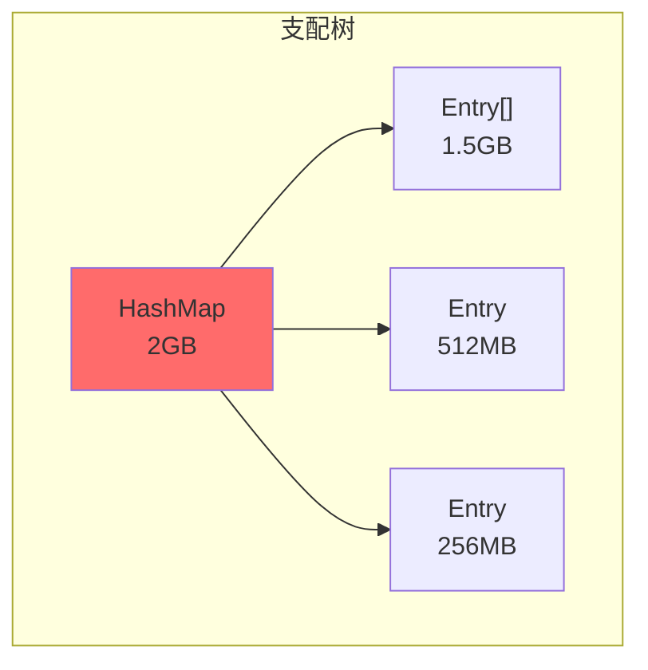

# 堆转储（Heap Dump）分析

堆转储（Heap Dump）是 JVM 堆内存中所有对象的快照。通过分析堆转储，可以找出内存占用最大的对象、定位内存泄漏的根源。

本文将详细介绍堆转储的获取方式和分析方法。

## 堆转储方式

### 方式一：jmap 命令

```bash
# 获取完整堆转储
jmap -dump:format=b,file=/tmp/heap.hprof <pid>

# 获取存活对象的堆转储（更小更快）
jmap -dump:live,format=b,file=/tmp/heap_live.hprof <pid>
```

### 方式二：JVM 参数

```bash
# OOM 时自动导出堆转储
java -Xms4g -Xmx4g \
    -XX:+UseG1GC \
    -XX:+HeapDumpOnOutOfMemoryError \
    -XX:HeapDumpPath=/var/log/myapp/ \
    -jar application.jar
```

### 方式三：jcmd 命令

```bash
# 使用 jcmd 获取堆转储
jcmd <pid> GC.heap_dump /tmp/heap.hprof

# 获取存活对象
jcmd <pid> GC.heap_dump /tmp/heap_live.hprof true
```

### 方式四：Arthas

```bash
# Arthas heapdump
heapdump                          # 完整堆转储
heapdump --live /tmp/heap.hprof  # 存活对象
```

## 堆转储文件分析

### 使用 MAT（Memory Analyzer Tool）

MAT 是 Eclipse 提供的专业堆转储分析工具：

```bash
# 下载 MAT
# https://www.eclipse.org/mat/downloads.php

# 启动 MAT
./MemoryAnalyzer /tmp/heap.hprof
```

### MAT 核心功能

#### 1. Leak Suspects 报告

MAT 自动分析可能的内存泄漏点：

```java
// MAT 生成的 Leak Suspects 报告示例
One instance of "java.util.HashMap" 
  loaded by "<system class loader>" 
  occupies 2,147,483,648 bytes (50.00%) 
  of java heap memory.
```

#### 2. Dominator Tree（支配树）

支配树显示对象之间的支配关系：



在支配树中，如果对象 A 支配对象 B，那么 A 被回收时 B 也必须被回收。

#### 3. Histogram（直方图）

直方图显示各类对象的数量和内存占用：

```java
// Histogram 示例
Class Name                              | Objects | Shallow Heap | Retained Heap
----------------------------------------|---------|--------------|----------------
java.lang.String                        | 123,456 |     24 B     |     2.5 GB
java.util.HashMap$Node                  |  98,765 |     32 B     |     1.8 GB
com.example.MyObject                    |  45,678 |     48 B     |     1.2 GB
```

### 关键指标

#### Shallow Heap

对象自身占用的内存，不包括引用的对象。

| 对象类型 | Shallow Heap |
| --- | --- |
| Object | 12 bytes（对象头） |
| int | 4 bytes |
| long | 8 bytes |
| 对象引用 | 4/8 bytes（32/64 位） |

#### Retained Heap

对象自身及其直接/间接引用的对象占用的总内存。

```java
// Retained Heap 示例
public class RetainedHeapExample {
    private byte[] data = new byte[1024];  // 1KB
    
    // Shallow Heap: 对象头 + 引用 = ~16 bytes
    // Retained Heap: 对象头 + data 引用 = ~1040 bytes
}
```

## 分析实战

### 步骤一：打开堆转储

```bash
# 使用 MAT 打开堆转储
./mat/MemoryAnalyzer /tmp/heap.hprof
```

### 步骤二：查看 Leak Suspects

```
# 选择 "Leak Suspects" 报告
# MAT 会列出可能的内存泄漏点
```

### 步骤三：查看 Histogram

```
# 选择 "Open Query Browser" -> "Java Basics" -> "Histogram"
# 可以按类名、包名过滤
# 找出对象数量或内存占用异常的类型
```

### 步骤四：查看 Dominator Tree

```
# 选择 "Open Query Browser" -> "Java Basics" -> "Dominator Tree"
# 找出 Retained Heap 最大的对象
# 点击对象查看其引用路径
```

### 步骤五：追踪 GC Roots

```
# 选择 "Path to GC Roots" -> "exclude weak/soft references"
# 显示对象到 GC Roots 的完整引用链
# 这是理解对象为何无法被回收的关键
```

## GC Roots 类型

堆转储中看到的 GC Roots 类型：

| GC Roots 类型 | 说明 |
| --- | --- |
| `Java Local` | 栈上的局部变量 |
| `Static Variable` | 静态变量 |
| `JNI Global` | JNI 全局引用 |
| `System Class` | 系统类加载器加载的类 |
| `Thread` | 活动线程 |
| `Busy Monitor` | 被 synchronized 持有的对象 |

## 低内存堆转储优化

当堆内存很大时，堆转储文件可能非常大（数十 GB）。可以使用以下优化：

### 1. 只转储存活对象

```bash
# 使用 live 参数只转储存活对象
jmap -dump:live,format=b,file=heap_live.hprof <pid>
```

### 2. 使用 HPROF 压缩格式

```bash
# HPROF 格式，支持压缩
jmap -dump:format=hprof,file=heap.hprof <pid>
```

### 3. 远程转储

```bash
# 通过 JMX 远程获取堆转储
jmap -J-Dcom.sun.management.jmxremote.port=9010 ...
```

### 4. 增量转储

对于超大型堆，可以使用 MAT 的增量分析功能。

## 常见问题分析

### 问题一：HashMap 占用大量内存

```java
// Histogram 中发现
Class Name               | Objects | Retained Heap
----------------------------------------|---------|----------------
java.util.HashMap$Node   | 10M      | 500MB (50%)
java.lang.String          | 8M       | 400MB (40%)

// Dominator Tree 发现
HashMap (default)         | 1        | 900MB (90%)
  HashMap$Node[]          |          | 800MB
    ... (10M entries)
```

解决：使用 WeakHashMap 或设置合理的缓存策略。

### 问题二：ClassLoader 泄漏

```java
// 发现大量自定义 ClassLoader
Class Name               | Objects | Retained Heap
----------------------------------------|---------|----------------
CustomClassLoader        | 1000    | 200MB (20%)
com.example.MyClass      | 50000   | 150MB (15%)

// Path to GC Roots 发现
CustomClassLoader@0x...  ->  // GC Root: CustomClassLoader 自身持有
  Map<Class, Object>      ->
    Class@0x...           ->
      MyClass@0x...       ->
        ClassLoader@0x...  // 形成循环引用
```

解决：确保 ClassLoader 不再使用时能被回收。

### 问题三：ThreadLocal 泄漏

```java
// Thread 对象占用大量内存
Class Name               | Objects | Retained Heap
----------------------------------------|---------|----------------
Thread                   | 500     | 250MB (25%)
ThreadLocal$ThreadLocalMap| 500    | 240MB (24%)

// ThreadLocal 中存储的大对象
ThreadLocalMap$Entry     | 50000   | 200MB (20%)
```

解决：在 finally 块中调用 ThreadLocal.remove()。
