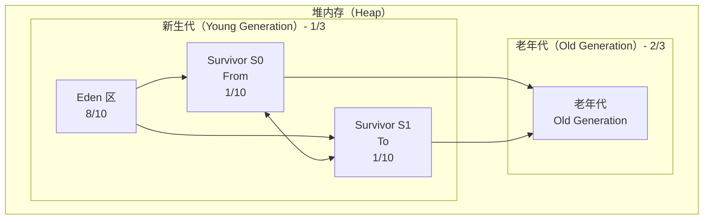
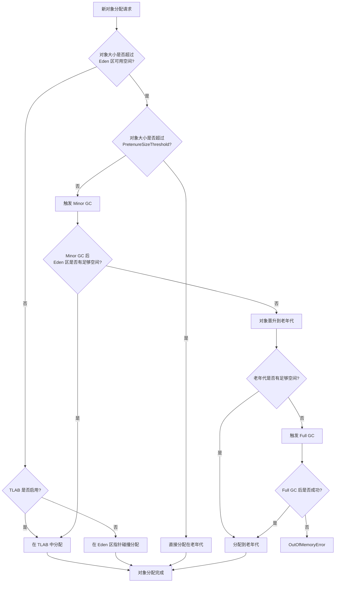

# 堆内存（Heap）详解

堆内存是 JVM 内存管理的核心区域，几乎所有的对象实例和数组都在堆上分配。如果把 JVM 比作一座城市，堆就是这座城市的主城区——人口最密集、故事最多、问题也最集中。

大多数性能问题都与堆内存直接或间接相关：对象分配过快导致 Minor GC 频繁、新生代空间不足导致对象频繁晋升、老年代空间不足导致 Full GC……理解堆内存的结构，是理解 GC 的第一步。

## 堆内存分代结构

现代 JVM 的堆内存采用分代设计，将堆划分为新生代和老年代两个大区。这种设计建立在两个经验法则之上：

- **弱分代假说**：大多数对象是朝生夕灭的
- **强分代假说**：熬过多次 GC 的对象很少会死亡

## 新生代详解

新生代占据堆内存的约 1/3，进一步划分为 Eden 区和两个 Survivor 区。HotSpot 默认的 `Eden : Survivor = 8 : 1`，意味着每次 Minor GC 后，大约 90% 的新生代空间是可用的（只有 Survivor 区会被浪费）。

### Eden 区

新创建的对象首先分配在 Eden 区。当 Eden 区空间不足时，触发 Minor GC。Minor GC 会回收 Eden 区和正在使用的 Survivor 区中不再被引用的对象，然后将存活的对象复制到另一个 Survivor 区。

大多数对象生命周期很短，它们在 Eden 区出生，在第一次 Minor GC 后被回收。只有少数对象会存活下来，进入 Survivor 区。

### Survivor 区

Survivor 区是新生代中的「缓冲区」，它的存在解决了内存复制算法的空间浪费问题。在没有 Survivor 区的情况下，每次 Minor GC 都需要将所有存活对象复制到老年代，空间利用率太低。

Survivor 区的工作机制：

- **两个 Survivor 区**：S0 和 S1（也称为 From 和 To），角色会交换
- **晋升年龄**：对象每经历一次 Minor GC 且存活，年龄就 +1，当年龄达到阈值（默认 15，可通过 `-XX:MaxTenuringThreshold` 设置）后晋升到老年代
- **动态年龄判断**：JVM 会根据 Survivor 区的使用情况动态调整晋升策略，如果 Survivor 区中相同年龄的对象总大小超过 Survivor 区的 50%，则年龄大于等于该年龄的对象直接晋升

## 老年代详解

老年代占据堆内存的约 2/3，用于存储长生命周期对象。对象晋升到老年代的途径有两种：

1. **年龄晋升**：对象在 Survivor 区经历多次 Minor GC 后，年龄达到阈值
2. **大对象直接晋升**：大对象（超过 `-XX:PretenureSizeThreshold` 设定值）直接在老年代分配

老年代的 GC 频率远低于新生代，但每次 GC 的代价更高。老年代的收集器通常采用标记-整理算法，需要扫描和整理更大的内存区域。

## 对象分配流程

一个对象的分配流程如下：

## 内存担保

内存担保是 Minor GC 前的一个检查机制：JVM 会判断老年代的最大可用连续空间是否大于历代 Survivor 区晋升到老年代的对象平均大小。如果大于，则 Minor GC 是安全的；如果不大于，JVM 会判断是否允许担保失败，如果允许则尝试 Minor GC，否则先进行一次 Full GC。

这个机制的设计意图是：如果 Minor GC 后新生代中的对象都能被 Survivor 区容纳，那就没必要触发 Full GC；如果不能容纳，则需要 Full GC 来释放老年代空间。

## 堆内存配置参数

| 参数 | 说明 | 示例 |
| --- | --- | --- |
| `-Xms` | 堆初始大小 | `-Xms2g` |
| `-Xmx` | 堆最大大小 | `-Xmx8g` |
| `-Xmn` | 新生代大小 | `-Xmn1g` |
| `-XX:NewRatio` | 老年代与新生代比例 | `-XX:NewRatio=2` 表示老年代:新生代 = 2:1 |
| `-XX:SurvivorRatio` | Eden 与 Survivor 比例 | `-XX:SurvivorRatio=8` 表示 Eden:Survivor = 8:1 |
| `-XX:MaxTenuringThreshold` | 最大晋升年龄 | `-XX:MaxTenuringThreshold=15` |
| `-XX:PretenureSizeThreshold` | 大对象阈值 | `-XX:PretenureSizeThreshold=1m` |

合理配置堆内存参数是 GC 调优的基础。新生代太小会导致 Minor GC 过于频繁，对象还没来得及在 Survivor 区「熬」到晋升年龄就被送进老年代；老年代太小会导致 Full GC 频繁发生。
