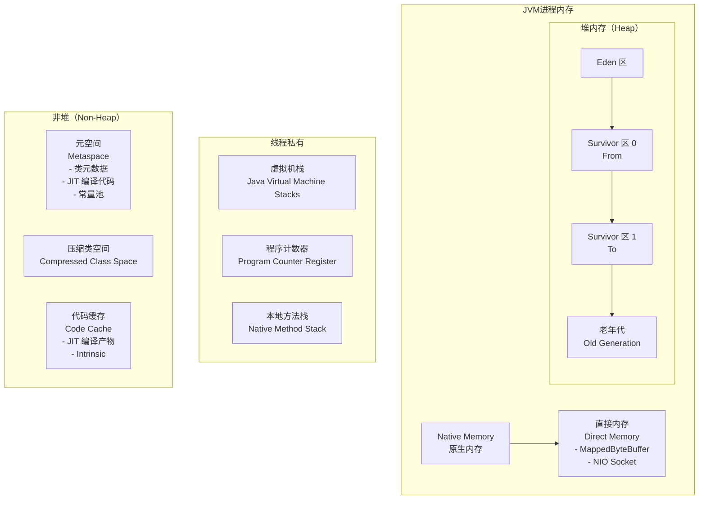
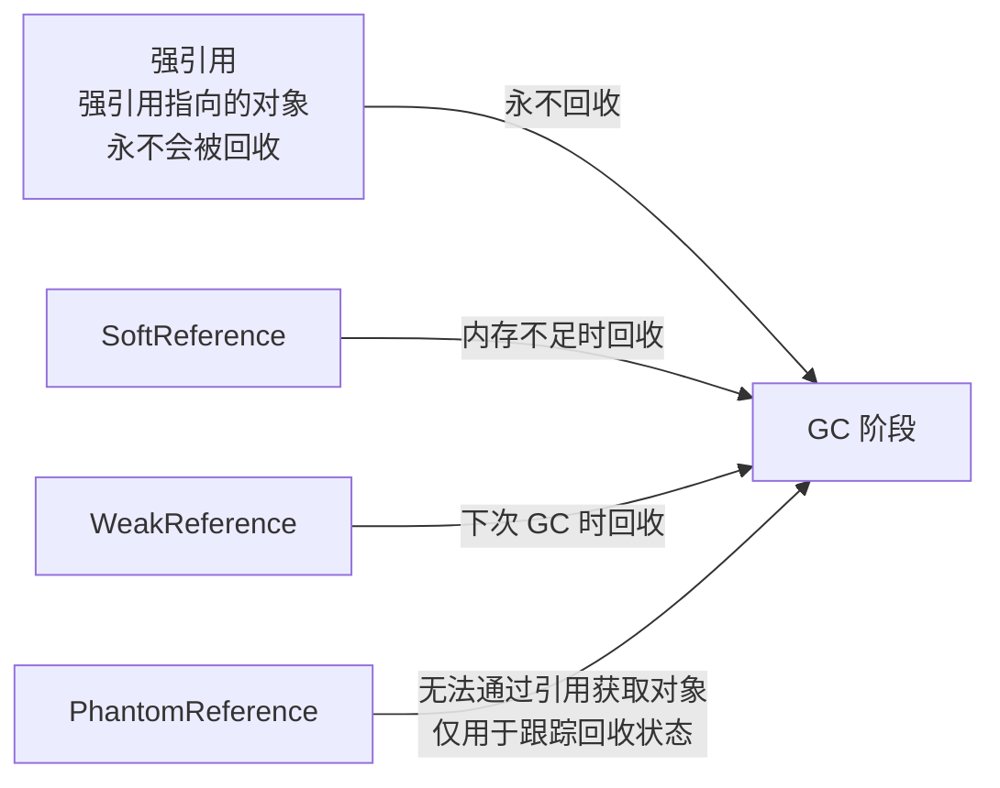
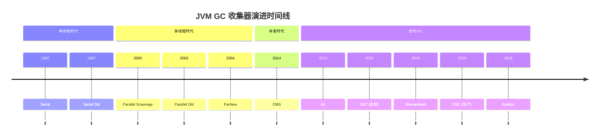
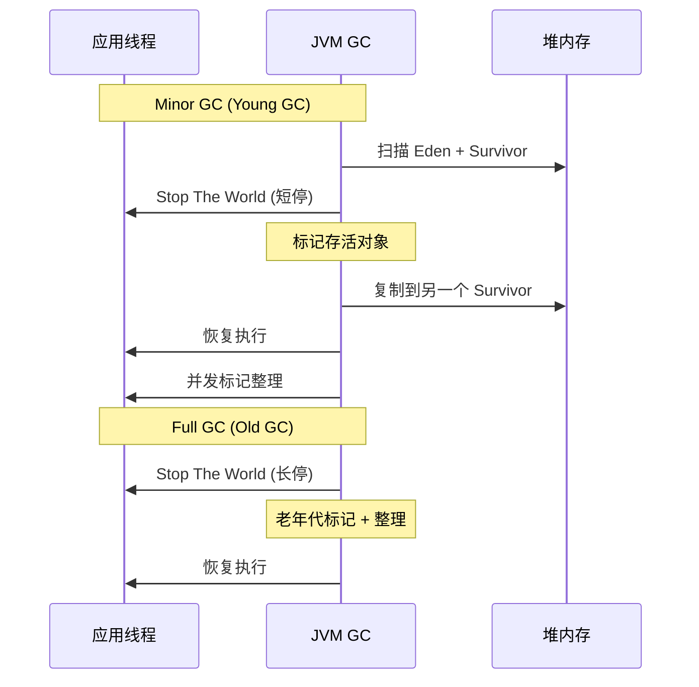
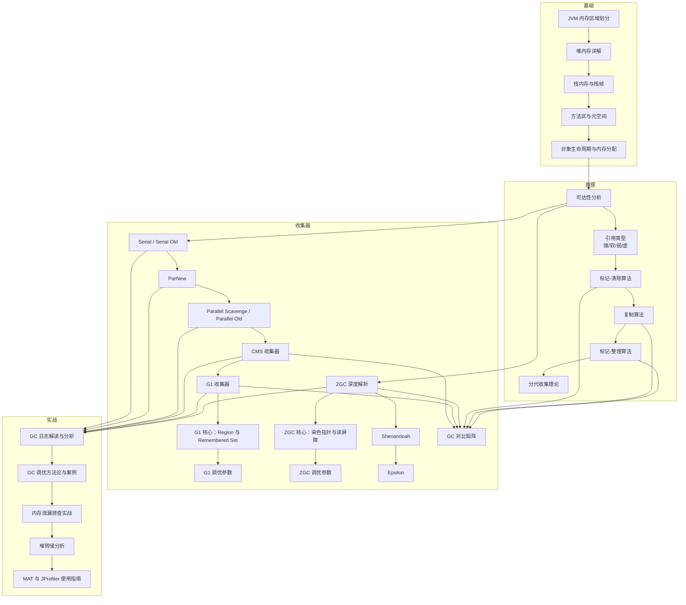

# 内存模型与 GC 总览

凌晨 2 点，一阵急促的告警打破了平静。监控系统显示：生产环境中某核心服务的接口延迟突然飙升至 2 秒以上，业务日志中充斥着大量超时错误。运维团队紧急排查后发现：Young GC 频率从正常的每分钟 3~4 次，飙升到每分钟超过 20 次，而每次 GC 造成的停顿时间从 50ms 暴增到 800ms。

这还只是 GC 问题最常见的表现形式。真正让工程师头疼的，往往是那些更隐蔽的场景：Full GC 导致系统短暂失去响应、FGC 后内存不降反升（内存碎片化）、ZGC 配置不当导致吞吐量反而下降、大数据量导入时频繁晋升导致老年代爆满……每一个问题都足以让一个经验丰富的工程师彻夜难眠。

GC 调优的本质，是在「内存利用率」「吞吐量」「停顿时间」三者之间寻找平衡。理解 GC，不是为了背诵那些拗口的算法名称，而是为了建立完整的内存管理思维，能够从一次次故障中快速定位根因，并做出正确的架构决策。

## JVM 内存区域划分

JVM 在运行时将内存划分为多个区域，每个区域有各自的用途、生命周期和管理方式。理解这些区域，是掌握 GC 的基础。



### 堆内存（Heap）

堆是 JVM 管理的主要内存区域，用于存储对象实例和数组。所有线程共享堆内存，因此堆是 GC 的主要工作区域。堆内存分为新生代和老年代两个大区：

**新生代（Young Generation）** 占据堆内存的约 1/3，进一步划分为 Eden 区和两个 Survivor 区（通常称为 From 和 To）。大多数新创建的对象首先分配在 Eden 区，当 Eden 区满时触发 Minor GC。经历多次 Minor GC 后仍然存活的对象，会晋升到老年代。默认比例约为 Eden : Survivor = 8 : 1，意味着只有 10% 的新生代空间会被浪费。

**老年代（Old Generation）** 占据堆内存的约 2/3，用于存储长生命周期对象。当老年代空间不足时，会触发 Full GC。Full GC 通常比 Minor GC 慢得多，因为它需要扫描和整理更大的内存区域。

### 栈内存（Stack）

每个线程拥有独立的虚拟机栈，用于存储局部变量、方法参数、返回值等信息。栈帧随着方法调用而入栈，随着方法返回而销毁。由于栈是线程私有的，GC 不需要关心栈内存的管理——栈帧随线程消亡而自动释放。栈内存大小可以用 `-Xss` 参数调整，但一般不需要频繁调整。

### 方法区与元空间（Metaspace）

方法区是 JVM 规范中的一个逻辑概念，用于存储类信息、常量、静态变量、JIT 编译后的代码等。在 Java 8 之前，方法区使用永久代（PermGen）实现，存在空间固定、难以调优的问题。Java 8 引入了元空间（Metaspace），改用本地内存实现，理论上可以无限扩展（受物理内存限制）。

元空间主要包含：类的元数据（类的结构信息）、运行时常量池、即时编译器编译后的代码、JIT 内部数据结构等。元空间默认无上限，但可以通过 `-XX:MaxMetaspaceSize` 设置上限，避免因类加载器泄漏导致内存溢出。

### 直接内存（Direct Memory）

直接内存不属于 JVM 堆内存，而是通过 `java.nio.DirectByteBuffer` 分配的堆外内存。NIO 的零拷贝特性依赖直接内存：数据可以直接在直接内存和网络缓冲区之间传输，避免 JVM 堆和系统内核之间的数据复制。直接内存默认大小为 `-XX:MaxDirectMemorySize`，未设置时与堆最大容量相等。

## GC 基本原理

### 可达性分析：GC Roots

GC 的核心问题只有一个：哪些对象还活着？JVM 通过可达性分析（Reachability Analysis）来回答这个问题。从一组称为「GC Roots」的对象出发，沿着引用链向下搜索，能够到达的对象是存活的，反之则是可以回收的。

GC Roots 包括以下几类对象：

| GC Roots 类型 | 说明 |
| --- | --- |
| 虚拟机栈中引用的对象 | 当前正在执行的方法的局部变量表 |
| 方法区中类静态属性引用的对象 | 类的 static 字段 |
| 方法区中常量引用的对象 | 字符串常量池中的 String 对象 |
| 本地方法栈中 JNI 引用的对象 | Native 方法中的对象引用 |
| JVM 内部引用 | Class 对象、异常对象、系统类加载器 |
| 同步锁持有的对象 | 被 synchronized 持有的对象 |

可达性分析是 GC 停顿的主要原因之一：分析过程中需要在一个一致性快照中进行，否则如果分析过程中对象引用关系还在不断变化，分析结果就无法保证准确性。这也是「Stop The World」的根源。

### 引用类型与回收时机

JDK 1.2 之后，Java 将引用分为四种类型，从强到弱依次是：强引用（Strong Reference）、软引用（Soft Reference）、弱引用（Weak Reference）、虚引用（Phantom Reference）。



**强引用**是最常见的引用类型，如 `Object obj = new Object()`。只要强引用还存在，GC 就永远不会回收这个对象。内存泄漏的根源往往就是无意识地持有过多强引用。

**软引用**用于描述还有用但非必需的对象。在系统将要发生内存溢出之前，会把这些对象列进回收范围进行第二次回收。如果这次回收还没有足够的内存，才会抛出 OutOfMemoryError。软引用适合实现内存敏感的缓存。

**弱引用**比软引用更弱。无论当前内存是否足够，都无法阻止 GC 回收被弱引用关联的对象。弱引用适合实现缓存或防止内存泄漏——比如 ThreadLocal 的实现就使用了弱引用。

**虚引用**是最弱的引用类型。虚引用完全不影响对象的生命周期，无法通过虚引用取得对象实例。虚引用的唯一作用，是在对象被 GC 回收时收到一个系统通知。NIO 的 DirectByteBuffer 依赖虚引用来追踪堆外内存的释放。

## GC 算法演进

从最早的 Serial 收集器到如今的 ZGC、Shenandoah，GC 算法经历了漫长的演进过程。理解这段历史，才能理解每种收集器的设计取舍。

### 标记-清除（Mark-Sweep）

标记-清除是最基础的 GC 算法，分为两个阶段：首先标记出所有需要回收的对象，然后统一回收被标记的对象。

这个算法简单直接，但有两个明显的缺陷：执行效率不稳定（标记和清除的效率都不高），以及空间碎片化问题（大量不连续的内存碎片可能导致后续分配大对象时找不到足够的连续空间）。

### 复制算法（Copying）

复制算法将可用内存按容量划分为大小相等的两块，每次只使用其中一块。当这一块内存用完时，就将还存活着的对象复制到另一块上，然后再把已使用过的内存空间一次清理掉。

复制算法解决了空间碎片化问题，而且实现简单、运行高效。但代价是可用内存缩小为原来的一半，空间利用率太低。Java 新生代的 Survivor 区设计正是复制算法的改良——默认 8:1:1 的比例，意味着每次浪费的空间只有 10%。

### 标记-整理（Mark-Compact）

标记-整理算法在标记-清除的基础上增加了整理阶段。标记完成后，不是直接清理可回收对象，而是让所有存活的对象向一端移动，然后直接清理掉边界以外的内存。

标记-整理解决了空间碎片化问题，但整理过程需要移动大量对象，有显著的内存访问开销。对于重视延迟的场景，整理开销是不可忽视的代价。

### 分代收集理论

分代收集并非某种具体算法，而是一套经验法则：大多数对象的生命周期很短（朝生夕死），而存活时间长的对象往往更可能继续存活。根据这个观察，将内存划分为新生代和老年代，分别采用不同的收集策略：

- **新生代**：对象存活率低，复制算法效率高，空间浪费可接受
- **老年代**：对象存活率高，复制算法代价太大，采用标记-清除或标记-整理

分代收集理论是现代 JVM GC 的基石。Minor GC 和 Full GC 的区分、晋升阈值的动态调整、新生代/老年代比例的配置，都建立在这个理论基础之上。

## GC 收集器全家桶



### Serial / Serial Old

Serial 是最古老的单线程收集器，使用单线程完成垃圾回收。在回收时，必须暂停所有用户线程（Stop The World）。Serial Old 是 Serial 的老年代版本，使用标记-整理算法。

优点：简单高效，没有线程切换开销，在单核 CPU 或小堆内存场景下效率最高。缺点：Stop The World 时间随堆内存增长而线性增长，在大内存场景下不可接受。

适用场景：客户端应用、小内存环境（`<=100MB`）、单核机器。

### ParNew / Parallel Scavenge

ParNew 是 Serial 的多线程版本，使用多个线程并行进行新生代垃圾收集。Parallel Scavenge（也称为 Throughput Collector）同样采用多线程，但设计目标不同：ParNew 关注停顿时间，Parallel Scavenge 关注吞吐量。

`-XX:MaxGCPauseMillis` 参数用于设置期望的最大停顿时间，JVM 会尽可能调整参数来满足这个目标。但这只是一个目标而非硬约束，JVM 可能在追求停顿时间目标时牺牲吞吐量。

适用场景：批处理任务、科学计算等吞吐量优先的场景。

### CMS（Concurrent Mark Sweep）

CMS 是第一个真正意义上实现并发标记的收集器，目标是将停顿时间降到最短。CMS 的工作过程分为：初始标记（Stop The World）→ 并发标记→ 重新标记（Stop The World）→ 并发清除。其中初始标记和重新标记需要 Stop The World，但时间很短；并发标记和并发清除与应用线程并发执行。

CMS 的致命缺陷是空间碎片化：由于使用标记-清除算法，长期运行后会产生大量内存碎片。当无法找到足够连续空间分配大对象时，会触发一次 Serial Old 的 Full GC，这次停顿可能长达数秒。另外，CMS 无法处理浮动垃圾（并发清理阶段新产生的垃圾），如果老年代空间不足以容纳浮动垃圾，会退化为 Serial Old。

CMS 在 Java 14 中已被移除。

### G1（Garbage First）

G1 是 Java 11 的默认 GC，也是目前最广泛使用的现代 GC。G1 的核心创新是将堆划分为大小相等的 Region（通常为 1MB~32MB），每个 Region 可以独立作为 Eden、Survivor 或老年代。

G1 的「Garbage First」得名于其回收策略：优先回收垃圾最多的 Region。这种设计使得 G1 可以在用户设置的停顿时间目标内，尽可能回收更多的垃圾。

G1 的工作过程分为：初始标记（Stop The World）→ 并发标记→ 最终标记（Stop The World）→ 筛选回收（Stop The World）。其中筛选回收阶段可以选择多个 Region 进行整理或清除。

G1 适合的场景：6GB 以上堆内存、`-XX:MaxGCPauseMillis` 设置 `<= 500ms`。G1 的缺点是吞吐量略低于 Parallel 系列，在追求极致吞吐量的场景下不如 Parallel Scavenge。

### ZGC

ZGC 是 Oracle 于 Java 11 引入的低延迟垃圾收集器，Java 15 正式生产可用。ZGC 的核心目标是：将停顿时间控制在 10ms 以内，同时支持数百 GB 甚至 TB 级别的堆内存。

ZGC 的关键技术创新包括：**染色指针（Colored Pointers）**和**读屏障（Load Barrier）**。染色指针将对象地址的若干位用作标记位，记录对象的 GC 状态，避免在对象头中存储这些信息。读屏障在每次读取对象引用时执行一小段代码，检查染色指针状态，如果发现对象正在被移动，则在应用线程中完成转发，而不需要等待 GC 完成。

ZGC 的工作过程几乎全部与用户线程并发执行，只有短暂的初始化和同步阶段需要 Stop The World。停顿时间与堆大小无关，始终保持在亚毫秒级别。

适用场景：超大堆内存（`>16GB`）、对延迟极度敏感的应用（如金融交易、游戏服务器）、需要高可用性的服务。

### Shenandoah

Shenandoah 是 OpenJDK 社区开发的低延迟 GC，与 ZGC 设计目标相似，但实现方式不同。Shenandoah 在 Java 12 随 OpenJDK 进入主线，在 Java 15 成为正式特性。

Shenandoah 与 ZGC 的主要区别：Shenandoah 的染色指针需要占用额外的一位（因此不支持指针压缩），且 Shenandoah 的并发整理与引用更新策略与 ZGC 不同。Shenandoah 的性能特征与 ZGC 相近，但社区支持更好（OpenJDK 原生集成）。

### Epsilon

Epsilon 是 Java 11 引入的「无操作」GC。它的设计哲学是：对于短生命周期的应用，或者内存足够大的场景，根本不需要 GC。Epsilon 只分配内存，不回收内存，当内存耗尽时直接退出。

Epsilon 的真正价值在于：性能基准测试（排除 GC 干扰）、极短生命周期应用、内存足够大的容器环境。Epsilon 让开发者精确测量 GC 的影响，而不是靠猜测。

## 收集器对比矩阵

| 特性 | Serial | Parallel Scavenge | CMS | G1 | ZGC | Shenandoah |
| --- | --- | --- | --- | --- | --- | --- |
| 线程模型 | 单线程 | 多线程并行 | 并发标记 | 并发 + 增量整理 | 并发 | 并发 |
| 停顿时间 | 长 | 较长 | 短 | 可控 | 亚毫秒 | 亚毫秒 |
| 吞吐量 | 低 | 高 | 中 | 中高 | 高 | 高 |
| 内存占用 | 低 | 低 | 中 | 中高 | 中 | 中 |
| 堆上限 | - | - | - | `~100GB` | `>16TB` | `>100GB` |
| 内存碎片 | 无 | 无 | 有 | 可控 | 无 | 无 |
| 指针压缩 | 支持 | 支持 | 支持 | 支持 | 不支持 | 不支持 |
| Java 版本 | 1.0 | 1.4 | 1.4（已移除） | 9（默认） | 15（生产） | 15（正式） |

**选型建议**：

- 小内存（`<1GB`）、单核环境：Serial
- 批处理、吞吐量优先：Parallel Scavenge + Parallel Old
- 中等内存、需要低停顿：G1
- 超大内存（`>16GB`）、极致低延迟：ZGC 或 Shenandoah
- 短生命周期、基准测试：Epsilon

## GC 调优方法论

### GC 日志解读

GC 日志是排查 GC 问题的第一手资料。开启 GC 日志需要在 JVM 启动参数中添加：

```bash
-Xlog:gc*:file=gc.log:time,uptime,level,tags:filecount=5,filesize=10M
```

这条配置会输出所有 `gc` 标签的日志，包含时间戳、进程运行时间、日志级别，并保留最近 5 个文件，每个文件最大 10MB。

常见的 GC 日志模式解读：



### 常见 GC 问题与排查

**Young GC 频繁**：通常是对象分配速率过高，可能的原因有：业务代码创建了大量短期对象、缓存未设置 TTL 导致持续增长、第三方库（如 JSON 解析库）频繁创建中间对象。

**Full GC 频繁**：通常意味着老年代空间不足。可能的原因有：内存分配过大但老年代空间不足、大对象直接进入老年代、对象晋升年龄过小导致频繁晋升。

**GC 停顿时间过长**：Parallel 系列 GC 的停顿时间随堆大小线性增长。如果停顿时间不可接受，考虑切换到 G1 或 ZGC。

**内存持续增长后 OOM**：内存泄漏是最常见的原因。常见泄漏源包括：未关闭的资源（连接、流）、静态集合持有对象引用、ThreadLocal 未清理、内部类持有外部类引用。

### 内存泄漏排查实战

内存泄漏的排查通常遵循以下步骤：

1. **观察监控**：通过 JMX 或 Prometheus 观察堆内存使用曲线，判断是持续增长还是周期性增长
2. **获取堆转储**：使用 `jmap -dump:format=b,file=heap.hprof <pid>` 获取堆快照
3. **分析支配树**：使用 MAT 或 JProfiler 加载堆转储，分析对象支配树（Retained Heap），找出占用内存最多的对象
4. **追踪引用链**：查看对象的 GC Roots 引用路径，确定泄漏的根因

### 堆转储分析（Heap Dump）

堆转储文件记录了某一时刻 JVM 堆内存中所有对象的快照。分析堆转储的关键指标：

| 指标 | 说明 | 正常范围 |
| --- | --- | --- |
| Shallow Heap | 对象自身占用内存 | 视对象类型而定 |
| Retained Heap | 对象及引用的总内存 | 应与堆使用量接近 |
| GC Roots 到对象的路径 | 对象为何无法回收 | 短路径表示泄漏 |
| 对象数量 | 特定类型的实例数 | 异常增长表示问题 |

推荐使用 Eclipse MAT（Memory Analyzer Tool）进行堆转储分析，它提供了支配树分析、 Leak Suspects 报告、OQL 查询等功能。

## 本章文章导读

本章将系统讲解 JVM 内存模型与 GC 相关的核心知识。按照由浅入深的原则，建议按以下顺序阅读：



**入门路线**（希望快速理解 GC 基本原理）：

内存区域划分 → 堆内存详解 → 可达性分析 → 引用类型 → 分代收集理论 → G1 收集器 → GC 日志解读

**进阶路线**（希望深入理解底层机制）：

染色指针与读屏障 → ZGC 深度解析 → ZGC 调优 → Shenandoah → GC 对比矩阵

**实战路线**（希望解决生产问题）：

GC 日志解读 → 内存泄漏排查实战 → 堆转储分析 → MAT 使用指南 → 调优方法论与案例

---

理解 GC 不是目的，目的是能够在面对复杂的内存问题时，快速定位根因、做出正确的决策。无论是选择合适的收集器、调整堆内存参数，还是设计更低内存占用的数据结构，都需要建立在对 GC 的深刻理解之上。接下来，让我们从 JVM 内存区域划分开始，逐步深入这个有趣的领域。
