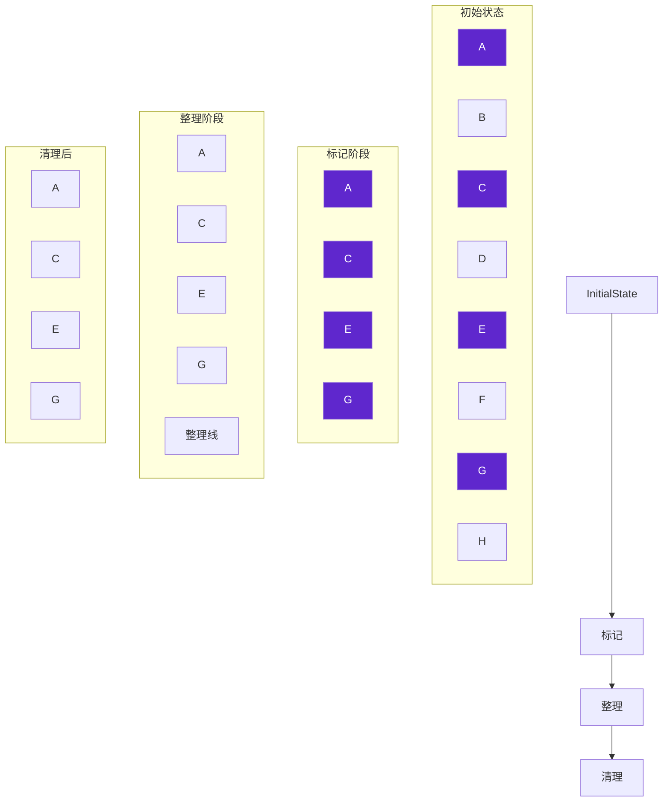
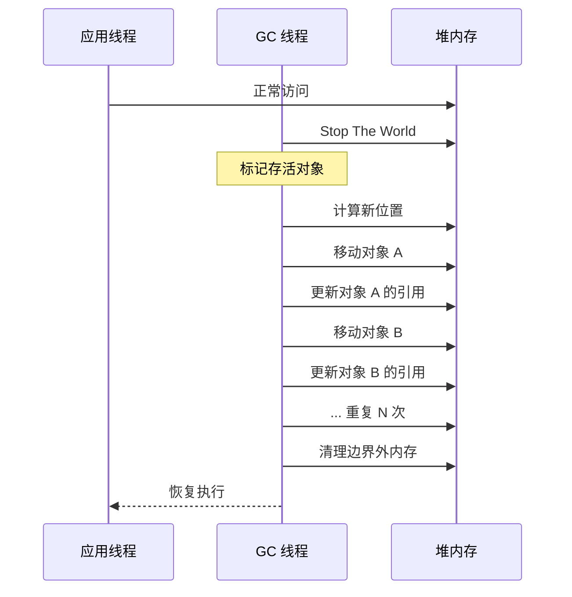

# GC 算法：标记-整理（Mark-Compact）

标记-整理算法是标记-清除算法的改进版本，它在标记阶段后增加了「整理」阶段，让所有存活对象向一端移动，然后直接清理掉边界以外的内存。

标记-整理解决了标记-清除算法的碎片化问题，同时保持了较高的内存利用率，是老年代收集器（如 Serial Old、Parallel Old）的主要算法。

## 算法原理

标记-整理算法分为三个阶段：



## 整理方向

标记-整理的核心在于如何移动存活对象。根据整理方向的不同，有两种实现：

### 从前向后整理（LISP）

从内存的低地址向高地址方向移动，整理线在内存末尾。

```mermaid
flowchart LR
    subgraph 整理前["整理前"]
        A1["A"]:::alive
        B1[""]:::dead
        C1["C"]:::alive
        D1[""]:::dead
        E1["E"]:::alive
        F1[""]:::dead
        G1["G"]:::alive
        H1[""]:::dead
    end
    
    Arrow["→"]
    
    subgraph 整理后["整理后"]
        A2["A"]
        C2["C"]
        E2["E"]
        G2["G"]
        Free2["空闲"]
        Free3["空闲"]
        Free4["空闲"]
    end
    
    classDef alive fill:#5f27cd,color:#fff
    classDef dead fill:#dfe6e9
```

### 从后向前整理

从内存的高地址向低地址方向移动，整理线在内存起始位置。HotSpot VM 采用这种方式。

## 整理过程实现

```java
public class MarkCompactGC {
    private static final int HEAP_SIZE = 1024 * 1024;
    private Object[] heap = new Object[HEAP_SIZE];
    private int heapTop = 0;
    
    // 标记阶段
    private void mark() {
        for (Object obj : getGCRoots()) {
            markReachable(obj);
        }
    }
    
    // 整理阶段
    private void compact() {
        // 1. 计算新的对象位置
        int newPosition = 0;
        Object[] newHeap = new Object[HEAP_SIZE];
        
        // 2. 按顺序移动存活对象
        for (int i = 0; i < heapTop; i++) {
            if (heap[i] != null && isReachable(heap[i])) {
                newHeap[newPosition++] = heap[i];
                // 更新对象的引用（需要修正引用）
                updateForwardingPointer(heap[i], newPosition - 1);
            }
        }
        
        // 3. 交换堆
        this.heap = newHeap;
        this.heapTop = newPosition;
    }
}
```

## 整理的代价

标记-整理最大的问题是**整理阶段需要移动大量对象**，这带来显著的内存访问开销：



整理阶段必须 Stop The World，因为移动对象时应用线程不能同时访问这些对象。对于堆内存较大的应用，整理可能需要较长时间。

## 增量整理与并发整理

为减少 Stop The World 时间，现代收集器采用了一些策略：

### G1 的增量整理

G1 不是一次性整理整个老年代，而是增量地整理部分 Region。G1 会根据用户设定的停顿时间目标，选择最值得整理的 Region 进行整理。

### ZGC 的并发整理

ZGC 的目标是让 Stop The World 时间保持在亚毫秒级别。ZGC 使用染色指针记录对象的移动状态，**不需要在整理阶段停止应用线程**。整理和引用更新都在应用线程执行过程中并发进行。

## 与复制算法的对比

| 特性 | 复制算法 | 标记-整理 |
| --- | --- | --- |
| 空间连续性 | 是（无碎片） | 是（整理后） |
| 空间利用率 | 50%（优化后 90%） | 100%（基本相同） |
| 移动成本 | 复制所有存活对象 | 移动所有存活对象 |
| 适用区域 | 新生代 | 老年代 |
| Stop The World | 短 | 长（取决于存活对象数量） |

复制算法适合存活率低的新生代，复制成本小；标记-整理适合存活率高的老年代，虽然移动成本高，但避免了复制算法 50% 的空间浪费。
