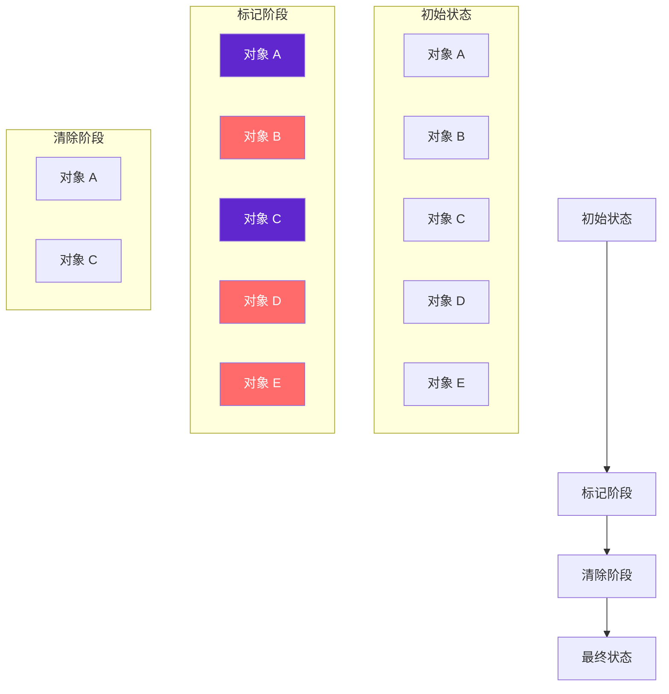
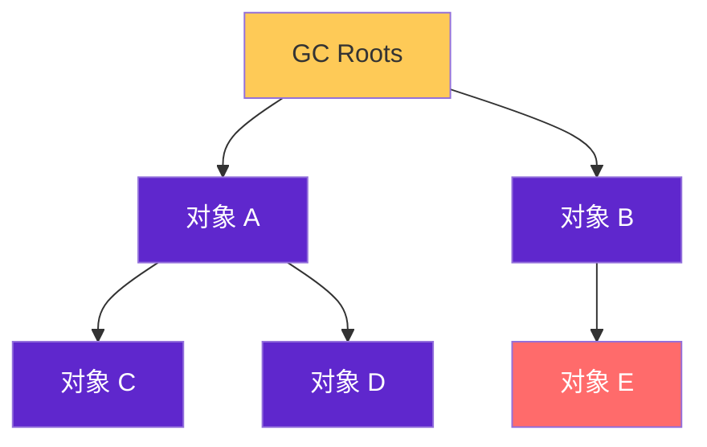
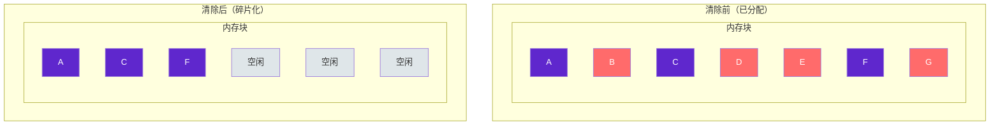

# GC 算法：标记-清除（Mark-Sweep）

标记-清除是最早出现也是最基础的垃圾回收算法。它的工作原理很简单：先标记出所有需要回收的对象，然后统一回收被标记的对象。

理解标记-清除，是理解其他高级 GC 算法的基础——其他算法大都是针对标记-清除的缺点进行改进的。

## 算法原理

标记-清除算法分为两个阶段：



1. **标记阶段**：从 GC Roots 出发，遍历所有可达对象，标记为存活
2. **清除阶段**：遍历整个堆内存，清除所有未被标记的对象

## 标记过程

标记阶段基于可达性分析算法。从 GC Roots 开始，沿着引用链遍历所有可达对象：



在这个例子中，E 对象从 GC Roots 不可达，会被标记为死亡。

## 清除过程

清除阶段遍历堆内存，释放所有未被标记的对象占用的内存：

```java
// 标记-清除的伪代码实现
public class MarkSweepGC {
    private static final int HEAP_SIZE = 1024 * 1024;
    private static final Object[] heap = new Object[HEAP_SIZE];
    private static int heapTop = 0;
    
    // 标记阶段
    private void mark() {
        // 从 GC Roots 开始，递归标记所有可达对象
        for (Object obj : getGCRoots()) {
            markReachable(obj);
        }
    }
    
    private void markReachable(Object obj) {
        if (obj == null || obj.isMarked()) return;
        obj.mark();  // 标记为存活
        for (Object ref : obj.getReferences()) {
            markReachable(ref);  // 递归标记引用对象
        }
    }
    
    // 清除阶段
    private void sweep() {
        int sweepPosition = 0;
        for (int i = 0; i < heapTop; i++) {
            if (!heap[i].isMarked()) {
                // 未被标记，对象已死亡，释放内存
                heap[i] = null;
            } else {
                // 存活对象移动到堆底部（可选）
                heap[i].unmark();  // 清除标记，供下次 GC 使用
                heap[sweepPosition++] = heap[i];
            }
        }
        heapTop = sweepPosition;  // 更新堆顶
    }
}
```

## 标记-清除的缺点

### 效率问题

标记和清除两个阶段的效率都不高。标记需要遍历所有存活对象，清除需要遍历整个堆。对于堆内存较大的应用，这个过程可能很慢。

### 空间碎片化

标记-清除算法不移动存活对象，只释放死亡对象占用的空间。这会导致内存空间不连续，产生大量内存碎片。



如果需要分配一个大对象，即使空闲空间总和足够，也可能因为空间不连续而分配失败。

## 适用场景

标记-清除算法的缺点限制了它的应用范围，但在某些场景下仍然有价值：

- **CMS 收集器**：CMS 在并发清除阶段使用的就是标记-清除算法
- **老年代**：老年代对象存活率高，不适合复制算法，标记-清除的效率问题不那么突出
- **不需要整理的场景**：如果应用对停顿时间敏感，整理操作带来的长时间 STW 可能比碎片化问题更严重

## 标记-清除的改进

针对标记-清除的缺点，后来的算法进行了改进：

| 改进方向 | 算法 | 改进内容 |
| --- | --- | --- |
| 消除碎片化 | 复制算法 | 将存活对象复制到另一块连续空间 |
| 消除碎片化 | 标记-整理 | 在清除前整理存活对象 |
| 效率优化 | 分代收集 | 大多数对象短命，只对新生代频繁 GC |

复制算法和标记-整理都是为了解决标记-清除的碎片化问题。复制算法适用于对象存活率低的新生代，标记-整理适用于对象存活率高的老年代。
