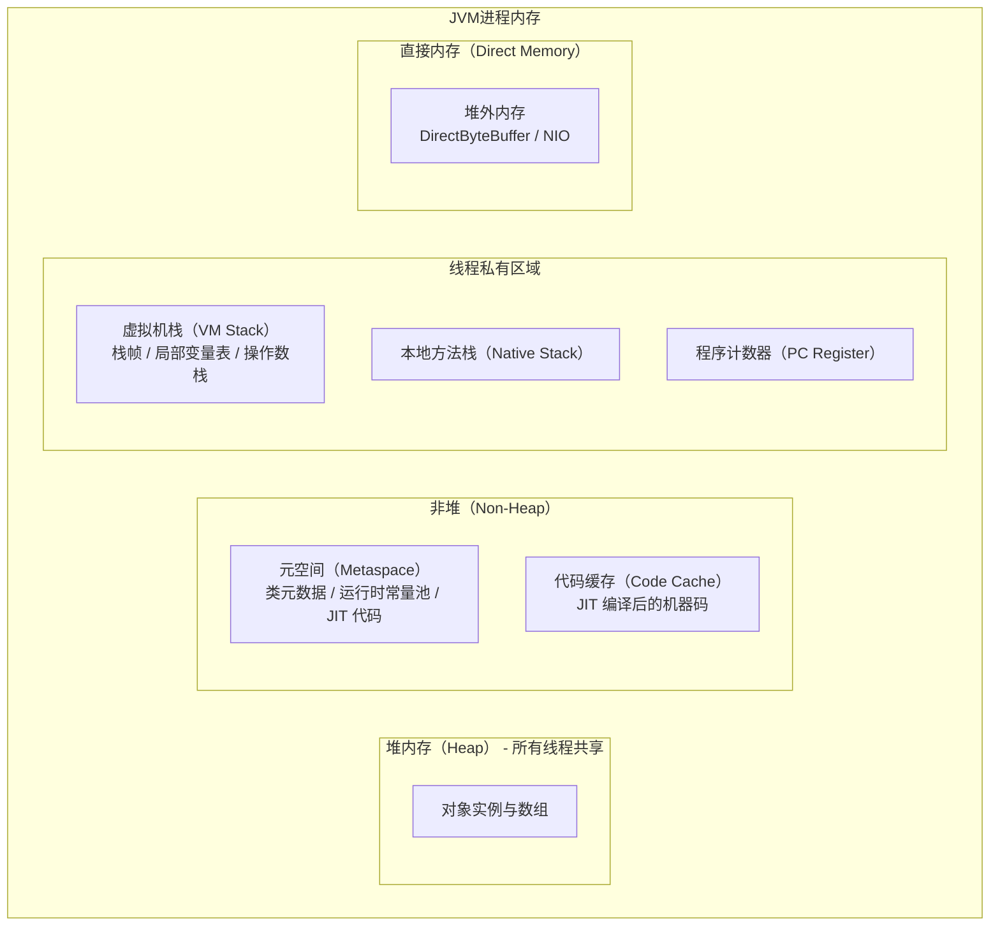

# JVM 内存区域划分

凌晨 2 点，一阵急促的告警打破了平静。监控系统显示：生产环境中某核心服务的接口延迟突然飙升至 2 秒以上。运维团队紧急排查后发现：JVM 堆内存使用率持续在 95% 以上，Full GC 频率从正常的每小时 1~2 次飙升到每分钟超过 5 次，而每次 GC 造成的停顿时间从 100ms 暴增到 2 秒。

这还只是内存问题最常见的表现形式。真正让工程师头疼的，往往是那些更隐蔽的场景：元空间持续增长导致 OutOfMemoryError、虚拟机栈溢出导致 StackOverflowError、直接内存耗尽导致 NIO 异常……每一个问题都需要对 JVM 内存区域有深刻的理解才能定位。

理解 JVM 内存区域，是掌握 GC 和性能调优的第一步。不同的内存区域有不同的用途、不同的生命周期，也对应着不同的调优策略。

## 运行时数据区全景

JVM 在运行时将内存划分为多个区域，每个区域有各自的用途、创建时机和销毁方式。根据《Java 虚拟机规范》，运行时数据区包括以下部分：

## 堆内存（Heap）

堆是 JVM 管理的主要内存区域，用于存储对象实例和数组。所有线程共享堆内存，因此堆是 GC 的主要工作区域。

堆内存的核心特点：

- **共享性**：所有线程都从堆中分配对象，对象的引用存在于虚拟机栈和本地方法栈中
- **动态性**：堆的大小可以在 JVM 启动时通过 `-Xms` 和 `-Xmx` 设置，并且可以动态扩展
- **垃圾回收的主要对象**：GC 关注的就是堆内存中不再被引用的对象

## 虚拟机栈（VM Stack）

每个线程拥有独立的虚拟机栈，用于存储局部变量、方法参数、返回值等信息。栈的基本单位是**栈帧（Stack Frame）**，每当一个方法被调用，一个新的栈帧就会入栈；方法执行完成（无论正常返回还是异常退出），栈帧就会出栈。

栈帧包含三部分核心内容：

- **局部变量表**：存储方法参数和局部变量
- **操作数栈**：执行字节码指令时的临时工作空间
- **动态链接**：将符号引用转换为直接引用

由于栈是线程私有的，GC 不需要关心栈内存的管理——栈帧随线程消亡而自动释放。栈内存大小可以通过 `-Xss` 参数调整，但一般不需要频繁调整。

## 本地方法栈（Native Method Stack）

本地方法栈与虚拟机栈类似，区别在于：虚拟机栈为 Java 方法服务，本地方法栈为 Native 方法服务。在 HotSpot VM 中，本地方法栈和虚拟机栈合二为一，使用同一个实现。

## 程序计数器（Program Counter Register）

程序计数器是一块较小的内存空间，保存当前线程正在执行的字节码指令的地址。如果当前线程正在执行 Java 方法，计数器记录的是正在执行的字节码指令的地址；如果是 Native 方法，则计数器为空（Undefined）。

程序计数器是线程私有的，每个线程都有独立的计数器，确保线程切换后能恢复到正确的执行位置。由于程序计数器只存储一个指针，几乎不会产生 OutOfMemoryError。

## 方法区（元空间）

方法区是 JVM 规范中的一个逻辑概念，用于存储类信息、常量、静态变量、JIT 编译后的代码等。在 Java 8 之前，方法区使用永久代（PermGen）实现；Java 8 引入了元空间（Metaspace），改用本地内存实现。

元空间主要包含：

- 类的元数据（类的结构信息、成员信息）
- 运行时常量池
- 即时编译器编译后的代码
- JIT 内部数据结构

元空间默认使用本地内存，理论上可以无限扩展（受物理内存限制）。但如果不设置上限，可能因为类加载器泄漏导致内存溢出，因此生产环境通常会通过 `-XX:MaxMetaspaceSize` 设置上限。

## 直接内存（Direct Memory）

直接内存不属于 JVM 堆内存，而是通过 `java.nio.DirectByteBuffer` 分配的堆外内存。

直接内存的核心价值在于零拷贝：数据可以直接在直接内存和网络缓冲区之间传输，避免 JVM 堆和系统内核之间的数据复制。这在高性能网络编程和高频交易场景中尤为重要。

直接内存默认大小为 `-XX:MaxDirectMemorySize`，未设置时与堆最大容量相等。直接内存的分配和回收不由 GC 管理，需要通过 `DirectByteBuffer` 的 `cleaner` 机制来释放。

## 内存区域对比

| 区域 | 线程共享 | GC 管理 | 异常类型 | 默认大小 |
| --- | --- | --- | --- | --- |
| 堆内存 | 是 | 是 | OutOfMemoryError | `-Xms`/`-Xmx` |
| 虚拟机栈 | 否 | 否 | StackOverflowError / OutOfMemoryError | `-Xss` |
| 本地方法栈 | 否 | 否 | StackOverflowError / OutOfMemoryError | `-Xss` |
| 程序计数器 | 否 | 否 | 无 | - |
| 元空间 | 是 | 否（本地内存） | OutOfMemoryError | `-XX:MaxMetaspaceSize` |
| 直接内存 | 是 | 否 | OutOfMemoryError | `-XX:MaxDirectMemorySize` |

理解这些区域的职责分工，是后续学习 GC 算法和调优技术的基础。堆内存和元空间是 GC 的主要关注对象，虚拟机栈和本地方法栈的深度问题则需要从代码层面解决。
