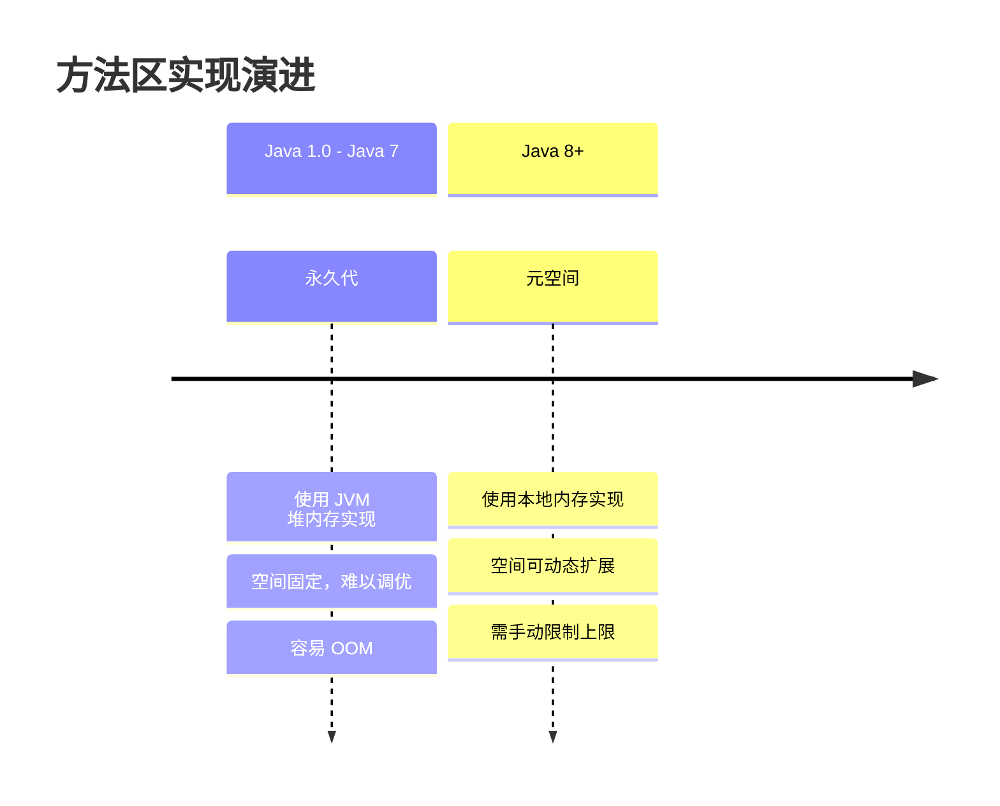
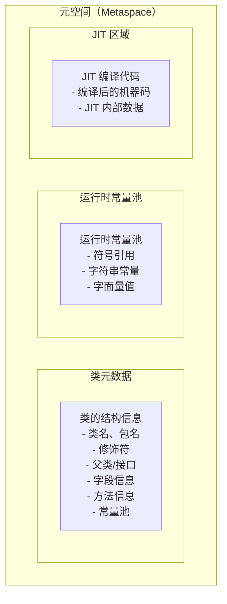

# 方法区与元空间（Metaspace）

你可能见过这样的错误：`java.lang.OutOfMemoryError: Metaspace`。这个错误在 Java 8 之后变得更加常见，因为永久代被移除，所有与类相关的元数据都移到了元空间。

理解元空间的机制，对于排查类加载器泄漏、解决元空间溢出问题至关重要。

## 方法区的演进

方法区是 JVM 规范中的一个逻辑概念，用于存储类信息、常量、静态变量、JIT 编译后的代码等。但它的实现方式经历了重大变化：



### 永久代（PermGen）

在 Java 8 之前，方法区使用永久代实现，位于 JVM 堆内存中。永久代的大小在 JVM 启动时就固定了，难以动态调整。

永久代的问题：

- **空间固定**：`-XX:PermSize` 和 `-XX:MaxPermSize` 设置后难以调整
- **GC 无法回收**：永久代中的类信息即使类加载器已被卸载，也很难被回收
- **字符串常量池冲突**：字符串常量池在永久代中，与堆内存竞争空间

### 元空间（Metaspace）

Java 8 引入元空间，彻底移除了永久代。元空间使用本地内存（Native Memory）实现，不在 JVM 堆内存中。

元空间的优势：

- **空间动态扩展**：元空间大小受物理内存限制，理论上可以无限扩展
- **独立管理**：元空间与堆内存分开，不会互相影响
- **类卸载更容易**：元空间使用 ClassLoader 的弱引用关联类，更容易回收

## 元空间存储内容

元空间主要包含以下内容：



| 存储内容 | 说明 |
| --- | --- |
| 类的元数据 | 类的名称、修饰符、父类/接口、字段描述符、方法描述符等 |
| 运行时常量池 | 编译期生成的各种字面量和符号引用，类加载后进入运行时常量池 |
| 静态变量 | 类的 static 字段（JDK 7 之后，字符串常量池移到了堆中） |
| JIT 编译代码 | JIT 编译器生成的机器码和内部数据结构 |
| 方法字节码 | 解析后的方法字节码和其他属性 |

## 元空间溢出：OutOfMemoryError: Metaspace

元空间溢出的根本原因是类加载过多或类加载器泄漏。常见场景：

### 场景一：动态类加载过多

```java
// 动态生成大量类（如 RPC 框架、动态代理）
for (int i = 0; i < 100000; i++) {
    Class<?> clazz = generateClass(i);  // 每次生成新类
    clazz.getDeclaredMethods();
}
```

### 场景二：类加载器泄漏

```java
// 自定义类加载器未正确释放
public class LeakingClassLoader extends ClassLoader {
    // 类加载器持有大量引用
    private Map<String, Object> cache = new HashMap<>();
}

// 问题：LeakingClassLoader 实例被静态引用持有
// 即使业务代码不再使用 LeakingClassLoader，也无法被回收
```

### 场景三：反射调用过多

大量使用 `Class.forName()` 或 `ClassLoader.loadClass()` 会加载大量类。

## 元空间调优参数

| 参数 | 说明 | 示例 |
| --- | --- | --- |
| `-XX:MetaspaceSize` | 元空间初始大小 | `-XX:MetaspaceSize=256m` |
| `-XX:MaxMetaspaceSize` | 元空间最大大小（生产必设） | `-XX:MaxMetaspaceSize=512m` |
| `-XX:MinMetaspaceFreeRatio` | GC 后最小空闲比例 | `-XX:MinMetaspaceFreeRatio=40` |
| `-XX:MaxMetaspaceFreeRatio` | GC 后最大空闲比例 | `-XX:MaxMetaspaceFreeRatio=70` |
| `-XX:+UseCompressedClassPointers` | 启用压缩类指针 | JDK 8+ 默认开启 |
| `-XX:CompressedClassSpaceSize` | 压缩类空间大小 | `-XX:CompressedClassSpaceSize=1g` |

## 生产环境建议

1. **必须设置 MaxMetaspaceSize**：防止元空间无限增长导致系统 OOM
2. **监控元空间使用**：通过 JMX 或监控工具观察元空间使用趋势
3. **排查类加载器泄漏**：使用 MAT 分析堆转储，查找持有类加载器引用的 GC Root
4. **限制动态代理生成**：对于使用 CGLIB、Javassist 动态生成大量类的场景，需要特别关注

```bash
# 推荐的生产配置
-XX:MetaspaceSize=256m \
-XX:MaxMetaspaceSize=512m \
-XX:+UseG1GC \
-XX:+UseStringDeduplication
```

元空间溢出的排查通常比堆内存溢出更复杂，因为元空间的 GC Roots 和类加载器的关系更加隐蔽。推荐使用 `jcmd <pid> GC.class_stats` 命令查看类加载统计信息。
