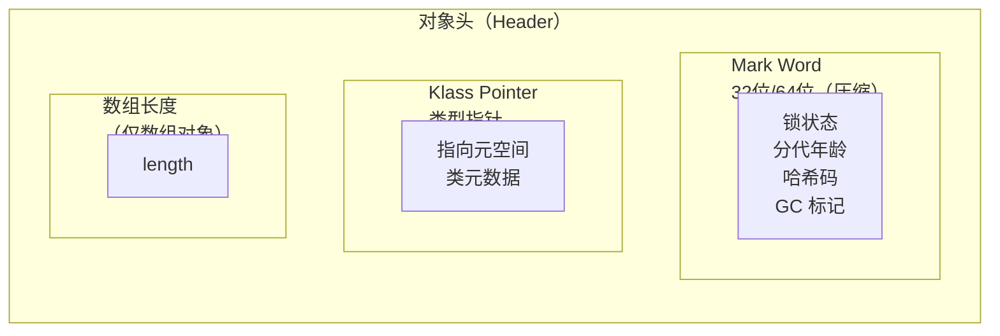
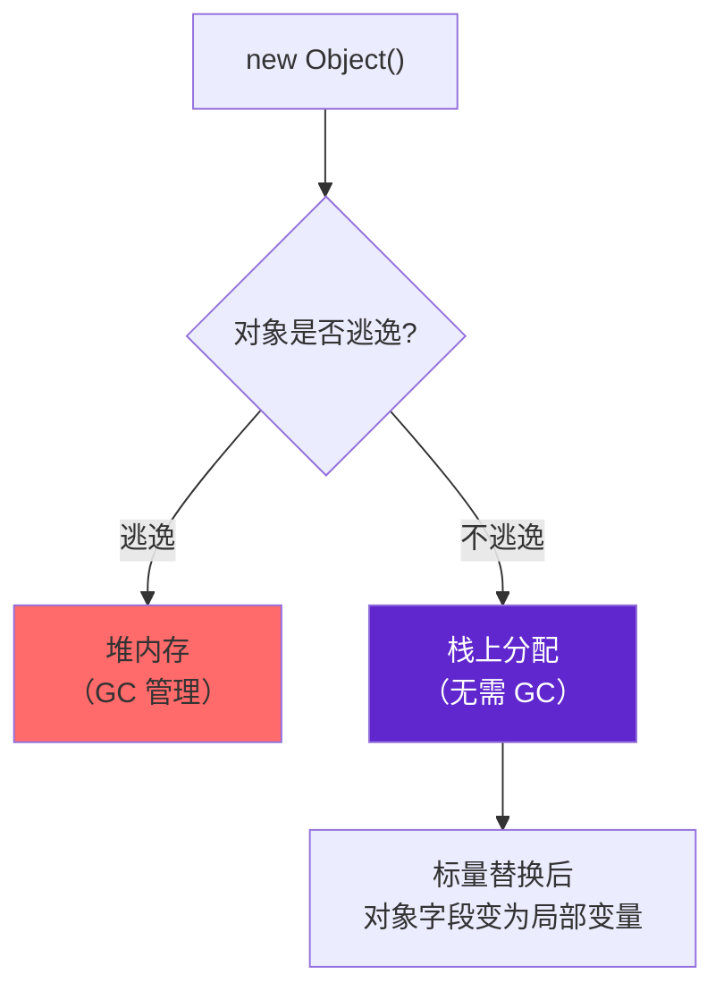

# 对象生命周期与内存分配

对象的创建是 Java 程序中最常见的操作之一。当执行 `new Object()` 时，JVM 内部经历了一系列复杂的过程：从判断类是否已加载，到分配内存、初始化对象、设置对象头，再到将引用返回给程序。

理解对象的创建过程和内存分配机制，是理解 GC 的基础——只有知道对象从何而来，才能理解对象如何消亡。

## 对象创建过程

当 Java 程序执行到一条 `new` 指令时，JVM 按以下步骤创建对象：

```mermaid
flowchart TD
    A["new 指令"] --> B["常量池检查\n类是否已加载?"}
    B -->|否| C["加载类"]
    B -->|是| D["分配内存"]
    D --> E["内存空间初始化为零值"]
    E --> F["设置对象头"]
    F --> G["执行构造函数"]
    G --> H["对象创建完成"]
```

### 第一步：类加载检查

执行 `new` 指令时，JVM 首先检查这个指令的参数是否能在常量池中定位到一个类的符号引用，并检查这个符号引用代表的类是否已被加载、解析和初始化过。如果没有，需要先执行类加载过程。

### 第二步：分配内存

类加载检查通过后，JVM 为对象分配内存。对象所需内存大小在类加载完成后就已确定。分配方式有两种：

**指针碰撞（Bump the Pointer）**：如果堆内存是规整的（已用内存在一边，空闲内存在另一边），用一个指针指向分界点，分配内存时只需要将指针向空闲方向移动相应距离。这种方式效率高，但要求堆内存规整。

**空闲列表（Free List）**：如果堆内存不规整，JVM 需要维护一个空闲列表，记录哪些内存块可用。分配时从列表中找到足够大的内存块，分配后更新列表。这种方式复杂，但可以处理不规整的内存。

### 第三步：内存空间初始化

内存分配完成后，JVM 将分配的内存空间初始化为零值（不包括对象头）。这一步保证了对象的实例字段在 Java 代码中可以不赋初值就直接使用。

### 第四步：设置对象头

初始化零值后，JVM 设置对象头。对象头包含两部分信息：



### 第五步：执行构造函数

以上步骤完成后，从 Java 程序视角，一个对象已经创建完成。但按照 Java 程序的语义，还需要执行构造函数（`<init>` 方法）来完成真正的初始化。

## TLAB（Thread Local Allocation Buffer）

在多线程环境下，对象分配是高频操作。如果多个线程同时在堆上分配内存，需要通过同步来保证线程安全，这会成为性能瓶颈。

TLAB 是 HotSpot VM 提供的一种优化：每个线程在新生代 Eden 区中预先分配一小块内存（约 1% 的 Eden 区大小），线程分配对象时在自己的 TLAB 中进行，只有 TLAB 空间不足或分配新 TLAB 时才需要同步。

```java
// TLAB 工作原理
public class TLABExample {
    public void allocate() {
        // 对象优先在当前线程的 TLAB 中分配
        Object obj = new Object();
        // 无需加锁，直接在 TLAB 空间内移动指针
    }
}
```

TLAB 的配置参数：

| 参数 | 说明 | 默认值 |
| --- | --- | --- |
| `-XX:+UseTLAB` | 启用 TLAB | JDK 7+ 默认开启 |
| `-XX:TLABSize` | TLAB 大小 | 由 JVM 自动计算 |
| `-XX:TLABRefillWasteFraction` | TLAB 浪费阈值 | 64（即 1/64） |

## 对象头结构

### Mark Word

Mark Word 存储对象的运行时数据，包括：

| 存储内容 | 说明 |
| --- | --- |
| 哈希码 | 对象的 hashCode() 返回值 |
| GC 分代年龄 | 对象经历 Minor GC 的次数 |
| 锁状态 | 无锁 / 偏向锁 / 轻量级锁 / 重量级锁 |
| 偏向线程 ID | 持有偏向锁的线程 ID |
| 偏向时间戳 | 偏向锁持有的时间 |

在 32 位 JVM 中，Mark Word 占用 32 位（4 字节）；在 64 位 JVM 中，占用 64 位（8 字节）。但可以通过 `-XX:+UseCompressedOops` 启用指针压缩，减少内存占用。

### Klass Pointer

Klass Pointer 是指向类元数据的指针，JVM 通过这个指针确定对象是哪个类的实例。在 64 位 JVM 中，未压缩时占用 8 字节；启用指针压缩后占用 4 字节。

## 对象分配位置

不是所有对象都分配在堆内存中。根据对象的生命周期和逃逸分析结果，JIT 编译器可能将对象分配在：



### 栈上分配

如果 JIT 编译器通过逃逸分析判断一个对象的引用不会逃逸出方法或线程，就可以在栈上分配对象。栈上分配的对象随着栈帧出栈而自动销毁，不需要 GC 介入。

### 标量替换

逃逸分析还可以更进一步：如果一个对象不逃逸，JIT 编译器可以把这个对象「拆解」为它的成员变量（标量），直接使用这些标量作为局部变量，完全不创建对象。

```java
// 标量替换前
public Point calculate() {
    Point p = new Point(1, 2);
    return p;
}

// 标量替换后（编译优化结果）
public int calculate_x() {
    int x = 1;  // Point 的 x 字段
    int y = 2;  // Point 的 y 字段
    return x + y;
}
```

这些优化（栈上分配、标量替换）是 JIT 编译器基于逃逸分析做出的激进优化，对象在代码层面看起来被创建了，但实际上从未进入堆内存，从根本上减少了 GC 的压力。
