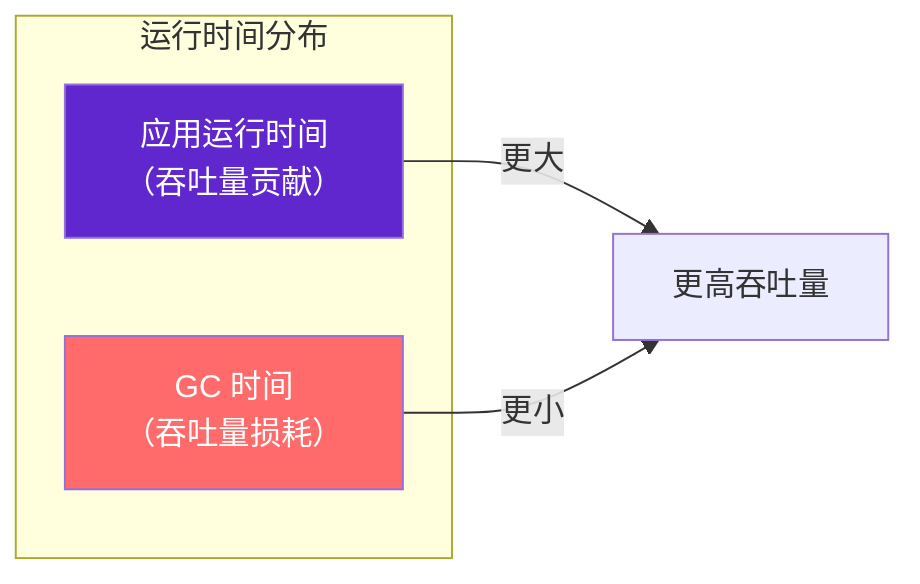
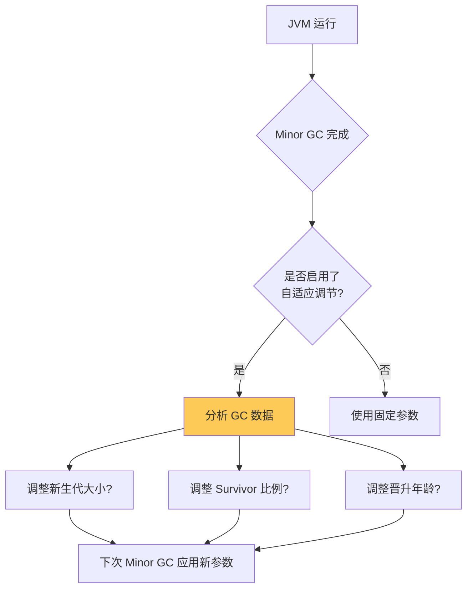
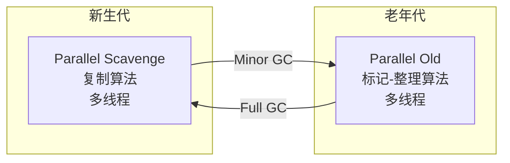
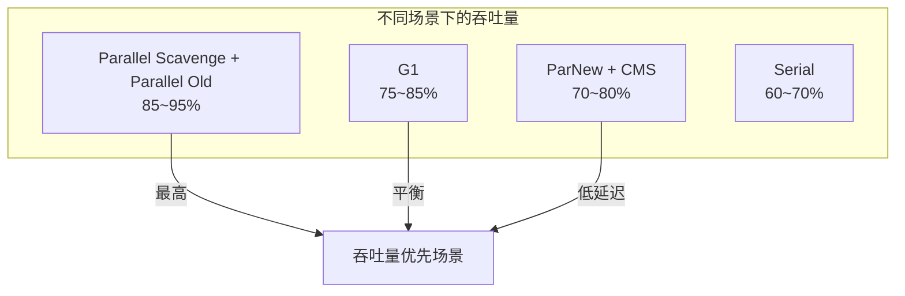

# Parallel Scavenge 与 Parallel Old

Parallel Scavenge（也称为 Throughput Collector）是 Parallel 公司的多线程新生代收集器，专注于**高吞吐量**场景。与关注停顿时间的 ParNew 不同，Parallel Scavenge 的目标是最大化应用运行时间与总时间的比例。

Parallel Old 是 Parallel Scavenge 的老年代搭档，使用标记-整理算法。

## 吞吐量优先

Parallel Scavenge 的核心设计目标是**吞吐量**。吞吐量（Throughput）定义为：

```
吞吐量 = 运行代码时间 / (运行代码时间 + GC 时间)
```



高吞吐量意味着 GC 时间占比小，应用能更充分地利用 CPU 资源。这对于后台批处理、科学计算等场景尤为重要。

## 与 ParNew 的区别

虽然 Parallel Scavenge 和 ParNew 都是多线程新生代收集器，但设计目标不同：

| 特性 | ParNew | Parallel Scavenge |
| --- | --- | --- |
| 设计目标 | 停顿时间优先 | 吞吐量优先 |
| 自适应调节 | 不支持 | 支持（Auto GC Tuner） |
| 与 CMS 配合 | 是 | 否 |
| GC 停顿时间 | 较短 | 可能较长 |
| 吞吐量 | 中等 | 最高 |

```java
// Parallel Scavenge 的自适应调节
// JVM 会根据运行情况自动调整：
// - 新生代大小（-Xmn 或 -XX:NewRatio）
// - Eden/Survivor 比例（-XX:SurvivorRatio）
// - 晋升年龄（-XX:MaxTenuringThreshold）

// 这些参数可以交给 JVM 自动调节：
-XX:+UseAdaptiveSizePolicy
```

## 核心参数

### 吞吐量参数

| 参数 | 说明 | 示例 |
| --- | --- | --- |
| `-XX:MaxGCPauseMillis` | 最大 GC 停顿时间目标 | `-XX:MaxGCPauseMillis=200` |
| `-XX:GCTimeRatio` | GC 时间占比（倒数） | `-XX:GCTimeRatio=19` |
| `-XX:+UseAdaptiveSizePolicy` | 启用自适应大小调节 | 默认开启 |

### GC 线程数参数

| 参数 | 说明 |
| --- | --- |
| `-XX:ParallelGCThreads` | GC 线程数（默认与 CPU 核数相同） |

## 自适应调节机制

Parallel Scavenge 最有价值的功能是**自适应调节**。当启用 `-XX:+UseAdaptiveSizePolicy` 后，JVM 会根据运行情况自动调整以下参数：

- **新生代大小**：根据 Minor GC 频率和存活对象数量动态调整
- **Eden/Survivor 比例**：根据对象晋升情况动态调整
- **晋升年龄**：根据 Survivor 区使用情况动态调整



自适应调节的判断逻辑：

```java
// 如果 MaxGCPauseMillis 设置较小，JVM 会优先减小新生代
// 这可能导致 GC 频率增加，但每次停顿时间缩短

// 如果 GCTimeRatio 设置较小，JVM 会优先减少 GC 时间
// 这可能导致更频繁的 GC，但整体吞吐量下降
```

## Parallel Old

Parallel Old 是 Parallel Scavenge 的老年代版本，使用标记-整理算法。



Parallel Old 的引入解决了 Parallel Scavenge 长期以来的短板：在没有 Parallel Old 之前，Parallel Scavenge 只能与 Serial Old 配合，而 Serial Old 是单线程的，会成为性能瓶颈。

## 配置示例

```bash
# 高吞吐量配置（批处理场景）
java -Xms4g -Xmx4g \
    -XX:+UseParallelGC \        # 使用 Parallel Scavenge + Parallel Old
    -XX:+UseAdaptiveSizePolicy \
    -XX:GCTimeRatio=19 \        # 目标 95% 吞吐量
    -XX:MaxGCPauseMillis=200 \  # 目标最大停顿 200ms
    -jar batch-processor.jar

# 最大吞吐量配置
java -Xms8g -Xmx8g \
    -XX:+UseParallelGC \
    -XX:+UseAdaptiveSizePolicy \
    -XX:GCTimeRatio=99 \        # 目标 99% 吞吐量
    -XX:ParallelGCThreads=8 \   # 固定 8 个 GC 线程
    -jar data-processor.jar
```

## 适用场景

### 批处理任务

批处理任务通常有明确的任务边界，不需要持续的低延迟响应：

```java
// 典型的批处理场景
public class BatchProcessor {
    public void process() {
        List<Data> datas = fetchAllData();
        for (Data data : datas) {
            processItem(data);  // CPU 密集型
        }
        saveResults();
    }
}
```

### 科学计算

科学计算应用通常运行时间长，吞吐量是核心指标：

```java
// 科学计算场景
public class Simulation {
    public void runSimulation(int iterations) {
        for (int i = 0; i < iterations; i++) {
            compute();  // 计算密集
        }
    }
}
```

### 后台服务

后台数据处理、ETL、日志分析等场景：

```bash
# ETL 作业
java -Xms8g -Xmx8g \
    -XX:+UseParallelGC \
    -XX:GCTimeRatio=49 \        # 98% 吞吐量
    -jar etl-processor.jar
```

## 吞吐量对比



Parallel Scavenge + Parallel Old 是吞吐量最高的组合，是后台批处理场景的首选。
