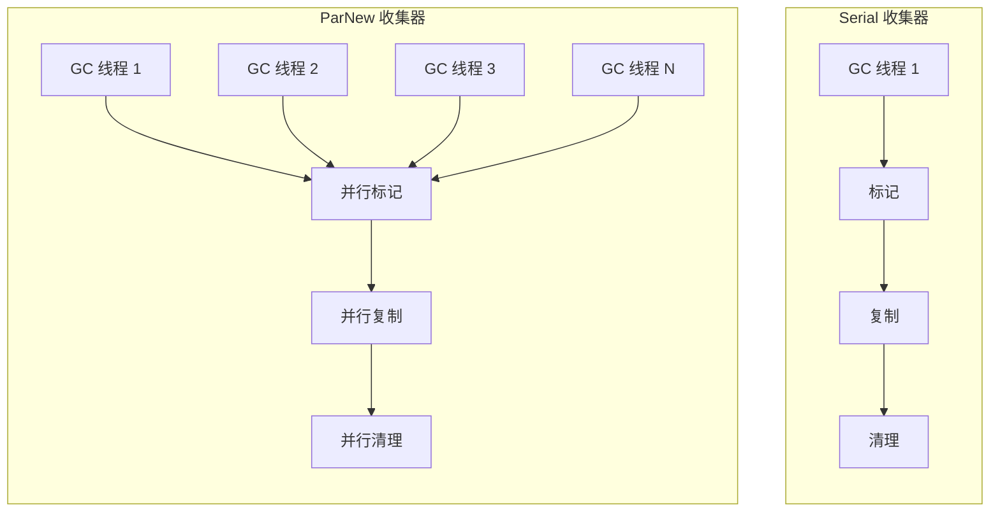
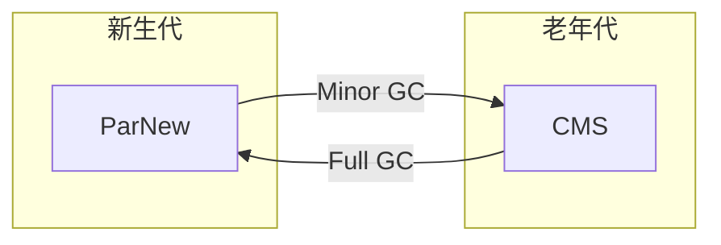
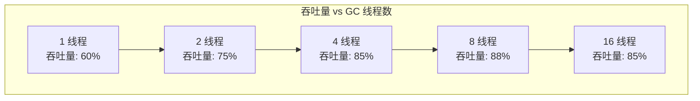

# ParNew 收集器

ParNew 是 Serial 的多线程版本，它使用多个线程并行进行新生代垃圾收集。从名字就可以看出：「Par」是 Parallel（并行）的缩写，「New」表示它只作用于新生代。

ParNew 在多核环境下比 Serial 有更好的表现，是 CMS 收集器在新生代的默认搭档。

## 与 Serial 的区别

ParNew 与 Serial 的核心区别在于**并行执行**：

| 特性 | Serial | ParNew |
| --- | --- | --- |
| 线程数 | 单线程 | 多线程（与 CPU 核数相关） |
| Stop The World | 需要 | 需要 |
| 算法 | 复制算法 | 复制算法 |
| 老年代配合 | Serial Old | CMS |
| 开启参数 | `-XX:+UseSerialGC` | `-XX:+UseParNewGC` |



## 工作原理

ParNew 的工作原理与 Serial 类似，但使用多个线程并行执行：

1. **Stop The World**：暂停所有应用线程
2. **并行标记**：多个 GC 线程从 GC Roots 出发，并行标记存活对象
3. **并行复制**：将存活对象复制到 Survivor 区
4. **并行清理**：清理 Eden 区和原 Survivor 区
5. **恢复**：恢复所有应用线程

```java
// ParNew 并行标记的简化实现
public class ParNewCollector {
    private static final int THREAD_COUNT = 
        Runtime.getRuntime().availableProcessors();
    
    public void collect() {
        // 1. 停止应用线程
        stopAllThreads();
        
        // 2. 多线程并行标记
        CountDownLatch latch = new CountLatch(THREAD_COUNT);
        for (int i = 0; i < THREAD_COUNT; i++) {
            new Thread(() -> {
                markFromGCRoots();  // 并行标记
                latch.countDown();
            }).start();
        }
        latch.await();
        
        // 3. 多线程并行复制
        // ... 类似实现
        
        // 4. 恢复应用线程
        resumeAllThreads();
    }
}
```

## 与 CMS 的配合

ParNew 是 CMS 收集器在新生代的默认收集器。CMS（Concurrent Mark Sweep）是一个并发老年代收集器，它需要与一个新生代收集器配合工作。



配合工作流程：

1. **Minor GC**：ParNew 负责新生代垃圾收集
2. **Old GC**：CMS 负责老年代垃圾收集（并发执行）
3. **降级**：如果 CMS 老年代空间不足，退化为 Serial Old

## 配置参数

| 参数 | 说明 | 示例 |
| --- | --- | --- |
| `-XX:+UseParNewGC` | 启用 ParNew 收集器 | - |
| `-XX:ParallelGCThreads` | GC 线程数 | `-XX:ParallelGCThreads=4` |
| `-XX:+UseCMSInitiatingOccupancyOnly` | 只使用初始占用率触发 CMS | - |
| `-XX:CMSInitiatingOccupancyFraction` | 初始 CMS 触发占用率 | `-XX:CMSInitiatingOccupancyFraction=70` |

## 性能特点

### 停顿时间

在多核环境下，ParNew 的 STW 时间通常比 Serial 短。但需要注意的是，GC 线程数不是越多越好：

- **线程创建开销**：每个 GC 线程都有创建和销毁开销
- **同步开销**：多个线程需要同步共享状态
- **缓存竞争**：大量线程可能竞争 CPU 缓存



当 GC 线程数超过一定数量后，收益递减，甚至可能因为开销增加而性能下降。

### 吞吐量

ParNew 的吞吐量通常比 Serial 高，但比 Parallel Scavenge 低：

| 收集器 | 目标 | 特点 |
| --- | --- | --- |
| Serial | 低延迟 | 单线程，低开销 |
| ParNew | 低延迟 | 多线程，CMS 搭档 |
| Parallel Scavenge | 高吞吐 | 多线程，吞吐量优先 |

## 适用场景

ParNew 适合以下场景：

1. **与 CMS 配合**：老年代使用 CMS，新生代自然选择 ParNew
2. **低延迟需求**：应用对停顿时间敏感
3. **多核环境**：4 核以上 CPU
4. **中小内存**：堆内存 `1GB~4GB`

```bash
# ParNew + CMS 配置示例
java -Xms2g -Xmx2g \
    -XX:+UseParNewGC \
    -XX:+UseConcMarkSweepGC \
    -XX:CMSInitiatingOccupancyFraction=70 \
    -XX:+UseCMSInitiatingOccupancyOnly \
    -jar application.jar
```

在 Java 9 之后，ParNew 被标记为废弃，因为 G1 收集器逐渐成为 CMS 的替代方案。但在 Java 8 及之前，ParNew + CMS 仍然是低延迟场景的主流选择。
