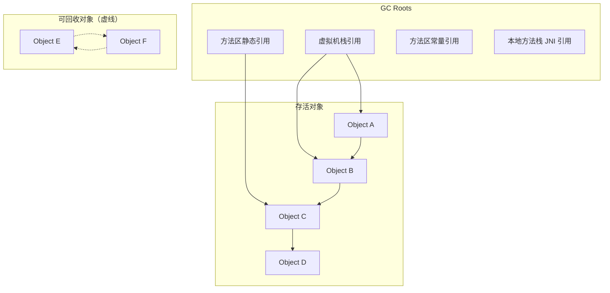
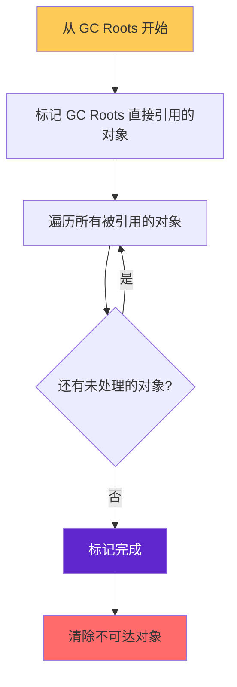
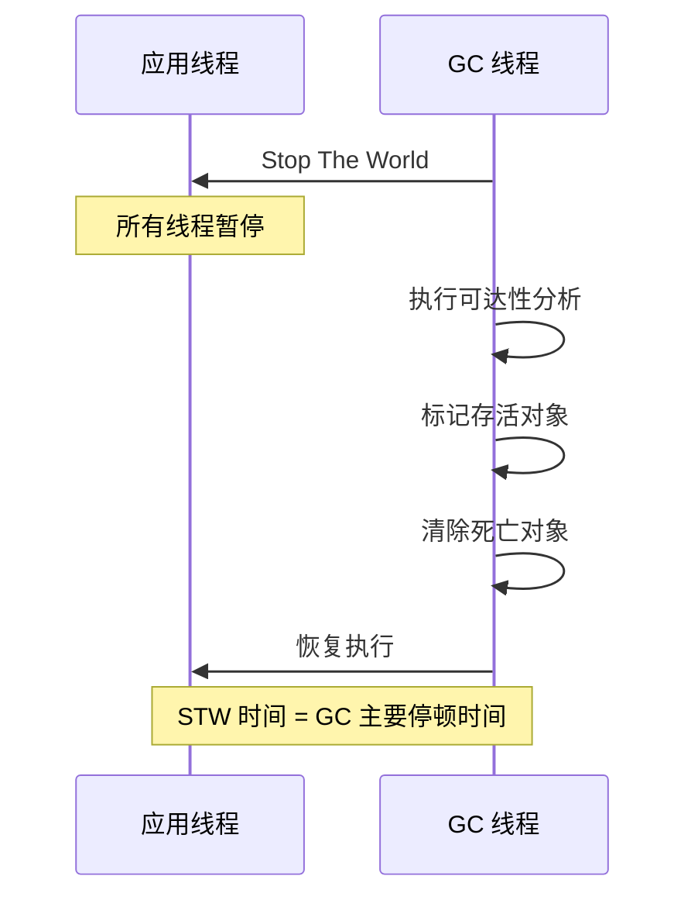

# GC 基本原理：可达性分析

GC 的核心问题只有一个：**哪些对象还活着？**

回答这个问题有多种方式：引用计数法简单直接，但它无法处理循环引用的问题；可达性分析通过追踪引用链来判定对象生死，虽然实现更复杂，但能正确处理循环引用——这是现代 JVM 普遍采用的方式。

## 引用计数法的问题

引用计数法为每个对象维护一个计数器，当有引用指向对象时计数器 +1，引用失效时计数器 -1。当计数器为 0 时，对象死亡。

```java
public class ReferenceCounting {
    public static void main(String[] args) {
        // 循环引用示例
        Node a = new Node("A");
        Node b = new Node("B");
        
        a.ref = b;  // a.ref 引用 b，b 计数器 +1
        b.ref = a;  // b.ref 引用 a，a 计数器 +1
        
        a = null;   // a 引用失效，但 a 计数 = 1（被 b.ref 引用）
        b = null;   // b 引用失效，但 b 计数 = 1（被 a.ref 引用）
        
        // A 和 B 互相引用，但实际已无法访问
        // 引用计数法无法回收它们
        System.gc();  // 无效，A 和 B 的计数都是 1
    }
}

class Node {
    String name;
    Node ref;
    Node(String name) { this.name = name; }
}
```

引用计数法无法解决循环引用问题——两个对象互相引用，但外部已经没有引用指向它们，它们实际上已经「死」了，但引用计数都是 1，无法被回收。

## 可达性分析算法

可达性分析（Reachability Analysis）从一组称为「GC Roots」的对象出发，沿着引用链向下搜索。所有能够到达的对象是存活的，无法到达的对象判定为死亡。



图中，A、B、C、D 通过引用链与 GC Roots 相连，是存活对象。E 和 F 互相引用，但没有 GC Roots 引用它们，可以被回收。

## GC Roots 详解

GC Roots 包括以下几类对象：

| GC Roots 类型 | 说明 | 示例 |
| --- | --- | --- |
| 虚拟机栈中引用的对象 | 当前正在执行的方法的局部变量表 | 方法参数、方法内局部变量 |
| 方法区中类静态属性引用的对象 | 类的 static 字段 | `private static Object obj = new Object()` |
| 方法区中常量引用的对象 | 运行时常量池中的引用 | 字符串常量池中的 String 对象 |
| 本地方法栈中 JNI 引用的对象 | Native 方法中的对象引用 | JNI 调用中的 jobject |
| JVM 内部引用 | Class 对象、异常对象、系统类加载器 | 异常对象、BootClassLoader |
| 同步锁持有的对象 | 被 synchronized 持有的对象 | `synchronized(obj)` 括号中的 obj |

## 引用链追踪过程

可达性分析的具体过程：



## 不可达对象的判定

对象被判定为不可达，需要满足以下条件：

1. **没有 GC Roots 引用链**：从 GC Roots 出发无法到达该对象
2. **没有 finalize() 方法**：如果对象有 finalize() 方法且未被调用过，JVM 会将它放入 F-Queue，由 Finalizer 线程执行 finalize()，这期间对象可能被重新引用
3. **不在 finalize() 中复活**：如果对象在 finalize() 中被其他存活对象引用，则对象复活

```java
public class FinalizeEscape {
    static FinalizeEscape SAVE_HOOK = null;
    
    @Override
    protected void finalize() throws Throwable {
        // 对象复活：将 this 赋值给一个 GC Root 引用的变量
        SAVE_HOOK = this;
    }
    
    public static void main(String[] args) throws InterruptedException {
        SAVE_HOOK = new FinalizeEscape();
        
        // 第一次 GC，对象被判定为不可达，但有 finalize()
        SAVE_HOOK = null;
        System.gc();
        Thread.sleep(500);  // 等待 Finalizer 线程执行
        
        // 对象复活
        System.out.println(SAVE_HOOK != null);  // true
        
        // 第二次 GC，对象再次不可达，且 finalize() 已调用过
        SAVE_HOOK = null;
        System.gc();
        Thread.sleep(500);
        
        System.out.println(SAVE_HOOK != null);  // false
    }
}
```

## Stop The World

可达性分析需要在一致性的快照中进行——分析过程中如果对象引用关系还在不断变化，分析结果就无法保证准确性。

因此，GC 时必须暂停所有应用线程（Stop The World，STW），直到 GC 完成。对于 Serial、Serial Old、Parallel Scavenge 等收集器，STW 时间随堆内存大小线性增长；对于 G1、ZGC、Shenandoah 等现代收集器，通过并发标记来减少 STW 时间。



## 跨代引用问题

在分代收集中，新生代和老年代之间可能存在跨代引用。例如，老年代对象持有新生代对象的引用，或新生代对象持有老年代对象的引用。

如果每次 GC 新生代都需要扫描整个老年代来查找跨代引用，性能代价太高。HotSpot 使用**卡表（Card Table）**来解决这个问题：将老年代划分为若干大小的卡片（Card），如果老年代的某个卡片中有对象引用新生代对象，则将该卡片标记为脏（Dirty）。Minor GC 时，只需要扫描脏卡片中的引用，而不是整个老年代。
