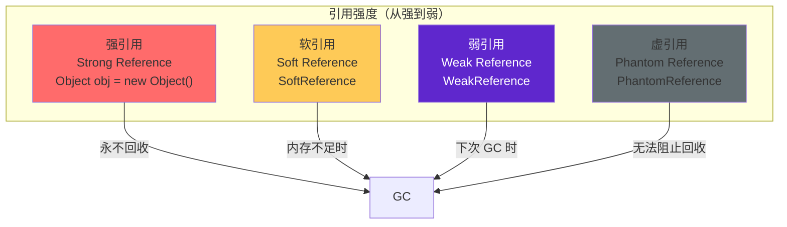

# 引用类型（强/软/弱/虚引用）

在 Java 中，引用不仅仅是「对象引用」这么简单。从 JDK 1.2 开始，Java 将引用细分为四种类型：**强引用（Strong Reference）**、**软引用（Soft Reference）**、**弱引用（Weak Reference）**、**虚引用（Phantom Reference）**。

这四种引用类型的回收时机不同，适用于不同的内存管理场景。理解它们的区别，是实现高效缓存和避免内存泄漏的基础。

## 引用类型一览



## 强引用（Strong Reference）

强引用是最常见的引用类型，例如 `Object obj = new Object()`。只要强引用还存在，GC 就永远不会回收这个对象。

```java
Object obj = new Object();  // 强引用
obj = null;  // 解除引用
System.gc();  // 此时对象可以被回收
```

强引用是内存泄漏的根源之一。如果无意识地持有过多强引用，即使这些对象已经不再需要，也无法被 GC 回收，最终导致 OutOfMemoryError。

## 软引用（Soft Reference）

软引用用于描述还有用但非必需的对象。在系统将要发生内存溢出之前，GC 会把被软引用关联的对象列入回收范围进行回收。如果这次回收还没有足够的内存，才会抛出 OutOfMemoryError。

```java
import java.lang.ref.SoftReference;

public class SoftReferenceExample {
    public static void main(String[] args) {
        // 创建一个 10MB 的大对象，用软引用包装
        byte[] bigData = new byte[10 * 1024 * 1024];  // 10MB
        SoftReference<byte[]> softRef = new SoftReference<>(bigData);
        
        // 手动解除强引用
        bigData = null;
        
        // 内存充足时，get() 可以获取到对象
        byte[] data = softRef.get();
        System.out.println("内存充足：" + (data != null));
        
        // 当内存不足时，JVM 会回收软引用关联的对象
        // 分配大量内存触发 GC
        try {
            byte[] trigger = new byte[100 * 1024 * 1024];
        } catch (OutOfMemoryError e) {
            data = softRef.get();  // 可能是 null
            System.out.println("内存不足后获取：" + (data != null));
        }
    }
}
```

软引用适用于实现内存敏感的缓存：当内存充足时保留缓存，内存不足时自动回收。Linux 的页面回收算法就采用了类似思想。

## 弱引用（Weak Reference）

弱引用比软引用更弱。无论当前内存是否足够，都无法阻止 GC 回收被弱引用关联的对象。只要发生 GC，无论内存是否充足，弱引用关联的对象都会被回收。

```java
import java.lang.ref.WeakReference;

public class WeakReferenceExample {
    public static void main(String[] args) {
        WeakReference<byte[]> weakRef = new WeakReference<>(new byte[1024 * 1024]);
        
        System.out.println("GC 前：" + weakRef.get() != null);  // true
        
        System.gc();  // 显式触发 GC
        
        System.out.println("GC 后：" + weakRef.get() != null);  // false
    }
}
```

弱引用的经典应用是 `ThreadLocal`。`ThreadLocal` 的实现中，每个线程持有一个 `ThreadLocalMap`，Entry 的 key（ThreadLocal 对象）使用弱引用：

```java
// ThreadLocal 内部实现简化
static class ThreadLocalMap {
    static class Entry extends WeakReference<ThreadLocal<?>> {
        Object value;
        Entry(ThreadLocal<?> k, Object v) {
            super(k);
            value = v;
        }
    }
}
```

为什么用弱引用？因为如果使用强引用，线程退出后，ThreadLocal 对象仍然被线程的 Map 持有，无法被 GC 回收，造成内存泄漏。使用弱引用后，ThreadLocal 对象在没有外部引用时可以被回收，但 value 仍然需要手动清理（这就是 ThreadLocal 内存泄漏的根源）。

## 虚引用（Phantom Reference）

虚引用是最弱的引用类型。一个对象是否有虚引用，完全不影响其生命周期——无法通过虚引用获取对象实例。虚引用的唯一作用，是在对象被 GC 回收时收到一个系统通知。

```java
import java.lang.ref.PhantomReference;
import java.lang.ref.ReferenceQueue;
import java.util.Queue;

public class PhantomReferenceExample {
    public static void main(String[] args) throws InterruptedException {
        // 创建一个引用队列
        Queue<PhantomReference<byte[]>> queue = new java.util.LinkedList<>();
        
        byte[] data = new byte[1024];  // 1KB
        PhantomReference<byte[]> phantomRef = new PhantomReference<>(data, queue);
        
        // 手动解除强引用
        data = null;
        
        System.gc();  // 触发 GC
        
        // 虚引用无法获取对象
        System.out.println("虚引用 get()：" + phantomRef.get());  // 永远是 null
        
        // GC 回收后，虚引用会被加入队列
        Thread.sleep(100);
        PhantomReference<?> ref = queue.poll();
        System.out.println("队列收到引用：" + (ref != null));  // true
    }
}
```

虚引用的典型应用是 NIO 的 `DirectByteBuffer`。`DirectByteBuffer` 分配的是堆外内存（直接内存），不受 JVM GC 管理。虚引用用于追踪 `DirectByteBuffer` 对象何时被 GC 回收，以便清理堆外内存。

## ReferenceQueue

`SoftReference`、`WeakReference`、`PhantomReference` 都可以与 `ReferenceQueue` 关联。当 Reference 被 GC 回收时，会将 Reference 本身加入 ReferenceQueue，这样程序可以知道 Reference 关联的对象何时被回收。

```java
ReferenceQueue<Object> queue = new ReferenceQueue<>();
WeakReference<Object> ref = new WeakReference<>(new Object(), queue);

// 对象被 GC 后
Reference<?> polled = queue.poll();  // 非 null 表示对象已被回收
```

这对于资源清理特别有用：不需要在每次使用时检查对象是否被回收，而是被动等待通知。

## 引用类型对比

| 引用类型 | 回收时机 | 典型应用 |
| --- | --- | --- |
| 强引用 | 永不回收 | 普通对象引用 |
| 软引用 | 内存不足时回收 | 内存敏感缓存 |
| 弱引用 | 下次 GC 时回收 | ThreadLocal、规范化映射（WeakHashMap） |
| 虚引用 | 无法阻止回收，仅通知 | 直接内存（DirectByteBuffer）追踪 |

在实际开发中，合理使用软引用和弱引用可以实现更智能的内存管理。例如，使用软引用实现图片缓存，在内存充足时保留缓存提高性能，内存不足时自动释放。
