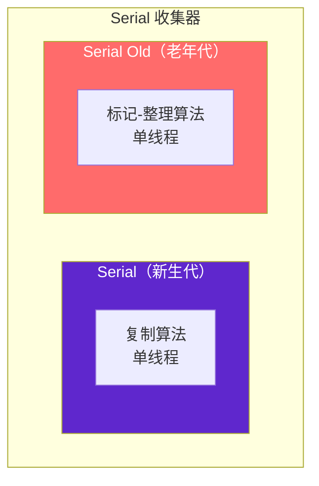
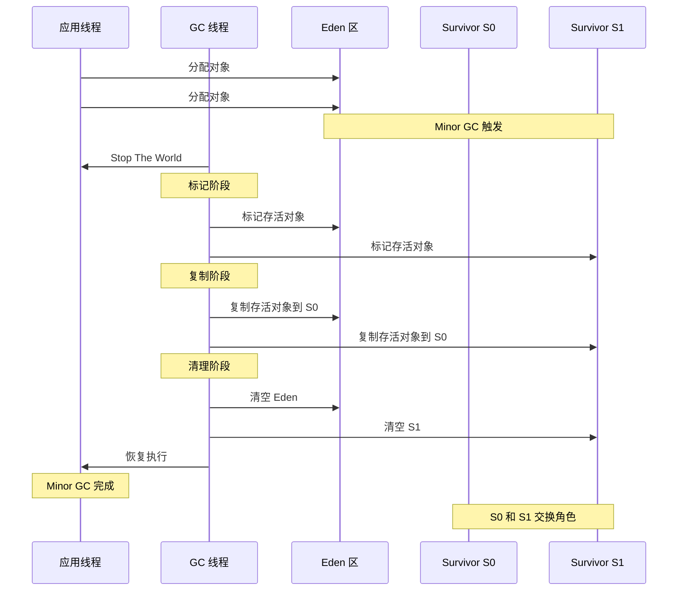
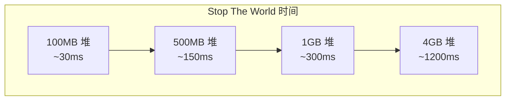

# Serial/Serial Old 收集器

Serial 是 JVM 最古老的垃圾收集器，从 Java 诞生的第一天起就存在。它使用单线程完成垃圾回收，在回收时必须暂停所有用户线程（Stop The World）。

虽然 Serial 看起来「落后」，但它简单高效、没有线程切换开销，在某些特定场景下仍然是最佳选择。

## 收集器特点

Serial 收集器的特点：

- **单线程**：使用单线程进行垃圾回收
- **Stop The World**：回收期间暂停所有应用线程
- **新生代收集器**：使用复制算法
- **Serial Old**：老年代版本，使用标记-整理算法



## 工作原理

### Serial 新生代收集

1. **Stop The World**：暂停所有应用线程
2. **标记**：从 GC Roots 开始，标记所有存活对象
3. **复制**：将存活对象复制到 Survivor 区
4. **清理**：清理 Eden 区和原 Survivor 区
5. **恢复**：恢复所有应用线程



### Serial Old 老年代收集

Serial Old 的工作原理与 Serial 类似，但作用于老年代，使用标记-整理算法：

1. **Stop The World**：暂停所有应用线程
2. **标记**：从 GC Roots 开始，标记所有存活对象
3. **整理**：将所有存活对象向一端移动
4. **清理**：清理端以外的所有内存
5. **恢复**：恢复所有应用线程

## 配置参数

| 参数 | 说明 |
| --- | --- |
| `-XX:+UseSerialGC` | 启用 Serial + Serial Old 收集器组合 |
| `-Xms` | 堆初始大小 |
| `-Xmx` | 堆最大大小 |
| `-Xmn` | 新生代大小 |
| `-Xss` | 线程栈大小 |

## 适用场景

### 客户端应用

对于桌面应用或小型客户端应用，Serial 收集器通常是最佳选择：

- **小内存**：堆内存 `100MB` 以内，STW 时间可接受
- **单核环境**：多线程收集的收益不明显
- **简单部署**：不需要复杂的调优

```bash
# 客户端应用的推荐配置
java -Xms256m -Xmx256m -XX:+UseSerialGC -jar application.jar
```

### 容器环境

在容器化部署中，如果内存资源受限，Serial 收集器可以减少内存开销：

- **内存资源受限**：容器内存 `100MB~512MB`
- **单核或小规格**：多线程收益不明显
- **追求稳定性**：Serial 没有线程管理的复杂性

### 性能基准测试

Serial 收集器没有并行开销，适合作为基准测试的对照：

- **排除 GC 干扰**：对比其他收集器的性能基线
- **简单可靠**：没有复杂的调优参数

## Stop The World 的影响

Serial 收集器的 Stop The World 时间随堆内存大小线性增长：



当堆内存达到一定规模后，Serial 收集器的 STW 时间可能无法满足业务需求。对于大内存或低延迟要求的场景，应选择 G1、ZGC 等现代收集器。

## Serial 收集器的价值

尽管 Serial 看起来「老土」，但它有几个不可替代的价值：

1. **简单可靠**：没有并行开销，没有线程同步问题
2. **内存开销小**：不需要额外的线程资源
3. **适合小内存**：在特定场景下效率最高
4. **基准测试**：作为其他收集器的性能对照

理解 Serial 收集器是理解其他收集器的基础。大多数现代收集器（ParNew、Parallel Scavenge）都是 Serial 的多线程版本。
