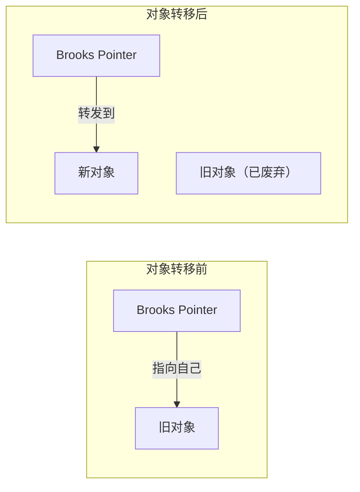
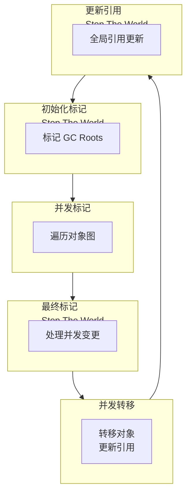

# Shenandoah GC 深度解析

Shenandoah 是 OpenJDK 社区开发的低延迟 GC，与 ZGC 设计目标相似，但实现方式有所不同。Shenandoah 在 Java 12 随 OpenJDK 进入主线，Java 15 成为正式特性。

Shenandoah 的最大特点是：**可以在不停止应用线程的情况下进行堆整理**。

## 与 ZGC 的对比

Shenandoah 和 ZGC 都是低延迟 GC，但实现方式有重要区别：

| 特性 | ZGC | Shenandoah |
| --- | --- | --- |
| 着色指针位数 | 4 位 | 1 位 |
| 转发指针 | 无（染色指针） | 有（Brooks Pointer） |
| 读屏障 | 需要 | 需要 |
| 写屏障 | 不需要 | 需要 |
| 指针压缩 | 不支持 | 不支持 |
| 实验版 JDK 版本 | Java 11 | Java 12 |
| 正式版 JDK 版本 | Java 15 | Java 15 |

## Brooks Pointer（转发指针）

Shenandoah 使用 Brooks Pointer 来实现并发整理：



### Brooks Pointer 的工作原理

```java
// Brooks Pointer 示意图
public class ShenandoahObject {
    // 对象头中额外的一个指针
    private Object forwardingPointer;
    // ... 其他字段
}

// 读取对象引用
public Object read(Object* ref) {
    ShenandoahObject obj = *ref;
    
    // 检查 Brooks Pointer
    if (obj.forwardingPointer != null) {
        // 对象已被转移，返回新地址
        return obj.forwardingPointer;
    }
    
    return obj;
}
```

### 写屏障

由于使用了 Brooks Pointer，Shenandoah 需要写屏障来更新转发指针：

```java
// 写屏障
public void write(Object* ref, Object newValue) {
    // 更新引用
    *ref = newValue;
    
    // 检查旧对象是否正在被转移
    Object oldValue = *ref;
    if (isBeingRelocated(oldValue)) {
        // 更新 Brooks Pointer
        updateForwardingPointer(oldValue, newValue);
    }
}
```

## Shenandoah 工作阶段

Shenandoah 的工作分为多个阶段：



### 各阶段说明

| 阶段 | 类型 | 说明 |
| --- | --- | --- |
| 初始化标记 | STW | 标记 GC Roots 直接引用的对象 |
| 并发标记 | 并发 | 遍历对象图，标记存活对象 |
| 最终标记 | STW | 处理并发标记期间的变更 |
| 并发转移 | 并发 | 转移存活对象，更新 Brooks Pointer |
| 更新引用 | STW | 更新全局引用（根引用） |

## 核心参数

### 启用 Shenandoah

```bash
# Java 15+ 启用 Shenandoah
java -XX:+UseShenandoahGC -Xms8g -Xmx8g -jar application.jar

# Java 12-14 启用 Shenandoah
java -XX:+UnlockExperimentalVMOptions -XX:+UseShenandoahGC -Xms8g -Xmx8g -jar application.jar
```

### 常用参数

| 参数 | 说明 | 默认值 |
| --- | --- | --- |
| `-XX:ShenandoahGCHeuristics` | 启发式算法 | adaptive |
| `-XX:ConcGCThreads` | 并发 GC 线程数 | 自动计算 |
| `-XX:ShenandoahTargetPause` | 目标停顿时间 | 200ms |

### 启发式算法

Shenandoah 支持多种启发式算法：

| 算法 | 说明 |
| --- | --- |
| `adaptive` | 自适应调整，根据运行时数据选择策略 |
| `static` | 静态配置，使用固定参数 |
| `compact` | 优先整理，最小化内存占用 |
| `aggressive` | 激进整理，尽快完成 |
| `passthrough` | 不进行并发整理 |

```bash
# 使用激进模式
java -XX:+UseShenandoahGC \
    -XX:ShenandoahGCHeuristics=aggressive \
    -Xms8g -Xmx8g \
    -jar application.jar
```

## 性能特点

### 停顿时间

Shenandoah 的停顿时间通常在毫秒级别：

| 阶段 | 典型停顿时间 |
| --- | --- |
| 初始化标记 | `<1ms` |
| 最终标记 | `<1ms` |
| 更新引用 | `<1ms` |
| 并发阶段 | 无停顿 |

### 吞吐量影响

Shenandoah 的读屏障和写屏障会带来一定的吞吐量损失：

| 维度 | 影响 |
| --- | --- |
| 吞吐量 | -5%~15% |
| 读屏障开销 | ~3% |
| 写屏障开销 | ~2% |

## 与 ZGC 的选择

### 选 ZGC 的场景

1. 需要支持超大内存（`>100GB`）
2. 需要 Oracle JDK 或 AdoptOpenJDK
3. 需要更好的 GC 吞吐量

### 选 Shenandoah 的场景

1. 使用 OpenJDK
2. 需要社区支持
3. 需要更灵活的启发式配置

## 配置示例

### 低延迟配置

```bash
java -XX:+UseShenandoahGC \
    -Xms8g -Xmx8g \
    -XX:ShenandoahGCHeuristics=adaptive \
    -XX:ConcGCThreads=8 \
    -XX:ShenandoahTargetPause=100 \
    -Xlog:gc*:file=gc.log:time,uptime,level,tags \
    -jar application.jar
```

### 低内存占用配置

```bash
java -XX:+UseShenandoahGC \
    -Xms4g -Xmx4g \
    -XX:ShenandoahGCHeuristics=compact \
    -Xlog:gc*:file=gc.log:time,uptime,level,tags \
    -jar application.jar
```

## 已知限制

1. **不支持指针压缩**：与 ZGC 相同
2. **不支持类数据共享**：与 ZGC 相同
3. **实验性特性**：虽然已正式发布，但仍是较新的 GC
4. **社区维护**：相比 ZGC（Oracle 支持），Shenandoah 主要由社区维护
