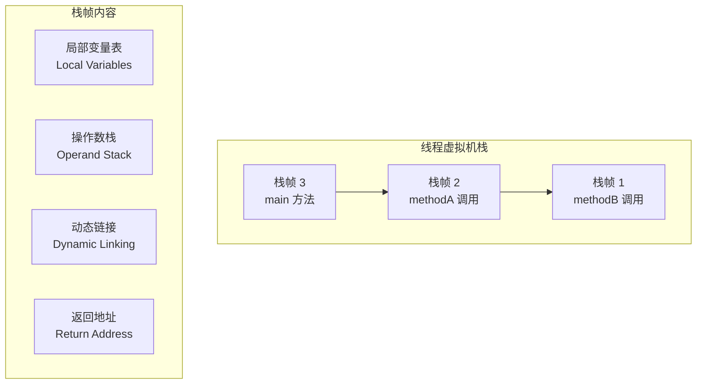
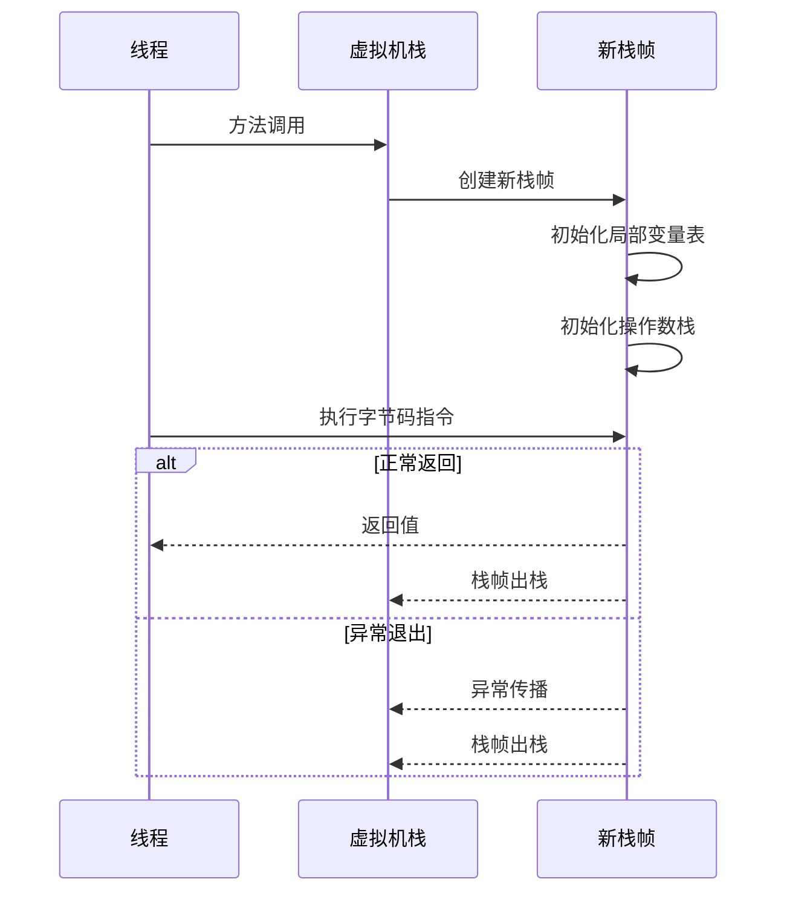

# 栈内存（Stack）与栈帧

栈内存可能是在 JVM 调优中最容易被忽视的区域——它不像堆那样会产生 GC 问题，不像元空间那样会溢出，但它的配置不当却可能导致最直接的线上故障：StackOverflowError。

更重要的是，理解栈内存的工作机制，是理解方法调用、局部变量、异常处理等核心概念的基础。

## 虚拟机栈概述

每个线程在创建时都会分配一个独立的虚拟机栈，栈是线程私有的。虚拟机栈的基本单位是**栈帧（Stack Frame）**，每当一个方法被调用，一个新的栈帧就会入栈；方法执行完成（无论正常返回还是异常退出），栈帧就会出栈。



## 栈帧结构详解

### 局部变量表

局部变量表存储方法参数和局部变量。局部变量表的容量以**变量槽（Variable Slot）**为单位，每个变量槽可以存储一个 32 位的数据类型（如 int、float、reference）。对于 64 位的数据类型（long、double），需要占用两个连续的变量槽。

```java
public class Example {
    public int calculate(int a, int b) {
        int c = a + b;  // a, b, c 都在局部变量表中
        return c;
    }
}
```

在字节码层面，局部变量表的使用如下：

```java
public int calculate(int, int);
  descriptor: (II)I
  Code:
    // local: a=1, b=2, c=未初始化
    iload_1        // 将局部变量 1（a）压入操作数栈
    iload_2        // 将局部变量 2（b）压入操作数栈
    iadd           // 栈顶两元素相加
    istore_3       // 结果存入局部变量 3（c）
    iload_3        // 将 c 压入操作数栈
    ireturn        // 返回
```

### 操作数栈

操作数栈是一个后进先出（LIFO）的栈，用于执行字节码指令时的临时工作空间。大多数字节码指令都是从操作数栈中取数据进行运算，再将结果压回操作数栈。

```java
// 源码
int a = 1;
int b = 2;
int c = a + b;
```

```java
// 对应字节码
iconst_1       // 将常量 1 压入操作数栈
istore_1       // 弹出栈顶，存入局部变量 1（a）
iconst_2       // 将常量 2 压入操作数栈
istore_2       // 弹出栈顶，存入局部变量 2（b）
iload_1        // 将 a 压入操作数栈
iload_2        // 将 b 压入操作数栈
iadd           // 弹出两元素，相加后压回栈顶
istore_3       // 弹出栈顶，存入局部变量 3（c）
```

### 动态链接

动态链接将符号引用转换为直接引用。每个栈帧都包含一个指向常量池的引用，指向当前方法的类。符号引用（如方法名、字段名）在类加载阶段或第一次使用时解析为直接引用。

### 返回地址

返回地址记录方法调用后的返回位置。正常返回时，调用者的程序计数器值被恢复；异常返回时，通过异常处理表确定返回位置。

## 方法调用与栈帧创建

方法调用时，JVM 会执行以下步骤：



## 栈溢出：StackOverflowError

当方法调用层次过深（例如递归没有正确终止条件），或局部变量表过大（方法参数过多、局部变量占用空间大），会导致栈帧无法分配，从而抛出 StackOverflowError。

常见原因：

- **无限递归**：没有终止条件的递归调用
- **递归深度过大**：即使有终止条件，递归层数过深
- **方法参数过多**：单个方法参数占用大量局部变量表空间
- **循环依赖**：方法 A 调用方法 B，方法 B 调用方法 A，形成间接递归

```java
// 无限递归示例
public class RecursiveExample {
    public int factorial(int n) {
        return n * factorial(n - 1);  // 没有终止条件
    }
}

// 正确的递归实现
public class CorrectRecursive {
    public int factorial(int n) {
        if (n <= 1) {
            return 1;
        }
        return n * factorial(n - 1);
    }
}
```

## 栈内存配置

栈内存大小通过 `-Xss` 参数配置，默认值通常为 1MB（1024KB）。对于大多数应用，默认值足够；如果应用有深度递归调用，需要增大栈大小；如果内存紧张且应用不需要深递归，可以减小栈大小以节省内存。

| 参数 | 说明 | 示例 |
| --- | --- | --- |
| `-Xss` | 栈大小 | `-Xss2m` 设置为 2MB |
| `-XX:ThreadStackSize` | 线程栈大小（与 -Xss 等效） | `-XX:ThreadStackSize=2048` |

## 逃逸分析与栈上分配

栈内存的一个重要特性是：栈帧出栈时，其中的对象会自动销毁，不需要 GC 干预。如果一个对象的引用不会逃逸出方法或线程，就可以直接在栈上分配，而不是堆上。

```java
public void process() {
    // point 的引用没有逃逸，可以在栈上分配
    Point point = new Point(1, 2);
    System.out.println(point.x + point.y);
}
```

JIT 编译器通过逃逸分析（Escape Analysis）来判断对象是否可以栈上分配。如果分析结果为不逃逸，则可以进行两项优化：

- **栈上分配**：对象直接在栈上分配，方法返回时自动销毁
- **标量替换**：对象的字段被替换为独立的局部变量，完全不需要对象头

这两项优化可以显著减少 GC 压力，因为大量短生命周期的小对象不需要进入堆。
