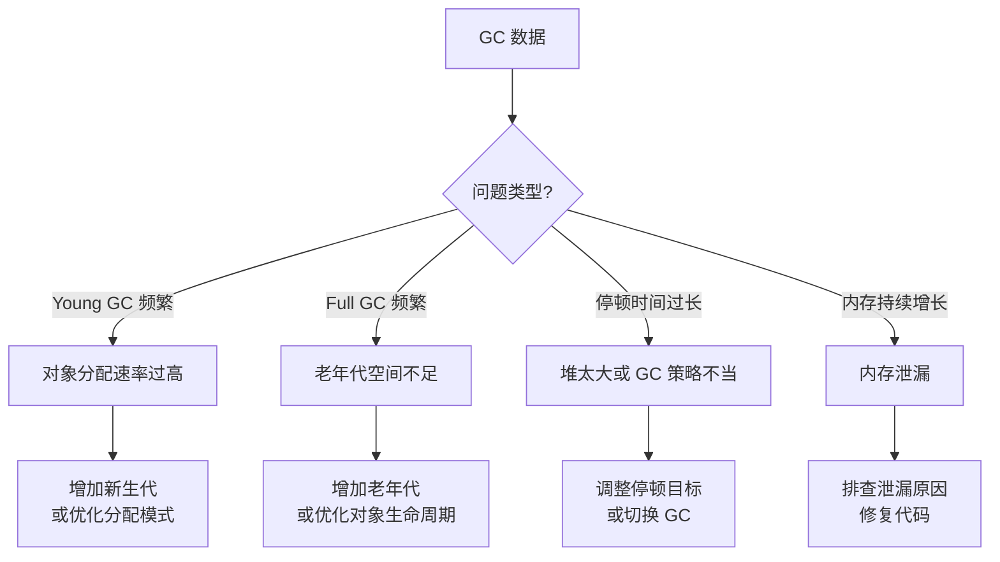
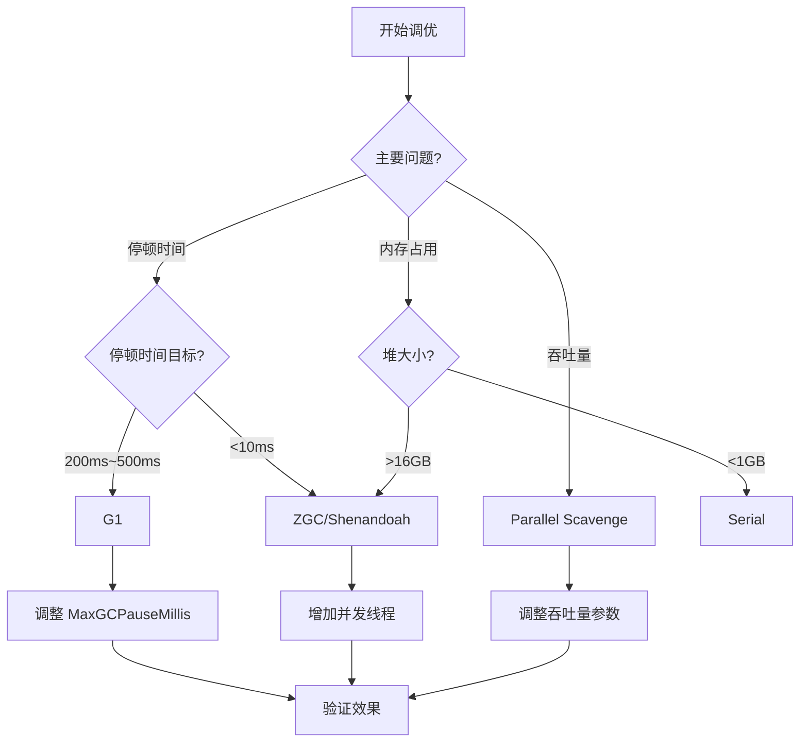

# GC 调优方法论与案例

GC 调优不是一蹴而就的，需要遵循系统的方法论：监控 → 分析 → 调整 → 验证。盲目调优不仅无效，还可能引入新的问题。

本文将介绍 GC 调优的系统方法，并通过真实案例展示如何解决常见的 GC 问题。

## 调优目标

在开始调优之前，首先需要明确调优目标：

| 目标 | 说明 | 衡量指标 |
| --- | --- | --- |
| 停顿时间 | 应用线程暂停时间 | P99 `<200ms` |
| 吞吐量 | 应用运行时间占比 | `>95%` |
| 内存占用 | 堆内存使用量 | 不超过 `-Xmx` 限制 |

这三个目标往往是相互制约的：追求低停顿可能牺牲吞吐量，追求高吞吐量可能需要更大的内存。

## 调优步骤

### 第一步：监控

```bash
# 使用 jstat 持续监控
jstat -gcutil -t <pid> 1000

# 使用 jcmd 获取实时信息
jcmd <pid> GC.class_stats

# 使用 Arthas 实时监控
arthas> dashboard
```

### 第二步：收集数据

```bash
# 开启 GC 日志
java -Xms8g -Xmx8g \
    -XX:+UseG1GC \
    -XX:MaxGCPauseMillis=200 \
    -Xlog:gc*:file=gc.log:time,uptime,level,tags:filecount=10,filesize=100M \
    -jar application.jar

# 定期获取堆转储
jcmd <pid> GC.heap_dump heap_dump_$(date +%Y%m%d_%H%M%S).hprof
```

### 第三步：分析

分析 GC 日志和监控数据，识别问题模式：



### 第四步：调整

根据分析结果调整参数。

### 第五步：验证

```bash
# 压测验证
# 使用 wrk 压测 HTTP 服务
wrk -t4 -c100 -d300s http://localhost:8080/api

# 使用 JMeter 进行负载测试
jmeter -n -t test.jmx -l result.jtl
```

## 案例一：CMS 频繁 Full GC

### 问题描述

某电商系统使用 CMS 收集器，Full GC 频率从正常的每小时 1~2 次增加到每分钟 3~4 次，系统响应时间从 50ms 飙升到 500ms。

### 问题分析

```java
// Full GC 日志
[Full GC (Allocation Failure) 
  [CMS: 4096M->4096M(4096M)  // 老年代已满
  5120K->3840K(5120K), 2.3456789 secs]
```

分析：

1. 老年代空间不足
2. 大量对象晋升到老年代
3. 内存碎片化导致无法分配大对象

### 解决方案

```bash
# 调整方案
java -Xms8g -Xmx8g \
    -XX:+UseParNewGC \
    -XX:+UseConcMarkSweepGC \
    -XX:CMSInitiatingOccupancyFraction=70 \  # 降低触发阈值
    -XX:+UseCMSCompactAtFullCollection \     # Full GC 时整理
    -XX:CMSFullGCsBeforeCompaction=3 \      # 3次Full GC后整理
    -XX:NewRatio=2 \                         # 调整新生代比例
    -jar application.jar
```

### 进一步优化

最终迁移到 G1：

```bash
java -Xms8g -Xmx8g \
    -XX:+UseG1GC \
    -XX:MaxGCPauseMillis=200 \
    -XX:InitiatingHeapOccupancyPercent=45 \
    -jar application.jar
```

## 案例二：G1 停顿时间过长

### 问题描述

某金融系统使用 G1 收集器，停顿时间目标设置为 200ms，但实际停顿时间经常超过 500ms。

### 问题分析

```java
// 停顿时间日志
[GC pause (G1 Evacuation Pause) (young), 0.5123456 secs]  // 超过目标
[GC pause (G1 Evacuation Pause) (mixed), 0.6789012 secs]  // Mixed GC 过长
```

分析：

1. Mixed GC 清理的老年代 Region 太多
2. 新生代比例过大
3. 堆内存接近上限

### 解决方案

```bash
java -Xms12g -Xmx12g \
    -XX:+UseG1GC \
    -XX:MaxGCPauseMillis=200 \
    -XX:G1NewSizePercent=10 \    # 减小新生代
    -XX:G1MaxNewSizePercent=30 \ # 限制新生代上限
    -XX:InitiatingHeapOccupancyPercent=40 \  # 提前触发
    -XX:G1MixedGCLiveThresholdPercent=85 \  # 降低混合 GC 阈值
    -jar application.jar
```

## 案例三：ZGC 吞吐量下降

### 问题描述

某游戏服务器使用 ZGC，发现吞吐量比预期低 20%。

### 问题分析

```bash
# 监控发现
[2024-01-15T10:30:45.123+0800] GC(12345) Duration: 12.345ms
[2024-01-15T10:30:50.123+0800] GC(12346) Duration: 45.678ms  # 突发延迟
```

分析：

1. 分配速率存在突发波动
2. 并发 GC 线程数不足
3. 可能存在 Humongous 对象问题

### 解决方案

```bash
java -XX:+UseZGC \
    -Xms64g -Xmx64g \
    -XX:ConcGCThreads=16 \  # 增加并发线程
    -XX:zAllocationSpikeTolerance=5 \  # 提高容忍度
    -jar application.jar
```

## 常见调优参数总结

### 堆大小配置

| 参数 | 说明 | 建议 |
| --- | --- | --- |
| `-Xms` | 初始堆大小 | 与 `-Xmx` 相同 |
| `-Xmx` | 最大堆大小 | 根据可用内存设置 |
| `-Xmn` | 新生代大小 | 总堆的 1/3~1/4 |

### G1 调优参数

| 参数 | 说明 | 默认值 |
| --- | --- | --- |
| `-XX:MaxGCPauseMillis` | 目标停顿时间 | 200ms |
| `-XX:G1HeapRegionSize` | Region 大小 | 自动计算 |
| `-XX:G1NewSizePercent` | 新生代最小比例 | 5% |
| `-XX:G1MaxNewSizePercent` | 新生代最大比例 | 60% |

### ZGC 调优参数

| 参数 | 说明 | 建议 |
| --- | --- | --- |
| `-XX:ConcGCThreads` | 并发线程数 | CPU 核数的 12.5% |
| `-XX:zAllocationSpikeTolerance` | 突发容忍度 | 2~5 |

## 调优决策树



## 调优注意事项

1. **不要过早优化**：如果 GC 问题不明显，无需调优
2. **一次只改一个参数**：便于判断每个参数的效果
3. **记录每次调整**：便于回溯和对比
4. **在生产环境验证前先测试**：测试环境尽量模拟生产环境
5. **关注长期效果**：短期效果可能不稳定
